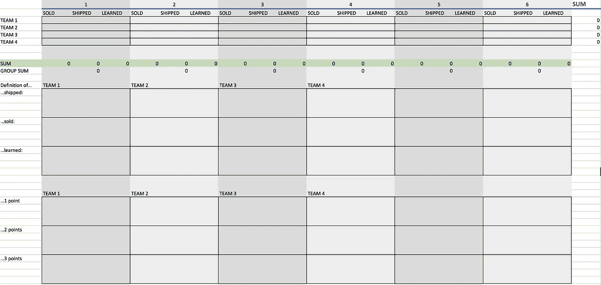

# 出货+销售+学习=进步

> 原文：<https://medium.com/hackernoon/ship-sell-learn-48198254848d>

Navigate uncertainty.

你如何衡量早期[创新](https://hackernoon.com/tagged/innovation)项目或[创业](https://hackernoon.com/tagged/startup)的进展？以下是每周要问的三个控制问题:

**1。我们装船了吗？**也就是说，我们是否为真正的客户打造并交付了大量的新产品？

**2。我们卖了吗？**也就是说，我们的销售额符合我们的增长目标吗？

**3。我们学会了吗？**也就是说，我们是否获得了新的见解，从而显著地推进了我们的项目？

好的一周，你可以在这三个方面都“得分”。你一个月有几个这样的星期？

**更新:**如果你和一组团队一起工作，你可以在一个 Excel 表格中跟踪他们的进度，如下所示:

注意每个团队如何定义他们自己的运输、学习和销售水平。当他们取得进步时，他们也应该设计自己的庆祝仪式。一次迭代 3 分(周):聚会时间！