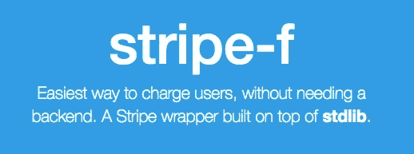

# 快速运输:我们如何使用微服务和 stdlib 测试想法

> 原文：<https://medium.com/hackernoon/shipping-quickly-how-we-test-ideas-using-microservices-and-stdlib-9e8143cee403>

我想一些创始人和开发人员已经发现了这样一个场景:

> 潜在的天才想法突然出现在你的脑海里>简单测试想法的天才方法随之而来>天才击掌在你的脑海里响起。

在过去的一年里，我和我的联合创始人一直在清洗、漂洗和重复这些不同想法的步骤。

最后一步实际上是建立测试——通常包括建立一个简单的带有一些文本的登录页面，一个收集人们的电子邮件以查看他们是否愿意注册的方法，以及一个收集付款以查看人们是否愿意为所述产品付费的方法。

在测试了几个想法后，每次我们有新想法时都必须建立相同的结构变得有点无聊，而且不可否认*有点扼杀了我们的兴奋*。

我开始思考如何抽象出这些服务的逻辑，这样我就可以一遍又一遍地使用它们。我做的研究越多，我就越开始关注微服务。简而言之，微服务是模块化的功能，您可以将其作为独立的 web 服务进行部署。你可以在这里阅读更多关于他们[的信息。](http://www.martinfowler.com/articles/microservices.html)

我的一个好朋友 Keith Horwood 构建了 stdlib，旨在尽可能简单地构建无服务器微服务，本质上是构建一个可移植和可重用的不同服务的目录。

使用它会迫使我简化和分离逻辑。从长远来看，这使得事情更容易测试和维护。此外，它还可以很好地横向扩展系统。所以我开始用它来做我们的测试！

我开始构建一个微服务集合，我通常用它来测试我的新想法。在我浏览它们的时候，我将开始开源其中的一些，因为它们可能对其他想要快速实现某些东西而不必担心构建定制逻辑或运行服务器的人有用。

# 我的第一个微服务

我构建的第一个开源函数叫做 stripe-f:[http://stdlib.com/services/nemo/stripe](http://stdlib.com/services/nemo/stripe)

它允许您在几分钟内创建具有支付功能的无服务器登录页面。这里可以找到一个工作实例[。它使用条纹测试环境，所以你可以使用他们的](https://nemo.github.io/stripe-f/)[测试信用卡](https://stripe.com/docs/testing#cards) : 4242 4242 4242 4242。

现在，下次我需要将 Stripe 集成到测试或辅助项目中时，我可以轻松地重用该功能，而不必从头到尾阅读 Stripe 的文档并记住它们是如何工作的。我将

我会发布更多我认为有用的微服务，所以如果你想跟踪它们，请确保关注我的帖子。

> [黑客中午](http://bit.ly/Hackernoon)是黑客如何开始他们的下午。我们是 [@AMI](http://bit.ly/atAMIatAMI) 家庭的一员。我们现在[接受投稿](http://bit.ly/hackernoonsubmission)并乐意[讨论广告&赞助](mailto:partners@amipublications.com)机会。
> 
> 如果你喜欢这个故事，我们推荐你阅读我们的[最新科技故事](http://bit.ly/hackernoonlatestt)和[趋势科技故事](https://hackernoon.com/trending)。直到下一次，不要把世界的现实想当然！

