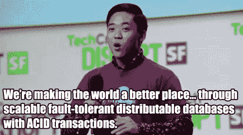
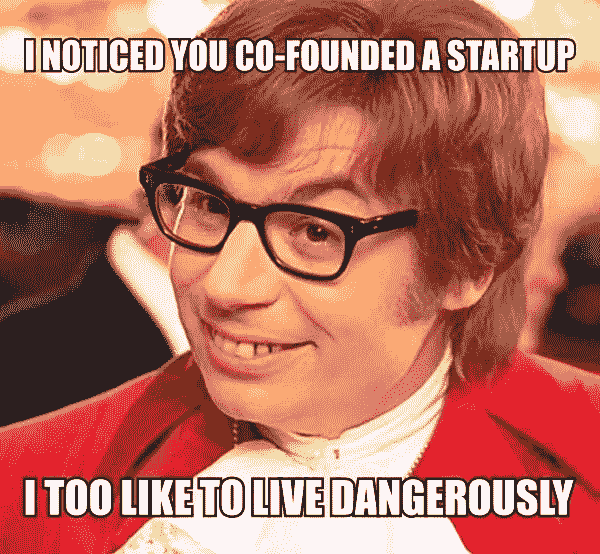

# 狗屎创业:第二集

> 原文：<https://medium.com/hackernoon/shit-startups-do-episode-2-33111f33a690>

## 建立一个团队

所以你决定开一家公司。你有一个超棒的想法，一个巨大的市场，你刚刚成功说服了几个钱多但没头脑的人给你 25 万美元去追逐你的梦想。

Photo credit: [Quino Al / Unsplash](https://unsplash.com/search/team?photo=2DmONVWZeaE)

他们问你会用这些钱做什么。妈的，*我们要用这些钱做什么*，你开始思考。你忙着做白日梦，想着你要推出一个产品，获得数百万用户，赚他妈的一大笔钱，以至于你完全忘记了思考你实际上该怎么做。

所以你急于思考你的创始团队的差距。这些缺口几乎总是要么是产品人员，要么是销售和营销人员。两组人会比你眨眼的速度还快地掏空你的银行账户。能够构建你的产品的工程师将会在工资和 [AWS 发票](https://hackernoon.com/shit-startups-do-episode-1-cbfa73f9c25f)上花费一大笔钱。更不用说他们要求的 5000 美元的装备，以及舒适的椅子，站立的桌子和其他各种珍贵的东西。你可能还需要一个游戏室，让他们在“心流”之外的 75%的时间里玩游戏，这样他们就能在短暂的高效时间里感到快乐。

雇佣销售人员是一种美妙的体验。即使是最糟糕的销售人员也擅长销售一样东西——他们自己。所以很有可能你最终会和一些白痴在一起，他们累积飞行里程如此之快，以至于你会闻到他们在一个大陆之外留下的碳足迹。当他们没有达到他们的目标时，你会听到一些关于产品还没有出现的言论。对此，产品团队会告诉你，销售人员试图通过实际获得真正的客户和收入来搅乱整体愿景。他们怎么敢通过基于网络的猫广播来偏离我们让世界变得更美好的目标！

GIF credit: [Oisin Lunny](http://oisinlunny.com/)

不要让我开始营销。虽然他们的薪水不算太低，通常也不会得到佣金，但他们每个月花几千美元在 HubSpot、Intercom、Salesforce 和其他一些为他们工作的工具上，不会让你破产。他们不满足于花大价钱购买比他们更便宜的产品，他们会再花几千美元通过电话从一个和他们一样了解产品的人那里获得培训。当然，他们还需要花费至少 10000 到 20000 美元，让一些网页设计机构将 WordPress 变成一个他们认为很漂亮的网站，有 janky parallax 滚动，25 兆字节的背景视频，并确保每个访问者离开时都被你弹出的巨大的模态叠加图激怒，就在他们开始阅读你的员工决定转述的回流的狗屁内容营销时。

一天结束的时候，你会挠头想，当初你到底在干嘛雇佣这些人。你还记得你曾有过这样的想法:建立一个团队可以让你腾出时间去做重要的事情，比如本周第九次根据你在上一次投资推介中受到的质询重新整理你的幻灯片。或者参加一些重要的社交活动，在那里你可以见到的不是顾客，而是和你一样的人，这样你就可以胡说八道，让自己感觉自己很重要。

Meme source: [Entrpreneurship Memes on Pinterest](https://www.pinterest.com/faceentrepreneu/entrepreneurship-memes/)

更糟糕的是，你甚至不会再有时间做所有这些创始人之间的亲密接触，因为你会被会议和所有工作中最耗时的工作——管理人员——所困扰。你雇佣的那个希望她成为首席技术官的该死的开发人员告诉你，她需要 2 个前端开发人员、2 个后端开发人员、1 个设计师、1 个开发人员和 2 个测试人员来得到一个最小可行的产品。哦，顺便说一下，至少要花 18 个月的时间才能生产出来。与此同时，您的销售总监正在寻找内部、外部和倒置销售团队。当你漫不经心地建议他出去试着推销自己时，他的反应是一脸惊恐，就好像你刚刚让他去打扫厕所一样。

随着这一切的进行，你会发现自己被金钱问题压得喘不过气来，同时还要记录账目。所以你出去找首席财务官。你巧妙地将这个职位称为财务总监，这样你就可以支付成功候选人应得工资的一半。你找到一个符合条件的人，他们走进来，像任何会计师一样，花一天的大部分时间在你的办公桌上卸下一公吨的痛苦。上一轮投资中你认为你拥有的 18 个月的跑道？是啊，更像是 8 个月。哦，这还包括已经过去的 6 个月。A 系列的时间已经到了吗？是的，祝你好运——我相信 Goliath VC 会对你可笑的糟糕销售数字印象深刻。

因此，你现在有 100 万美元的年薪，没有任何重要的产品，只有少数非常不开心的客户，你想知道你雇佣的每个人到底在做什么。就你所见，他们生活的唯一目的就是让你的生活变成人间地狱。值得称赞的是，他们在这方面的工作绝对非常出色。

你会想，也许你应该做些不可思议的事情——也许你应该自己做些这种事。

# 收场白

我们都知道一个优秀的团队对公司成功的重要性，但我们经常过早地匆忙组建一个团队。当涉及到公司雇佣员工完成任务的成本/收益时，创始人似乎会有这种心理障碍。理论上，人手越多，完成的工作就越多，这更有道理，但实际上，这往往会大大降低工作效率。

有人曾经告诉我(作为一个典型的第一次创业的人，我没有听进去。)

1.  你对你要雇佣的人会做什么有一个全面而准确的了解。通常情况下，你非常忙，你的一天是如此的充实，以至于你别无选择，只能把你的一些任务交给别人。如果你发现自己试图为某人的工作想出一个计划，那你就做错了。
2.  你努力雇佣在工作上比你更优秀的人。在一家[初创公司](https://hackernoon.com/tagged/startup)的早期，做导师会耗费你大量的时间。你经营的是一家公司，不是一所大学。我是“[授人以鱼](https://www.google.ie/url?sa=t&rct=j&q=&esrc=s&source=web&cd=1&cad=rja&uact=8&ved=0ahUKEwjG-JzwrIjTAhVqJ8AKHVHDDNkQFggcMAA&url=https%3A%2F%2Fen.wiktionary.org%2Fwiki%2Fgive_a_man_a_fish_and_you_feed_him_for_a_day%3B_teach_a_man_to_fish_and_you_feed_him_for_a_lifetime&usg=AFQjCNFCuIIc4bija_m4ehltyKwqDjOFtA)”哲学的忠实信徒，但当你刚刚起步时，不是遵循这一哲学的时候——你可能活不到看到投资成果的时候。

一个伟大的团队可以成就伟大的事情。但是建立一个伟大的团队需要时间、耐心和对人的强烈直觉。如果你满足于一个好的或一般的团队，期待你从他们那里得到的结果是好的或一般的。一大笔工资会让时钟走得更快，所以一定要算进去。

# 关于这个系列

这是一系列关于一些常见的初创公司在其典型的短暂存在期间的开玩笑帖子。它的灵感来自于我自己的经历和巨大的成功，以及我在其他初创公司中所看到的。

过去的剧集:

1.  [在托管](https://hackernoon.com/shit-startups-do-episode-1-cbfa73f9c25f)上花了太多钱

> [黑客中午](http://bit.ly/Hackernoon)是黑客们开始他们下午活动的方式。我们是 [@AMI](http://bit.ly/atAMIatAMI) 家庭的一员。我们现在[接受提交](http://bit.ly/hackernoonsubmission)并很高兴[讨论广告&赞助](mailto:partners@amipublications.com)机会。
> 
> 如果您喜欢这个故事，我们建议您阅读我们的[最新科技故事](http://bit.ly/hackernoonlatestt)和[趋势科技故事](https://hackernoon.com/trending)。直到下一次，不要把世界的现实视为理所当然！

