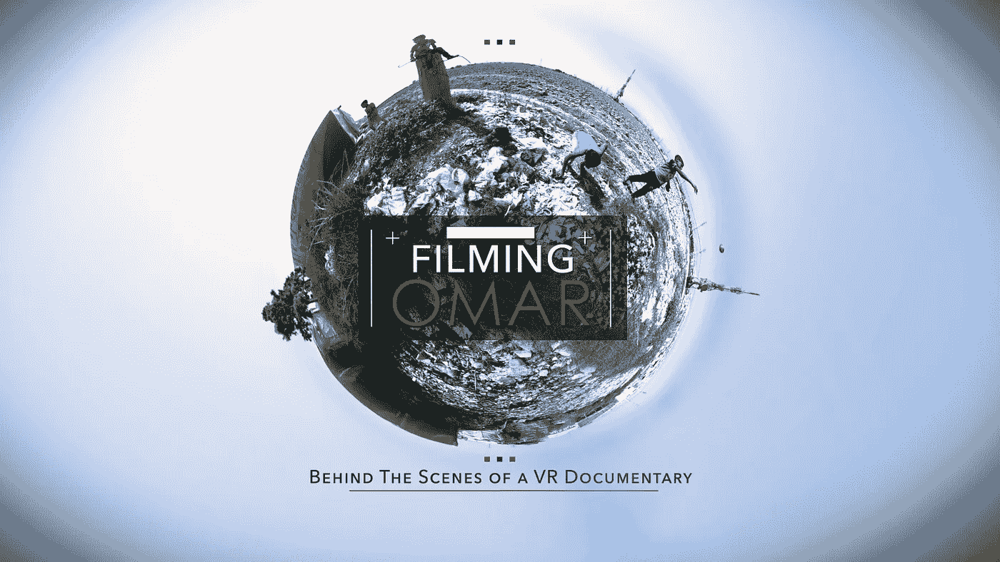

# 拍摄虚拟现实或:我如何学会停止担心和喜欢配音

> 原文：<https://medium.com/hackernoon/shooting-vr-or-how-i-learned-to-stop-worrying-and-love-the-voice-over-67b3df7358e>

故事开始于纽约一个寒冷冬天的早晨，一小群人正在联合国总部一个不起眼的角落里一间没有窗户的房间里开会。这些人的工作是传达人道主义问题，在一个战火纷飞的世界里，他们有自己的工作要做。他们聚集在一起观看一部名为《锡德拉上空的 T4 云》的[虚拟现实](https://hackernoon.com/tagged/virtual-reality)电影，这部电影讲述了一个叙利亚难民营的故事。现在是 2014 年 2 月。

像房间里的其他人一样，我听说过很多关于虚拟现实的事情，但这是我第一次观看虚拟现实电影。我是一名记者转电影制作人，20 年来一直用文字、图片和电影讲述人道主义故事。我以前在 Za'atari 难民营工作和拍摄过，并制作或帮助制作了几部关于叙利亚难民困境的电影。我知道会发生什么。我想大概是这样。

六分钟后，我把耳机放回桌上，深吸一口气。我被 Gabo Arora 的电影将我拖入他的故事核心的方式惊呆了，我大胆地认为这可能是我一直在等待的讲故事的工具。这感觉就像一次旅行的结束和开始。感觉像是对未来的一瞥。

一晃 18 个月过去了，我正坐在黎巴嫩贝卡谷地一个不通风的难民帐篷里。我的一边坐着诺基亚漂亮的 Ozo VR 相机和我的长期摄影师兼朋友 Thomas，另一边是前伊拉克难民变成的援助工作者 Warda 和六个年轻的叙利亚难民女孩。我们正在传递一个装有关于恐龙的动画短片的三星 Gear 耳机，试图向他们解释 VR。

*点击播放，看看他们第一次看 VR 的时候发生了什么…*

在我听说虚拟现实之前很久，我在某处读到过“讲故事的进化与技术的进化密不可分。”我当时记下了它，很快就忘记了，但在拍摄我们的虚拟现实电影*避难时期的生活*时，这个想法一直在我脑海中浮现。

已经在虚拟现实游戏中呆了一段时间的朋友警告我，在虚拟现实中拍摄意味着抛弃你认为你所知道的关于电影制作的一切，重新开始。"*你必须躲在镜头之外…你不能跟随动作…你不能框住镜头，因为一切都在镜头之中…无论你做什么，都要非常小心动作，因为即使是最轻微的动作也会让观众感到恶心…"*

所以当一天早上我们在芬兰的一个湖边拍摄时，托马斯建议我们把相机架在船上，“在湖中央拍摄”，这在我听来像是个麻烦。

*单击“播放”观看我们尝试时发生了什么…*

当然，在虚拟现实中拍摄纪录片故事更加困难和耗时，而且观察纪录片的 run 'n' gun 风格几乎是不可能的(至少目前是这样)。

更不用说在不安全程度高、人们怀疑陌生人的地区拍摄，用看起来奇怪的工具做奇怪的事情。

*点击下面的“播放”,看看在黎叙边境附近拍摄虚拟场景是什么感觉…*

事实证明——正如我被警告的那样——拍摄虚拟现实的大部分内容是抛弃你喜欢的电影制作的东西，拥抱你认为你不喜欢的东西。比如画外音。

还记得在查理·考夫曼的*改编的*中，罗伯特·麦基对偏执的尼古拉斯·凯奇的警告吗？:*“朋友们，如果你们在工作中使用画外音，上帝会帮助你们的。上帝保佑你！那是软弱的，潦草的笔迹。任何白痴都可以写画外音旁白来解释人物的思想。”*

我认为，迄今为止我看过的太多人道主义虚拟现实电影都过于依赖配音，故事需要一个与角色一起发展的机会。带着我傲慢的电影制作人的帽子，我把画外音视为恶棍最后的避难所，所以当我们开始这个项目时，我坚持认为我们应该避免它。

但正如我们发现的那样，底线是在虚拟现实中，导演让故事顺其自然发展的能力在很大程度上被导演和摄影师在关键时刻躲在坟墓后面的事实所抵消。所以最后我们咬紧牙关，接受了一些“软弱、草率的写作”

但是你知道吗，我们认为它做得很好…

*点击播放观看我们关于脸书的 360 度电影……*

结束

> [黑客中午](http://bit.ly/Hackernoon)是黑客如何开始他们的下午。我们是 AMI 家庭的一员。我们现在[接受投稿](http://bit.ly/hackernoonsubmission)并乐意[讨论广告&赞助](mailto:partners@amipublications.com)机会。
> 
> 如果你喜欢这个故事，我们推荐你阅读我们的[最新科技故事](http://bit.ly/hackernoonlatestt)和[趋势科技故事](https://hackernoon.com/trending)。直到下一次，不要把世界的现实想当然！

