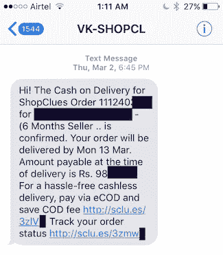

# 通过短链接泄露用户数据

> 原文：<https://medium.com/hackernoon/shopclues-user-data-leak-via-short-links-15dcfcabb68a>

[Shopclues](https://en.wikipedia.org/wiki/ShopClues) 是一个印度独角兽电子商务市场。每个在 Shopclues 上下订单的用户都会收到一条短信，其中包含跟踪订单的链接。

这些短链接例如 http://sclu.es/3zlVa[http://sclu.es/3zlV**a**](http://sclu.es/3zlVa)[http://sclu.es/3zlV](http://sclu.es/3zlVa)**b**[http://sclu.es/3zlV](http://sclu.es/3zlVa)**c**实际上是连续可迭代的..这些都是有效的链接，显示了 Shopclues 用户的**姓名、电话号码、电子邮件、家庭住址、订单详情**。可以编写一个简单的脚本来遍历所有这些元素，如下所示:

我们在 2017 年 3 月的第一周向 Shopclues 报告了这一情况。我们没有收到他们的确认邮件。一封单独发给他们共同创始人的电子邮件没有收到任何回复。我们于 3 月 20 日重新检查了该问题，该问题尚未解决，但我们发现该问题已于 2017 年 5 月 3 日得到解决。现在，URL 要求输入电子邮件 id 和电话号码，以确认请求是由授权用户发出的。

# 重要的学习

作为一名开发人员，重要的是要明白，在没有认证的情况下，你不能在短链接后面保存敏感和私人数据——你会问，短链接有多短？让我们做一点数学来理解这一点，如果代码是 6 个字母长(全部大写)，我们有这些许多可能性:

你可能认为这是一个巨大的数字，没有人能猜出任何随机的联系。这将是正确的，除了取决于你到目前为止已经生成了多少链接，链接的可猜测性继续增加。假设你是一个电子商务网站，产生了 100 万个短链接。现在如果你分开:

平均来说，每 308 次错误的猜测中，就有一次能够猜出正确的链接。所以，如果你决定把用户的个人敏感数据放在任何人都可以不经认证就能访问的短链接后面，请三思。

Shopclues 的漏洞甚至更严重，因为它们甚至没有随机化短链接(虽然如果你只看单个链接而不是一堆链接，它看起来很混乱)，它们只是连续增加它。

做一些事情来增加非工作短链接的样本空间——使样本空间变得巨大，使猜测(几乎)不可能。

尝试这些方法的组合:

*   随机生成短链接**，不连续。**
*   在短链接中使用更长的 **id** ,而不是 5 或 6 个字符——根据一次有多少个活动链接来决定长度。
*   如果您真的需要将敏感数据放在短链接后面，您将不得不使用额外的身份验证和授权层。

> [黑客中午](http://bit.ly/Hackernoon)是黑客如何开始他们的下午。我们是 [@AMI](http://bit.ly/atAMIatAMI) 家庭的一员。我们现在[接受投稿](http://bit.ly/hackernoonsubmission)并乐意[讨论广告&赞助](mailto:partners@amipublications.com)机会。
> 
> 如果你喜欢这个故事，我们推荐你阅读我们的[最新科技故事](http://bit.ly/hackernoonlatestt)和[趋势科技故事](https://hackernoon.com/trending)。直到下一次，不要把世界的现实想当然！

