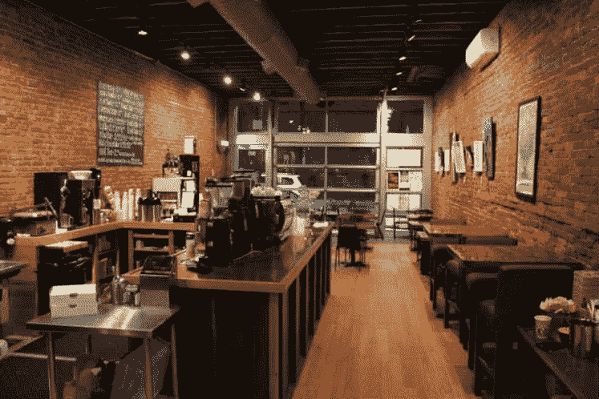

# 矮椅子——高桌子

> 原文：<https://medium.com/hackernoon/short-chairs-tall-tables-cf84d9d52bd3>

# 一个软件开发人员的奋斗

当我用你 8 小时的电和无线网络来买一杯 3 美元的咖啡时，你的过度时髦的咖啡店能提供足够的座位安排吗！？

你指望我整天坐在这里而没有一张电动站立式办公桌，这太可笑了。我辞职回学校不是为了受制于你不舒服的工作环境。

你的咖啡店让我:

*   买一台时髦的苹果电脑
*   留胡子
*   学习如何穿紧身牛仔裤而不显得整天局促不安
*   不管外面有多热，都要戴上帽子
*   假装我不喜欢洗澡
*   在全食超市购物
*   享受羽衣甘蓝，虽然我们都同意它就像吃树皮
*   以 37 美元一杯的价格品尝四倍干年份的啤酒花淡色啤酒
*   卖掉我的车，买个修车的

你至少可以把我的[桌子](https://hackernoon.com/tagged/table)和[椅子](https://hackernoon.com/tagged/chair)的比例调得足够高，这样我的前臂就不会抽筋了，因为你那时髦的现代边椅太低了，我的胳膊会伸进你手工制作的实心橡木金属边桌子里。

我只想边喝咖啡边啜饮 6 美元的饮料，8 个小时都没有痛苦。

> [黑客中午](http://bit.ly/Hackernoon)是黑客如何开始他们的下午。我们是 [@AMI](http://bit.ly/atAMIatAMI) 家庭的一员。我们现在[接受投稿](http://bit.ly/hackernoonsubmission)并乐意[讨论广告&赞助](mailto:partners@amipublications.com)机会。
> 
> 如果你喜欢这个故事，我们推荐你阅读我们的[最新科技故事](http://bit.ly/hackernoonlatestt)和[趋势科技故事](https://hackernoon.com/trending)。直到下一次，不要把世界的现实想当然！

