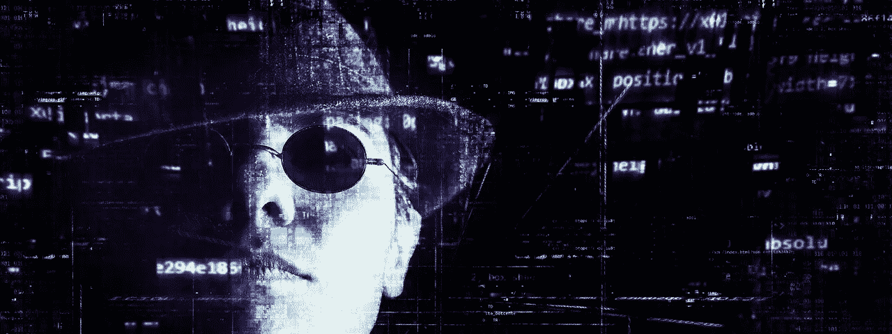

# 数据科学家应该签署道德准则吗？

> 原文：<https://medium.com/hackernoon/should-data-scientists-sign-an-ethical-code-f3fbb0213bbd>

考虑一下这个。

一个身患绝症的病人刚刚被她的医生告知她只能再活一年。她有一份 10 万美元的人寿保险。但她现在需要的是钱——用于医疗保健，或者仅仅是为了在最后几天好好生活。

假设一位投资者提出以 5 万美元的折扣从她那里购买该保单，并接管每年的保费支付。当她死的时候，他将会得到 10 万美元。

一言为定。垂死的投保人获得现金，投资者获利。但是有一个问题。一切都取决于她的死亡，按计划。

这种被称为旅行行业的工具保证在人死后有一定的回报，但回报率取决于这个人活多久。

如果投保人在不到一年的时间内死亡，投资者就赚了一大笔(至少是变形的)。如果她能活到两年，他的年回报率就会减半，他还得支付额外的保费。如果她以某种方式康复，投资者可能最终什么也赚不到。

听起来太可怕了，不像是真的？在他的[书中](https://hackernoon.com/tagged/book) — ***金钱可以买到什么***——迈克尔·桑德尔揭示了更多这样的市场驱动行为的例子，在这些例子中，金钱的道德极限受到质疑，甚至当你开始怀疑是否有金钱不应该买的东西。

当我们将这一类比应用到数据科学的动态学科时，一个非常有趣的相似之处出现了。

数据被誉为解决许多问题的灵丹妙药。事实上，它已经在跨学科领域取得了巨大的进步。但随着越来越多的数据科学家加入这个行业，是否应该有更多关于数据道德极限的讨论？

> ***关键问题:***
> 
> ***数据科学家是否应该签署一个代码，像医生一样敏感地处理数据？***

让我们来理解为什么这在今天变得如此紧迫。

## 差距:

大多数关于数据道德限制的讨论都局限于数据使用的规章制度。哪些数据是可用的，有哪些隐私限制，这在不同国家之间有什么不同，以及公司如何将这些纳入他们的流程。

[Forrester 的国家数据保护热图](http://heatmap.forrestertools.com/?utm_source=datafloq&utm_medium=ref&utm_campaign=datafloq)展示了一个快照。但是，随着数据变得更加开放和普遍，随着[分析解决方案](http://www.bridgei2i.com/#solutions)开始变得更加不可见，围绕数据的伦理或道德的问题是否也在发生变化？

> ***关键问题:***
> 
> ***数据是如何产生的，如何用于不同的目的？***

## 喜欢带来的危险:

心理学家 Michal Kosinski 开发了一种基于脸书活动分析人们的方法。这是基于一个模型，该模型试图评估人类的五种性格特征:开放、认真、外向、随和和神经质。

主张——人们可以对一个人做出相对准确的评估，包括需求、恐惧以及他们可能的行为方式。这些特征已经成为心理测量的标准技术。但是在很长一段时间里，这种方法的问题是数据收集，因为它涉及到填写一个复杂的，高度个人化的问卷。

然后互联网出现了。还有脸书。还有科辛斯基。但这并不是故事的全部。这篇文章挖掘了一些更令人不安的东西。

在 Kosinki 不知情的情况下，一家名为 Cambridge Analytica 的小公司使用了一个非常相似或者可能是相同的模型来制造近代史上最不可思议的两个政治结果。英国退出欧盟和川普。科辛斯基想象过他的模型的潜在道德极限吗？

> ***关键问题:***
> 
> ***如果我们的数据被用于与其原始目的截然不同的目的，我们如何控制其潜在影响？***

## 设备造成的危险:

想象一下像手表这样的小型可穿戴设备可能拥有的关于我们每个人的数据量。可穿戴技术和物联网不仅仅是流行语。它们离我们很近——离我们的设备和我们的家很近。现在，看看这个标题。

****被你的冰箱黑了*** *。”**

*这篇文章谈到了去年通过智能冰箱发起的一次网络攻击。在没有侵入笔记本电脑和其他设备的安全功能的情况下，黑客可以使用通常不安全的物联网设备来危及整个网络。*

*在什么时候，我们需要和欢迎的个性化会变成不受欢迎的迫害和彻头彻尾的危险？*

*可穿戴设备的安全性已经成为许多人关注的一个关键点，因为可穿戴设备上的信息开始变得更加个人化和有价值，甚至超过了我们的信用卡所能提供的关于我们的信息。*

> ****关键问题:****
> 
> ****如果潜在的数据滥用可能导致意想不到的后果，我们需要采取什么保护措施？****

## *需求:*

*解决方案在哪里？*

*个人停止访问他们的个人数据？这将变得越来越不可想象。*

*设备制造商在这些设备上安装了强大的安全控制？这肯定会发生。*

*还是让设计这些机器赖以运行的智能的数据科学家，提高他们对数据的潜在道德极限的认识和敏感度？这是我们都需要签署的准则吗？*

*让我们把话题转到好数据上。*

**本文旨在提高对数据潜在用途以及我们个人和集体责任的认识。**

**(这篇文章最早出现在*[*LinkedIn Pulse*](https://www.linkedin.com/pulse/moral-limits-data-lets-shift-conversation-good-prithvijit-roy)*，*[*data floq*](https://datafloq.com/read/moral-limits-data-lets-shift-conversation-data/3513)*和*[*bridge i2i*](http://bridgei2i.com/blog/moral-limits-data-shift-conversation-data/)*上，作者是 Prithvijit Roy，*[*bridge i2i Analytics Solutions*](http://www.bridgei2i.com/)*)**

## *如果你喜欢这篇文章，请鼓掌并留下评论，让更多的人知道！*