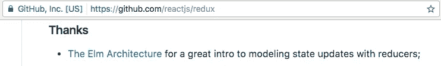
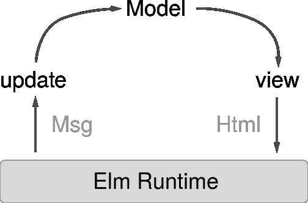
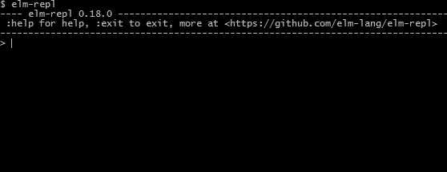

# 如果我是 JavaScript 开发人员，应该学习 Elm 吗？

> 原文：<https://medium.com/hackernoon/should-i-learn-elm-if-i-am-a-javascript-developer-fba282cef6a0>

我的一个好朋友说我应该学榆树。

——“你会从中学到很多，用不用都没关系。”

这正是那种无论他说什么都让人信服的朋友。可能是因为他的白胡子和蓝眼睛。或者可能是因为他实际上几乎总是对的。

Elm 是一个 4 岁的成年人，它将文件转换成 javascript，并且没有选择“正确”框架的 js 疲劳，因为它实际上是一个框架。它功能齐全，是 redux 之父:



所以我牺牲了几个有希望变好的周末来获得一些见解，现在很乐意与你分享:

# 1.没有运行时错误

我将直接从核心概念开始。

您可以忘记 Elm 中恼人的错误消息“NaN”、“未捕获类型错误”或“foo is undefined ”,因为它支持*静态类型检查*,这意味着在编译时它会检查您的所有代码，以确保所有变量以及函数的输入和输出匹配。这意味着如果你的函数只接受字符串，你就无法传递其他任何东西。

虽然建议将类型声明为:

```
reps : String -> Int
```

(reps 是函数名，String 是输入类型，Int 是输出类型)，这不是必需的，因为 Elm 可以自动地自己算出所有的类型(这叫做*类型推断)*并在编译完成后向您显示适当的错误或成功消息。

# 2.工会类型

Elm 中常用的一个好技巧是 Union type，它允许您为怪异或复杂的类型定义可能的值。假设我们有一个练习类型，它可以是以下字符串之一:`Pull-up`或`Push-up`

```
type Exercise = Pull-up | Push-up
```

我想创建一个函数`reps`，它根据练习返回重复次数:

```
reps : Exercise -> Int
reps exercise =
  case exercise of
    Pull-up ->
      10 Push-up ->
      15
```

这里重要的是，每当我们传递一个联合变量作为参数(在这个例子中是`exercise`)时，我们被迫使用`case`表达式。更重要的是，编译器检查了那个`case`表达式的所有分支。这意味着:

*   如果您忘记处理一个案例(比如有 8 个 reps 的`Muscle-up`),那么您会在编译时得到一个错误。
*   如果你不小心打错了任何一个 case(比如说`Psuh-up`)，你会在编译时得到一个错误。不错吧。

# 3.边缘案例

我们还没有完成类型。

即使对我这样一个在多年编写需求规范后来到开发人员世界的人来说，也理解边缘案例的重要性，有时很难不在代码中忘记它们。value 为`undefined`或者 json 格式不正确或者 http 请求超时怎么办？

Elm 通过引入 Maybe、Result 和 Task 类型来解决这个问题，这些类型是我们已经熟悉的 Union 类型的特例。

如果您有可选字段，您可能会使用 Maybe:

```
type alias Sportsman =
  { name : String
  , age : Maybe Int
  }
```

这意味着`age`字段可以表示两个值之一:`Nothing`或`Just Int`—第一个为空，第二个为非空值。因为它是联合类型，任何时候你将这个变量作为参数传递，你都被迫使用`case`表达式并处理所有的变化，所以你不能避免处理空/未定义的情况:

```
getReps : Sportsman -> Maybe Int
getReps sportsman =
  case sportsman.age of
    Nothing ->
      Nothing

    Just age ->
      Just 12
```

相同的方法用于`Result`和`Task`类型，但是`Task`用于同步操作，如解析 json，而`Result`用于异步操作，如 html 请求。它们都可以以下列值之一结束:`Success`表示成功的情况，`Failure`表示错误的情况，和`Maybe`一样，我们总是被迫处理这两种情况。

# 4.包装分发

静态类型的另一个结果是自动强制版本控制。

这意味着，如果我们创建了一个库，并希望与他人共享，我们不必每次更新我们的包时都考虑它的版本号。榆树会帮我们做的。

从最初的版本 1.0.0 开始，它将比较我们的软件包的每个后续版本的代码变化，并创建新的版本号，该版本号最准确地反映了我们所做的更改。🌟

# 5.Redux

Redux 是当今 Javascript 中一个众所周知的模式，起源于 Elm。你可以在 [React](https://github.com/reactjs/redux) 和 [Angular](https://github.com/ngrx/store) 中找到它，最近我甚至在一个没有任何现代 MV*框架的 jQuery 项目中使用了它。

这个想法是你有一个单一的信任点，称为`Model` (Elm)或状态(React)或存储(Angular)，你有一个接口来更新它。在 Elm 中我们称这个接口为`Update`(在 Javascript 世界中是 Reducer)。

所以每次我们想改变`Model`时，我们就调用`Update`函数。

更新函数获取当前的`Model`和`Msg`(动作)作为参数，并返回新的`Model`。

最近我们使用`Model`来更新我们的视图，如果我们谈论网站的话，简单来说就是`Html`，我们通过调用以自己命名的函数`View`来完成。

看起来是这样的:



Elm architecture

为什么它很酷？

# 6.质量保证和支持

首先，问答变得简单多了。

我们已经知道 Elm 是一种函数式语言，这意味着它为我们提供了两种功能保证:

*   给定相同的参数值，所有函数总是返回相同的结果
*   所有的函数都不会产生副作用，也就是说，不会改变它们自身范围之外的任何东西

基本上这意味着有了一个`Update`函数调用的列表，我们总是可以重新运行它们，并且作为重新运行的结果，将总是得到相同的`Model`。为什么？因为没有人能从外面改变我们的`Model`(记得吗？没有副作用)并且因为如果用相同的参数调用我们的`Update`函数，它总是返回相同的结果。

这意味着，任何时候你的 QA 工程师发现一个 bug，她都会把`Update`函数调用的日志发送给你(它被无声地记录下来),而不需要手工记录所有的步骤。您无需手动重现所有步骤，只需将其导入您的应用程序，就可以立即在屏幕上看到错误，并可以在操作历史中来回移动，以查看是哪一系列用户操作导致了错误。🌟🌟

# 6.惰性装载

使用 redux 的第二个结果是延迟加载。

与 jQuery 相比，我喜欢现代 javascript 框架的一点是它们是声明性的。你没有在程序中说明如何操作 DOM——添加、删除、隐藏等等。您只需描述 html 的初始和最终状态——它在不同情况下应该是什么样子，框架会处理(通常使用虚拟 DOM)更新页面所需的一切，使它看起来像您希望的那样。

榆树也一样。您只需定义`View`函数，描述如何根据当前的`Model`渲染 html。然后当`Model`改变时，你的`View`函数相应地更新 DOM，比较当前和以前的状态，并进行相应的 DOM 操作。

现在有趣的事情是:如果只有一小部分`Model`被更新，而其余部分保持不变会怎样？重新计算和比较整个 DOM 有意义吗？肯定不会。

如果我们将视图函数分成几个部分，一个函数呈现页眉，另一个呈现页脚，等等，那么由于第一个函数保证(给定相同的参数值，总是返回相同的结果)，我们可以跳过输入没有改变的函数。

我们只是在函数前面放了`lazy`关键字:

```
viewHeader: String -> Html Msg
viewHeader name =
    ...some codeview : Model -> Html Msg
view model = 
    **lazy** viewHeader model.loggedUser.name
    ...other code
```

这里我们有一个显示登录用户名的标题。一旦模型中的某些东西改变了(用户向下滚动，新的内容被加载)，我们不希望重新计算 DOM 的头部分，因为它基本上和以前一样。但是我们想更新内容部分，因为用户滚动了它。这就是`lazy`为我们做的——Elm 将检查 viewHeader 输入是否被更改，并完全跳过这一部分，但将呈现其余部分。这为我们节省了一些 CPU 资源，并使渲染速度更快。

# 7.不变

这引出了 Elm 的另一个重要概念，即*不变性*。在前面的例子中，我们将`String`作为头函数的输入，但是如果我们有更复杂的东西——`Object`呢？

如果我们想比较两个输入对象(新的和旧的)该怎么办？然后，我们必须深入他们的字段层次结构，并逐个比较字段。这耗费时间和资源。

另一方面，*不变性*要求我们每次修改对象时都要创建新的对象，比较就像比较两个引用一样简单，速度快得惊人。因为如果引用指向同一个对象，那么它就是同一个对象，如果不是，那么这就是两个不同的对象。酷毙了。现在，延迟加载更有意义了。

# 8.甚至更快

但是我们可以做得更快。

我们都知道，典型的浏览器每秒执行 60 次重画，因为这是我们的眼睛感知视觉信息的方式。没有必要经常重画，因为我们不会改善任何网站的外观和感觉，而是浪费设备资源。

同时，我们希望除了重画之外的其他操作能够在正常模式下工作，无论是 http 请求还是后台的一些复杂计算。

那么我们如何在 Elm 中实现这一点呢？

实际上我们什么都不用做。它是内置的。Elm 使用`requestAnimationFrame`来同步视图计算和浏览器重画。这意味着呈现 html 的视图函数将不会被调用超过每秒 60 次，并且它节省了时间、CPU 资源和移动设备电池。

我们可以在 Elm 中这样做的主要原因是应用于`View`函数的第二个函数保证——它没有任何副作用，所以它唯一改变的是 html。这意味着它不能更新`Model`。虽然我们每秒钟只调用`View`函数 60 次，但我们的`Model`仍然可以实时更新，没有任何延迟。这就是纯函数的纯粹性。


# 9.模糊测试

正如我们已经看到的，Elm 花费了大量的精力来防止我们的应用程序出错，所以它所使用的测试框架也相当复杂。

我很兴奋的一个特性是*模糊测试*，它将很快出现在[摩卡](https://www.npmjs.com/package/mocha-testcase#fuzzcount-coming-soon)中。

背后的想法是用随机生成的输入多次运行测试用例。酷的部分是所有的边缘情况，如零，空值或负值，保证至少检查一次，您也可以设置一些范围及其概率，以确保最重要的情况比其他情况更频繁地测试。

```
Fuzz.frequency
[ ( 1, Fuzz.intRange -100 -1 )
, ( 3, Fuzz.intRange 1 100 )
]
```

这可以节省大量的手动测试编写时间，但是有一个警告，测试执行时间可能会明显增加。

# 结论

那么一旦我们知道了所有这些很酷的东西，我们如何在我们正常的 Javascript 生活中使用它们呢？

首先，使用静态类型——Typescript 或 Flow 可能是很好的解决方案。Typescript 允许您在同一个代码库中将它与 javascript 混合，这意味着您可以在不破坏遗留代码的情况下逐渐将项目转换为静态类型。它还结合 VSCode 提供了强大的智能感知支持。

第二，在适当的情况下使用功能方法(状态管理、渲染等)。Redux 库就是一个很好的例子。

第三，借助像 [Mori](https://github.com/swannodette/mori) 或 [immutable.js](https://github.com/facebook/immutable-js/) 这样的现成库，使用不变性来改进变更检测并提高应用程序性能。

[](http://bit.ly/HackernoonFB)[](https://goo.gl/k7XYbx)[](https://goo.gl/4ofytp)

> [黑客中午](http://bit.ly/Hackernoon)是黑客如何开始他们的下午。我们是 [@AMI](http://bit.ly/atAMIatAMI) 家庭的一员。我们现在[接受投稿](http://bit.ly/hackernoonsubmission)并乐意[讨论广告&赞助](mailto:partners@amipublications.com)机会。
> 
> 如果你喜欢这个故事，我们推荐你阅读我们的[最新科技故事](http://bit.ly/hackernoonlatestt)和[趋势科技故事](https://hackernoon.com/trending)。直到下一次，不要把世界的现实想当然！

