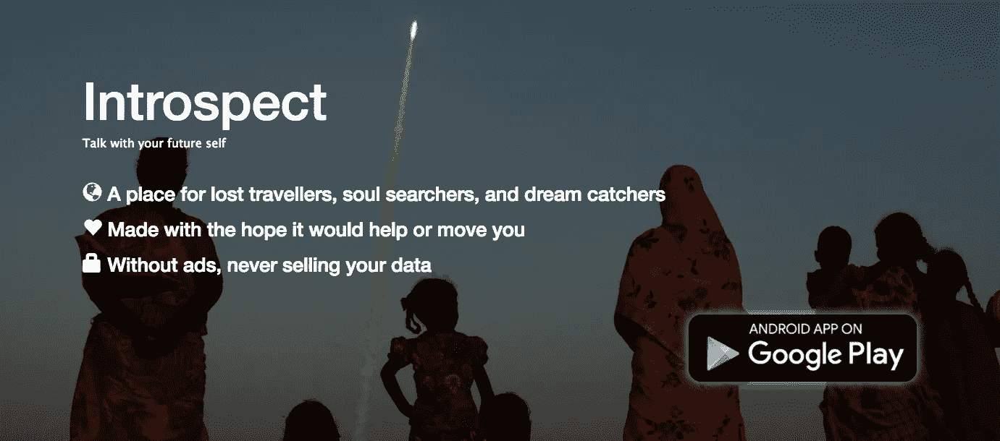
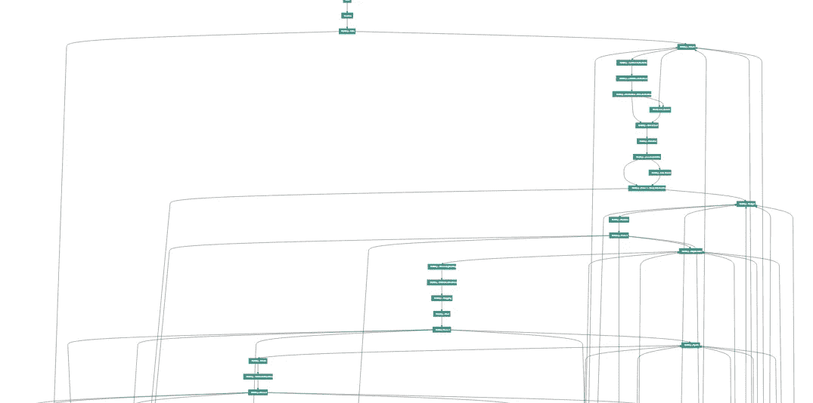
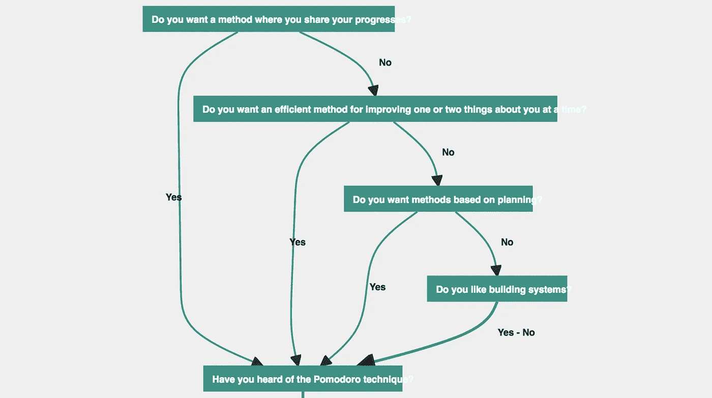

# 我应该丢掉一年的工作吗？

> 原文：<https://medium.com/hackernoon/should-i-throw-away-one-year-of-work-e67ed3f503f>

我打算放弃我努力了一年的东西。我不确定我放弃得太早还是太晚。我所知道的是，我想使用我尝试制作的产品。我真的希望它还能被制作出来，并被人们接受，我很难过我不能成为制作它的人。

# 我想做的是

我想建立一个不断发展的自助聊天机器人，在那里建议可以同时定制和透明。**一个协作聊天机器人帮助你问自己重要的问题。一个会问你关于你的工作、爱情生活、家庭生活、感情、金钱状况等问题的机器人，会引导你找到一个友好社区所确认的内容。这个想法是通过问封闭的问题来避免 [**NLP**](https://en.wikipedia.org/wiki/Natural_language_processing) 的复杂性，而是关注问题的结构和内容。**

****

**Web app ~ Talking about vacations seemed a good way to hook users…**

# **灵感**

**对于专业知识，我想借鉴一下[**stack exchange**](http://stackexchange.com)[**Wikipedia**](http://wikipedia.org)和 [**Reddit**](http://reddit.com) 。我相信所有这些平台都建立了一个工具，使得分享信息和建立专业知识变得更加容易。对于自省方面，我希望它类似于 [**Okcupid**](http://okcupid.com) 问题，可以帮助你定义你到底是谁。**

**介于 [**与**](http://akinator.com) 之间的东西为你的日常生活而艾从 [**她**](http://www.herthemovie.com/) **。****

> **一个像维基百科一样的聊天机器人，讨论生活中的常见问题。**

# **技术阶段**

**我建造了它。首先我写了一个 [**的基本安卓应用**](https://play.google.com/store/apps/details?id=com.mfkr.introspect) 来传递问题。然后我开始在 node.js 里面写后端:我写结构化问题协同编辑需要的工具。我试图为问题设计一个简单的结构，它既强大(针对特定用户，如生活在高生活成本地区的年轻人)，又能被任何人理解，这样每个人都可以参与进来并留下自己的印记。我花了很多时间实现一个允许协作、版本控制和接受/拒绝修订的投票系统的界面。**

# **合伙**

**项目进行 6 个月后，我意识到，如果我能提出技术解决方案，我在业务方面就有所欠缺。我的目标是创建一家专注于项目并与其社区合作的公司。我尝试并设法获得了一位业务能力很强的老朋友的帮助:易标。和他交谈是我开始这个项目以来遇到的最好的事情。**

# **心理学**

**从一开始，我就知道这个项目有心理学的角度。我试图联系现场的人，但我一直不太擅长跟进我拥有的潜在线索。**

# **内容**

**我们决定专注于一个领域。我们选择旅游是因为有一整个 [**维基**](http://wikitravel.org/en/Main_Page) 致力于旅游，并且在 [**子编辑**](https://www.reddit.com/r/travel/) 上有一个非常活跃的社区。我试图用这些资源填充应用程序，试图重写它们的内容以适应我们的格式。回想起来，我对我当时写的内容有点不满意。我的过程有点太机械了，而且很明显我不是以英语为母语的人。我还觉得回答这些焦点问题变得比一次谈话应该做的还要乏味。**

**在此阶段，我们了解到图表的复杂性很高，但使用专用工具绘制图表是可以管理的:**

****

**This tool simulates most possible path for the conversations.**

# **拔靴带**

**然后我们决定联系一些子编辑，把他们作为反馈来源。我们只联系了一个 sub Reddit[**/r/get disciplified**](http://reddit.com/r/getdisciplined)，我们从 subreddit mod 那里得到的反馈很有价值，我们根据他们的意见做了一些修改。**

****

**Small graph extract with strong emphasis on Pomodoro. Not displayed here: reactions and tags associated with answers.**

**与此同时，我联系了另一位心理学毕业的老朋友，看看我们如何在应用程序中添加一些心理学内容。这让我们增加了一些工作心理学调查。在这次添加过程中，我发现了平台中的错误，并花了大量时间来修复这些错误。她也有点不太方便，我不想强迫她从她的有偿工作中抽出时间来做一个我不能保证会成功的项目。**

# **动量损失**

**在这些台阶的某个地方，我失去了动力。我的搭档一直在和人见面。我开始找工作。我还遭受了一次运动损伤，这使我无法出门。我之前已经几次失去动力，但被堵在家里让我更难回到正轨。我现在几乎已经完全从伤病中恢复了。**

**我们总是在专注于一个单一领域和试图为全球观众创造一些东西之间摇摆不定。找到合适的角度，从这个角度我们可以施加足够的摩擦来建立一个成功的公司，并通过这个项目接触到每个人。易标设法找到了一个在创业和投资方面有很强背景的人。**

**对话的结果表明，像现在这样，作为一家成功的公司推出或吸引投资来启动项目将极具挑战性。看来我们需要做一个强有力的支点。虽然我同意可能需要改变，但我担心这意味着我们需要**放弃一年的工作**。**

> ****用户如何到达那里？****

**所有的问题都有一个网页，所有这些网页都由问题图联系起来。我们尝试寻找内容来源。我相信这是搜索引擎想要推广的内容。**

> ****他们会发现什么？****
> 
> ****我为什么要使用该应用程序？****

**找到重要的问题。为了帮助你摆脱财务债务、没有出路的工作、有害的关系，找到与家人重新联系的方法……我们需要以透明友好的方式互相帮助。**

> ****为什么这是正确的格式？****

**我不确定我选择的格式是不是正确的格式，但是我相信对话框对于像这样的工具来说是正确的格式。我还认为是/否格式很有趣，因为它允许用户在有限的时间内回答一长串问题。似乎是/否格式也有局限性，有时可能会在某些地方被下拉列表或数字选择器取代，但为了保持流畅，不要太频繁。**

# **兴趣**

**这个项目涉及了我在过去 10 年里一直热衷的许多话题:**

**我在工程学校写了第一个聊天机器人。从那时起，我就一直密切关注这一领域。**

**我有机会用我以前的工作为一个社区工作，这感觉很棒。建立一些有积极反馈的东西让我很高兴去工作。**

****Stackexchange** 和**维基百科**一直让我着迷。浏览维基百科的聊天页面和堆栈溢出元是我需要避免做的事情。你听说过[联合维基](http://fed.wiki.org/view/welcome-visitors)吗？**

**你现在一定听说过 reddit 了。你可以在 reddit 上找到与你分享激情的小社区。这就是我想带你去的地方，这些专门的社区和他们已经创建/选择的资源。**

**回答 okcupid 的问题可能有助于我定义我现在是谁。**

****在这些平台上工作真的很棒。**在我开始过多怀疑这个项目之前，这个工作感觉不像工作。**

# **迷失在牵引中**

**当大愿景看起来可行，但你不知道如何实现时，你能做什么？我迷路了。我从来不认为这很容易。**

**我曾在一家初创公司工作过，我发现找到合适的产品/市场可能是一场斗争。我希望早点获得一些关注，我们必须对反馈做出反应，而不是总是试图寻找获得有用反馈的方法。**

**我希望找到一条曲折的道路，从我所在的地方到我想去的地方。我们学到的是，我们的道路是不切实际的。我们需要接触更多的人来创造新的途径。**

**我要么放弃，回归正常生活；我真的应该。厌恶损失。迷失和缺乏自律是一杯糟糕的鸡尾酒。**

**我还是不想。我相信我们还没有打出我们手中的一些牌。我失败得还不够努力。**

**我知道我在这里与两个群体对话。那些已经想参与进来的人和那些相信他们知道为什么行不通的人。我的目标是调和这两个社区，并在这个项目发生的地方走一条好的路线。**

**如果你想投稿， [**请便**](https://introspect.space/auth/signup) ，这个项目正处于欢迎所有投稿的阶段。**

**最后，我设法获得了创建 subreddit 的权限:这里是**

****你可以讨论你希望这个项目何去何从。不是我的，是你的。我想继续参与，但我是否会有所贡献将取决于你。我们还需要一个聊天机器人的名字…****

# ****结论****

****写这篇文章的时候，我在人际交往方面还不是很好。这并不奇怪，因为我从来都不是一个真正的[人缘好的人](https://www.16personalities.com/intp-personality)，但它在这里的影响是巨大的。我可能特别没有足够自信地看待我在这个项目中所看到的，以及我们应该如何大胆地去接触人们。****

# ****然后****

****自从我开始写这篇文章以来，事情发生了变化:****

****我目前正在面试巴黎创业公司的[安卓开发者](https://www.linkedin.com/in/emmanuel-requier-b673786/)职位。经历面试帮助我进入更积极的心态。****

****我会在未来几年资助这个项目，如果它吸引用户。我需要清理代码并开源它。****

****我喜欢来自**维基人、redditors、okcupid 和 stack exchange 用户**以及这些平台背后的人们**的意见。他们的意见是我需要知道如何做这个项目。你能帮我联系到他们吗？******

****[杰夫·阿特伍德](https://fr.wikipedia.org/wiki/Jeff_Atwood)、[乔尔·斯波尔斯基](https://fr.wikipedia.org/wiki/Jo%C3%ABl_Spolsky)、[吉米·多纳尔·威尔士](https://fr.wikipedia.org/wiki/Jimmy_Wales)、[沃德·坎宁安](https://fr.wikipedia.org/wiki/Ward_Cunningham)、[史蒂夫·霍夫曼](https://en.wikipedia.org/wiki/Steve_Huffman)、[亚历克西斯·奥哈尼安](https://en.wikipedia.org/wiki/Alexis_Ohanian)、[克里斯蒂安·鲁德](https://en.wikipedia.org/wiki/Christian_Rudder)、[萨姆·亚甘](https://en.wikipedia.org/wiki/Sam_Yagan)和马克斯·克罗恩:我的职业生涯和人格很大一部分都归功于你们。你能帮我想想我做的这个项目该怎么办吗？****

# ****谢谢****

****没有我的朋友和家人的支持，这个项目永远不会发生。谢谢你****

****我需要特别感谢易标，他准备在这个项目上与我合作，并一周又一周地跟踪进展，试图将这个项目推向可行性。****

****我还要特别感谢梅吉，她花时间给了我一些反馈，让我完成了这篇文章。****

****感谢你阅读了这么多。****

# ****[立即试用 web app](https://introspect.space/app)****

************************

> ****[黑客中午](http://bit.ly/Hackernoon)是黑客如何开始他们的下午。我们是 [@AMI](http://bit.ly/atAMIatAMI) 家庭的一员。我们现在[接受投稿](http://bit.ly/hackernoonsubmission)，并乐意[讨论广告&赞助](mailto:partners@amipublications.com)机会。****
> 
> ****如果你喜欢这个故事，我们推荐你阅读我们的[最新科技故事](http://bit.ly/hackernoonlatestt)和[趋势科技故事](https://hackernoon.com/trending)。直到下一次，不要把世界的现实想当然！****

********