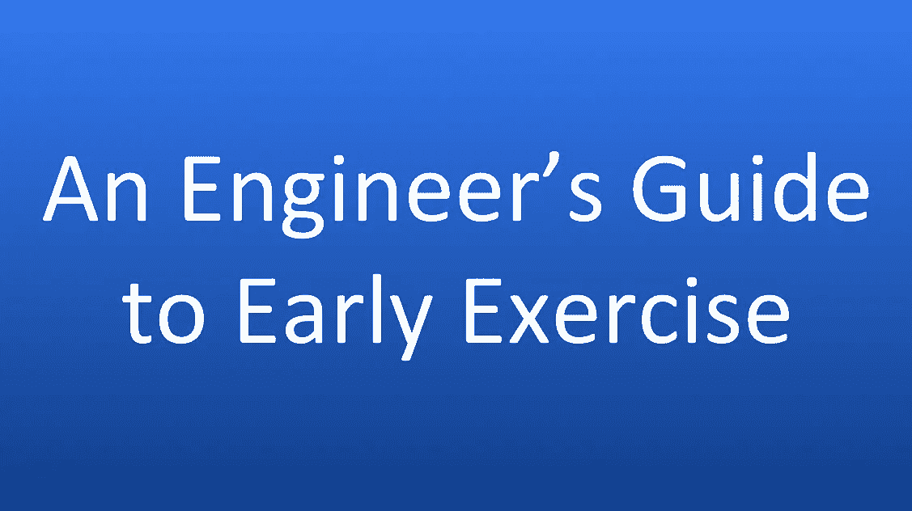

# 早期锻炼的早期工程师指南

> 原文：<https://medium.com/hackernoon/should-you-early-exercise-dd9dfe25accb>

欢迎，目光明亮的[工程师](https://hackernoon.com/tagged/engineer)，来到早期[创业公司](https://hackernoon.com/tagged/startups)的世界！希望你已经见过这个团队，得到了你的名字@电子邮件地址，提交了你的第一个拉请求，并且疯狂地回复了你的第一个拉请求。你现在面临着迄今为止你一生中最重要的财务决策:你应该提前行使你的股票期权吗？

当我做出这个决定时，我惊讶于网上的建议如此之少。最令人费解的是，没有一个电子表格模拟早期锻炼的成本和收益。现在，哪个工程师不爱一个好的 Excel 模型？你等着瞧吧，我精通金融的朋友，因为我已经为你建了一个！

那么，什么是早期锻炼，如果不是一些自虐的清晨交叉健身锻炼？当您提前行使时，您提前购买了部分或全部未授予的期权，然后在授予时获得股份(您加入时应该已经收到了授予时间表)。假设你被授予 10 万份期权，执行价格为 0.25 美元，行权期为 4 年。如果你提前行权，你给你的公司开一张 2.5 万美元的支票(10 万股 X 0.25 美元的执行价/股)，然后把你的所有期权转换成股票。根据你的授权时间表，你仍然可以得到股票(假设公司做到了——以后会有更多的介绍！)，你只需预付即可。

现在，你为什么要预付？为了避税。

你可以避免短期资本利得税，并可以减轻可怕的替代最低税。在我继续之前，官方声明:**我不是会计师。我不会假装自己是同性恋，甚至会尽量避免穿得像同性恋。所以，如果你使用我的模式，最后不得不典当你珍贵的吉娃娃来赚取租金，不要起诉我。(不过说真的，对狗的事很抱歉。)**

早期行使没有截止日期，但正如你将在下面看到的，在你的公司被政府重新估值之前行使是最有利的。这通常每年都会发生，在重大财务事件(新一轮融资、大客户支票等)期间也会发生。和你的创始人确认下一次 409a 估值是什么时候。如果还有两个多月，就推迟做这个决定。你应该尽可能晚地做出决定，因为到那时你会对你的公司和市场有更多的了解。

**提早行使的理由#1:避免短期资本利得税**

如果你在购买后的一年内出售投资，你的收入将作为固定收入征税。但如果你在出售前持有该资产一年或更长时间，你需要支付长期资本利得税，这通常低于你的所得税。大多数收入群体的联邦税率是 15%，而各州税率各不相同(这里的是一个计算器)。你的长期资本利得率可能远远低于你的所得税率。

如果您同时满足以下两个条件，您的股权可以获得长期资本利得待遇:

(1)在授予日期后持有 2 年

(2)运动后坚持 1 年

通过早期锻炼，你可以更早地开始工作。如果你想匆忙卖出你的股票，比如说因为你需要钱来行使更多的股票，这就很重要。通过提前行权，你可以在出售股票时获得较低的税率。

**提早行使的理由之二:减轻替代最低税**

提前行使的另一个财务原因是减轻替代最低税(AMT)。在 60 年代，尼克松和他的共和党国会被富有的美国人利用漏洞逃税而受到指责。为了解决这个问题，他们实施了简单的统一税，取消了所有纳入主要税法的特殊利益豁免。美国国税局以两种方式计算你的税款:标准累进所得税，以及这种替代最低税。你必须支付两者中较高的一个。

在 AMT 计算中，行权价格和行权时间估价的差异被视为收入。换句话说，你要为行权价和当前估值之间的差价支付 AMT。一个简单的例子可以让你意识到这有多疯狂:假设你以 0.25 美元的执行价格行使你的 10 万份期权，公司目前的市值为每股 1 美元。在金额计算中，你花费了 0.25 * 10 万美元= 2.5 万美元，并赚取了 1 * 10 万美元= 10 万美元，因此你应就 7.5 万美元的收入纳税。但是等等，你还没有卖掉你的股份！你赚了整整 0 美元。不管怎样，你必须为这 75，000 美元的收入缴税。

你支付的金额是行权价和当前估值之间的差价。目前的估值由政府设定，通常使用[布莱克-斯科尔斯模型](https://en.wikipedia.org/wiki/Black%E2%80%93Scholes_model)。因为您的履约价格是根据您加入时的估价设定的，所以通过提前行使，此价差将为 0。所以行使你的期权不会让你达到 AMT。

AMT 多功能体适一体机是员工选择早期锻炼的最常见原因。然而，有一个不可或缺的事实经常被忽视: [AMT 可退款](https://www.irs.gov/publications/p17#en_US_2016_publink1000174949)！

如果您以 AMT 支付 15k 美元的税款，而您的常规税款为 10k 美元，您将获得 5k 美元的税收抵免。在未来几年，当你没有达到 AMT 时，你可以将此抵免用于你的常规税收。即使可以退款，AMT 还是很讨厌。你手头可能没有现金来购买你的期权和支付 AMT，这使得行使变得困难或不可能。你在 AMT 中支付的金额被捆绑，这意味着你不能投资它。通过早期锻炼，你可以避免 AMT。

*如何计算金额*

AMT 原理简单，但实际操作复杂。美国国税局已经提供了一个方便的 [AMT 助手](https://www.irs.gov/businesses/small-businesses-self-employed/alternative-minimum-tax-assistant-for-individuals)，但这里有一个快速和肮脏的近似:

(1)将你的应税收入加到你的总扣除额中。这是你的应税金额。

(2)从应纳税额中减去 54，300 美元的免税额。再加上(收入—淘汰收入)的 25%，其中淘汰收入当前设置为 120，700 美元。这些数字是 2017 纳税年度的数据，其他年份，请向美国国税局查询。

(3)取这个数的 26%。这是你的 AMT。

现在把这个数字和你在普通税收中支付的金额进行比较。你付出的越多。

一位读者[开发了这个网络应用](https://amtcalculator.com/)来使用这个近似值计算 AMT。

一些州有 AMT，但它通常不会影响你，除非你的收入非常高(> 50 万美元)。

**早锻炼的理由之三:避开金手铐**

快速成长的公司的早期工程师经常被“金手铐”囚禁。期权通常在离开公司 90 天后到期。当一个早期员工想要离开时，她会发现自己陷入了困境:她在股票期权上账面价值数百万，但为了保留股权，员工必须将期权转换成股票。她必须支付行使股票的费用，还将被课以重税。这个总数可能非常大，以至于离开创业公司在财务上是不可行的，这导致了众所周知的金手铐。

早期行使时，您需要预先支付行使价，也无需支付金额。你可以随时离开公司，并持有所有既得股份。

你应该检查一下你公司的期权到期政策。虽然 90 天曾经是标准，但许多公司正在转向对员工更友好的政策。在 Pinterest，你的期权在离职 10 年后才到期。在心电图，是你任期的两倍。

通过尽早行使你的期权，你可以避免金手铐，从而在职业生涯中获得更大的灵活性。

**车型**

如我所承诺的，我已经把这些知识编成了一个模型。现在，在你埋头于数字和公式之前，有一些假设你应该知道:

(a)您收到的是激励性股票期权(ISOs ),而不是非限定性股票期权(NSO)。AMT 不适用于国家统计局，尽管对他们有一些严重的不利因素。

(b)你的履约价格高到足以产生影响。如果你加入预融资，你的执行价格将会非常低，以至于早期执行的成本微不足道。这就是创始人的情况，早期锻炼是显而易见的。

(c)假设稀释、税率和市场收益等常数。在使用模型之前，您应该在“假定常数”页面中修改这些值。

[二话没说，下面是型号](https://drive.google.com/open?id=1ih77OEI2qCxi_j2rHXPFfGge_pPCUv1-fJ56mbc6vUE)。你应该复制一份并修改*下的数字，你的值*和*假定为常数。*

我包括了 3 个常见的场景:

(1)提前行使一切，当你的行权价等于当前股票估值时，你可以提前行使你的全部股票授予。请注意，在这种情况下没有 AMT，尽管有很大的机会成本来行使，其中你的钱被束缚在你的公司，所以不能投资。

(2)在授权时行使和持有:在这种方法中，一旦股票授权，你就行使你的股票，然后持有股票直到有退出机会。在这种情况下，锻炼的机会成本较低，但你必须支付 AMT。

(3)在退出时行使和出售:最规避风险的方法，你持有你的期权，直到一个退出机会(收购、IPO、融资)，当你行使你的期权并立即出售股票。

**公司倒闭了怎么办？**

所以你把你的数字输入到模型中，注意到三种情况都给了你过高的分红。当然，问题是他们认为你的公司有一个有利可图的退出机会。如果公司倒闭了会怎么样？

本文讨论了三项支出:行权价、资本收益和 AMT。让我们在公司倒闭的情况下逐一看一下:

你将失去你为早期锻炼付出的钱。从技术上讲，该公司有权回购未归属股票，但如果他们失败了，他们就没有钱这么做。最令人欣慰的是，你不用缴纳资本利得税，因为你没有资本利得。至于 AMT，如上所述，您仍然可以通过税收抵免获得这些税款。

这就是早期锻炼有风险的原因。你永远不应该过早锻炼，锻炼的量不能超过你能承受的量。

**就这些！**

提早锻炼意味着你今天支付了很多钱，如果公司倒闭了，你就拿不回来了。而且它占用了原本可以投资于市场的资金。然而，有一些很好的理由让你尽早锻炼:

(1)尽量减少资本收益税

(2)避免击中 AMT

(3)职业灵活性

我已经给了你决定早期锻炼是否适合你的方法，但是没有放之四海而皆准的答案。运行模型，与你的创始人讨论，并评论任何问题。

如果你觉得这很有用，那就把它分享给你那些在早期创业公司工作的朋友。

如果你注意到这篇文章或模型中有任何不准确的地方，请给我留言。

非常感谢安妮莎·怀特和 T2·奥默·扎克帮助我编辑这篇文章。