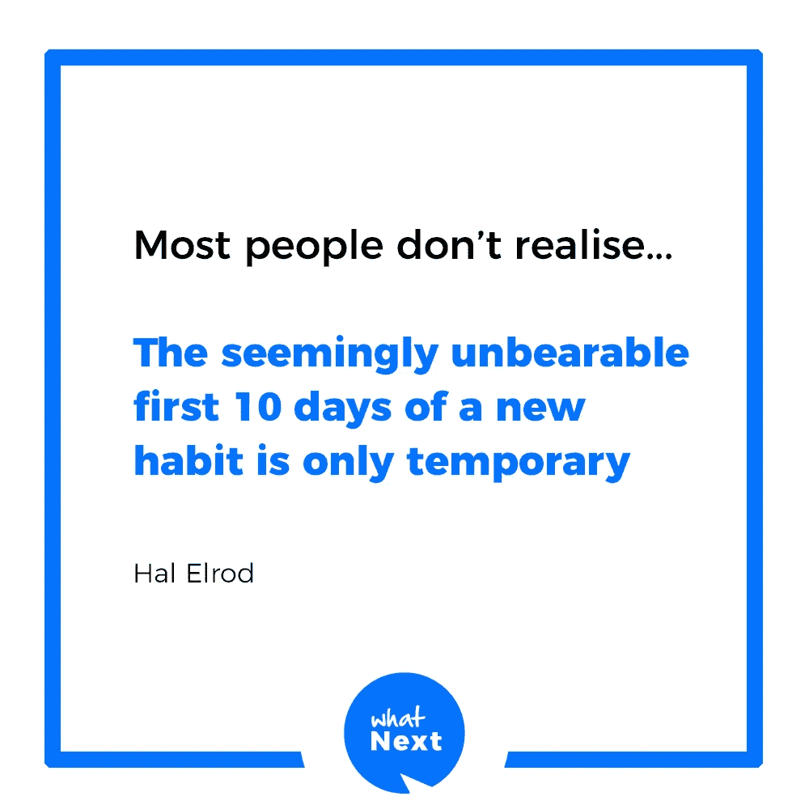

# 出现吧。每天。

> 原文：<https://medium.com/hackernoon/show-up-everyday-9ecca24519a0>

## 不管你喜不喜欢。

> 你不必完美，你永远也不会完美。事情一开始可能并不令人兴奋，而且通常也不会令人兴奋。

一个新习惯需要很多努力和力量才能进入你的日常生活(它已经被很多事情过度拥挤，让你超级忙碌，不让你做那些引导你达到目标的超级重要的事情)。

和输赢没关系。更重要的是找到不失败的方法。头脑总是在一千件事情上工作，有效地阻止你采取任何行动。

它能想到的最好的行动是——让我们明天再来看，因为这很简单，也不碍事。

一件困难的事情是此时此刻盯着这个问题，然后说——让我们现在就来解决这个问题。这从来都不深刻或令人兴奋。

做一些完全不舒服的事情会让你脱离大多数人，这些人很擅长把事情推到第二天。**不要成为那样的人。**

这并不有趣，但重要的是你要采取行动，让你的目标更容易实现。

如果你不能从座位上站起来开始执行，世界上所有的计划都是不够的。

旧习惯很难改变，新习惯可能比旧习惯难 10 倍。这就是最成功的人和失败者的区别。这是一个艰难的选择，很少有人有精神力量做出这样的选择。

大多数人只是每天梦见它。从一小步开始。**你很可能会失败，但这没关系。**重要的不是在第一步取得胜利，而是知道第一步的失败已经向你展示了如何应对第二步。

这个游戏正在变得越来越热，现在没有多少人玩这个游戏。

> 所以不要想着放弃。任何新习惯的头 10 天都是最可怕的。

这是你的猴脑通常会赢，你又回到老套路的时候。看看过去的 10 天，把它当成休息的 10 天，接下来的 10 天是工作的 10 天——来建立这个新习惯。

你可能在十天中的每一天都失败，没关系。振作起来，坚持到第 11 天。

很多人说养成习惯需要 90 天。这听起来很可行，但我们大多数人坚持不了头 10 天。

一旦你达到 30 天，你现在要对自己负责。你已经投入了 30 天的努力，你不想失去它，这将推动接下来的 30 天，等等。

现在，每天出现，变成了一种惯例，你不想打破这一链条。

接下来的日子就简单多了。

记住这一点，继续前进。

**如果你喜欢这个帖子，请鼓掌…**

[www.1uxtip.today](http://www.1uxtip.today)