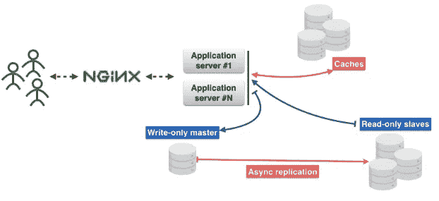
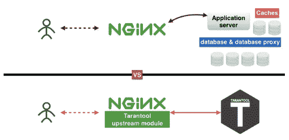
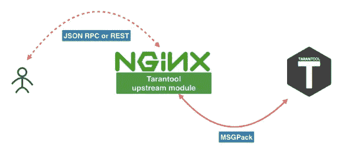
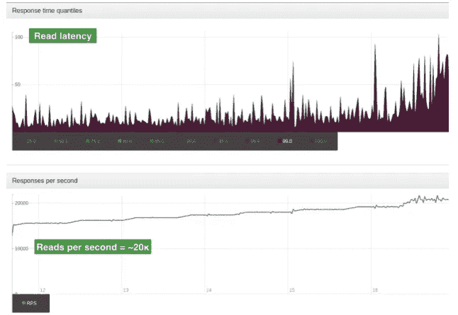
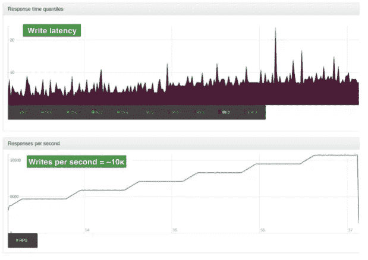

# 将多层体系结构中的层数从 5 层缩减到 2 层

> 原文：<https://medium.com/hackernoon/shrink-the-number-of-tiers-in-a-multitier-architecture-from-5-to-2-c59b7bf46c86>

作为许多开源项目的提交者，有一天我决定让我的生活变得更简单，为 NginX 开发了一个上游模块，它帮助我消除了多层架构中的一大堆层。这是一次如此有趣的经历，现在我决定分享我的结果并发表一篇文章。我的结果是完全开源的，参见这里的源代码:[https://github.com/tarantool/nginx_upstream_module](https://github.com/tarantool/nginx_upstream_module)。你可以从头开始构建它，或者通过这个链接下载一个 docker 镜像:【https://hub.docker.com/r/tarantool/tarantool-nginx。

# **议程**

*   导论和理论
*   如何使用这些技术
*   基准
*   参考

# **简介&理论**



这是微服务的典型架构。用户请求通过 NginX 到达应用服务器。在用户与之交互的应用服务器上运行着一些业务逻辑。

应用服务器不保存任何状态，所以您需要将这些状态存储在某个地方。你可以使用数据库。此外，还有一个缓存来减少延迟并确保更快的内容交付。

让我们给这些层下定义:

**一级** — NginX

**第二层** —应用服务器

**第三层** —缓存

**第 4 层** —数据库代理。您需要该代理来保护数据库的容错能力，并保持与数据库的连接。

**第 5 层** —数据库服务器

有一天，我开始思考这五个层次，并提出了一个消除其中一些层次的想法。我为什么要这么做？原因有很多。我喜欢保持简单，我不喜欢在生产中维护大量不同的系统，最后但同样重要的是，层次越少意味着故障点越少。因此，我创建了一个 Tarantool NginX 上游模块，帮助我将层数减少到两层。



Tarantool 如何帮助我们减少一些层级？嗯，第一层是 NginX，第二层、第三层和第五层现在被 Tarantool 取代了。第四层——即数据库代理——现在在 NginX 中。诀窍在于 Tarantool 集数据库、缓存和应用服务器于一身。我的上游模块是把 NginX 和 Tarantool 粘在一起的胶水，让它们在没有其他三层的情况下工作。



这就是我们新的微服务的样子。用户使用 Tarantool 上游模块向 NginX 发送 REST 或 JSON RPC 请求。这个模块直接连接到 Tarantool，或者这个模块可以在许多 Tarantool 实例之间平衡工作负载。我们在 NginX 和 Tarantool 之间使用了一个基于 [MSGPack](http://msgpack.org/) 的高效协议。你可以在这篇[文章](/@vasiliysoshnikov/building-nginx-and-tarantool-based-services-c92492fc34c6#.yiru1luj9)中找到更多信息。

此外，您可以浏览这些链接，下载 Tarantool 和 NginX 模块。但是我建议你通过软件包安装所有的东西或者使用 Docker 镜像(Docker pull tarantool/tarantool-nginx)。

## Docker 图像

【https://hub.docker.com/r/tarantool/tarantool 

[](https://hub.docker.com/r/tarantool/tarantool-nginx) [## Tarantool NginX 上游模块

### 关键特性:nginx 和 tarantool 特性都可以通过 HTTP(S)访问。Tarantool 方法可通过 JSON-RPC 或…

hub.docker.com](https://hub.docker.com/r/tarantool/tarantool-nginx) 

## **套餐**

 [## Tarantool -下载

### curl http://download.tarantool.org/tarantool/1.7/gpgkey | sudo apt-key add-release = ` LSB _ release-c-s `# install…

tarantool.org](https://tarantool.org/download.html) 

## **来源**

[](https://github.com/tarantool) [## 塔兰托尔

### GitHub 是人们构建软件的地方。超过 1500 万人使用 GitHub 来发现、分享和贡献超过…

github.com](https://github.com/tarantool) [](https://github.com/tarantool/nginx_upstream_module) [## tarantool/nginx _ upstream _ module

### NginX _ upstream _ module-Tarantool NginX 上游模块(REST、JSON API、websockets、负载平衡)

github.com](https://github.com/tarantool/nginx_upstream_module) 

# **如何使用这些技术**

下面是 nginx.conf 文件的一个例子。如你所见，这是一个常规的 NginX 上游。这里我们有“tnt_pass”指令告诉 NginX 在指定的位置有一个 Tarantool 上游。

*— nginx-tnt.conf*

```
http { # upstream
 upstream tnt {
  server 127.0.0.1:3301;
  keepalive 1000;
 }
 server {
  listen 8081; # gateway 
  location /api/do {
   tnt_pass_http_request parse_args;
   tnt_pass tnt;
  }
 }
}
```

以下是文档链接:

[http://nginx.org/en/docs/http/ngx_http_upstream_module.html](http://nginx.org/en/docs/http/ngx_http_upstream_module.html)
[https://github . com/tarantool/nginx _ upstream _ module/blob/master/readme . MD](https://github.com/tarantool/nginx_upstream_module/blob/master/README.md)

我们已经把 NginX 和 Tarantool 联系起来了。那么，下一步是什么？我们需要编写一个函数，并将这个函数存储在一个文件中。我把它保存在一个名为“app.lua”的文件中。

这里有一个到塔兰托尔文档的链接:[https://tarantool.org/doc/tutorials/index.html](https://tarantool.org/doc/tutorials/index.html)

```
-- Bootstrap Tarantool
box.cfg { listen='*:3301' }-- Grants
box.once('grants', function()
 box.schema.user.grant('guest', 'read,write,execute', 'universe')
end) -- Global variable
hello_str = 'Hello'-- function
function api(http_request)
 local str = hello_str
 if http_request.method == 'GET' then
  str = 'Goodbye'
 end
 return 'first', 2, { str .. 'world!' }, http_request.args
end
```

让我们仔细看看这段 Lua 代码。

*box.cfg {}* —它在告诉 Tarantool 开始监听 3301 端口，也可以带其他参数。

*box.once* —它在告诉 Tarantool 在一生中调用某个函数一次。

*函数 api()* —这是我们即将要调用的函数。这个函数非常简单，它接受一个 HTTP 请求作为第一个参数，并返回一个值数组。

我将这段代码存储在一个名为“app.lua”的文件中。我可以通过启动 Tarantool 二进制文件来执行它。

```
$> tarantool app.lua
```

让我们通过使用 HTTP GET 请求来调用我们的函数。我用“wget”来表示这个。默认情况下，“wget”将结果放入一个文件中。所以，我用“猫”来提取这个文件的内容。

```
$ wget '0.0.0.0:8081/api/do?arg_1=1&arg_2=2'$ cat do*
{ “id”:0, # — unique identifier of the request
  “result”: **[ # —** is what our Tarantool function returns [“first”], [2], [{ “request”:{“arg_2”:”2",”arg_1":”1"} “1”:”Goodbye world!”
    }]
]}
```

# **基准**

> 这些基准测试正在使用生产数据运行。
> 
> 这个基准测试的输入数据是一个大型 JSON 对象。每个对象的平均大小为 2k 字节。
> 
> 单台服务器，4 核 CPU，90GB 内存，操作系统 Ubuntu 14.04.1 LTS

对于这个测试，我们只使用一个 NginX worker。这个工人是循环平衡器。该工作线程正在平衡两个 Tarantool 实例的工作负载。实例通过分片联系在一起。

这些图表向我们展示了每秒的读取次数。顶部的图表显示了延迟时间(毫秒)。



在这里我们可以看到更多的图表。这些图表显示了每秒的写入次数。顶部的图表显示了延迟时间(毫秒)。



印象深刻！你这样认为吗？

在下一篇文章中，我将详细介绍 REST 和 JSON RPC。

[](http://bit.ly/HackernoonFB)[](https://goo.gl/k7XYbx)[](https://goo.gl/4ofytp)

> [黑客中午](http://bit.ly/Hackernoon)是黑客如何开始他们的下午。我们是 [@AMI](http://bit.ly/atAMIatAMI) 家庭的一员。我们现在[接受投稿](http://bit.ly/hackernoonsubmission)并乐意[讨论广告&赞助](mailto:partners@amipublications.com)机会。
> 
> 如果你喜欢这个故事，我们推荐你阅读我们的[最新科技故事](http://bit.ly/hackernoonlatestt)和[趋势科技故事](https://hackernoon.com/trending)。直到下一次，不要把世界的现实想当然！

[](https://goo.gl/Ahtev1)