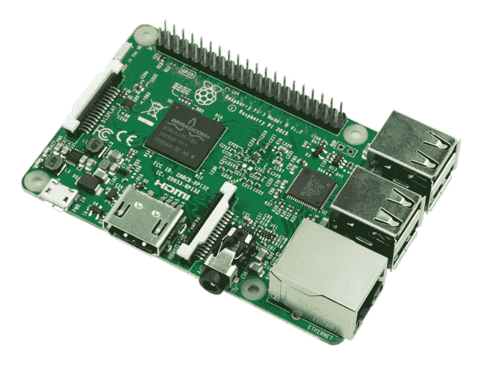

# 关闭你的树莓派，简单的方法

> 原文：<https://medium.com/hackernoon/shut-down-your-raspberry-pi-the-easy-way-9c7be0b4fff8>



A Raspberry Pi 3

树莓派(又名 rpi)是一个很好的小东西。它很便宜，用 SD 卡运行 debian。在它上面做任何事情都很快很容易，只要你不把它当成一个*无头*设备。

无头设备是指没有连接显示器、鼠标或键盘等外围设备的设备。他们基本上处于最低限度:权力**和网络**。(这些可以在没有 GUI 的情况下运行轻量级发行版)。访问这些机器的唯一方式是通过串行转 usb 适配器或 ssh。特别是，通过 ssh 的访问也有自己的问题。****

# **如果没有网络连接，您将如何关闭您的无头 rpi？**

**reddit 上有一整个[线程](https://www.reddit.com/r/raspberry_pi/comments/59nate/really_wish_the_rpi_had_a_power_switch/)致力于关闭无头 pi。大多数答案都围绕着给 GPIO 附加一个按钮或者购买一个附加板。有相当多的解决方案涉及买东西。**

**我要买东西吗？
*没门！***

**很久以前，Stefan Tomanek 写了一个叫做 [triggerhappy](https://github.com/wertarbyte/triggerhappy) 的东西。用他的话说，**

> **Triggerhappy 是一个热键守护程序，专为小型嵌入式系统开发，例如基于 linux 的路由器。它附加到输入设备文件上，
> 解释接收到的事件数据，并执行在
> 配置中配置的脚本。**

# **给我台阶就行了！**

**要关闭 pi，我们将鼠标插入 pi 的 USB 并右键单击。我们将配置 *triggerhappy* 守护进程来监听该事件并调用 shutdown 命令。**

****找到触发**的事件代码
将鼠标(或任何其他输入设备)连接到 rpi。通过运行`thd --dump /dev/input*`找出您点击/敲击的事件名称。这将列出与您的点击相关的事件。在我的例子中，按下鼠标右键是`BTN_RIGHT 1`，按下按钮是`BTN_RIGHT 0`。**

****创建关机脚本** 制作文件`/etc/trigger.sh`**

```
#!/bin/bash# Announce to all terminals
wall 'A mouse forced me to shut down'# The actual shutdown command. sudo is used because shutdown    
# needs root previlages 
sudo /sbin/shutdown now
```

****使脚本可执行****

```
sudo chmod +x /etc/trigger.sh 
```

****创建 *triggerhappy* 配置文件**
创建一个包含以下内容的文件`/etc/triggerhappy/triggers.d/mouse-poweroff.conf`。(用第一步中的触发事件代码替换`BTN_RIGHT`)**

```
BTN_RIGHT 1 /etc/trigger.sh
```

****重启*触发*快乐****

```
sudo systemctl restart triggerhappy.service
```

# **路障！**

**嗯，它不是应该已经开始工作了吗？没有。
triggerhappy，作为名为`nobody`的用户执行我们的脚本。根据[维基百科](https://en.wikipedia.org/wiki/Nobody_(username))，**

> **在许多 Unix 变体中，“ **nobody** ”是一个用户帐户的常规名称，它不拥有任何文件，不属于任何特权组，并且除了其他用户拥有的能力之外，没有其他能力。有些系统还定义了一个等价的群“nogroup”。**

**`shutdown`命令[需要根预览](https://github.com/systemd/systemd/blob/master/src/core/shutdown.c)来实际关闭 pi。`nobody`实际上不能用超级用户权限执行任何命令。我们现在要绕过它。我们需要允许用户`nobody`在不需要密码的情况下用`sudo`执行`shutdown`。**

**现在，`sudo visudo`会打开一个编辑器来编辑`sudoers`文件。在末尾添加以下内容，保存并退出。**

```
# We add echo command for testing. Remove later
nobody ALL =NOPASSWD: /bin/echo*,/sbin/shutdown*
```

*****警告:*** 这不是一种干净或安全的方式，因为我们正在授予`nobody`关闭您的 pi 的权限。**

**要查看它是否有效，请从您的当前用户处获取`sudo su -s /bin/bash nobody`，并检查您是否可以将`sudo echo 'hello world'`作为`nobody`。**

# **我们结束了。**

**将鼠标连接到 rpi，右键单击并观察 rpi 关闭。**

**[](http://bit.ly/HackernoonFB)****[](https://goo.gl/k7XYbx)****[](https://goo.gl/4ofytp)**

> **[黑客中午](http://bit.ly/Hackernoon)是黑客如何开始他们的下午。我们是 [@AMI](http://bit.ly/atAMIatAMI) 家庭的一员。我们现在[接受投稿](http://bit.ly/hackernoonsubmission)并乐意[讨论广告&赞助](mailto:partners@amipublications.com)机会。**
> 
> **如果你喜欢这个故事，我们推荐你阅读我们的[最新科技故事](http://bit.ly/hackernoonlatestt)和[趋势科技故事](https://hackernoon.com/trending)。直到下一次，不要把世界的现实想当然！**

****