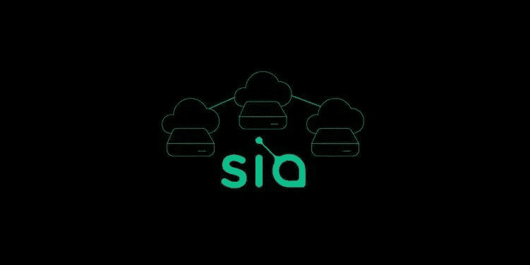
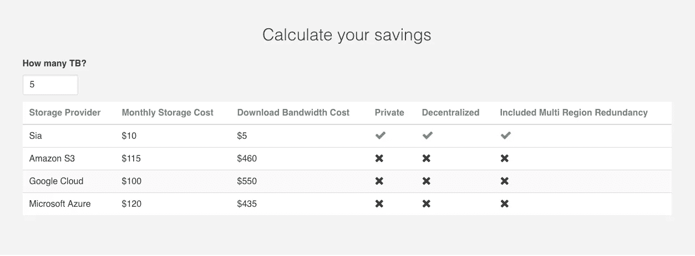

# Sia:区块链最亮的明星

> 原文：<https://medium.com/hackernoon/sia-blockchains-brightest-star-ab584992391>

当今时代最具革命性的产品以更低的成本为消费者提供了更好的产品。虽然这种说法听起来很简单，但在竞争如此激烈的资本主义市场中，只有极少数公司能够做到这一点。在云存储这样一个由亚马逊、谷歌和 Dropbox 等科技巨头主导的庞大行业中，这甚至增加了另一层难度。各位，今天我在这里告诉你们，新航成功了。

Sia 是一个分散的云存储解决方案。对于非技术人员来说，大多数人可能都至少有过在 Google Drive、Dropbox 或类似设备中存储文件的经验。谷歌和 Dropbox 都拥有拥有数千台服务器的大型数据中心。当你在 Google Drive 或 Dropbox 这样的服务上存储文件时，你的文件实际上会进入他们的一个中央服务器，他们为此支付了数百万美元。

新航没有建立一个巨大的数据中心，而是为闲置的硬盘空间建立了一个市场。虽然我绝对讨厌这种比较，但可以把它想象成“硬盘空间的优步”(我稍后会解释它是如何变得更好的)。当我在 Sia 上存储一个文件时，这个文件被分成 30 个不同的片段。每一个片段都被加密并发送到世界各地的硬盘上。当我想从 Sia 网络下载文件时，只需要收集 10 个文件(任意 10 个，不是特定的 10 个)并发送给我。因为只需要 10 块，Sia 还能够提供 3 倍的数据冗余，以防有人决定将他们的计算机从网络上移除。

任何有闲置硬盘空间的人，如果想寻找额外的现金，都可以作为“主机”加入 Sia 网络并获得报酬。Sia 用一种叫做“Siacoin”的加密货币支付他们的主人为什么是加密货币？嗯，任何在过去几年里关注优步的人都知道他们的盈利之路有多艰难。说实话，他们甚至都不亲近。他们每年损失数百万美元。他们的成本如此之高的一个主要原因是他们必须雇用大量的员工来审查新的潜在司机，检查汽车等。

Sia 的最大障碍是验证用户付费给主机的文件中，主机是否仍有他们应负责的部分..新航没有雇佣员工来完成这项工作，而是在一台[区块链](https://hackernoon.com/tagged/blockchain)上搭建了这个平台，在这里，每个文件都会在主机上使用“智能合同”进行定期验证这一点，再加上不需要为任何服务器付费，使得 Sia 的开销极低，从而可以提供极低的价格。

新航仍在对他们的产品进行最后的润色，所以他们还没有做太多的营销。然而，这并没有阻止其加密货币 Siacoin 的飙升。随着越来越多的投资者意识到这一点，Siacoin 已经成为当今市场上第 16 大最有价值的加密货币。有了像 Sia 这样好的解决方案，很难说 Siacoin 到 2018 年底不会成为前五大加密货币。

请在 twitter @maxekaplan 上关注我，了解 Siacoin 和区块链理工大学的最新消息！

> [黑客中午](http://bit.ly/Hackernoon)是黑客如何开始他们的下午。我们是 [@AMI](http://bit.ly/atAMIatAMI) 家庭的一员。我们现在[接受投稿](http://bit.ly/hackernoonsubmission)并乐意[讨论广告&赞助](mailto:partners@amipublications.com)机会。
> 
> 如果你喜欢这个故事，我们推荐你阅读我们的[最新科技故事](http://bit.ly/hackernoonlatestt)和[趋势科技故事](https://hackernoon.com/trending)。直到下一次，不要把世界的现实想当然！

