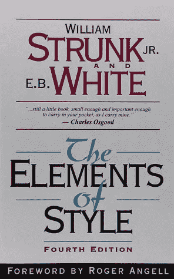
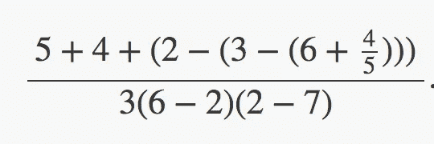

# SICP 1.1:“程序设计的要素”

> 原文：<https://medium.com/hackernoon/sicp-1-1-the-elements-of-programming-e9728929e907>

## (计算机程序的结构和解释)1.1

我的 1.1 习题解答也在 Github 这里:[https://Github . com/bold UCP/SICP/tree/master/exercises/chapter _ 01/1.1 _ exercises](https://github.com/bolducp/SICP/tree/master/exercises/chapter_01/1.1_exercises)



我喜欢第一小节的标题——“T2 编程的要素”。我不确定作者是否打算引用 Strunk 和 White 的经典*风格的元素*文本，但我相信他们对原始元素、组合方法和编程中抽象手段的分析为 Strunk 和 White 描述组合艺术的方式提供了恰当的相似之处。

# 注意事项

1.1 节主要是关于计算机语言如何提供概念化和结构化计算机程序的方法来实现过程。作者不可思议地将这种语言用简单的术语分解如下。

“语言提供了将简单的概念组合成更复杂的概念的手段”:

> **原语表达式**，表示语言所涉及的最简单的实体，
> 
> **组合方式**，通过这种方式，复合元素由更简单的元素构建而成，以及
> 
> **抽象手段**，通过它可以将复合元素命名并作为单元进行操作。

## 程序应用模型

*   *程序应用的替代模型*
*   应用顺序与正常顺序

## 方案语法

*   命名和环境—函数和变量定义
*   条件表达式和谓词
*   简洁明了的定义:“单词*谓词*用于返回 true 或 false 的过程，以及计算结果为 true 或 false 的表达式”

# 1.1 练习

我的答案在每个练习题下面的灰色文本块中提供。

## 练习 1.1

> 下面是一系列的表达式。解释器响应每个表达式打印出来的结果是什么？假设序列将按照其出现的顺序进行评估。

(我的答案作为注释插入到每个表达式的右侧)

```
10                      ;10
(+ 5 3 4)               ;12
(- 9 1)                 ;8
(/ 6 2)                 ;3
(+ (* 2 4) (- 4 6))     ;6
(define a 3)            ;a
(define b (+ a 1))      ;b
(+ a b (* a b))         ;19
(= a b)                 ;#f(if (and (> b a) (< b (* a b)))
    b
    a)                  ;4(cond ((= a 4) 6)
      ((= b 4) (+ 6 7 a))
      (else 25))        ;16(+ 2 (if (> b a) b a))  ;6
(* (cond ((> a b) a)
         ((< a b) b)
         (else -1))
   (+ a 1))             ;16
```

## 练习 1.2

> 将下列表达式翻译成前缀形式。



```
(/ (+ 5      
      4     
     (- 2 (- 3 (+ 6 (/ 4 5)))))   
   (* 3   
     (- 6 2)     
     (- 2 7)))
```

## 练习 1.3

> 定义一个将三个数字作为参数并返回两个较大数字的平方和的过程。

```
(define (square x) (* x x))
(define (sum-of-squares x y) (+ (square x) (square y))) 
(define (sum-two-largest-squares x y z)   
    (if (> x y)     
        (if (> y z) (sum-of-squares x y) (sum-of-squares x z))  
    (if (> x z) (sum-of-squares x y) (sum-of-squares y z)))) 
;; test(= 34 (sum-two-largest-squares 3 2 5))
```

## 练习 1.4

> 请注意，我们的评估模型允许运算符为复合表达式的组合。使用此观察来描述以下过程的行为:
> 
> (定义(a-加-ABS-b a b)
> ((if(>B0)+-)a b))

```
The if-statement returns either the primitive procedure - or the primitive procedure +, depending on whether b is greater than 0\. This procedure is then applied to the operands a and b.
```

## 练习 1.5

> Ben Bitdiddle 发明了一个测试来确定他面对的解释器是使用应用顺序求值还是正常顺序求值。他定义了以下两个过程:
> 
> (定义(p) (p))
> 
> (定义(测试 x y)
> (if (= x 0)
> 0
> y))
> 
> 然后他对表达式求值
> 
> (测试 0 (p))
> 
> 对于使用应用顺序求值的解释器，Ben 会观察到什么行为？对于使用正常顺序求值的解释器，他会观察到什么行为？解释一下你的答案。(假设无论解释器使用正常顺序还是应用顺序，特殊形式`if`的求值规则都是一样的:首先对谓词表达式求值，结果决定是对结果表达式求值还是对替代表达式求值。)

```
With applicative-order, the expression will try to evaluate all of the operands so that the procedure is fully expanded before it is reduced. Thus, it will try to evaluate p, which just calls itself in a recursive loop, and test will never end up getting invoked.With normal order, p will never be evaluated (and thus will never have the chance to enter into its infinite loop), because the first condition of the if-statement in test (x = 0) evaluates to true and the procedure returns 0 without calling p.
```

## 练习 1.6

> Alyssa P. Hacker 不明白为什么需要以特殊形式提供`if`。"为什么我不能用`cond`来定义它为一个普通的程序？"她问道。Alyssa 的朋友 Eva Lu Ator 声称这确实可以做到，她定义了一个新版本的`if`:
> 
> (define (new-if 谓词
> then-clause
> else-clause)
> (cond(谓词 then-clause)
> (else-clause))
> 
> Eva 为 Alyssa 演示了该计划:
> 
> (new-if(= 2 3)0 5)
> 5
> 
> (new-if(= 1 1)0 5)
> 0
> 
> 高兴之余，艾丽莎用`new-if`重写了平方根程序:
> 
> (define(sqrt-ITER guess x)
> (new-if(足够好？猜测 x)
> 猜测
> (sqrt-iter(改进猜测 x) x)))
> 
> 当 Alyssa 试图用这个来计算平方根时会发生什么？解释一下。

```
I had some trouble with this question at first, because I was missing what the question was really trying to ask. I thought that the comparison under discussion was using "cond" as opposed to "if", and this does, in fact, work:(define (sqrt x)
  (sqrt-iter 1.0 x))(define (sqrt-iter guess x)
  (cond ((good-enough? guess x) guess)
      (else (sqrt-iter (improve guess x)
                 x))))(define (improve guess x)
  (average guess (/ x guess)))(define (average x y)
  (/ (+ x y) 2))(define (good-enough? guess x)
  (< (abs (- (square guess) x)) 0.001))This code above, which replaces the "if" statement with the "cond" statement in `sqrt-iter` works. However, the question is **actually** asking about what happens when you replace the if-statement with a custom designed function, which fails because since Scheme is an *applicative-order* language, it evaluates all of the arguments as soon as a function is called. Since `new-if` is a procedure, all of its subexpressions get evaluated as soon as it is applied, before it acts upon the operands provided. This includes a call to `sqrt-izer`, which then recursively calls `new-if`, and creates an infinite loop.
```

**习题 1.7。**

> 够好了吗？计算平方根时使用的测试对于寻找非常小的数的平方根不是非常有效。此外，在真实的计算机中，算术运算几乎总是以有限的精度执行。这使得我们的测试不适用于非常大的数量。请解释这些陈述，并举例说明测试在小数字和大数字情况下是如何失败的。
> 
> 实现“足够好”的另一种策略？观察 guess 从一次迭代到下一次迭代是如何变化的，当变化只占 guess 的很小一部分时就停止。设计一个使用这种终结测试的平方根过程。这对小数字和大数字更有效吗？

```
Here's an example of the `sqrt` function not working as well for very small numbers: (sqrt .00004) returns .03167509508023218, instead of the accurate 0.02 value. This happens because, currently, `good-enough?` returns true when the our original number and the square of our next guess have a difference of less than 0.001.For understanding why calling our `sqrt` function on very large numbers never returns a value, I had to look for help online. It seems that this is a result of losing precision for storing very large floating point numbers. (define (sqrt x)
  (sqrt-iter 1.0 0 x))(define (sqrt-iter guess old-guess x)
  (if (good-enough? guess old-guess)
      guess
      (sqrt-iter (improve guess x)
                guess
                 x)))(define (improve guess x)
  (average guess (/ x guess)))(define (average x y)
  (/ (+ x y) 2))(define (good-enough? guess old-guess)
  (< (abs (- guess old-guess)) 0.001))(sqrt 9999999999998)
(sqrt 0.001); Yes, this does seem to improve for both very large and very small numbers.
```

**习题 1.8。**

> 牛顿的立方根方法是基于这样一个事实，即如果 y 是 x 的立方根的近似值，那么更好的近似值由值给出
> 
> (x/y^2 +2y) / 3
> 
> 使用此公式实现类似于平方根过程的立方根过程。(在 1.3.4 节中，我们将看到如何实现牛顿法作为这些平方根和立方根过程的抽象。)

```
(define (cube-root x)
  (cube-root-iter 1.0 0 x))(define (cube-root-iter guess old-guess x)
  (if (good-enough? guess old-guess)
      guess
      (cube-root-iter (improve guess x)
                guess
                 x)))(define (improve guess x)
  (/ (+ (/ x (square guess))
        (* 2 guess))  
    3))(define (square x) (* x x))(define (average x y)
  (/ (+ x y) 2))(define (good-enough? guess old-guess)
  (< (abs (- guess old-guess)) 0.001))(cube-root 25)
```

[](http://bit.ly/HackernoonFB)[](https://goo.gl/k7XYbx)[](https://goo.gl/4ofytp)

> [黑客中午](http://bit.ly/Hackernoon)是黑客如何开始他们的下午。我们是 [@AMI](http://bit.ly/atAMIatAMI) 家庭的一员。我们现在[接受投稿](http://bit.ly/hackernoonsubmission)，并乐意[讨论广告&赞助](mailto:partners@amipublications.com)机会。
> 
> 如果你喜欢这个故事，我们推荐你阅读我们的[最新科技故事](http://bit.ly/hackernoonlatestt)和[趋势科技故事](https://hackernoon.com/trending)。直到下一次，不要把世界的现实想当然！

