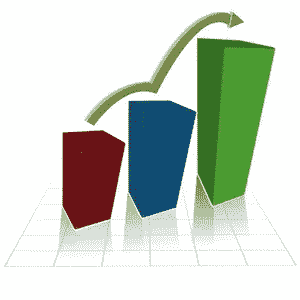

# SICP 1.3.1:“用高阶过程制定抽象:作为参数的过程”

> 原文：<https://medium.com/hackernoon/sicp-1-3-1-formulating-abstractions-with-higher-order-procedures-procedures-as-arguments-6bdd6be0d43>

## (计算机程序的结构和解释)

我的 1.3.1 习题解答也在 Github 上**这里:[https://Github . com/bold UCP/SICP/tree/master/exercises/chapter _ 01/1.3 _ exercises](https://github.com/bolducp/SICP/tree/master/exercises/chapter_01/1.3_exercises)**

> 我们应该对强大的[编程语言](https://hackernoon.com/tagged/programming)提出的要求之一是，通过给常见模式命名来构建抽象，然后直接根据抽象进行工作。(第。56)



image credit: [http://crossfithorgen.ch/blog/skill-levels/](http://crossfithorgen.ch/blog/skill-levels/)

> “通常，相同的编程模式将用于许多不同的过程。为了将这种模式表达为概念，我们需要构造能够接受过程作为参数或返回过程作为值的过程。操作过程的过程称为高阶过程。本节将展示高阶过程如何作为强大的抽象机制，极大地增强我们语言的表达能力。”(第 56- 57 页)

# 1.3.1:作为参数的过程

本节首先提供了三个处理各种数据集合(例如特定序列中的整数、立方、分数)求和的过程示例，并指出所有过程中的相似逻辑，而不管累积的项目类型如何。这引出了对求和的一般概念的讨论，借助于一个普通求和[过程](https://hackernoon.com/tagged/procedure)的例子，该过程从三个原始函数中抽象出重复的逻辑，并提供变量部分作为自变量。

> 这种常见模式的存在是一个强有力的证据，表明有一个有用的抽象正等待被呈现出来。(第。58)

# 练习

我的答案在每个练习题下面的灰色文本块中提供。

## 练习 1.29

> 辛普森法则是一种比上述方法更精确的数值积分方法。使用辛普森法则，函数 *f* 在 *a* 和 *b* 之间的积分近似为
> 
> h/3[y0+4 y1+2 y2+4 y3+2 y4+…+2yn 2+4yn 1+yn]
> 
> 其中，对于某个偶数 n，h =(b a)/n，yk=f(a+kh)。(增加 *n* 会增加近似的精确度。)定义一个过程，将参数 *f* 、 *a* 、 *b* 和 *n* 作为参数，并返回使用辛普森规则计算的积分值。使用您的程序对 0 和 1 之间的立方体进行积分(其中 *n* = 100 和 *n* = 1000)，并将结果与上面显示的积分程序进行比较。

```
(define (simpson f a b n)
  (define h (/ (- b a) n))
  (define (yk k)
    (f (+ (* k h) a)))
  (define (term x)
    (* (cond ((= x 0) 1)
             ((= x n) 1)
             ((even? x) 2)
             (else 4))
       (yk x)))
  (* (/ h 3)(sum term 0 inc n)))(simpson cube 0 1 100.0)  ; .24999999999999992
(integral cube 0 1 0.01)  ; .24998750000000042(simpson cube 0 1 1000.0)  ; .2500000000000003
(integral cube 0 1 0.001) ; .249999875000001
```

## **练习 1.30**

> 上面的求和过程产生一个线性递归。可以重写该过程，以便迭代地执行求和。通过填写以下定义中缺少的表达式来说明如何做到这一点:

```
(define (sum term a next b)
  (define (iter a result)
    (if <??>
        <??>
        (iter <??> <??>)))
  (iter <??> <??>)) (define (sum-recursive term a next b)
  (if (> a b)
      0
      (+ (term a)
         (sum-recursive term (next a) next b))))(define (sum term a next b)
  (define (iter a result)
    (if (> a b)
        result
        (iter (next a)(+ (term a) result))))
  (iter (term a) 0)); testing:(define (inc n) (+ n 1))(define (identity x) x)(define (sum-integers a b)
  (sum identity a inc b))(sum-integers 1 10) ; 55
```

## **练习 1.31**

> sum 过程只是大量类似抽象中最简单的一个，这些抽象可以作为高阶过程来捕获。编写一个名为 product 的类似程序，返回给定范围内各点函数值的乘积。尝试递归和迭代方法。展示如何根据乘积定义阶乘。也用乘积来计算使用公式的近似值:π/4=(2⋅4⋅4⋅6⋅6⋅8…)/(3⋅3⋅5⋅5⋅7⋅7…)

```
(define (inc n) (+ n 1))(define (identity x) x); recursive
(define (product term a next b)
  (if (> a b)
      1
      (* (term a)
         (product term (next a) next b)))); iterative
 (define (product-iter term a next b)
   (define (iter a result)
     (if (> a b)
         result
         (iter (next a)(* (term a) result))))
   (iter (term a) 1)); factorial(define (factorial n)
  (product-iter identity 1 inc n)); testing
(factorial 0)
(factorial 1)
(factorial 2)
(factorial 3)
(factorial 6); π/4 = (2⋅4⋅4⋅6⋅6⋅8...) / (3⋅3⋅5⋅5⋅7⋅7...)(define (pi-product n)
  (define (term x)
     (if (even? x)
         (/ (+ x 2) (+ x 1))
         (/ (+ x 1) (+ x 2))))
  (product-iter term 1 inc n))(pi-product 4)
```

## 练习 1.32

> 展示 sum 和 product(练习 1.31)都是更一般的概念 accumulate 的特例，accumulate 使用一些一般的累加函数来组合一组术语:

```
(accumulate combiner null-value term a next b)
```

> Accumulate 将与 sum 和 product 相同的项和范围规格作为参数，以及一个组合器过程(两个参数),该过程指定当前项如何与前面项的累积相组合，以及一个空值，该空值指定当项用完时要使用的基值。编写 accumulate 并演示 sum 和 product 如何都可以定义为简单的 accumulate 调用。写两个过程，一个生成递归过程，一个迭代。

```
(define (inc n) (+ n 1))(define (identity x) x)(define (accumulate combiner null-value term a next b)
  (if (> a b)
    null-value
    (combiner (term a)
              (accumulate combiner null-value term (next a) next b))))(define (accumulate-iter combiner null-value term a next b)
  (define (iter a result)
    (if (> a b)
        result
        (iter (next a)(combiner (term a) result))))
  (iter (term a) null-value))(define (product term a next b)
  (accumulate * 1 term a next b))(define (sum term a next b)
  (accumulate-iter + 0 term a next b)); testing
(sum identity 1 inc 10) ; 55
(product identity 1 inc 6) ; 720
```

## 练习 1.33

> 通过在要组合的项上引入一个*过滤器*的概念，你可以得到一个更一般的累加版本(练习 1.32)。也就是说，只组合那些从满足指定条件的范围内的值派生的术语。产生的 filtered-accumulate 抽象采用与 accumulate 相同的参数，以及一个指定过滤器的参数的附加谓词。将过滤-累积写成一个过程。

```
(define (filtered-accumulate combiner null-value term a next b filter?)
  (define (iter a result)
    (cond ((> a b) result)
          ((filter? a) (iter (next a)(combiner (term a) result)))
          (else (iter (next a) result))))
  (iter a null-value))
```

> 展示如何使用 filtered-accumulate 表达以下内容:
> 
> 1.区间 *a* 到 *b* 内素数的平方和(假设你有一个素数？谓词已经编写)
> 
> 2.所有小于 *n* 且与 *n* 互质的正整数的乘积(即所有正整数 i < n 使得 GCD(i，n)=1GCD。

```
Part I:(define (smallest-divisor n)
  (find-divisor n 2))(define (find-divisor n test-divisor)
  (cond ((> (square test-divisor) n) n)
        ((divides? test-divisor n) test-divisor)
        (else (find-divisor n (+ test-divisor 1)))))(define (divides? a b)
  (= (remainder b a) 0))(define (prime? n)
  (= n (smallest-divisor n)))(define (inc n) (+ n 1))
(define (square n) (* n n))(define (sum-prime-squares a b)
  (filtered-accumulate + 0 square a inc b prime?)); testing
(sum-of-prime-squares 1 4) ;14
(sum-of-prime-squares 3 50) ;10462 Part II:(define (identity x) x)(define (gcd a b)
  (if (= b 0)
      a
      (gcd b (remainder a b))))(define (relative-prime? x y)
  (= (gcd x y) 1))(define (product-relatively-primes n)
  (define (filter-relative-prime x)
    (relative-prime? x n))
  (filtered-accumulate * 1 identity 1 inc n filter-relative-prime)); testing
(product-relatively-primes 20) ; 8729721
```