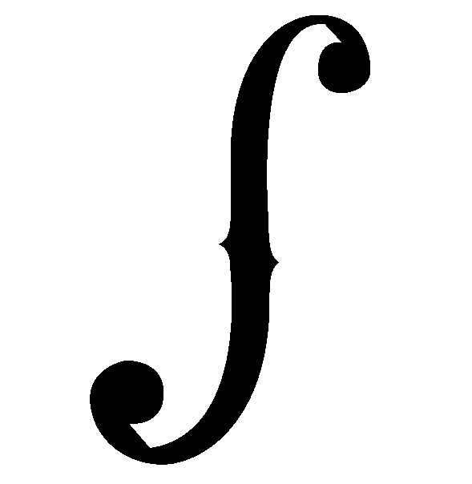
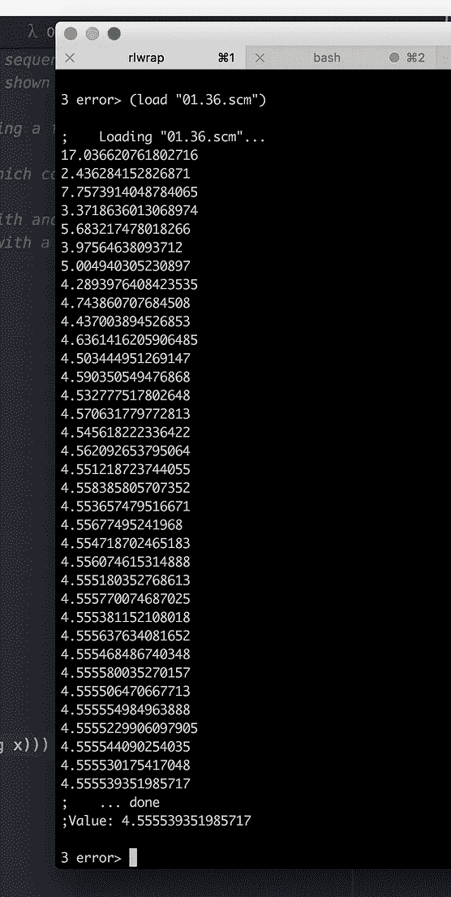
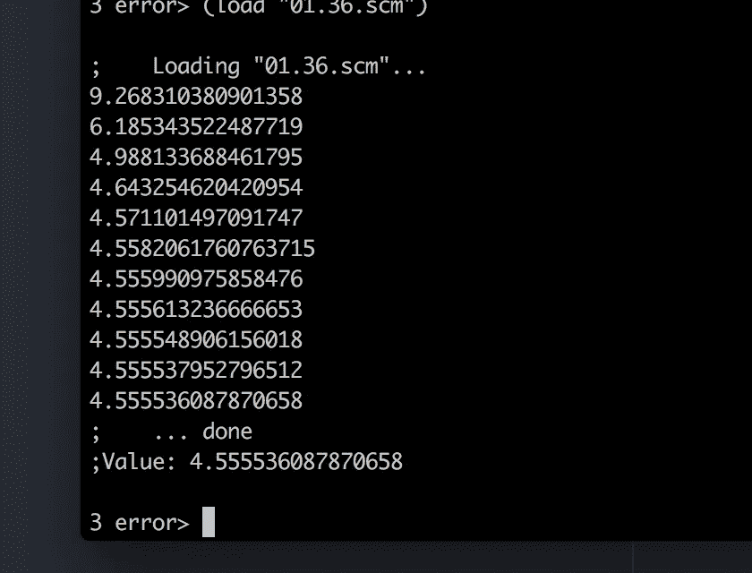
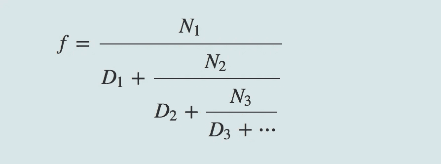
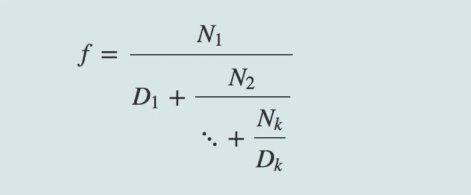
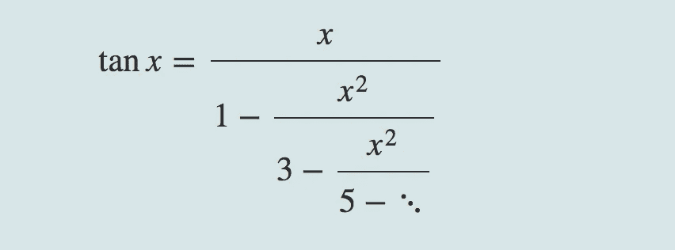

# SICP 1.3.3:“用高阶过程制定抽象:作为返回值的过程”

> 原文：<https://medium.com/hackernoon/sicp-1-3-3-formulating-abstractions-with-higher-order-procedures-procedures-as-general-methods-d78f39ad5eb7>

## (计算机程序的结构和解释)

我的 1.3.3 习题解答也在 Github 这里:[https://Github . com/bold UCP/SICP/tree/master/exercises/chapter _ 01/1.3 _ exercises](https://github.com/bolducp/SICP/tree/master/exercises/chapter_01/1.3_exercises)

本节主要通过两个具体的详细例子来说明[高阶程序](https://hackernoon.com/tagged/high-order-procedures)的有用性: **1。)**求一个方程的根*f*(*x*)= 0； **2。)**求函数的不动点。



[F Cut Violin by Cristian Scarlat](https://thenounproject.com/term/f-cut-violin/1367014/) from the Noun Project

## “用半区间法求方程的根”

*半区间法*是一种简单但强大的技术，用于寻找方程 f(x)=0f(x)=0 的根，其中 *f* 是一个连续函数。”(第 67 页)

这种方法的 2 页长的解释是一个简洁明了的读物，所以我不会在这里试图总结它。它演示了高阶函数的定义，以及如何在另一个也处理错误情况的函数中使用它。(参见第 67–68 页)

> **寻找函数的固定点**
> 
> 如果 x 满足方程 f(x)=x，那么数 xx 称为函数 f 的不动点

本节回顾了第 1.1.7 节中用于寻找平方根的策略，该策略还实现了一个[过程](https://hackernoon.com/tagged/procedure)，用于递归应用一个函数，直到返回值与前一个返回值的差值在一个确定的范围内(在本例中，在 0.00001 以内)。本例还展示了一种方法(称为“平均转储”)，如果最初的实现导致无限循环，“在答案附近振荡”(第 70 页)，该方法可使后续的猜测以更小的间隔变化。

# 练习

我的答案在每个练习题下面的灰色文本块中提供。

## 练习 1.35

> 证明黄金分割率(1.2.2 节)是变换 x↦1+1/x 的不动点，并利用这一事实通过不动点方法计算ϕ。

```
x = 1 + 1/x
x^2 = x + 1Turn this into a quadratic equation: x^2 - x - 1 = 0
And use [quadratic equation factorization](https://en.wikipedia.org/wiki/Quadratic_equation) to get the roots:
x = 1/2(1 - √5)
x = 1/2(1 + √5)which shows what the golden ratio we learned in 1.2.2 (ϕ = (1 + √5) / 2 = 1.618033988)is a fixed point of the transformation x = 1 + 1/x.We use the fixed-point function that SICP provides for us: (define tolerance 0.00001)

(define (fixed-point f first-guess)
  (define (close-enough? v1 v2)
    (< (abs (- v1 v2)) tolerance))
  (define (try guess)
    (let ((next (f guess)))
      (if (close-enough? guess next)
          next
          (try next))))
  (try first-guess))and plug in the function that we're trying to find a fixed point for x = 1 + 1/x, which we can turn into the anonymous Scheme function (**lambda** (x) (**+** 1 (**/** 1 x))), and we can choose any starting valueThus: (fixed-point (lambda (x) (+ 1 (/ 1 x))) 1.0)
= 1.6180327868852458
```

## 练习 1.36

> 使用练习 1.22 中所示的换行符和显示原语，修改定点，以便打印它生成的近似序列。
> 
> 然后通过找到 x ↦ log(1000) / log(x)的一个不动点来找到 x^x=1000 的解。(使用 Scheme 的原始对数过程，它计算自然对数。)比较使用和不使用平均阻尼时的步数。
> 
> (注意，不能以猜测值 1 开始定点，因为这将导致除以 log(1)=0。)

```
(define tolerance 0.00001)(define (fixed-point f first-guess)
  (define (close-enough? v1 v2)
    (< (abs (- v1 v2)) tolerance))
  (define (try guess)
    (let ((next (f guess)))
    (newline)
    (display next)
      (if (close-enough? guess next)
          next
          (try next))))
  (try first-guess))(define (average x y)
  (/ (+ x y) 2))(fixed-point (lambda (x) (/ (log 1000)(log x))) 1.5) here's the solution using average dumping:
(fixed-point (lambda (x) (average x (/ (log 1000)(log x)))) 1.5)As shown in the screen shots below, using average dumping decreased the number of iterations by about two thirds.
```



without average dumping (left) vs. with average dumping (right)

## 练习 1.37

> 无穷连分数是以下形式的表达式:



infinite continued fraction

> 作为一个例子，可以证明 Ni 和 Di 都等于 1 的无穷连分数展开产生 1ϕ，其中ϕ是黄金比例(在 1.2.2 节中描述)。逼近无穷连分数的一种方法是在给定项数后截断展开式。这种截断——所谓的 *k 项有限连分式*——具有以下形式:



> 假设 n 和 d 是一个自变量的过程(返回连分式项的 Ni 和 Di 的项索引 I。定义一个过程 cont-frac，使得 evaluation(cont-frac n d k)计算 k 项有限连分式的值。通过使用近似 1ϕ来检查您的程序

```
(cont-frac (lambda (i) 1.0)
           (lambda (i) 1.0)
           k)
```

> 对于 k 的连续值，为了得到精确到小数点后 4 位的近似值，k 必须取多大？
> 
> B.如果您的 cont-frac 过程生成了一个递归过程，请编写一个生成迭代过程的过程。如果它生成一个迭代过程，那么就写一个生成递归过程的程序。

```
(define (cont-frac n d k)
  (define (recursive-frac i)
    (if (< i k)(/ (n i) (+ (d i) (recursive-frac(+ i 1))))
               (/ (n i) (d i))))
(recursive-frac 1)); k = 12 gives us accuracy within 0.0001 of the expected 0.61803
(cont-frac (lambda (i) 1.0)
  (lambda (i) 1.0)
  12)
;.6180257510729613 Part B- iterative version:(define (cont-frac-iterative n d k)
  (define (iterative-frac i acc)
    (if (= i 0) acc
               (iterative-frac (- i 1)(/ (n i)
                                         (+ (d i) acc)))))
(iterative-frac k (/ (n k)(d k)))); k = 12 gives us accuracy within 0.0001 of the expected 0.61803
(cont-frac-iterative (lambda (i) 1.0)
  (lambda (i) 1.0)
  11)
;.6180371352785146
```

## 练习 1.38

> 1737 年，瑞士数学家莱昂哈德·欧拉出版了回忆录《连续分数》,其中包括对 E2 的连分式展开，其中 e 是自然对数的底。在这个分数中，Ni 都是 1，Di 依次是 1，2，1，1，4，1，1，6，1，1，8…根据欧拉展开式，编写一个程序，使用练习 1.37 中的 cont-frac 程序来逼近 e。

```
(define (cont-frac d k)
  (define (recursive-frac i)
    (if (< i k) (/ 1.0 (+ (d i) (recursive-frac(+ i 1))))
               (/ 1.0 (d i))))
(recursive-frac 1))(define (d i)
  (if (= (remainder i 3) 2) (/ (+ i 1) 1.5)
                            1))(define (euler-e k)
  (+ 2.0 (cont-frac d k)))(euler-e 10)The tricky part here was figuring out the correct function implementation for d, such that Euler's Di pattern would be maintained. Also, rather than using my final iterative function solution and supplying d as a function to cont-frac-iterative, I refactored the recursive cont-frac implementation to use the new n and d function values directly.
```

## 练习 1.39

> 德国数学家 J.H. Lambert 在 1770 年发表了正切函数的连分式表示:



> 其中 *x* 以弧度为单位。定义一个程序(tan-cf x k ),根据 Lambert 公式计算正切函数的近似值。k 指定要计算的项数，如练习 1–37 中所示。

```
(define (cont-frac-iterative n d k)
  (define (iterative-frac i acc)
    (if (= i 0) acc
               (iterative-frac (- i 1)(/ (n i)
                                         (+ (d i) acc)))))
(iterative-frac k (/ (n k)(d k)))) (define (square x) (* x x))(define (d i) (- (* 2 i) 1))(define (tan-cf x k)
  (define (n i)
    (if (> i 1) (- (square x))
                x))
  (cont-frac-iterative n d k))
```