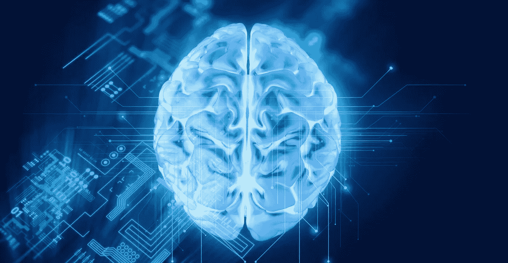

# 西门子的人工智能工作为 IIoT 带来竞争优势

> 原文：<https://medium.com/hackernoon/siemens-ai-work-delivers-competitive-advantage-in-iiot-548e99b084fd>

# 像工业 4.0 和工业互联网这样的概念现在很流行，但西门子在它变得很酷之前就已经将人工智能集成到工业机器中了。

你可能会认为德国工业巨头西门子主要是一家机器制造商，但该公司拥有一系列跨越制造业整个价值链的数字产品。得益于其产品生命周期管理、 [digital twin](http://www.ioti.com/iot-trends-and-analysis/4-ways-iot-changing-world-case-studies-visa-airbus-bosch-and-sncf/gallery?slide=2) 软件和 MindSphere 物联网平台，该公司从产品开发、生产工程和生产执行，提供了跨越所有制造水平的一致数据模型。

IoTI.com 内容总监 [Brian Buntz](https://twitter.com/Brian_Buntz) 最近写了关于西门子投入软件的资源[，虽然这很重要，但我对西门子的](http://www.ioti.com/industrial-iot-iiot/why-siemens-iot-strategy-big-software)[人工智能](http://www.ioti.com/analytics/don-t-fear-ai-fear-human-stupidity)和[机器学习](http://openclassroom.stanford.edu/MainFolder/CoursePage.php?course=MachineLearning)工作更感兴趣。该公司的技术领域业务分析和监控负责人迈克尔·梅博士在汉诺威工业博览会上告诉我，该公司几十年来一直致力于人工智能项目。例如，20 多年前，西门子在 30 多家钢铁厂实施了神经网络来监控和提高质量、流程和效率。该公司在使用人工智能计算燃气轮机的剩余使用寿命方面也有丰富的经验。此外，该公司已经在 CERN 强子对撞机上使用了根本原因分析，以防止故障并最大限度地延长正常运行时间。

在过去的十年里，西门子的人工智能努力一直专注于使用[深度学习](http://spectrum.ieee.org/automaton/robotics/artificial-intelligence/facebook-ai-director-yann-lecun-on-deep-learning)和强化[学习](https://hackernoon.com/tagged/learning)来改善工业过程的控制。该公司已经获得了 50 多项专注于优化复杂工业系统的专利。这项深度学习研究始于一个数学证明，即任何动态系统都可以用深度递归神经网络来建模。这种技术的一个例子是西门子利用强化学习的“自我优化”燃气轮机。

人工智能的这一分支从使用数百个传感器学习机器过去的行为开始，这些传感器的动作应用于控制参数。深度学习算法通过执行各种动作来学习模拟设备的行为，然后监控系统如何响应这些动作。随着时间的推移，系统在理解和模拟这种行为方面变得更加复杂。这种能力使您能够提出新的问题，如:如果我将参数置于一种以前没有观察到的状态，会发生什么？然后，工业公司可以使用来自运营的数据来调整和优化控制策略，并最终在模拟环境中模拟全新的行为。你可以用使用神经网络的机器学习循环来扩展经典的控制循环，使其动态化，从而创建新的控制策略。

随着[机器学习](https://hackernoon.com/tagged/machine-learning)通过强化学习利用可用数据创建以前看不到的新模拟，它可以在期望的结果出现时提供“数字奖励”，或者在不期望的事情发生时发出“数字惩罚”。

虽然硅谷的公司搭上了人工智能和机器学习的潮流，承诺定制他们的算法以在工业环境中工作，但西门子的人工智能工作几十年来已经生产出了这种具有内置智能的机器。

*原载于 2017 年 6 月 3 日*[*www.ioti.com*](http://www.ioti.com/industrial-iot-iiot/siemens-ai-work-delivers-competitive-advantage-iiot)*。*

> [黑客中午](http://bit.ly/Hackernoon)是黑客如何开始他们的下午。我们是 [@AMI](http://bit.ly/atAMIatAMI) 家庭的一员。我们现在[接受投稿](http://bit.ly/hackernoonsubmission)，并乐意[讨论广告&赞助](mailto:partners@amipublications.com)机会。
> 
> 如果你喜欢这个故事，我们推荐你阅读我们的[最新科技故事](http://bit.ly/hackernoonlatestt)和[趋势科技故事](https://hackernoon.com/trending)。直到下一次，不要把世界的现实想当然！

