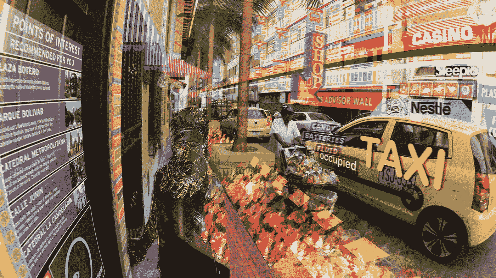
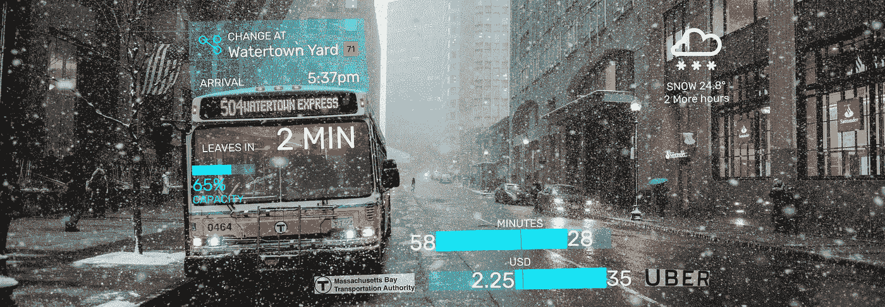
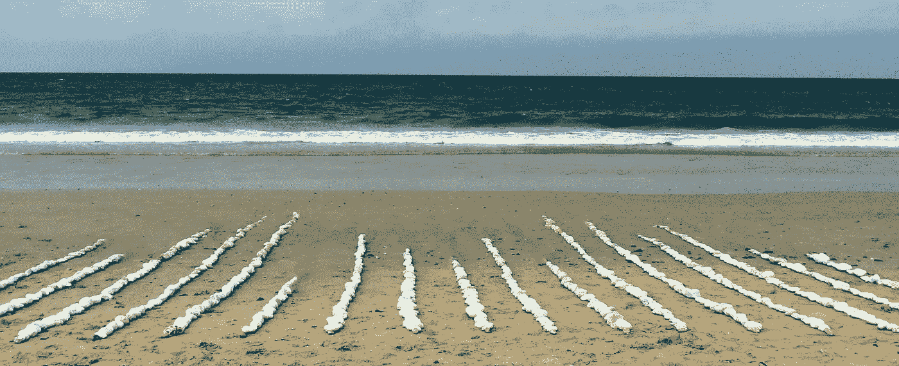
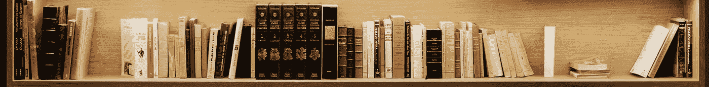
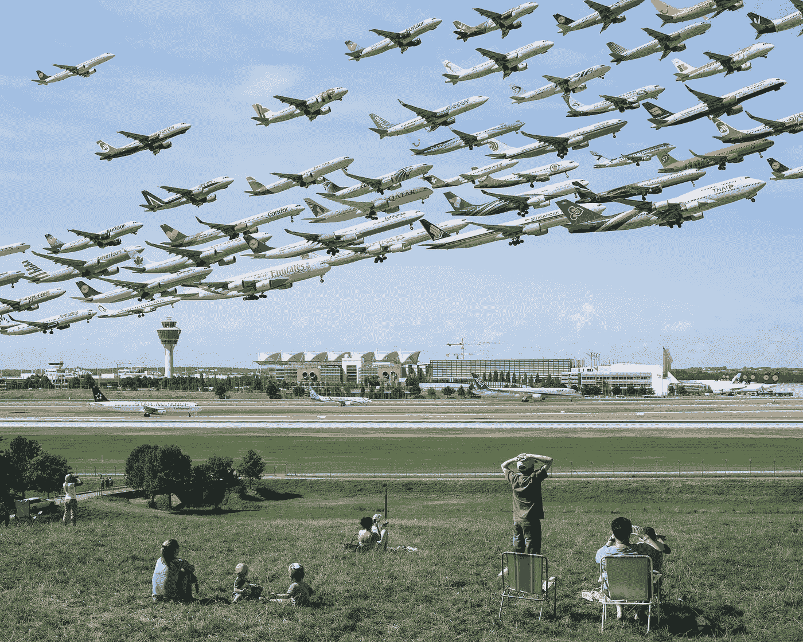
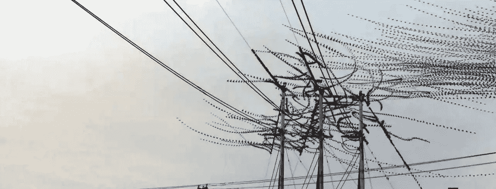
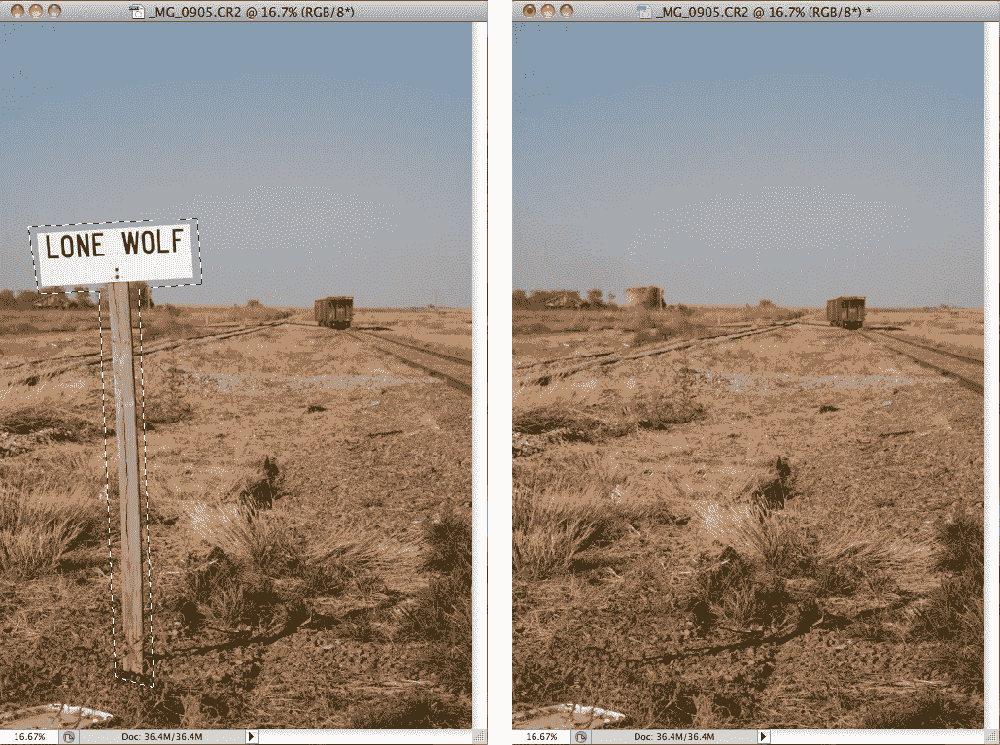
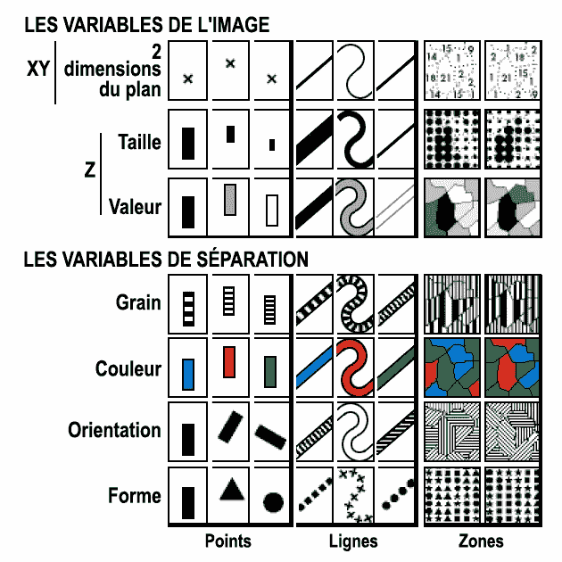
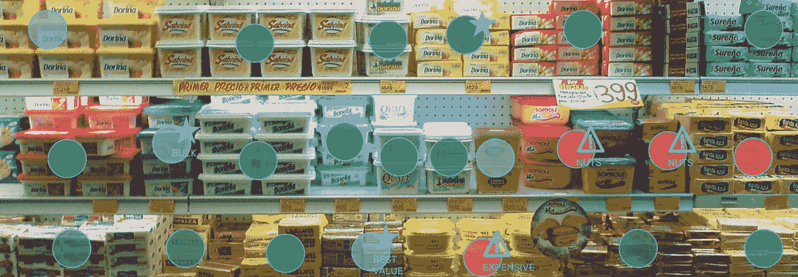

# 无声增强现实

> 原文：<https://medium.com/hackernoon/silent-augmented-reality-f0f7614cab32>

(这是第二部分。阅读 [*第 1 部分关于增强现实可视化在这里*](https://hackernoon.com/can-augmented-reality-solve-mobile-visualization-f06c008f8f84) *。)*

每当我读到一些关于增强现实的文章或看到它在电影/电视节目中出现，它看起来就像这样:

Still from Keiichi Matsuda’s [HYPER-REALITY](http://hyper-reality.co/)

没有什么比霓虹灯的颜色和华而不实的动画更能彰显未来。我不会为此辩解:即使在我上一篇关于如何将数据可视化引入 AR 的文章中，我的例子在 neon 部门也很常见，一眼就能看出这是未来的趋势:

这让我想起了 90 年代的网页设计，当时闪烁的文本和结构 gif 非常流行。

现在，虽然这种类型的增强可能清晰可见且极其灵活(将所有数据打包成您想要的任何表示形式)，但它也非常分散注意力:

*   **原色和动画旨在吸引我们的注意力**。实际上，在这种环境下，专注于手头的任务可能会变得很难(想象一下在赌场里阅读科学论文)。
*   **虚拟物体与物理物体重叠**。当隐藏的物理对象是一辆向你疾驰而来的汽车时，这显然是一个问题，但在更良性的情况下，比如搜索隐藏在虚拟条形图后面的车钥匙，这也可能是令人讨厌的。

那么，如何应对这些问题呢？

这篇文章和之前的[文章](https://hackernoon.com/can-augmented-reality-solve-mobile-visualization-f06c008f8f84)的全部前提是，不久的将来，增强现实系统会将透视眼镜与自动物体识别结合起来。这也意味着这些系统可以随心所欲地塑造你的现实。

他们不必显示霓虹蓝色闪烁的方块，而是可以创造他们想要的任何东西，并覆盖在你的现实中。

使用这些增强的力量来创造无声的增强现实怎么样？帮助你的增强，但变得(大部分)无缝，融入现实。不再总是被动画和花哨的颜色淹没，而是附加的、有用的、不会分散注意力的信息。

# 逼真的虚拟物体

虽然它似乎需要达到赛博朋克的信誉，但增强现实并不一定要显示任何霓虹灯。

在过去的几十年里，计算机图形学已经发展到可以生成看似真实的物体，并用它们来表示数据。

当然，虽然我们可以把一个霓虹蓝色的条形图扔到读者面前，但我们也可以从他们当前的环境中获得灵感，展示如下内容:

The world’s most serene bar chart

想象一下那些石头是由 AR 引擎创建的，只能通过眼镜才能看到，这意味着它们就像我们以前见过的任何霓虹 AR 一样不真实。尽管如此，他们还是更好地适应了他们的环境，没有造成任何不和谐的现实中断。他们同样擅长于展示数据。

如果 AR 系统知道一个人的周围环境，它就可以与合适的虚拟物体作出反应。网上有大量的图书馆，里面有岩石、贝壳、书籍、小动物等逼真的 3D 模型。—用于可视化的所有合适对象。将这些与一些真实的阴影结合在一起。是的，甚至有馅饼的 3D 模型可以用来制作你知道的图表。

Books chart or chart books? Photo by [Samuel Zeller](https://unsplash.com/photos/y0Fa1DEKOKs?utm_source=unsplash&utm_medium=referral&utm_content=creditCopyText) on [Unsplash](https://unsplash.com/?utm_source=unsplash&utm_medium=referral&utm_content=creditCopyText)

为了保持真实的错觉，这些虚拟物体应该看起来真实，这使得阴影、遮挡和透视很重要。但他们行为的其他方面也必须受到严格控制:你的海滩摇滚条形图不能凭空出现。虚拟岩石可能会从天而降，或者可能不那么恼人，慢慢地从地下长出来。视频游戏的物理引擎似乎非常适合这些问题。

如果我们稍微放松一下规则，允许显示由看似真实的物体组成，但绝对不是你摘下眼镜时看到的东西，其他有趣的事情就有可能发生。

Mike Kelley: [Airportraits](http://www.mpkelley.com/projects/)

Dennis Hlysnky: [1 2014 starlings 00011](https://vimeo.com/84361066)

虚拟飞机展示了一个机场一天的业务，就像虚拟鸟(与它们的创造者一起)显示它们的飞行路线一样。

虽然这些例子是通过照片处理(直接将飞机照片拼接在一起，或者用过滤器将视频帧组合在一起)构建的，但人们可以想象它们在实时和增强现实中发生。

但我们不必止步于添加逼真的虚拟物体。AR 也可以用来扭曲和操纵现实世界本身。

# 现实扭曲

鉴于我们的增强现实系统可以识别现实世界的物体，并在其上创建任意图形，一些更疯狂的事情成为可能:

增强现实不限于创建位于现实世界中的虚拟物体。它还可以操纵现实世界的物体，使它们(看起来)缩小、增长甚至消失。

也许你的汽车上有一个难看的凹痕:由于你的 ar 眼镜跟踪你正在看的地方，它们可以显示一层非常闪亮的汽车油漆覆盖在凹痕上，从而使它消失。同样，像卧室地板上的脏衣服这样的物体可以通过在干净地板上覆盖一层纹理来隐藏。

一旦这些现实世界的物体(显然)消失了，系统可以生成它们的新表示——在大小、形状、颜色等方面进行处理。—并将其显示在(隐藏的)对象上以编码数据。

如果你现在想宣布我完全疯了，请观看这个由 Laan Labs 在未经修改的 iPhone 上运行的简短演示，使用新的 ARKit:

Laan Labs: [ARKit iPhone Levitation take 2](https://www.youtube.com/watch?v=0yKJHKQU81I)

而这只是这一招目前的状态。想象一下十年后它会是什么样子。

这种现实失真需要物体识别以及填充遮挡(因此不可见)背景的能力。所有的事情，即使是今天的图像处理软件已经能够做到。想想 Photoshop 在你鼻子上的内容感知填充:

Photoshop’s Content-Aware Fill function (image by [Creative Pro](https://creativepro.com/review-adobe-photoshop-cs5/))

一旦我们有了这样一个能够识别物理对象并操纵我们对它们的视觉感知的系统，我们就可以创建没有花哨的覆盖或虚拟对象的数据可视化:真实世界成为我们映射信息的建筑材料。

当我们看数据可视化的基础时，只有少数所谓的*视觉变量*让我们对信息进行编码。它们都是基于我们的视觉感知，以及我们能分辨出物体的哪些属性，比如位置、大小、亮度、面积、颜色等。

Jacques Bertin: Visual Variables from ‘Sémiologie graphique’ (1967)

视觉变量的概念也使得将每种类型的图表分解成这些基本构件成为可能:散点图将数据编码为水平和垂直位置。我们可以为每个项目编码一个额外的属性作为大小，从而将它变成一个气泡图等等。

数据可视化的过程最基本的就是将数据中的数字映射到这些可视变量。

借助视觉变量和强大的现实扭曲 AR，我们可以从日常物体中创建数据可视化:

## 颜色+亮度+纹理

It’s ok, I’m sure it’s just sleeping.

这些都是显而易见的——只是重新着色现实世界的对象来编码数据。你几天来忽视的窗台上的植物可能已经显示出变黄的迹象，但 AR datavis 可以真正强调它的糟糕状态，希望能激励你采取行动。

为了提高它的机会，AR 还可以增强它的亮度，使它在你窗边的所有其他物体中更加突出。

最后，AR 还可以改变它的纹理，让它看起来更有条纹或更有刺，只要能抓住你的注意力就行——甚至可以作为最后的手段，显示沿着植物缓缓流动的蛇形动画。

所有这些视觉操作都不需要通过将真实的物体隐藏在一些模拟的背景后面来摆脱它。这足以在实际对象上创建一个大小和形状合适的覆盖图。我们可视化的数据(例如，植物土壤的干燥度)决定了颜色、亮度或纹理的数量。

为了最大限度地利用数据可视化，你可能还想比较多个对象-也许看看你的植物实际上最需要水-即使只是通过数字方式改变它们的颜色、亮度或纹理，这也应该可以很好地工作。

## 尺寸+方向+形状

这些视觉变量是我们从微妙的增强转向更剧烈的增强的地方。通过隐藏实际对象并扭曲它们的虚拟表示，AR 可以修改对象的大小、方向或形状以进行数据可视化。

超市中的可视化数据不一定要像上面的例子那样使用热图。物体本身也可以被视觉扭曲以反映数据。

也许整齐排列的产品通过扭曲一堆黄油的高度，自己变成了条形图。

他们也可以缩小尺寸来代表他们要走多远才能到达那里，借用一个透视隐喻(并使选择当地产品变得容易得多)。

除此之外，它们还可以轻微旋转，甚至改变形状来编码信息——无论是营养还是关于它们的奖励。

## 位置

最强大、最易读的可视变量——位置——可能是 AR datavis 中最少使用的变量。

以上所有的现实扭曲使得与那些(实际的，物理的)物体的互动变得有些困难。如果产品的尺寸或方向被操纵，就很难从超市货架上拿走产品。

但是更糟糕的是这些产品漂浮在太空中，或者不可预测地在货架上移动。有助于 datavis 图表可读性的东西不一定有助于与现实世界的交互。

再加上来自上方的一系列虚拟现实物体，我们就陷入了混乱状态。

# 现实黑客

所有这些观点的共同点是，它们扰乱了我们感知的基础。当一半的物体是虚拟生成的，而另一半被彻底扭曲时，我们从最早的日子里学到的东西——我们看到的大多数都是真实的，物体可以被抓住并与之互动——不再适用。

这些扩展的增强现实技术是现实黑客。我们自己的现实版本不仅变得机器可读，而且变得*可写—* ,由此带来各种后果。这应该引导设计师和技术人员非常非常小心地行事，并在每个决定之前问自己正确的问题。

作为一个[技术](https://hackernoon.com/tagged/technology)的乐观主义者，我希望像这样的早期反思能够推动我们和我们的技术取得好的结果。我们现在对这项技术的影响思考得越多，一旦拥有完美物体识别和操作的 AR 眼镜出现在每个人的面前，我们就会犯越少的错误。

这样我们的 AR 未来可能看起来更像这样:

比这个:

*如果你喜欢这篇文章，请* ❤/👏*还是分享一下吧！更多此类，* [*中上关注我*](/@dominikus) *或*[*Twitter 上关注我*](https://twitter.com/dominikus) *为一般数据。*

*我非常感谢* [*项目*](https://medium.com/u/c8d36315cca4#projects) *以及更多:*[*https://do . minik . us*](https://do.minik.us)*。*

你有一个令人着迷的项目要做？你想把这些想法变成现实？ [*让我知道*](mailto:do@minik.us) *！*