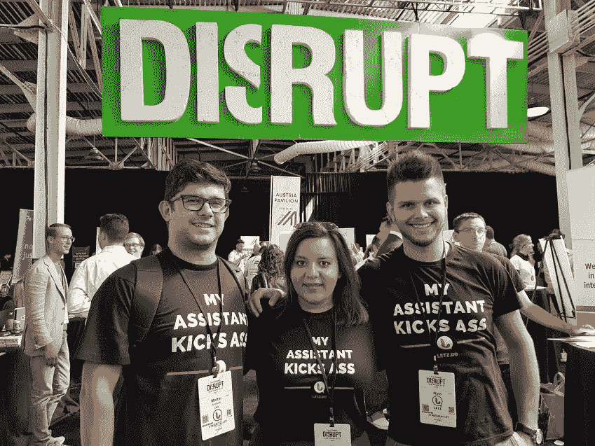
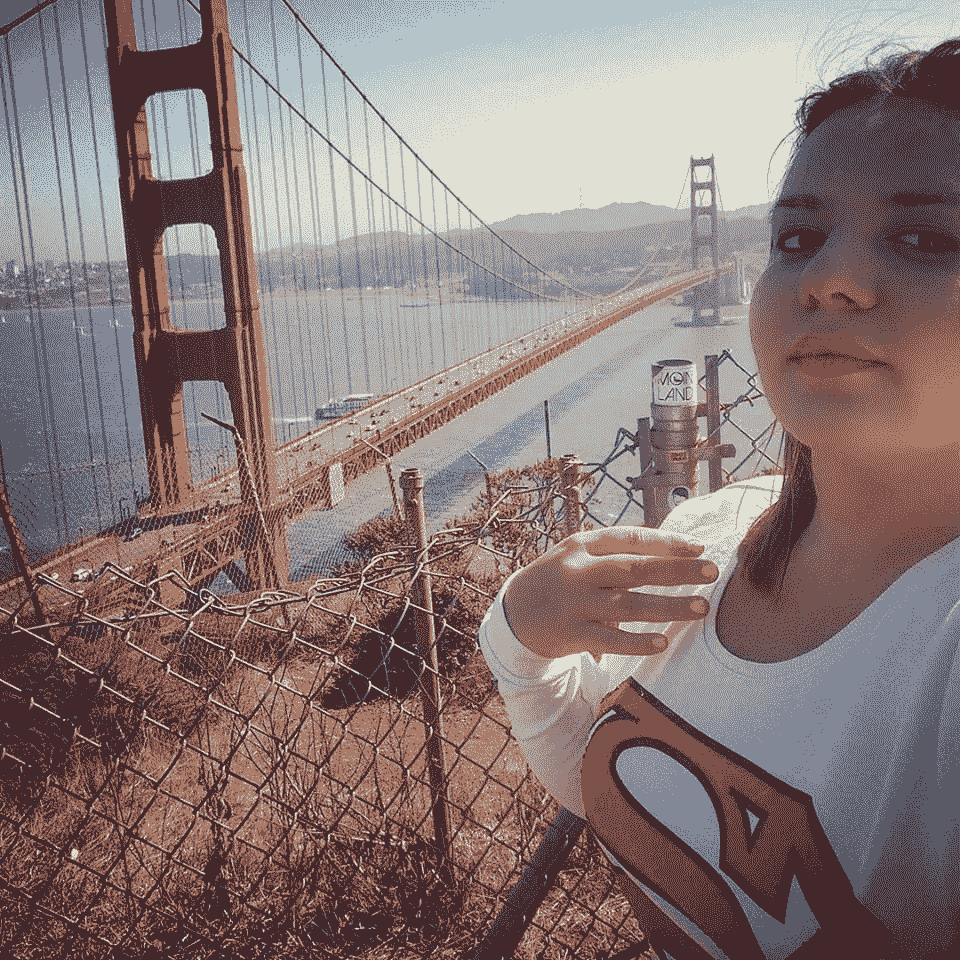
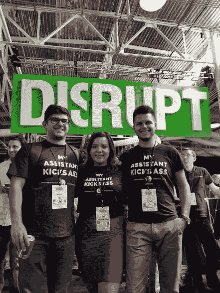
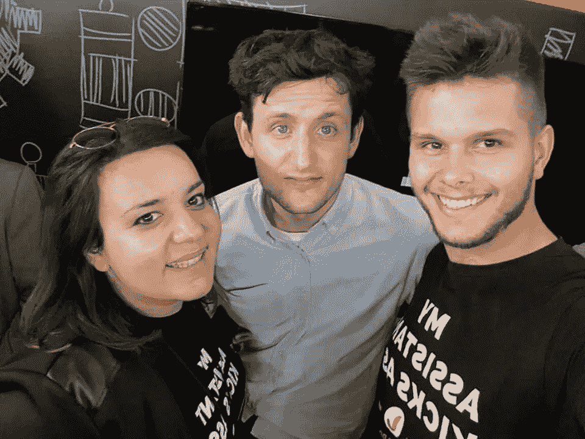
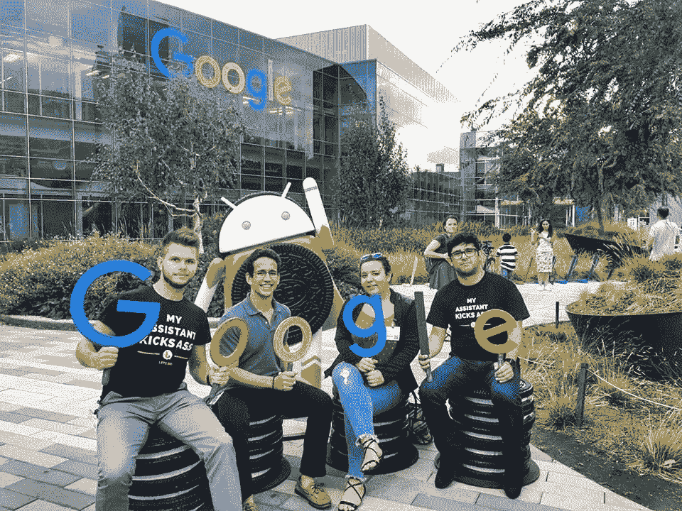
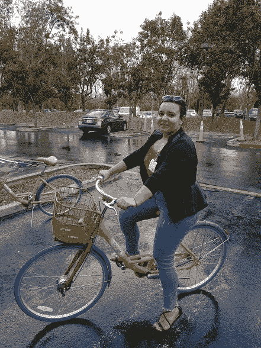

# 硅谷和 TechCrunch 扰乱旧金山

> 原文：<https://medium.com/hackernoon/silicon-valley-and-techcrunch-disrupt-san-francisco-1881fc6712f8>

自从我加入创业社区以来，我最大的愿望之一就是在硅谷呆上一段时间，探索旧金山，看看“创业奇迹”在哪里发生。

让我们来谈谈命运和在正确的时间来到你面前的正确的事情…

今年春天，我们新上任的短期专家之一是 T2 的约翰·比格斯。我们一起做的事情之一是在斯科普里组织了[首届 TechCrunch 会议。](https://techcrunch.com/2017/04/07/a-look-inside-the-skopje-startup-scene/)
获胜者 [Letz](http://letz.do/) 得到了两张《扰乱旧金山》的门票和一个展位，我记得对约翰说，如果有机会，我也会参加“*科技大会圣杯”*。仍然不知道我的 YTILI 奖学金和西雅图作为我的位置。

时间快进到九月，在我参加团契的同时，TC Disrupt SanFran 也在进行。我的兴奋感直线上升。这对我来说是一个千载难逢的机会，尤其是当我发现*我是第一个参加*[*TechCrunch Disrupt in San Francisco*](https://www.facebook.com/events/1853834044867400/)*的马其顿女性。*

在过去的一段时间里，我学到的一件事是，当你参加会议(尤其是大型会议)时，你必须提前准备，并设定你的目标。这一次，我最优先考虑的事情是为那里唯一的马其顿初创公司 Letz 辩护，并帮助他们与投资者取得联系(因为他们已经进入了首轮融资)。第二个目标是为我们的西巴尔干企业家常驻项目会见尽可能多的高素质专业人士。第三个目标是了解更多在硅谷做生意的知识，当然还有去谷歌总部和/或脸书总部。

西雅图到旧金山的航班让我保持警惕，因为我迫不及待地开始了硅谷之旅…一旦你通过机场，你就可以看到和体验高科技的存在！

**TechCrunch 的第一天，扰乱旧金山和目标 1**

与 Letz 的两位创始人尼诺和 T2·马丁一起，我们一大早就来到 Pier48，并在创业胡同的人工智能区安排了展位。由于他们已经与投资者进行了预先安排的会谈，我的主要职责是代表 Letz 并在我们的展位上与与会者接触。这是一种体验，能够讲述故事，并向那天在展位前驻足的 1000 多人“销售产品”。一次偶遇让我开心不已……一位女士在展台前停下来，说她认识 Lucy (Letz 生产力助理和第一个角色),因为她的男朋友一直在和“她”说话。不久后，我得知这位女士 April 在一家中美风险投资基金工作，该基金正在 a 轮投资人工智能初创公司。这是我分享我们正在筹集高达 100 万美元资金的最佳时机，对此她回答说:“哦，你筹集的太少了。我们 A 轮是 300-400 万！”。我告诉 April，我们是来讨论细节的，所以我立即让她和创始人联系，这样他们就可以采取下一步行动了。

> L *esson 了解到:*美国风投对欧洲初创公司很感兴趣。但是，与美国的初创公司相比，东欧的初创公司的价值更低吗？有许多因素会影响估值，但在融资前最好的事情可能是三重检查你的估值。你放弃的是你的公司的股权！

*有趣的事实:*我最喜欢的电视剧之一是《硅谷》(我心中的极客)，能够见到 Jared IRL(在现实生活中)是一个会在我的记忆中突出很长时间的时刻！

**第 2 天和目标 2:常驻企业家**

在为期三天的会议中，我重新联系了来自不同创业社区的朋友，也认识了许多新朋友。当我把驻校企业家项目作为一个机会分享时，他们都有兴趣深入了解更多细节。对于绝大多数人来说，西巴尔干地区是一个未知的“新兴”地区，他们不知道那里正在发生什么，也不知道生态系统实际上有多发达。希望他们中的许多人会报名，完成匹配过程，并来到我们四个国家无私地分享他们的知识和实践经验。

> *经验教训:* [**与尽可能多的人分享现有的机会**](https://startupselfie.wordpress.com/2017/12/01/launch-in-macedonia-swissep-entrepreneur-in-residence-program-promoted-in-the-us/) 。目前你可能还不知道这意味着什么，也不知道会发生什么。从长远来看，一切都会变得非常合理。这一跨大西洋的桥梁可以通过企业家支持和专业知识交流得到加强。

*有趣的事实:*一个和我同名同姓的家伙找到我，陈述了这个事实。这是一个令人愉快的惊喜，在离你们两个都来自的地方 10 000 公里之外遇到这样的人。Dimitrije 是一位年轻有为的企业家，有潜力在接下来的时间里成为一名 EiR。

**第 3 天和目标 3:参观谷歌总部**

有些人可能认为你可以出现在谷歌总部并四处漫游。多亏了我的朋友玛丽莲和她的关系，我们被介绍给了在谷歌工作的帕布罗。我们三个人就是这样在这个可能和我的家乡一样大的建筑群中得到一次有导游的游览。了解更多关于谷歌的快速发展，并看看为一家大公司工作是什么样子，这是一件非常棒的事情。一个人在任何时候都需要所有的东西。

> 吸取的教训:当你从一个小公司成长为一个大公司时，需要付出很多努力。话说回来，有了一个良好的平台、正确的时机、支持系统、创造一种留住千禧一代的公司文化，你就能接近成为谷歌现在这样的巨头。

有趣的事实:至少有 3 个小时，我感觉自己是谷歌的员工，是谷歌大家庭的一员，在小吃店里喝咖啡，在校园里骑着谷歌自行车，和员工们聊天……在我日常生活中使用的东西的总部，这是一种超现实的感觉！

**硅谷的经验教训:**

也许我对旧金山和硅谷有很高的期望，这影响了我的整体经历。在同样的街道上，在同样的城市里，我震惊地目睹了极度富有的人和如此多无家可归的人之间的巨大差异……这令人心碎。在硅谷呆了一段时间后，SanFran…让我意识到… [**主要是关于第三点:认识到商业和社会是在一起的——而不是在不同的世界里！**](https://techcrunch.com/2017/10/08/dear-silicon-valley-americas-fallen-out-of-love-with-you/?ncid=rss&utm_source=tcfbpage&utm_medium=feed&utm_campaign=Feed%3A+Techcrunch+%28TechCrunch%29&utm_content=FaceBook&sr_share=facebook)

希望下次我在那里的时候，一些事情会变得更好…

干杯