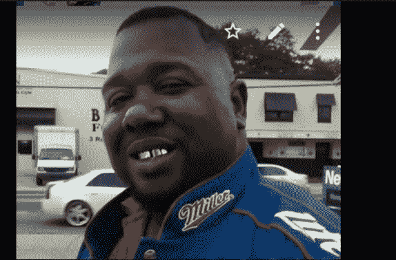

# 硅谷不关心黑人，但如果它关心，那会是什么样呢？

> 原文：<https://medium.com/hackernoon/silicon-valley-doesnt-care-about-black-people-and-what-would-it-be-like-if-it-did-d9d62ea0f28d>

你非常体贴的文章让我想起了昨天阿尼尔·达什发的这条推特。

我喜欢媒体，我很幸运能在一家主要的[硅谷](https://hackernoon.com/tagged/silicon-valley)科技公司找到一份工作，但如果我说这很正常，那我就是在撒谎，如果我说硅谷对[黑人](https://hackernoon.com/tagged/black)的生活进行了有意义的投资，那我就是在撒谎。

就像你在文章中指出的那样，在技术领域，每个人都在口头上投资于多样性和包容性。但是，在大学招聘活动或浮华的座谈会上说出你的承诺是很容易的(同时穿着一件“保持清醒”的 t 恤。)更难的其实是站在黑人生命的立场上，实际上是要求黑人生命得到重视。如果你招募和雇佣了大量的黑人人才，当他们到达迅速中产阶级化的旧金山街头时，却被警察毫无意义地杀害，那又有什么区别呢？

似乎技术领域的每个人都有“破坏”某些东西的计划。谁来破坏我们破碎的刑事司法系统呢？谁来用科技让自己在美国做黑人身体更安全？如果技术如此强大，为什么我们最伟大的技术头脑没有用它来解决如此紧迫的问题？

你的一个回答说“修理”我们的警察系统不是硅谷的工作，我完全不同意。自 digital 诞生以来，黑人和棕色皮肤的年轻人一直是其活力源泉。如果没有黑人用户，Twitter 会变成什么样？还是藤蔓？还是 Instagram？我们比我们的白人同行更多地使用这些技术，是我们的创造力使它们在使用时变得有趣。科技公司乐于将黑人思想、黑人创造力和黑人天赋商品化，但在屠杀黑人身体时却保持沉默。

在北卡罗来纳上学时，我自豪地看到脸书、苹果和谷歌等大公司因歧视性的 HB2 立法而拒绝在该州做生意。我想知道，如果那些从黑人身上赚了很多钱的公司为黑人的生活挺身而出，会是什么样子？如果他们以我们为他们效力的方式为我们效力会是什么样子？

> [黑客中午](http://bit.ly/Hackernoon)是黑客如何开始他们的下午。我们是 [@AMI](http://bit.ly/atAMIatAMI) 家庭的一员。我们现在[接受投稿](http://bit.ly/hackernoonsubmission)，并乐意[讨论广告&赞助](mailto:partners@amipublications.com)机会。
> 
> 如果你喜欢这个故事，我们推荐你阅读我们的[最新科技故事](http://bit.ly/hackernoonlatestt)和[趋势科技故事](https://hackernoon.com/trending)。直到下一次，不要把世界的现实想当然！

