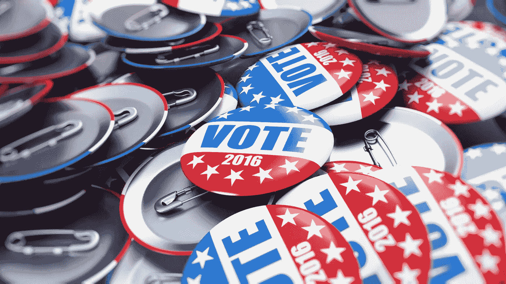
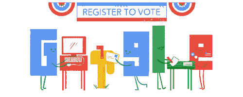

# 硅谷希望你注册投票

> 原文：<https://medium.com/hackernoon/silicon-valley-wants-you-to-register-to-vote-86a4fa7f29a5>

## 从谷歌到媒体和脸书，他们都在提醒我们去投票。

如果你在第一次总统辩论的前一天早上，也就是全国选民登记日前夕打开谷歌，搜索引擎会展示它的*投票登记*涂鸦，链接到[基于你所在州的操作指南](https://www.google.com/webhp?hl=en&ictx=2&sa=X&ved=0ahUKEwi2zNXViK3PAhXQpYMKHZOjCJwQPQgD#q=How+to+register+to+vote&oi=ddle&hl=en&eob=va/1/2/m.059rby)。

同一天早上，谷歌博客上的双语帖子[宣布了这一涂鸦，以强调其 *#IRegister* 活动以及为创建一个数字平台所做的努力，用户可以在这个平台上了解更多关于候选人、问题和投票过程的信息。](https://googleblog.blogspot.com/2016/09/iregistered-to-vote-have-you.html)

> 通过帮助更多的人登记，我们也帮助确保更多的人去投票站投票。大多数登记投票的美国人最终都参加了投票——根据美国人口普查局的数据，2012 年，86%的登记选民也在 11 月的选举中投票。

上周，谷歌的母公司 Alphabet 宣布了 Youtube 的 get out of vote 运动，旨在帮助年轻人投票。

> 尽管人们显然在网上关注选举，但我们希望确保他们也参与“现实生活”。我们相信让每个人都有发言权。因此，在这个美国选举季，我们致力于确保人们——尤其是年轻人——通过投票表达自己的心声。

距离美国总统大选仅剩六周时间，Alphabet 并不是唯一一家为更多人——特别是年轻一代的社交媒体用户——争取在 11 月投票的硅谷巨头。

从上周五开始，脸书推出了一项新功能，提醒所有美国 18 岁以上的用户注册。这是脸书有史以来第一次全国性的选民登记活动。

“我们认为我们有独特的能力和责任向人们展示这个提醒，他们应该检查他们的登记，以便他们可以参加选举，”脸书全球政治和政府外联主任凯蒂·哈巴斯告诉《今日美国》。

据 NBC 新闻报道，Instagram 和 Twitter 都在筹备选民登记活动。

与此同时，在全国选民登记日，Twitter 推出了带有自定义表情符号的#IRegistered 标签。

此外，Twitter 的首席执行官[根据他们在媒体](https://medium.com/u/ab69c5472679#.i3c5017u5)上的声明，注册投票的大队用户在平台上成为*经过验证的投票者*，并带有一个特殊的徽章，出现在他们的个人资料头像旁边，“当他们采取行动，如承诺为候选人投票，以及就对他们重要的问题发起或加入辩论时。”

> 作为 Brigade 对该计划承诺的一部分，我们已将 TurboVote 的选民注册工具集成到我们的网站和智能手机应用程序中，以便我们不断增长的社区中尚未注册的新成员可以在他们所在州即将到来的选民注册截止日期之前迈出这一关键的一步。

至于 Tumblr，这个微博平台自 2012 年成立以来一直是全国选民登记日的支持者，据 Benzinga 报道，[在 2012 年推动了 100，000 次登记，在 2014 年中期推动了 30，000 次登记。今年，Tumblr 通过 Tumblr 仪表板右侧的一个突出按钮，将美国的登录用户直接链接到选民登记登录页面。他们也将让博客所有者选择引导他们所有的网页访问者去注册。](http://www.benzinga.com/pressreleases/16/09/p8498819/september-27-is-national-voter-registration-day-2016)

早在 6 月，Tumblr 发起了一项新的社会影响活动，旨在让更多的千禧一代投票。该公司与 MTV 的 *Elect This* 投票倡议合作，举办了一系列名为 *IssueTime* 的虚拟 Q &。

Tumblr 的社会影响和公共政策经理 Victoria McCullough 告诉 AdWeek，今年的风险真的很高，许多问题可能会令人困惑，可能会误导年轻选民。

> 我们有一个自然参与这些问题的社区，所以我们想在教育他们方面发挥作用，让他们在平台上发表意见，让他们从感兴趣转向参与。

她补充道:

> 人们真的担心千禧一代今年不会去投票，我们希望推迟投票。

最后，在

### [我 14 岁时，我的家乡芝加哥的民主党大会爆发了暴力事件。这是艰难的一年。马丁…](https://medium.com/u/504c7870fdb6#TimeOffToVote</h2>

 [黑客中午](http://bit.ly/Hackernoon)是黑客如何开始他们的下午。我们是阿妹家庭的一员。我们现在[接受投稿](http://bit.ly/hackernoonsubmission)并乐意[讨论广告&赞助](mailto:partners@amipublications.com)的机会。
> 
> 如果你喜欢这个故事，我们推荐你阅读我们的[最新科技故事](http://bit.ly/hackernoonlatestt)和[趋势科技故事](https://hackernoon.com/trending)。直到下一次，不要把世界的现实想当然！

