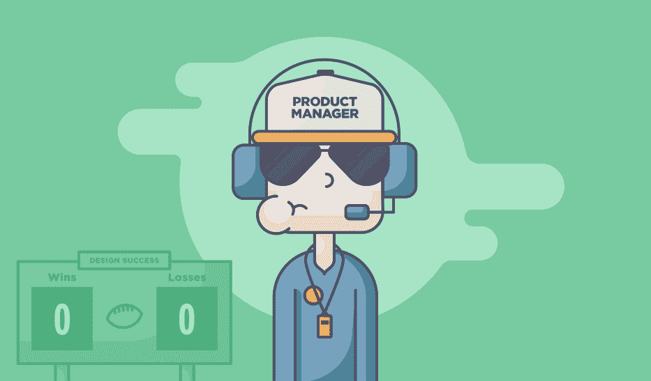
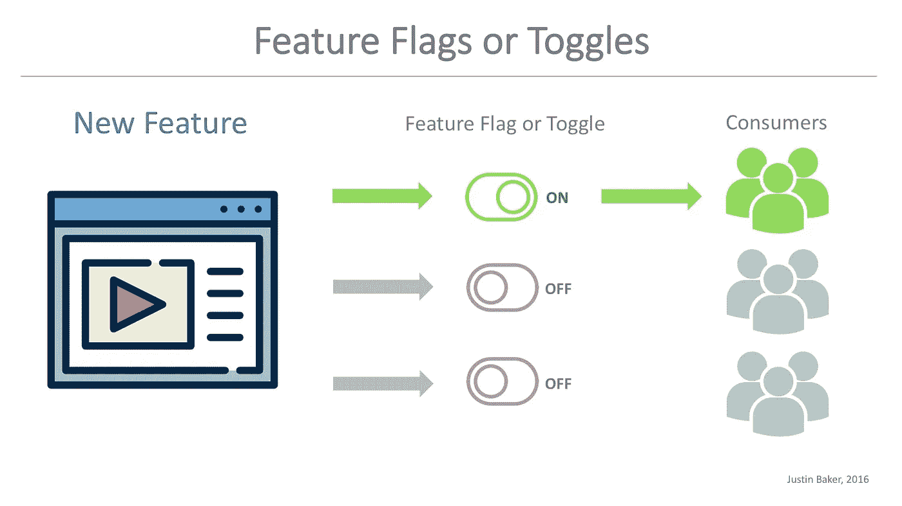
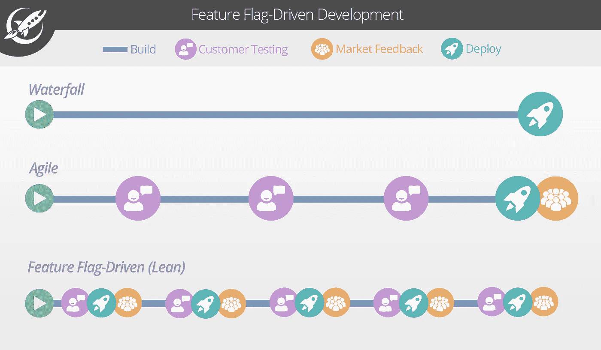

# 硅谷的顶级产品经理使用功能标志——你也应该这样做

> 原文：<https://medium.com/hackernoon/silicon-valleys-top-product-managers-use-feature-flags-and-you-should-too-cc51cc1aeafb>

## 顶级公司的产品经理如何控制发布并加速产品生命周期

thebridgesummit.org

# 产品经理

你是产品的国王或王后。你是工程师、设计师、商业头脑、营销人员……事实上，你什么都有点。你是产品负责人，但更重要的是，你是领导者。

在他的文章中，Prasad Thammineni(Choose Energy 的首席采购官)概述了一个伟大的产品经理的 9 种品质:

1.  **战略思考者—** 了解产品的当前需求，以及它如何与公司的整体愿景相契合。
2.  **热爱产品—** 热爱你所做的，热爱你所做的。
3.  **同情顾客—** 了解顾客的需求。
4.  **采访客户—** 从客户那里收集见解，了解他们的痛点并发现机会。
5.  **渴望打造卓越的体验—** 明白用户体验对产品的成功至关重要。
6.  **记录分数—** 确定关键指标并跟踪绩效，建立衡量成功的基准。
7.  **分清轻重缓急的能力—** 让事情有条不紊，明白哪些需要先完成，哪些需要等待。使用客户反馈来确定优先级。
8.  **协作型领导—** 管理是一个协作的过程，你不能独断专行，还指望激励你的团队。
9.  **执行力—** 行动导向，你把事情做好。

为了体现这 9 个原则，你通常会看到项目经理使用无数的工具来组织团队、管理开发、QA 和跟踪基准(JIRA、Aha、Mavenlink 和大约 10，000 个其他工具)。有效产品管理的每个方面似乎都有自己的一套工具，但通常缺少两个方面:**客户同理心**和**客户反馈(采访、测试)**，我将更深入地探讨这两个方面。

# 顾客移情

作为一名产品经理，你必须理解你的目标受众的需求。Catherine Shyu(full contact 的 PM)写道:

> “产品经理负责对客户了如指掌——他们的挫折、他们的日常想法、他们使用产品的环境以及他们的需求。”

向你的客户寻求反馈，在开发过程中与他们面谈，在产品发布前让他们测试你的产品是一回事。让你的客户在真实环境中测试你的产品或者为某些客户提供个性化的体验是另一回事。

移情的关键是对反馈采取行动的能力。正如詹妮弗·温特所说，

> “协作和创造性的同理心不等于同情。同理心的目标是支持和理解他人的意图和目的，这反过来将帮助你获得有见地的反馈。”

# 真实反馈

用户访谈、亲自测试、分配任务和进行基本的用户研究是开发成功的用户体验的基础。然而，它们都有一个共同的局限:人工反馈。

当我们与用户坐下来，要求他或她做一些事情时，我们通过强迫他们不自然地提供反馈，使用户脱离了他们的自然环境。我们收到的反馈仍然是有价值的，但它不是纯粹真实的。

**真正的反馈**来自在真实环境中测试真实用户，而他们并不知道自己正在接受测试。想象一下，在向其他 99%的用户推出之前，能够在 1%的实际用户身上测试一项新功能或体验。

**例如，我可以向 1%的用户发布*功能。如果他们从来不使用这个特性，或者只使用一次，那么反馈是震耳欲聋的。***现在，想象一下，如果您可以完全回滚功能 A，然后使用访谈/测试来找出该功能没有被使用的原因，然后再次回滚。

[特征标志驱动开发](https://dzone.com/articles/feature-flag-driven-development)实现了真正的反馈循环。

# 功能标志和真正的用户反馈

谷歌、脸书和亚马逊的项目经理已经将功能标志整合到他们的开发周期中。这允许他们在一个特性完全发布之前收集用户对它的反馈。这也有助于他们对反馈做出更快的反应，而不必让一个“不好的特性”在市场上停留太久。

假设脸书想要发布一个新的时间轴功能，叫做*时间轴测试版*。该功能对时间线故事进行重新排序，以提高用户参与度。让我们假设 *Timeline Beta* 已经通过了所有严格的内部测试、用户访谈和所有适当的 UX 研究。

为了发布，脸书将时间线测试版包装在一个特征标志中，允许脸书完全控制谁能看到这个特征。

第一天，他们向 0.5%的脸书用户推出该功能，看看他们有多喜欢。

在第二天，他们看到那些拥有*时间线测试版*的用户参与度下降了 20%。

因此，在第 3 天，脸书通过特征标志回滚*时间线 Beta* ，并重新开始循环。

想象一下，如果脸书向所有用户发布了时间线测试版，却没有一个简单的机制来恢复到之前的版本。他们可能会损失数百万美元的收入，在社交媒体上引起轩然大波，并拒绝用户。这就是特性标志驱动开发的力量:完全控制特性发布和在真实环境中测试特性的能力。

# 开始更好的产品管理

产品经理有巨大的责任。他们必须协调多个团队，确定业务目标，管理时间表，并为发布的成功承担最终责任。

幸运的是，将特性标志集成到开发周期中并不需要完整的过程转换或数月的再培训。如果你已经在实践连续交付，特性标记可以很快成为你开发周期中不可或缺的一部分。

如果您是一个敏捷团队，那么您可以将特性标记视为一种安全、智能地迭代的方式，没有损害您的应用程序或扰乱所有用户的风险。这使得顶级公司(脸书、谷歌、亚马逊)的产品经理能够安全地管理产品生命周期，并收集真实的用户反馈。

—

***感谢阅读！我喜欢为你写作，所以掌声和关注非常感谢:)***