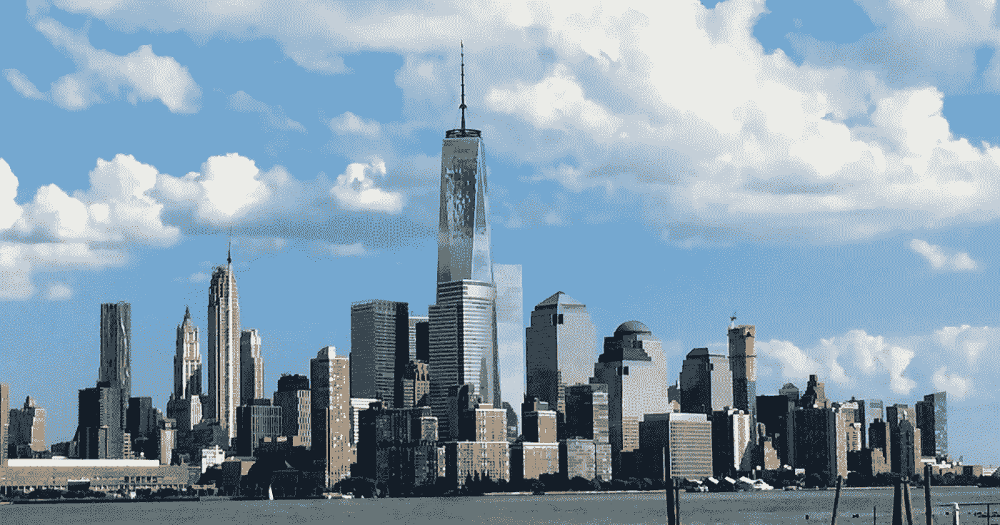
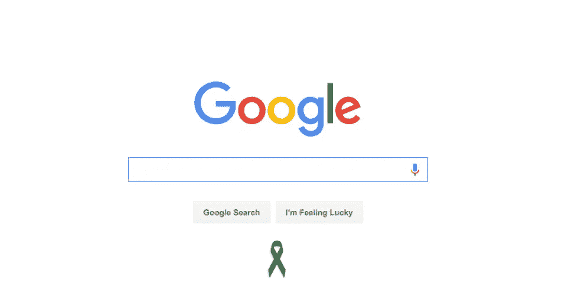
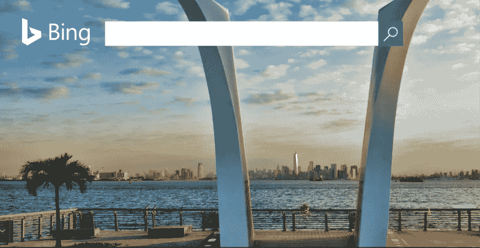

# 硅谷向 911 致敬

> 原文：<https://medium.com/hackernoon/silicon-valleys-tribute-to-september-11-58d684af5001>

Photo credits: World Trade Rising

## 科技界的记忆如何？

911 袭击 15 周年纪念遍布社交媒体和互联网，从 Twitter 时刻到我们在脸书的新闻，再到 Snapchat 上的“*记住 911*”故事

在[媒体](https://medium.com/u/504c7870fdb6?source=post_page-----58d684af5001--------------------------------)上，策展团队专门收集了一些故事。

 [## 9/11

### 反思，回忆。

medium.com](/browse/227d92d77ea5) 

[谷歌](https://medium.com/u/be36e94a7e47?source=post_page-----58d684af5001--------------------------------)决定不再涂鸦，并添加了一条简单的黑色丝带，以纪念 15 年前失去生命的近 3000 名男女老少，同时搜索引擎必应(Bing)发布了一张从斯塔滕岛 911 纪念馆拍摄的纽约天际线和自由塔的照片。

但是科技界和硅谷是如何记住的呢？

在脸书，[维基百科](https://medium.com/u/5559f459f970?source=post_page-----58d684af5001--------------------------------)提到了全世界 5000 多名编辑为 9/11 页面做出了贡献，而雪莉·桑德伯格写了一篇感人的帖子来纪念那些恐怖袭击的受害者和幸存者。

在推特上，风险投资和科技大师马克·安德森分享了一篇政治的文章，根据飞机上的人所说，是关于袭击发生后几个小时乔治·w·布什总统乘坐空军一号的旅程。Twitter 新闻、政府和选举主管亚当·夏普(Adam Sharp)转发了几年前他在 9 月 11 日发布的一些推文。

在 Medium 上，[four square](https://medium.com/u/727d26561f47?source=post_page-----58d684af5001--------------------------------)[的联合创始人](https://medium.com/u/70456b814f2?source=post_page-----58d684af5001--------------------------------)丹尼斯·克劳利，在 9/11 五周年之际，重新发布了他在 2006 年写的一篇博文。从那以后，他每年都在这篇文章中讲述他在 2001 年 9 月 11 日的经历。

> 当第一架飞机撞上北塔时，我正在睡觉。当我记得看着我的闹钟，想着“8:46，为什么我还醒着？”时，这种声音一定把我吵醒了。

 [## 2001 年 9 月 11 日

### 我在 9/11 五周年纪念日(2006 年)写下这篇文章。我每年都重新发布。(原托管在我的博客上…

medium.com](/@dens/september-11-2001-8c72c28c047e) 

筹款网站 [GoFundMe](https://medium.com/u/e5f41ba95263?source=post_page-----58d684af5001--------------------------------) 开设了一个专门的活动来帮助三个非营利伙伴和他们的 9/11 倡议，包括 [9/11 纪念馆](https://medium.com/u/df952ab3da9a?source=post_page-----58d684af5001--------------------------------)。

 [## 发起一个 9/11 慈善活动——GoFundMe

### 星期二儿童基金会的成立是为了促进那些直接受到星期二事件影响的人的长期康复…

pages.gofundme.com](https://pages.gofundme.com/start-campaign-911-charity/) 

> [黑客中午](http://bit.ly/Hackernoon)是黑客如何开始他们的下午。我们是 [@AMI](http://bit.ly/atAMIatAMI) 家庭的一员。我们现在[接受投稿](http://bit.ly/hackernoonsubmission)并乐意[讨论广告&赞助](mailto:partners@amipublications.com)机会。
> 
> 如果你喜欢这个故事，我们推荐你阅读我们的[最新科技故事](http://bit.ly/hackernoonlatestt)和[趋势科技故事](https://hackernoon.com/trending)。直到下一次，不要把世界的现实想当然！

