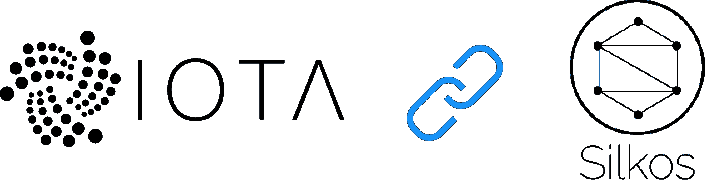

# 西尔科斯和奥塔

> 原文：<https://medium.com/hackernoon/silkos-and-iota-d2c7281153f8>

Silkos 正在讨论将 IOTA 的 tangle 技术应用到他们的区块链业务开发技术中。一个在线加密市场。

自去年年初以来，我们无法避免将我们模拟的一切数字化。而且从去年开始我们无法回避数字货币，所以这就是我们要结合的原因。使用我们简单的新技术，您可以轻松地用加密货币支付。它将按需转换为菲亚特或留在它的价值为卖方或买方。这使得它很容易适应在线市场，并能使双方受益。

Silkos 正试图寻找实现比我们所知的区块链更多的可能性。他们希望更上一层楼，从线下支付开始，将 tangle 技术引入市场。这意味着你可以用代币购买服务和商品。在该平台中，将有可能切换到 IOTA node tangle 网络，并从该网络进行购买。

Silkos 是 Ebay 和亚马逊的去中心化版本。自 2015 年以来，他们已经在开发一个平台，连接加密货币社区内的买家/供应商。

与比特币、以太坊和莱特币不同，IOTA 交易速度极快，最多只需几分钟即可验证。与所有其他加密货币不同，IOTA 绝对没有费用。这意味着 IOTA 可用于日常使用。没有费用意味着你也可以轻松发送微交易。所以这意味着人们支付一小部分产品或服务与他人分享。