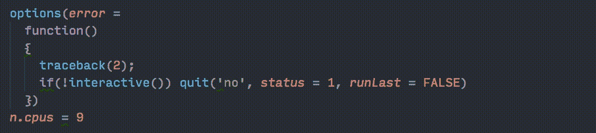

# 愚蠢的错误和我可能会犯的愚蠢的原因

> 原文：<https://medium.com/hackernoon/silly-r-errors-and-the-silly-reasons-im-probably-getting-them-c6bd9ada59c>

我们都喜欢认为，几年的经验意味着我们学到了一些东西:同样愚蠢的错误发生的次数减少了，当它们发生时，我们会在更短的时间内纠正它们。

嗯，是的— *理想情况下。但是编码并不总是理想的，而且因为我通常在编码后立即调试，所以当我碰到这些事情时，我并不总是处于最佳状态。每当我的脚本崩溃时，我很容易陷入重新发明诊断轮的陷阱，因为我应该检查一些事情。*

## **命名空间问题**

使用 [tidyverse](http://tidyverse.org/) 在很大程度上减少了这个列表。R 的灵活但微妙的子集化语法意味着任何时候我在 base R 中，我都感觉我在调试 DEFCON1。将这些句子换成容易记忆的动词，让普通任务变得更容易*和*更安全。

一个例外是每当我使用`[filter](http://dplyr.tidyverse.org/reference/filter.html)`时，它给你一个数据框行的选择:


“I’ll just filter this b — WHAAAA”

我给我的专栏起的名字不好吗？忘记等号了吗？(那个应该也在这个名单上，BTW。)不:我根本不跑`dplyr::filter`。

如果像我一样，您的`.RProfile`中有`library`语句，您会反常地在交互会话中运行`stats::filter`(统计数据显然是稍后加载的)。这导致了许多有趣的错误，表明输入了错误的变量或列名，但实际上只是运行了错误的函数。

简单但恼人的解决方法是，每当我在一个 filter 语句的几个邮政编码中遇到错误时，检查我是否显式地使用了`dplyr::filter`。

如果我用 RScript 运行一个非交互式会话(比方说，在一个有作业队列的服务器上)，我指定`RScript --vanilla`来防止坏的概要文件开始起作用。但是大多数时候，我只是用类似`filter = dplyr::filter`的东西来遵循我的脚本的库声明——老实说，这感觉像是一个等待发生的愚蠢错误。

还有其他一些有趣的例子:

*   `MASS::select`与`dplyr::select`冲突
*   `here::here`与`lubridate::here`冲突(已折旧但仍存在)

## **失控错误**

r 的隐性多行语句，可以是福也可以是祸。每当我遇到一个似乎与它所在的行完全无关的错误时，我都会检查是否有更早的行在运行。

这通常发生在我修改管道或 ggplot 时——事实上，90%的探索性数据都是 vis。我运行一个 ggplot，返回去添加一个元素，忘记在末尾加一个+,然后奇怪为什么它都不运行。

另一种情况是字符串中缺少或放错了右引号。通常这种情况下，语法高亮会提示你，但是有时我们需要咖啡。

## 闭合误差

这些错误包括:

`Evaluation error: invalid type (closure) for variable '***'`

`Error in ***: object of type 'closure' is not subsettable`

它们通常意味着当 R 期望另一种对象时，它已经被赋予了一个闭包(作为对象的函数)，反之亦然。需要检查两件明显的事情:

*   **函数调用末尾有(括号)。使用`magrittr`管道时，很容易忘记它们(虽然我尽量不去忘记)，但是一般来说，如果你忽略它们，你是在操作函数本身(或者更确切地说，是闭包)，而不是调用它(这可能是你的本意)。**
*   **您指定的变量或数据框列实际上已定义。**如果不是，并且——和我一样——你使用的变量/列名(比如，`month`)可能和函数名(比如，`lubridate::month`)冲突，R 将匹配后者并尝试使用闭包，而不是仅仅报告变量不存在。

事后看来，我可以通过使用不太可能冲突的变量名来避免这些错误(比如用`month_local`代替`month`)。

## 马格里特规则

在这个问题上我已经碰了几次头——事实上，我写了一个论坛帖子向人们询问了两次*，然后在发布两次之前大约五秒钟意识到发生了什么。*

*我还没有完全掌握如何使用`purrr`的[工具来处理列表列](https://jennybc.github.io/purrr-tutorial/ls13_list-columns.html)，但是我已经开始使用它们来完成一些常见的任务，比如批量导入或导出文件。但我时不时会碰到这样的事情:*

```
*library(tidyverse)
library(purrr)# example data set
df = data_frame(
  g = rep(letters[1:3], 20),
  a = 1:60,
  b = rnorm(60))# group, then write each group out to disk
df %>%
  nest(-g) %>%
  mutate(g = paste0(g, '.csv')) %>%
  print() %>%
  walk2(data, g, write_csv)
#> # A tibble: 3 x 2
#>   g     data
#> <chr> <list>
#> 1 a.csv <tibble [20 × 2]>
#> 2 b.csv <tibble [20 × 2]>
#> 3 c.csv <tibble [20 × 2]>
#> Error in as_mapper(.f, ...) : object 'g' not found*
```

*没有:`g`没有找到。好了，也许这些没有使用 tidyeval 来识别列名，我需要在点代词`.`前面加上前缀，它代表管道数据帧:*

*(注意:在本教程的[中，](https://jennybc.github.io/purrr-tutorial/ls13_list-columns.html)#> g data
#> <chr> <list>
#> 1 a.csv <tibble [20 × 2]>
#> 2 b.csv <tibble [20 × 2]>
#> 3 c.csv <tibble [20 × 2]>
#> Error in recycle_args(.l) : all(lengths == 1L | lengths == n) is not TRUE*

*不要。但是我的两列绝对是一样长的。绞尽脑汁，终于想起了`magrittr`的根本规律:最后一个返回值成为第一个参数，除非你也单独使用了点代词*。*如果你在一个表达式中使用它(比如`.$data`，管道仍然把`.`作为第一个参数输入。*

*所以我的烟斗是偷偷的:*

```
*walk2(., .$data, .$g, write_csv)*
```

*但是我可以用括号把它包起来:*

```
*{ walk2(.$data, .$g, write_csv) }*
```

*不幸的是，这似乎在`purrr`工作流中经常发生——这不是任何人的错，错误只是有时以一种令人困惑的方式相互作用。*

# ***首先避免问题***

*所以我们注定要永远犯同样愚蠢的错误，对吗？不:我们可以犯*更好的错误！也就是说，我们可以采取一些措施来确保愚蠢的错误不再成为问题。**

## ***使用棉绒***

*Linters 是检查你的代码是否有[‘可疑用法’](https://en.wikipedia.org/wiki/Lint_%28software%29)——奇怪的语法，可能导致意想不到的后果的代码，诸如此类。*

**

*The excellent [R extension](https://marketplace.visualstudio.com/items?itemName=Ikuyadeu.r) for Visual Studio Code supports linting with [lintr](https://github.com/jimhester/lintr). So does [RStudio](https://www.rstudio.com/).*

*一个 linter 可能带来的许多标志可能只是非标准的风格——如果你对风格有一些…嗯，*分歧*([猜猜我准备死在哪个山头](http://www.win-vector.com/blog/2013/04/prefer-for-assignment-in-r/)？).但是最坏的情况是，linters 只是强迫你检查你的编码决策。在最好的情况下，他们在问题滚雪球般地占据你半个下午之前就发现了问题。*

## ***编写可以快速测试的脚本***

*作为一名学者，我在远程服务器上做了很多工作。其中一些是资源受限的，所以如果我需要多一点的 RAM 或多几个 CPU，我必须编写一个脚本，而不是排队等待并以非交互方式运行。*

*这对调试来说是个问题，因为作业系统可能会在脚本上停留几分钟到几个小时。即使只有几分钟，也要花上半天的时间来解决一些原本只需要 15 分钟就能解决的问题。*

*如果您编写的脚本可以让您自己运行(最好是交互式的，但是非此即彼)，那么修复早期出现的各种错误会非常快。如果所有的脚本代码都在函数内部，那么一旦定义了函数，就会出现一些错误，而不是在代码真正执行之前一直处于休眠状态(根据脚本的大小，可能是几个小时或几天之后)。*

## ***定期转储输出样本***

*非交互工作的另一个令人沮丧的方面是，您不能只放下一个断点就检查您的数据结构。我知道有很多方法可以解决这个问题，但是对我来说，半定期地使用`print(head(data))`和`print(summary(data))`可能也是一个好习惯。这样，如果我的代码运行时，我打开了一个满是`NA`的列，我至少可以找出哪里出错了。*

*在我的待办事项列表中，一个更好的选择是使用 [RMarkdown](http://rmarkdown.rstudio.com/) 作为我的分析的一个看起来更好的日志文件。*

## ***不要放弃未测试的代码***

*运行需要几分钟时间来设置的代码是一个去厕所、伸伸腿或泡一杯茶的好借口。但是运行你没有测试过的代码，在它崩溃之前离开它，是忘记可能导致它的变化的好方法。*

*个人原则:从现在开始，如果我在调试时做了一些修改，然后开始测试，我不会离开，直到测试结束，除非我在便利贴上潦草地写下我所做的修改。这样，如果我在修复第一个错误时引入了另一个愚蠢的错误，至少我知道它在哪一行。*

*你有没有其他经常陷入的 R 陷阱或者最小化调试痛苦的技巧？我想更新这个，因为我继续犯愚蠢的错误，所以不要羞于告诉我你的错误！*