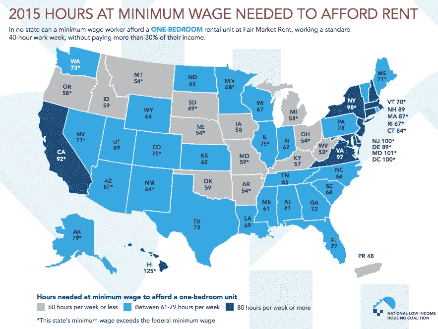

# 西蒙·西内克对千禧一代的想法就像长长的放屁

> 原文：<https://medium.com/hackernoon/simon-sineks-thoughts-on-millennials-are-like-long-gassy-farts-18387f68fdec>

## 西内克在《名垂千年》上的人物暗杀充满了火辣、愚蠢的空气。

43 岁的高龄似乎是西蒙·西内克退休的好时机。

他最近在[千禧一代](https://hackernoon.com/tagged/millennials)上的采访，目前从一个[雅虎](https://hackernoon.com/tagged/yahoo)账户跳转到另一个账户，并附有宝贵的注释，如“我已经说了很多年了！”表明他的观察变得模糊，他完全脱离了周围的世界。

无论如何，一个职业同行把 21 岁到 39 岁之间的工作、纳税的人称为“孩子”，这种不劳而获的优越感不值得他目前享受的那种病毒式传播和愚蠢的崇敬。

伪装成思想领导的懒惰的职场宣传。这是一个旨在诋毁非常普通的一代人的老掉牙的比喻——它既迟钝又毫无用处。

在这个视频中，西蒙·西内克放了几个屁，你应该像平常放屁一样，迅速地、毫无歉意地走开。

# 1.“千禧一代是……”

[千禧一代并不存在。“千禧一代”一词指的是出生于 1981 年至 1997 年之间的一代人。](/@skstock/shut-up-simon-sinek-15de7b8cdaa9#.ceyr2mcwj)

有些人出身富有。有些人出身贫寒。有些是共和党人。有些很胖。有些人出生在法国。一些人看尼克国际频道。有的被父母打。有些是双胞胎。有些孩子直到 8 岁还尿床。

你看到这里的模式了吗？你不应该。千禧一代除了出生在特定的年代和我们从老一代继承的糟糕的经济危机之外，没有任何共同点。

你不能把特定的行为特征和独特的职场气质分配给一群全球的人。好吧，你可以，如果目的是为了卖书而欺骗你的读者。

# 2.“随着年龄的增长，太多的孩子……”

对，37 岁的孩子。继续吧。

# 3.“……太多的孩子不知道如何建立深刻而有意义的关系……”

Sinek 认为我们是傻瓜，生活在一个童话世界里，在这个世界里寻找爱情和工作满足感就像订购一个无缝的比萨饼。

但是只有傻瓜才会用少量的经验证据对 7450 万美国人进行如此广泛的心理分析。

这里有一个疯狂的想法:一些“千禧一代”知道如何建立深刻而有意义的关系。其他“千禧一代”则没有。他们听起来非常像历史上的人类。

技术总是阻碍一些人，推动另一些人。在 Tinder 出现之前，就有了交友网站。在约会网站之前，有粗略的聊天论坛。在粗略的聊天论坛之前，报纸上有个人广告。在报纸上登个人广告之前，有 yentas？Idk。

This woman does not represent me.

阿齐兹·安萨里的这本关于现代浪漫的书是一个证明，与我们的祖父母那一代相比，我们必须更加努力地寻找爱情，他们几乎总是从自己的邻居那里寻找生活伴侣。

是的，我们完全卷入了选择的[悖论](http://www.pbs.org/newshour/making-sense/is-the-famous-paradox-of-choic/)。是的，我们拥有前所未有的社会、浪漫和经济机会，但我们充分意识到摆在我们面前的艰巨、漫长和艰难的旅程。

孩子们都很好。

与此同时，我们唯一要面对的现实是老人告诉我们，我们是多么爱发牢骚、沮丧的失败者。

# 4."你想要的一切，瞬间就能拥有。"

这股又热又臭的气流是所有谎言中的谎言:千禧一代缺乏耐心、勇气和毅力。

正是基于这些站不住脚的理由，老年人要求年轻人停止购买 22 美元的鳄梨吐司，以便为他们买不起的房子节省[，即使他们再也不会碰鳄梨。](http://www.theguardian.com/news/datablog/2016/oct/18/are-millennials-actually-bad-at-saving-or-are-houses-just-unaffordable)

This is not the reason we’re not buying houses.

这是他们用来嘲笑那些不愿意搬出父母家，等待更长时间才结婚和从一个工作换到另一个工作的年轻人。

Sinek 特别哀叹这位不可驯服的千禧一代渴望在工作场所产生影响。

事实是，如果你觉得你对工作没有影响，那就意味着你的工作对你没有影响。如果你不想离开你的工作，明智的做法是找一份有学习曲线的工作。

在这段时间里，我们剩下的只有产生影响的感觉。

在我们的“千禧年”世界里，自 2008 年经济衰退以来，收入一直停滞不前，[我们的 401(k)计划可能毫无价值](http://www.google.de/url?sa=t&rct=j&q=&esrc=s&source=newssearch&cd=3&ved=0ahUKEwiP97m--K7RAhUGlxoKHS6kClYQqQIIJCgAMAI&url=http%3A%2F%2Fwww.wsj.com%2Farticles%2Fthe-champions-of-the-401-k-lament-the-revolution-they-started-1483382348&usg=AFQjCNH8ptt2BhUNDXzgD_BzBUg-a2-trg&bvm=bv.142059868,d.d2s)，你必须以最低工资每周工作[惊人的 92 小时](http://mic.com/articles/120428/1-map-shows-how-many-hours-you-need-to-work-minimum-wage-to-rent-an-apartment-in-any-state#.sEimvmJFa)，才能在加利福尼亚州买得起一套一居室公寓。

Kids these days.

我们进入了工作的黄金时期，健康福利越来越少，工作保障越来越少，赚钱能力越来越弱，同时背负着比美国任何一代人都多的大学债务。

千禧一代不是问题一代，我们也远没有资格。我们在一个系统中运作，这个系统无情地要求我们的生产力和最好的自己，同时把我们降低到最低的公分母。

西蒙·西内克只是你的坏脾气爷爷，抱怨现在的孩子太他妈的软，当他在你这个年龄时，他步行 8 英里去学校。

# 5.“(对千禧一代来说)最好的情况是一辈子都找不到快乐……从来没有真正在工作或生活中找到深度的满足感。”

“深度满足”是一个虚构的概念，旨在向千禧一代出售自助书籍。很好笑，因为两者都不存在！

Sinek 担心我们永远也找不到“深度满足”，就好像这是一种永恒的人间天堂。

但我们的祖父母或他们的祖父母也没有，他们中的许多人过着非常愉快的生活，没有成为这种新时代自恋的受害者。

值得庆幸的是，没有人出现在我们的祖先整日劳作的田野里，向他们兜售如此模糊、不可能的概念。也许他们也会很痛苦！

“快乐”、“真爱”和“深度满足”等定义模糊的概念——以及我们必须在工作和生育的黄金时期实现这些目标的期望——设定了一个很高的、无法实现的标准，足以让任何人陷入螺旋式抑郁。

我会接受有意义的工作和好朋友带来的满足感。

别担心我们，西蒙。我们会解决的！

**像这样？讨厌这个？来推特上吼我吧——我是**[**@ nan doodles**](https://twitter.com/nandoodles)**。**

> [黑客中午](http://bit.ly/Hackernoon)是黑客如何开始他们的下午。我们是 [@AMI](http://bit.ly/atAMIatAMI) 家庭的一员。我们现在[接受投稿](http://bit.ly/hackernoonsubmission)并乐意[讨论广告&赞助](mailto:partners@amipublications.com)机会。
> 
> 如果你喜欢这个故事，我们推荐你阅读我们的[最新科技故事](http://bit.ly/hackernoonlatestt)和[趋势科技故事](https://hackernoon.com/trending)。直到下一次，不要把世界的现实想当然！

