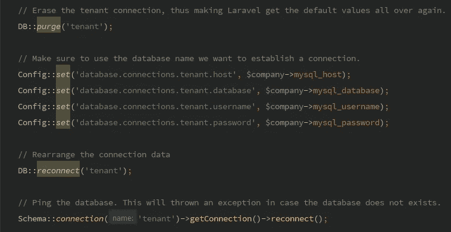

# 带 Laravel 的简单多租户

> 原文：<https://medium.com/hackernoon/simple-multi-tenancy-with-laravel-b3f84fc13c39>



在开发一个小型管理工具来帮助公司对 800 个不同的数据库进行数据更改时，我几乎没有时间来想出一个可靠的解决方案，来说明如何用 Laravel 建立主/租户连接。当你用 Laravel 搜索多租户时，大约有 3 个包脱颖而出。

*   [hyn/多租户](https://github.com/hyn/multi-tenant)由 [Luceos](https://github.com/Luceos)

我玩了一会儿 [hyn](https://hyn.readme.io/) ，不可否认这是一个很棒的软件包，但是它与 Laravel 5.4 不兼容(我说过我时间不多吗？).这让我害怕不得不经常处理过时的软件包，我不想让这个负担压在我身上。

*   [管弦乐/泰南提](https://github.com/orchestral/tenanti)

那时，管弦乐对我来说太复杂了。Laravel 初学者，特别是当你没有其他框架经验时，可能需要一些时间来理解服务提供者、引导等。我无法完全理解单数据库和多数据库的解决方案。

*   [楼主](https://github.com/HipsterJazzbo/Landlord)

单一数据库解决方案。不是我需要的。

# 自己动手

Laravel 让你自己动手变得非常简单。您所需要的只是一个连接配置、一个中间件、一个特征连接器，并相应地设置您的模型。

## 连接设置

在您的 **config/database.php** 文件中，让我们设置 2 个连接。请注意，我删除了 **mysql** 连接，所以您需要您的**。env** 说 **DB_CONNECTION=main**

```
'connections' => [

    'main' => [
        'driver' => 'mysql',
        'host' => env('DB_HOST', '127.0.0.1'),
        'port' => env('DB_PORT', '3306'),
        'database' => env('DB_DATABASE', 'forge'),
        'username' => env('DB_USERNAME', 'forge'),
        'password' => env('DB_PASSWORD', ''),
        'charset' => 'utf8mb4',
        'collation' => 'utf8mb4_unicode_ci',
        'prefix' => '',
        'strict' => **true**,
        'engine' => **null**,
    ],

    'tenant' => [
        'driver' => 'mysql',
        'host' => env('DB_HOST', '127.0.0.1'),
        'port' => env('DB_PORT', '3306'),
        'database' => '',
        'username' => '',
        'password' => '',
        'charset' => 'utf8mb4',
        'collation' => 'utf8mb4_unicode_ci',
        'prefix' => '',
        'strict' => **true**,
        'engine' => **null**,
    ]
]
```

## 中间件

始终确保连接存在。您所要做的就是确保所有应该连接到**租户**数据库的路由都使用这个中间件。在我的特定情况下，用户将从列表中选择一个客户(租户),并操作该客户的数据，因此使用了会话。但是我可以很容易地拥有两个中间件(WebTenant、ApiTenant ),并依靠令牌来选择一个租户连接。

```
<?php

**namespace** App\Http\Middleware;

**use** App\Models\Main\Company;
**use** App\Support\Controller\TenantConnector;
**use** Closure;

**class** Tenant {

    **use** TenantConnector;

    */**
     ** ***@var*** *Company
     */* **protected** $company;

    */**
     * Tenant constructor.
     ** ***@param*** *Company $company
     */* **public function** __construct(Company $company) {
        $this->company = $company;
    }

    */**
     * Handle an incoming request.
     *
     ** ***@param*** *\Illuminate\Http\Request $request
     ** ***@param*** *\Closure $next
     ** ***@return*** *mixed
     */* **public function** handle($request, Closure $next) {
        **if** (($request->session()->get('tenant')) === **null**)
            **return** redirect()->route('home')->withErrors(['error' => __('Please select a customer/tenant before making this request.')]);

        // Get the company object with the id stored in session
        $company = $this->company->find($request->session()->get('tenant'));

        // Connect and place the $company object in the view
        $this->reconnect($company);
        $request->session()->put('company', $company);

        **return** $next($request);
    }
}
```

## TenantConnector(特征)

这里没什么好说的。只需设置您的租户数据连接。

```
**<?php

namespace** App\Support;

**use** App\Models\Main\Company;
**use** Illuminate\Support\Facades\Config;
**use** Illuminate\Support\Facades\DB;
**use** Illuminate\Support\Facades\Schema;

**trait** TenantConnector {

   */**
    * Switch the Tenant connection to a different company.
    ** ***@param*** *Company $company
    ** ***@return*** *void
    ** ***@throws*** **/* **public function** reconnect(Company $company) {     
      // Erase the tenant connection, thus making Laravel get the default values all over again.
      DB::*purge*('tenant');

      // Make sure to use the database name we want to establish a connection.
      Config::*set*('database.connections.tenant.host', $company->mysql_host);
      Config::*set*('database.connections.tenant.database', $company->mysql_database);
      Config::*set*('database.connections.tenant.username', $company->mysql_username);
      Config::*set*('database.connections.tenant.password', $company->mysql_password);

      // Rearrange the connection data
      DB::*reconnect*('tenant');

      // Ping the database. This will throw an exception in case the database does not exists or the connection fails
      Schema::*connection*('tenant')->getConnection()->reconnect();
   }

}
```

## 模特们

主数据库中的模型将拥有**主**连接，如此而已。

```
**<?php

namespace** App\Models\Main;

**use** Illuminate\Notifications\Notifiable;
**use** Illuminate\Foundation\Auth\User **as** Authenticatable;

**class** Admin **extends** Authenticatable {

   **use** Notifiable;

   **protected** $connection = 'main';
}
```

公司(客户/租户)模型只是略有不同。我决定在这里也使用 TenantConnector 特性，并提供一个 **connect()** 方法。这让我可以做类似**Company::find($ id)->connect()；**

```
**<?php

namespace** App\Models\Main;

**use** App\Support\TenantConnector;
**use** Illuminate\Database\Eloquent\Model;

*/**
 ** ***@property*** *string mysql_host
 ** ***@property*** *string mysql_database
 ** ***@property*** *string mysql_username
 ** ***@property*** *string mysql_password
 ** ***@property*** *string company_name
 */* **class** Company **extends** Model {

    **use** TenantConnector;

    **protected** $connection = 'main'; */**
     ** ***@return*** *$this
     */* **public function** connect() {
        $this->reconnect($this);
        **return** $this;
    }

}
```

租户模型将只连接到**租户**数据库设置。

```
**<?php

namespace** App\Models\Tenant;

**use** Illuminate\Database\Eloquent\Model;**class** MailQueue **extends** Model {

   **protected** $connection = 'tenant';}
```

最后是一个 **SelectTenantController** ，允许您设置中间件期望的会话。

```
*/**
 ** ***@GET*** *** ***@param*** *Request $request
 ** ***@param*** *$company
 ** ***@return*** *\Illuminate\Http\RedirectResponse|\Illuminate\Routing\Redirector
 */* **public function** select(Request $request, $company) {
   $this->reconnect($this->company->findOrFail($company)); $request->session()->put('tenant', $company);
   **return** redirect('/');
}
```

# 结论

Laravel 会让你轻松拥有 2 个连接设置。将连接到特定数据库的路由可以很容易地使用中间件来确保连接存在。您可以轻松地为每个模型选择连接(或者拥有一个 MainModel / TenantModel 并扩展它们)。万事俱备，您已经得到了一个能够连接多个数据库的 Laravel 应用程序。

我应该很快会写一篇关于租户自动化测试和租户基于令牌的路由的后续文章。

[](http://bit.ly/HackernoonFB)[](https://goo.gl/k7XYbx)[](https://goo.gl/4ofytp)

> [黑客中午](http://bit.ly/Hackernoon)是黑客如何开始他们的下午。我们是 [@AMI](http://bit.ly/atAMIatAMI) 家庭的一员。我们现在[接受投稿](http://bit.ly/hackernoonsubmission)并乐意[讨论广告&赞助](mailto:partners@amipublications.com)机会。
> 
> 如果你喜欢这个故事，我们推荐你阅读我们的[最新科技故事](http://bit.ly/hackernoonlatestt)和[趋势科技故事](https://hackernoon.com/trending)。直到下一次，不要把世界的现实想当然！

