# 2020 年简单反应发展

> 原文：<https://medium.com/hackernoon/simple-react-development-in-2017-113bd563691f>

## 嗨，有抱负的 React 开发人员！👋

也许您是一名 jQuery 开发人员，希望尝试一种现代框架。或者，也许你是一个有棱角的开发者，想看看所有的宣传是关于什么的。也许你是一个经验丰富的后端或系统程序员，希望跳到前端。一般来说，您可能是编程新手，但想学习如何构建动态 web 应用程序。

不管你的背景如何，你可能都有过类似的经历: [React](https://hackernoon.com/tagged/react) 本身看起来很简单，但是工具和生态系统是压倒性的。

你可能会觉得这个人:


[https://twitter.com/thomasfuchs/status/834481271443226627](https://twitter.com/thomasfuchs/status/834481271443226627?lang=en)

我经常看到和听到这个主题的变化。尤其对于新手来说，React 开发经常看起来像一个复杂的工具和库的迷宫。甚至有经验的开发人员也在谈论现代 web 开发有多复杂，并且渴望简单的打开编辑器进行编写的日子。

## **不过，这是一个已经解决的问题！**

在过去的几年里，React 社区投入了大量的精力来创建一个工具，让 React 开发人员可以像下载一个依赖项和打开一个编辑器一样快地开始并运行*。*

本指南的目标是帮助创建您的第一个 React 应用程序。它分享了从初始系统设置到部署的一步一步的过程，没有偏离到在学习过程的这一点上不重要的切线解释。

不要求以前有 React 或其相关工具的经验，尽管它假设您知道使用命令行和 git 的基本知识。

这是一份活的文件，我会随着形势的变化而更新它。

*最后更新:2019 年 12 月 9 日*

# 最快的开始:CodeSandbox

[CodeSandbox](https://codesandbox.io/) 是一个在线 REPL。太不可思议了。

它可以让你立即启动一个包含你需要的所有东西的 React 项目。它在浏览器中运行，但是支持多文件，第三方依赖……它用 VS 代码做编辑器，这是*野。*本质上是运行在浏览器内的全开发环境，我可以毫无保留的推荐。您可以使用 CodeSandbox 构建一个完整的应用程序。

有*是*让所有东西都在你的本地机器上运行，所以我们也会谈到这一点。但是，如果您正在寻找一个火箭般速度的开始，请前往 CodeSandbox，直接跳到第 3 步。

# 第一步:安装纱线

纱是一个包装经理。它帮助我们管理项目的依赖性。

如果你是编程新手，基本上你可以把它看作是一个帮助我们轻松下载和使用他人代码的工具。

纱线网站 上有 [**的下载和安装说明。**](https://yarnpkg.com/en/docs/install)

一旦你安装了 yarn，验证你能在命令行上使用它。打开一个新终端，运行:

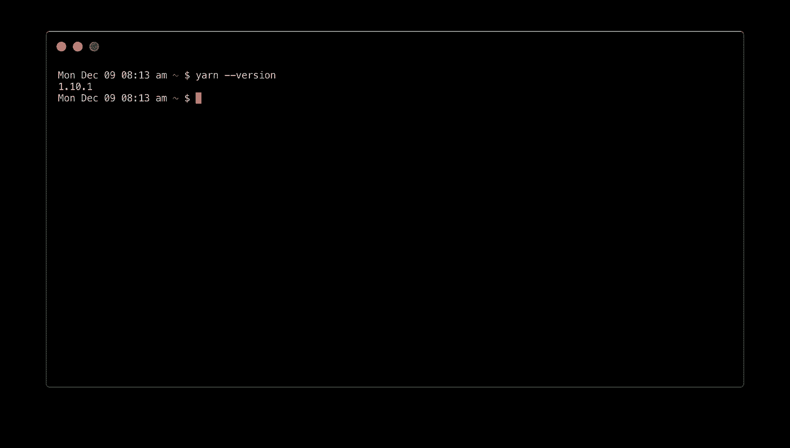

> **但是 NPM 呢？你可能已经看到 NPM 是 Javascript 社区中事实上的包管理者，并且可能想知道为什么我建议使用 Yarn。
> 
> 没有离题太远，Yarn 是社区共同努力改进的包管理。在内部，它仍然使用 NPM 软件包库，所以你仍然可以安装所有相同的软件包。**
> 
> 在过去的几年里，默认的 NPM 客户端有所改进。如果你已经习惯了 NPM，你可以用它来代替。我们将继续提供替代 NPM 指令。

# 步骤 2:创建一个 React 应用程序

当人们谈论 React 开发中的复杂性时，他们通常指的不是 React 本身，而是构建系统和开发环境中的复杂性。

他们说得有道理——作为 React 开发人员，我们倾向于构建非常复杂的开发环境和系统。我们忍受这种复杂性，因为它使 React 开发更快更愉快。

然而，对于那些刚刚起步的人来说，这种复杂性是压倒性的，更糟糕的是，它妨碍了学习什么是真正重要的:自己做出反应。

谢天谢地，有一个鱼和熊掌兼得的解决方案。叫做 [**创建-反应-app**](https://github.com/facebook/create-react-app) **。**

create-react-app 是一个命令行工具，由脸书所有，由脸书和社区的天才开发者维护。真是*惊艳*。它抽象出了实现 Webpack、Babel、开发服务器、产品构建过程和一千个其他繁琐但重要的东西的所有复杂性和困难。

默认情况下，它是零配置的，不会因为一堆您不理解的文件而使您的项目目录混乱。

> **注意**:最终，你会想花时间了解这在内部是如何工作的。例如，你可以用 Webpack 做很多有趣的事情。不过，我们目前的首要任务是让您对 React 的构建感到兴奋，所以我们可以将这一工作推迟到以后。

Yarn 带有一个内置的助手，用于使用 create-react-app:

```
yarn create react-app [your-app-name]
```

我希望我的应用程序被命名为 *cats-n-stuff* ，所以我将运行:

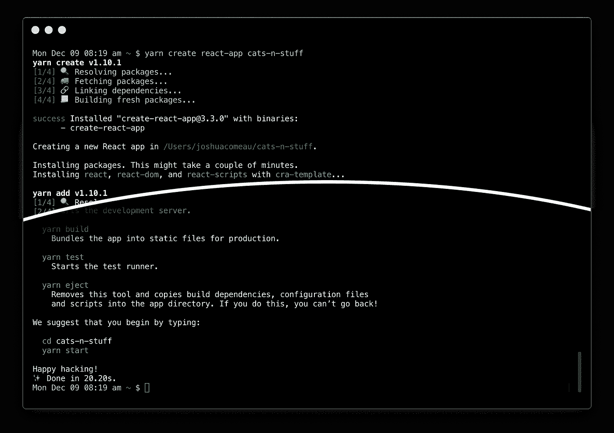

The actual terminal output is ***a lot****, so this screenshot cuts out a bunch of stuff in the middle.*

> 如果您得到一个以“没有提供模板”开始的错误，很可能是因为您安装了一个早期的不兼容版本的 create-react-app。看看[这个 StackOverflow 回答](https://stackoverflow.com/questions/59188624/template-not-provided-using-create-react-app)。
> 
> 如果你使用的是 NPM 而不是 yarn，你可以运行“*npx create-react-app cats-n-stuff”来达到同样的效果。*

这个命令做了很多事情:

*   下载并安装`create-react-app`
*   创建一个新的项目文件夹，`cats-n-stuff`(或者你给你的应用起的名字)
*   搭建一个新项目，包括编译一个生产就绪的应用程序所需的一切，以及运行一个开发服务器
*   安装依赖项

您会注意到最后的输出给出了一组命令。
让我们按照它的指示开始吧:

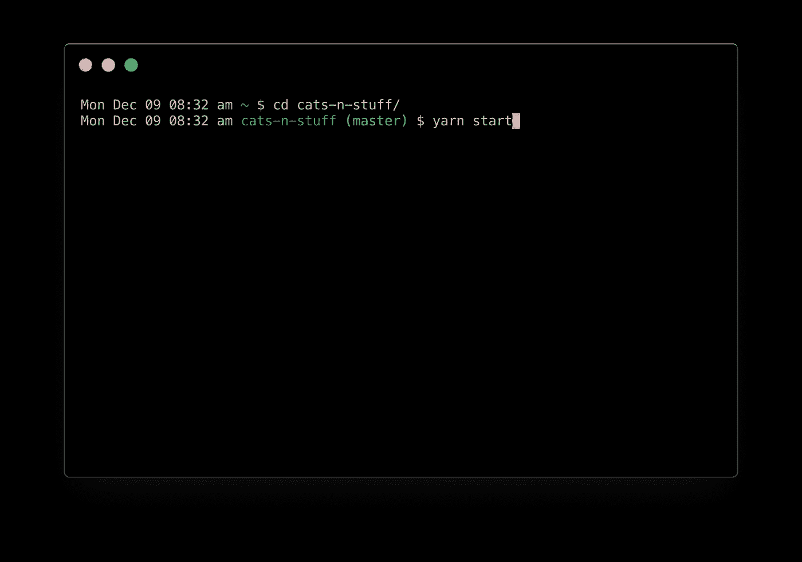

我们应该会看到以下输出:

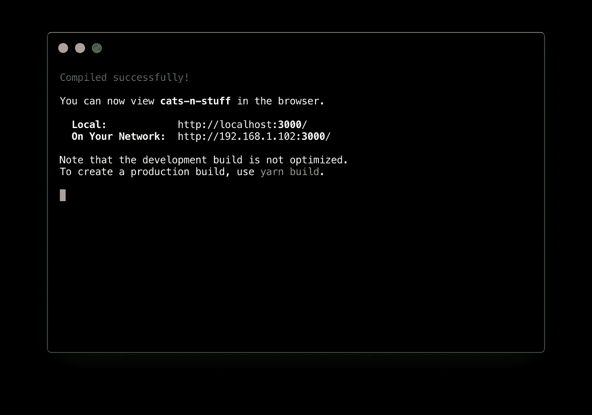

还应该打开一个浏览器窗口，显示以下内容:

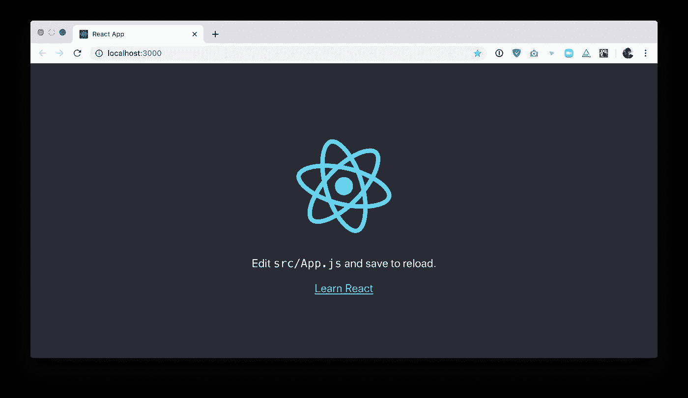

让我们在代码编辑器中打开新项目。我用的是 VS 代码。您应该会看到以下文件:

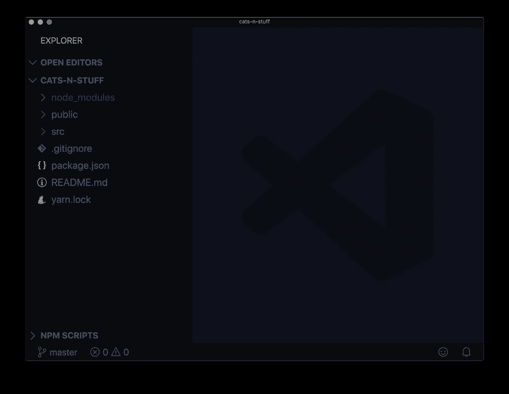

让我们浏览一下:

## 节点 _ 模块

这个目录保存了我们所有的项目依赖项，比如 *react* 和 *react-dom* 。它还包括运行我们的构建系统和开发服务器所需的所有依赖项。有时候，人们会被这个目录的大小(大约 200mb)吓到，但是重要的是要记住它包括了一大堆开发工具。真正交付给用户的代码非常少。

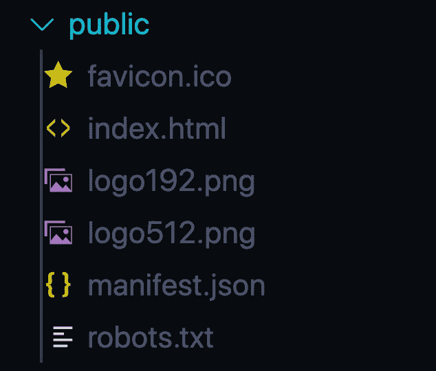

## 公众的

这个目录包含静态资产，比如我们的 favicon 和搜索引擎偏好。它还存放了我们项目唯一的 HTML 文件。因为 React 是全 javascript，所以你只需要 HTML 文件来更新标题和 meta 标签。这也可以用 React 修改，但是现在最简单的方法是将你自己的<标题>添加到这个文件中。

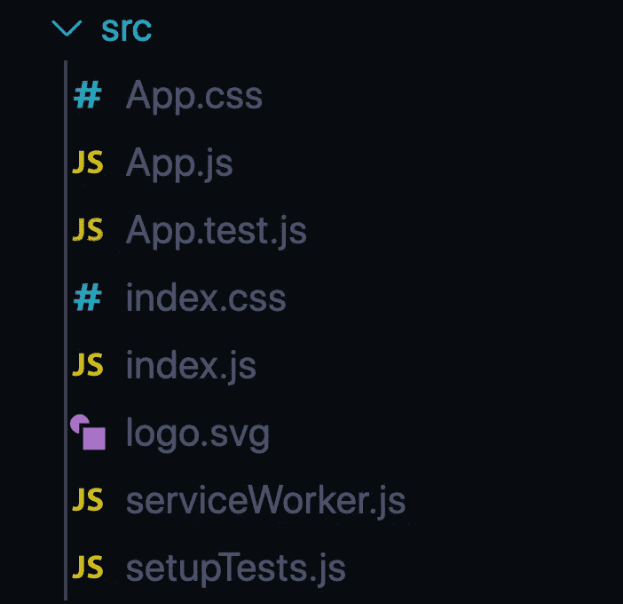

## 科学研究委员会

这个目录保存了我们将要编写的构建应用程序的源代码。默认情况下， *create-react-app* 带有一个组件——App——和一个挂载它的 *index.js* 文件。它还包括一些 CSS 文件——在 React 社区中，通常将样式和代码放在一起，这样每个组件都有自己的样式表。

现在，你可以忽略最后两个文件， *serviceWorker.js* 和 *setupTests.js* 。我们还不需要对他们大惊小怪。

## 根目录

最后，项目的根目录保存了与依赖项相关的东西( *package.json* 和 *yarn.lock* )，以及 create-react-app 的综合文档( *README.md* )。

> 这是只给初学者的吗？我会妨碍自己吗？
> create-react-app 抽象掉所有配置，帮助你专注于编写应用程序本身。但是，在某些时候，您可能想要访问该配置。
> 
> 谢天谢地，create-react-app 有 [**一个** **eject** **特性**](https://facebook.github.io/react/blog/2016/07/22/create-apps-with-no-configuration.html#no-lock-in) 去掉了这个抽象，暴露了底层配置。这意味着 create-react-app 不仅对新手来说是一个出色的工具，对有经验的 react 开发者来说也是如此。

几年前，在一个新项目的第一天设置构建系统和开发服务器是很常见的。既然你知道这个过程，它应该只需要几分钟！此外，与安装 jQuery 和启动编辑器的时代不同，我们有一系列奇妙的工具让我们的生活变得更加轻松:

*   当我们保存文件时，开发服务器将自动刷新/热重装
*   我们可以使用现代的 JS 特性而不用担心浏览器的兼容性，因为 *babel* 会把你的代码翻译成所有主流浏览器都能理解的旧版本 JS
*   您可以将所有类型的文件导入到您的 JS 代码中，包括 CSS 和图像。
*   当你犯错误时，你的编辑会警告你，包括那些不太明显的事情(比如易访问性问题)

# 步骤 3:编写应用程序

好了，我们的项目已经准备好了。现在我们必须构建我们的应用程序。

当人们开始工作时，我有一条我经常给自己的建议:**先学会独立反应。**

如果您学习了许多面向中级或高级用户的教程，您可能会认为您需要了解并安装十几个“补充”包。毕竟 React 只是视图层吧？

不对。脸书曾说 React 是“MVC”中的“V”。他们不再使用那种语言，因为那不是真的；React 是一个完全不同的范例，不仅仅是一个模板渲染器。事实是，React 是惊人的能力*对自己的*。

比如一开始不需要安装 Redux 或者其他任何状态管理库。我真的很喜欢 Redux，但如果你尝试一起学习它们，它会令人不知所措，React 附带了一个内置的状态管理解决方案:React state。

我相信最好的学习方法是做几个小的“周末项目”应用。尝试[制作一个游戏](https://reactjs.org/tutorial/tutorial.html)，或者验证一个表单，或者建立一个迷你组件库。这类项目不需要任何额外的依赖。

一旦您构建了几个测试项目，您可能会想要添加 [React 路由器](https://reacttraining.com/react-router/web/guides/quick-start)。因为 React 没有内置路由器，所以它确实很重要。[构建自己的路由器](https://gist.github.com/joshwcomeau/2a31d790fbd80edae0a562e96d503a46)可以是一个有趣的教育项目，但我也足够务实地意识到，有时你只是想构建一个项目，使用 React 路由器会解除你的障碍。

你可能会发现，在你的第二个或第三个小 React 项目之后，某些事情会比你想要的更痛苦。也许您自己开发的路由器太麻烦了，或者您觉得应用程序的状态很难管理。这是你应该寻找已有解决方案的时候；在之后，而不是在**之前，你已经遇到了问题。**

花时间学习如何自己做出反应。根据需要添加依赖项。尝试自己解决问题；如果没有别的，您将理解这些依赖项所提供的好处。


Dan Abramov, co-creator of Redux, explaining that Flux libraries like Redux aren’t always needed. [https://twitter.com/dan_abramov/status/704304462739939328](https://twitter.com/dan_abramov/status/704304462739939328)

## 学习资源反应

在花了一些时间谷歌 React 教程后，我明白了为什么新手会觉得 React 如此令人困惑。

如果不深入研究 webpack 和 redux 以及无数其他东西，实际上很难找到可靠的、最新的涵盖 React 本身的教程。

以下是我找到的做这项工作的资源:

1.  [**官方 React 教程**](https://facebook.github.io/react/tutorial/tutorial.html) —直接来自官方团队。建立一个井字游戏。
2.  [**学习之路 React**](https://www.robinwieruch.de/the-road-to-learn-react/) —一个按需付费的电子书，使用 create-react-app 和最少的第三方库构建了一个全功能的 HackerNews 克隆。奇妙的资源。
3.  [](https://daveceddia.com/pure-react/)****——戴夫·塞迪亚的一本伟大的反应书****
4.  ****[**React**](https://www.taniarascia.com/getting-started-with-react/)入门 Tania Rascia 的一篇精彩博文****

## ****钩子？****

****2019 年对于 React 来说是大年，其中最大的变化之一就是 2 月份“钩子”的稳定发布。钩子是一个现代的 React 特性，它允许您从功能组件中访问 React 特性，如状态、引用和生命周期方法。****

****我看到的一个常见问题是，你是否应该学习钩子或类组件。我个人的信念是钩子是未来，我听说从钩子开始会更简单更快。但最终，两者都很重要，你学习它们的顺序并不重要。****

# ****步骤 4:部署****

****好了，你已经创建了一个很棒的小玩具应用程序。现在你想向世界展示你的创造。我们怎么把这东西放到网上？****

****Web 开发很有趣，如果你有一些好东西可以炫耀，那就更好了。向世界展示你的 [随机](https://beatmapper.app/) [身边](https://pudding.cool/2018/02/waveforms/) [项目](http://panther.audio/)会带来难以置信的满足感。****

****我们需要做的第一件事是构建我们的项目。****

****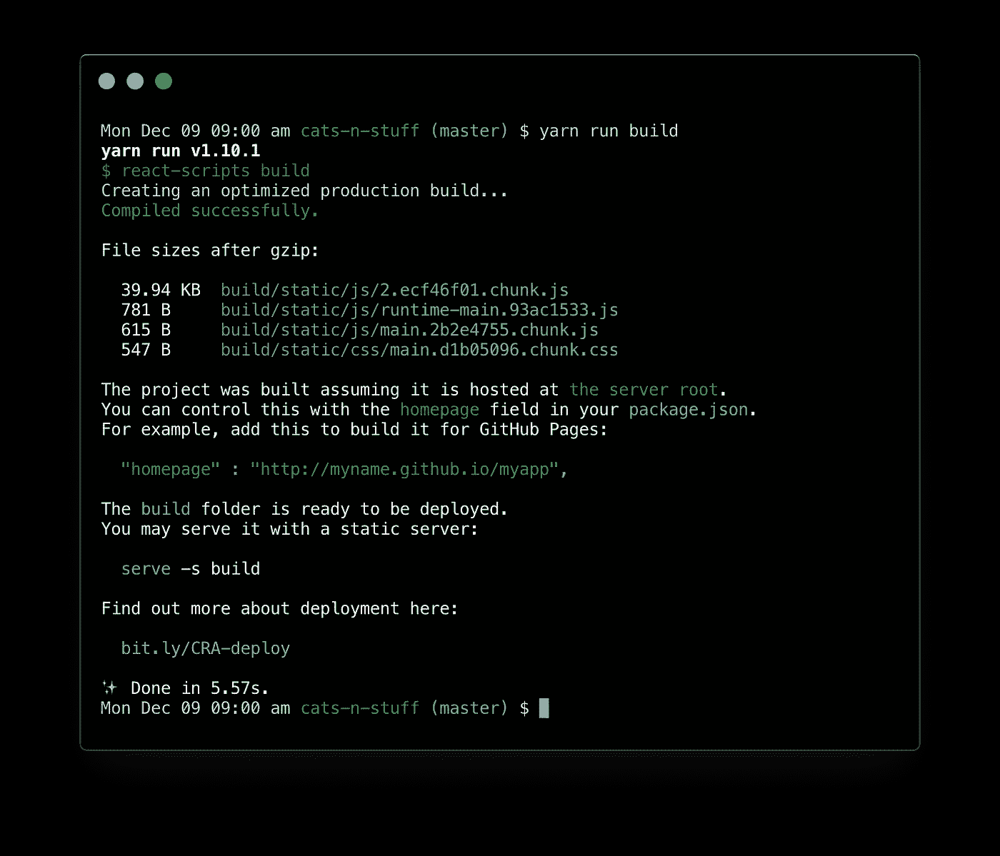****

> ******这是做什么的？** ‘build’是由 create-react-app 提供的 NPM 脚本。它将您的代码打包成随时可以部署的静态文件。运行之后，您会注意到项目中有一个新的 *build* 目录，包括运行项目所需的所有编译后的 JS 和 HTML。构建也使用 React 的生产版本，这意味着它运行得更快，并且不包括错误屏幕之类的开发模式助手。****

## ****部署服务****

****就像现代 web 开发中的其他事情一样，有很多选项可以让你把构建好的文件放到互联网上。****

****[Create-react-app 的文档](https://github.com/facebookincubator/create-react-app/blob/master/packages/react-scripts/template/README.md#deployment)涵盖了几种可能的部署选项，根据我的经验， [Surge.sh](http://surge.sh) 是让代码快速上线的最快捷、最简单的方式。****

****让我们用纱线安装它:****

****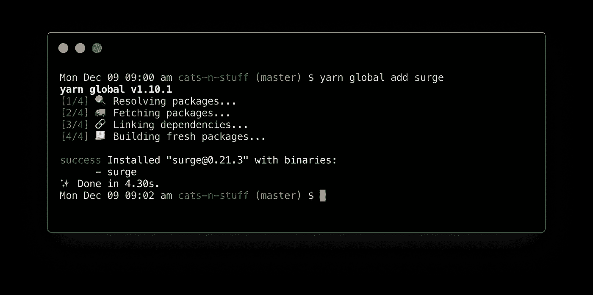****

****我们在全球范围内安装它，以便我们可以使用它的 CLI 工具。让我们现在运行它:****

```
**surge**
```

****第一次运行 *surge* ，会提示你创建一个账号。输入您的电子邮件，并提供一个新密码。****

****之后，它会问你一个项目路径。**这很重要:**它应该会自动填充当前位置，但是我们需要在路径中添加/ *build* ，因为静态的、编译过的文件就在那里。****

****最后，你可以选择一个域名。它会随机推荐一个，或者你也可以自己试试。****

****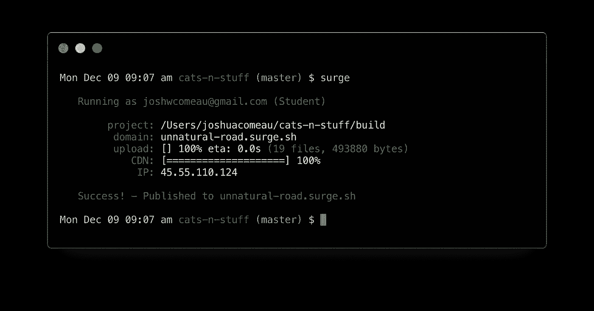****

****值得注意的是，这就是我们要做的一切。Surge 会将我们的文件发送到指定的域。看看这个:****

********

## ****简化重复部署****

****如果我们愿意，我们可以每次都重复这个过程；构建，运行 *surge，*，然后指定一个项目路径和域名。****

****不过我们可以用 NPM 的剧本来稍微花哨一点。打开你的 *package.json* ，找到“脚本”部分。你应该找到我们已经用过的，比如“开始”和“构建”。让我们添加一个新的:****

```
**"deploy": "yarn run build && surge -p build -d your-domain.surge.sh"**
```

****终端命令可以用`&&`串在一起，因此我们可以创建一个 NPM 脚本来完成我们需要的所有工作。我们构建项目的新副本，然后用 Surge 部署它，预先填充一些必需的字段。****

****该命令首先构建我们项目的最新版本，然后使用一些默认参数调用 Surge。这是我在 package.json 中的“scripts”对象，带有新的部署脚本:****

****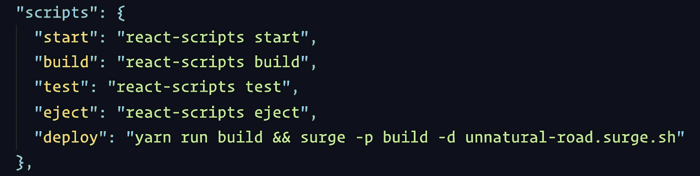****

****现在，我们所要做的就是运行一个简单的命令，在不到 20 秒的时间里，我们辉煌的项目就展现在所有人面前。****

****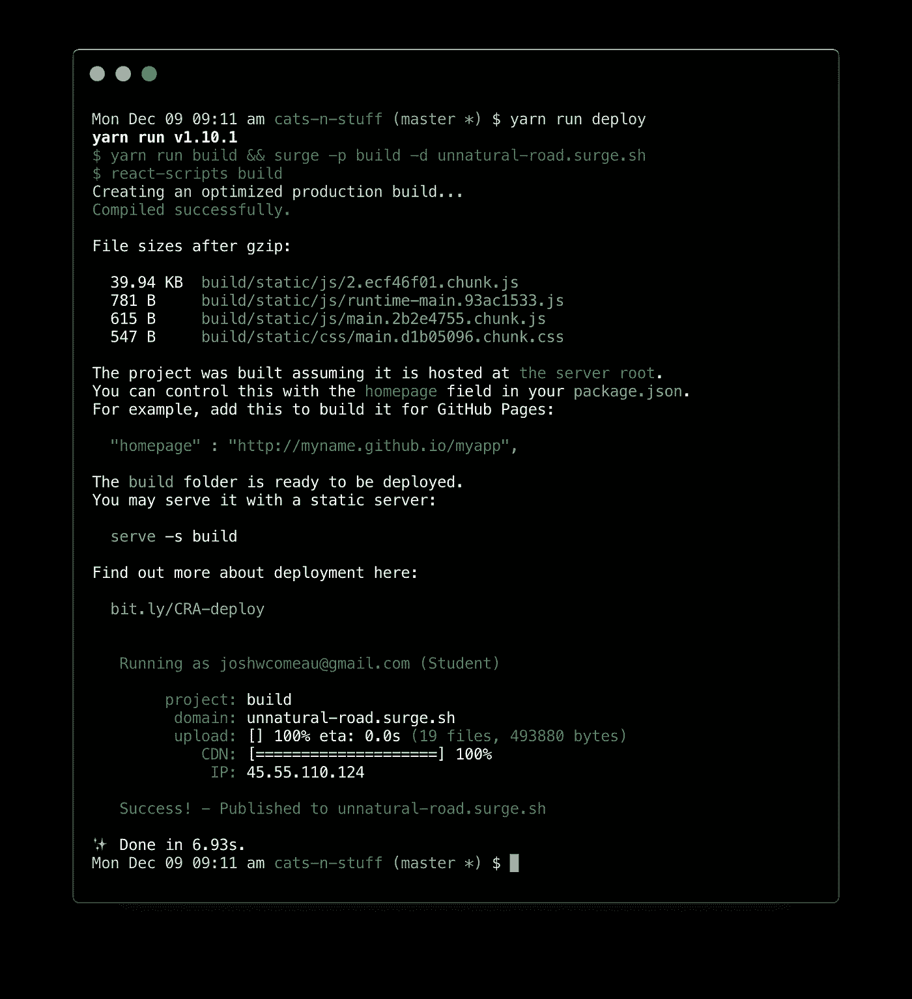****

## ****其他部署选项****

****Surge 是我发现的最快的在线获取项目的方式，但是还有很多选择。我真的很喜欢[Netlify](https://www.netlify.com/)——进行初始部署需要稍微多做一点工作，但它给了你大量的回报，包括免费的 SSL 证书和当你将代码推送到 GitHub 时的自动部署。****

# ****像盖茨比和 Next 这样的框架****

> ****声明:我为盖茨比工作！****

****React 应用程序因臃肿和性能差而臭名昭著。我认为这不太公平——React 做了很多开箱检查以确保其性能良好！—但是有一个不可否认的事实:默认情况下，React 应用程序在客户端完成所有的工作。****

****这意味着当您加载 React 应用程序时，初始的 HTML 文档是空白的，React 必须加载它需要的所有 JS，用户才能看到任何内容。****

****解决这个问题的一个常见方法叫做*服务器端渲染(SSR)* 。SSR 的思想是 HTML 文件可以在交付给用户之前构建。Javascript 仍将在浏览器中运行(否则，它就不是一个交互式应用程序)，但这个想法是用户不应该在这种情况下盯着白色屏幕。****

****create-react-app 是一个很好的入门选择，但是它真的非常简单；它为您提供了快速入门所需的开发工具，并且不碍事。在过去的几年中，已经出现了一些框架，它们提供了一系列额外的特性，同时仍然构建在 React 之上。****

## ****盖茨比（姓）****

****Gatsby 有时被宣传为“静态站点生成器”——它的用法类似于 Hugo 或 Jekyll。不过，它比那要强大得多！****

****Gatsby 在“编译时”构建你的所有 HTML 文件，当你构建你的站点时，而不是在“运行时”当用户想要使用它时。它非常快，因为不像服务器端的渲染，所有的工作在用户发出请求之前就已经完成了！****

****除了这个性能焦点之外，我们在 Gatsby 做了很多非常酷的事情，但是这超出了本文的范围。****

## ****然后****

****[下一个](https://nextjs.org/)建立在一个强大的理念之上:路由应该在文件系统中被镜像，就像 PHP 一样。您可以创建单独的组件来处理每条路线，这样在 your-domain.com/about/the-team*的 *pages/about/the-team* 的文件就可以到达。*****

****除了这个聪明的路由方案之外，Next 还提供了内置的服务器端渲染和自动代码分割，这两个强大的特性使包的大小保持较小，响应速度也很快。****

****《盖茨比》和《Next》都是构建“现实生活”项目的绝佳选择。如果你刚刚开始，坚持使用 create-react-app 可能是有意义的，直到你熟悉 react 的基本原理。****

# ****结论****

****新人对 React 有两种误解:****

*   ****建立一个像样的构建系统和开发环境需要很长时间。直到你花了*个小时*做好准备，你才能开始编写实际的应用程序代码。****
*   ****React 是创建基本 web 应用程序所需的工具集的一小部分，在开始之前，您必须学习许多其他的东西。****

****我希望我在反驳这些理论方面做得很好。您可以在几秒钟内开始*构建一个出色的前端 web 应用程序，并且您可以在没有任何额外依赖的情况下开始。*****

## ****附录:社区资源****

****到目前为止，React 开发者最受欢迎的社区中心是[**React flux**](https://www.reactiflux.com/)。这是一个会见 React 开发人员的好地方，如果你发现自己遇到困难或困惑，可以寻求帮助。****

****对我个人来说，Twitter 是了解 React 和认识社区的一个很好的来源。React 核心团队成员、Redux 的联合创始人丹·阿布拉莫夫(Dan Abramov)有一个 [**的大名单，可以关注**](/@dan_abramov/my-react-list-862227952a8c) 。****

> ****感谢阅读！****
> 
> ****我渴望听到你对这篇文章的反馈！我能做些什么让它对初学者更友好？在推特上让我知道[T21。](https://twitter.com/JoshWComeau)****