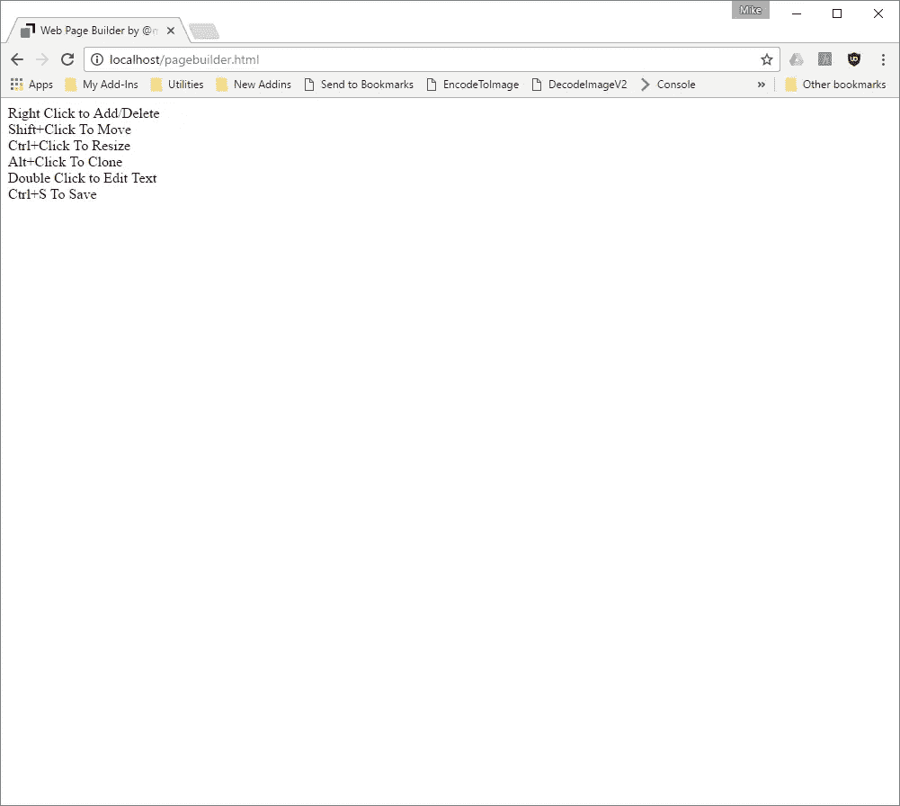
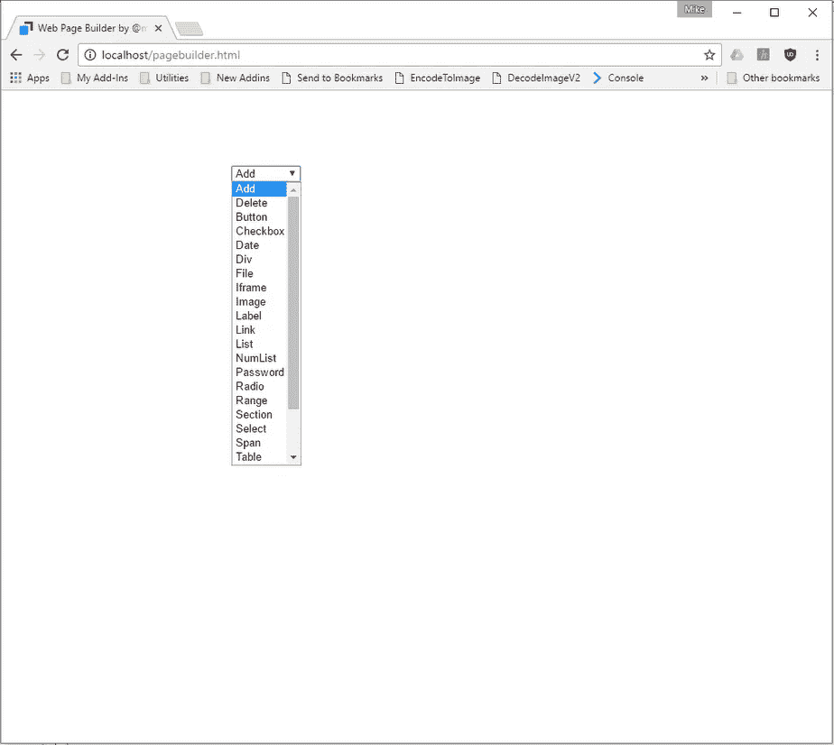

# 简单的有线框架/网页生成器在 2k gzipped。

> 原文：<https://medium.com/hackernoon/simple-wire-framer-web-page-builder-in-2k-gzipped-836017e2164e>

有时候你只需要一个快速而简单的方法来模拟一个 UI 原型！

我做这个是因为对现有的工具感到失望，这些工具要么太复杂，要么太费钱，要么需要成为 T2 的设计大师才能做一个屏幕模型。我想要一些我可以坐在客户或潜在客户面前即时制作的东西。我还想要一些可以用你自己的定制部件轻松扩展的东西。

这就是:

 [## @mikeptweet 的网页生成器

### 编辑描述

s3.amazonaws.com](https://s3.amazonaws.com/mparsons/PageBuilder.html) 

看起来是这样的:



说明很简单:

右键添加/删除
Shift+点击移动
Ctrl+点击调整大小
Alt+点击克隆
双击编辑文本
Ctrl+S 保存

右键单击界面会提供一个小部件下拉列表，您可以将它添加到页面中:



拖动鼠标时按住 ***SHIFT*** 键可以移动东西。

拖动鼠标时按住 ***CTRL*** 键可以调整大小。

按住 ***ALT*** 键，同时单击并拖动项目，即可复制或克隆内容。

像这样:

【https://s3.amazonaws.com/mparsons/PageBuilder.gif】

您可以通过双击任何文本来编辑文本。

您可以使用下拉菜单中的删除选项来删除内容。

您可以在 DIV 或 SPAN 中粘贴剪贴板中的 HTML 内容，也可以使用 IFRAME 元素粘贴更复杂的 HTML。

要直接编辑 HTML，请按 F12 打开浏览器开发工具并在那里进行编辑。

完成后，按下 ***CTRL+S*** 在本地保存您的页面(确保选择**网页完成**作为保存选项)。以这种方式保存网页还可以在保存的网页中提供完整的编辑环境，这样您就可以脱机工作或将网页发送给其他人进行更多的编辑。

# 添加您自己的小部件

只需使用 ***CTRL+S*** 选项保存页面，并使用您最喜欢的文本编辑器编辑文件。您需要向选项列表中添加一个项目，如下所示:

```
var options= {
  Add:"",
  Delete:"Delete",
  Button:"<button>Button</button>",
  Checkbox:"<input type=checkbox />",
  Date:"<input type=date />",
  Div:"<div>Div</div>",
  File:"<input type=file />",
  Iframe:"<table border=1><tr height='1%'><th>iframe</th></tr><tr><td valign=top><iframe frameBorder=0 height=100% width=100% srcdoc='<body contenteditable=true>paste stuff here'></iframe></td></table>",
  Image:"",
  Label:"<label>Label</label>",
  Link:"<a onclick='return false' href=#>Link</a>",
  List:"<ul><li>Item 1</li><li>Item 2</li></ul>",
  NumList:"<ol><li>First</li><li>Second</li></ol>",
  Password:"<input type=password />",
  Radio:"<input type=radio />",
  Range:"<input type=range />",
  Section:"<fieldset><legend>Section</legend></fieldset>",
  Select:"<select><option>Dropdown</option></select>",
  Span:"<span>Span</span",
  Table:"<table border=1><tr height='1%'><th>Col1</th><th>Col2</th><th>Col3</td></tr><tr><td>&nbsp;</td><td>&nbsp;</td><td>&nbsp;</td></tr></table>",
  TextArea:"<textarea>TextArea</textarea>",
  TextBox:"<input/>",
  Title:"<h1>Header</h1>",
  Video:"<video style='border:1px solid grey' controls></video>"
 };
```

您还可以通过修改 HTML 来编辑任何现有的小部件。此时，您只需编辑一个 HTML 页面，这样您还可以向页面添加自己的 CSS 样式和/或脚本。我希望不久能增加更多的功能来使这变得更容易。

这是一个早期的原型，我很想得到你对这篇文章或我关于黑客正午的其他文章的反馈！

[](/@mikeptweet) [## 迈克·帕森斯-中等

### 并可选择将其导出到剪贴板或 Excel、JSON、HTML、Tab 或逗号分隔的文件格式！在较早的时候…

medium.com](/@mikeptweet) 

谢谢，如果你觉得这篇文章有用，请推荐！

[](http://bit.ly/HackernoonFB)[](https://goo.gl/k7XYbx)[](https://goo.gl/4ofytp)

> [黑客中午](http://bit.ly/Hackernoon)是黑客如何开始他们的下午。我们是 [@AMI](http://bit.ly/atAMIatAMI) 家庭的一员。我们现在[接受投稿](http://bit.ly/hackernoonsubmission)，并乐意[讨论广告&赞助](mailto:partners@amipublications.com)机会。
> 
> 如果你喜欢这个故事，我们推荐你阅读我们的[最新科技故事](http://bit.ly/hackernoonlatestt)和[趋势科技故事](https://hackernoon.com/trending)。直到下一次，不要把世界的现实想当然！

