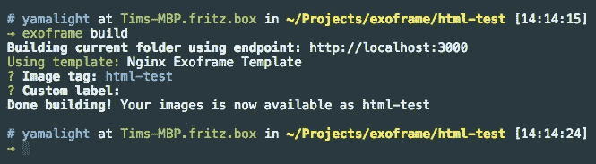
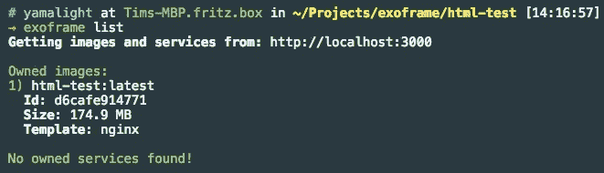
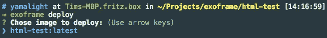
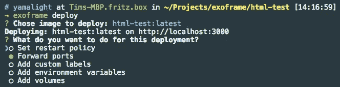
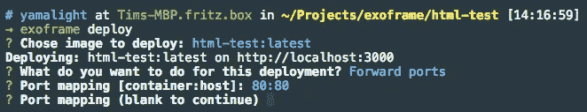
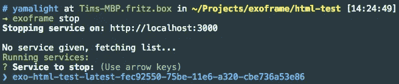
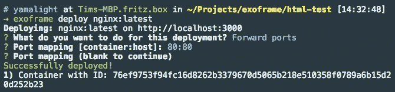

# 使用 Exoframe 简化 Docker 管理

> 原文：<https://medium.com/hackernoon/simplifying-docker-management-with-exoframe-9275e92c7406>

Docker 是一个[惊人的](https://medium.freecodecamp.com/a-beginner-friendly-introduction-to-containers-vms-and-docker-79a9e3e119b#.111rlevmh)工具。它可以帮你[设置自托管 PaaS](/@RemindEng/introducing-empire-a-self-hosted-paas-built-on-docker-amazon-ecs-7f8beb7f6ae4) 、[扩展事物](/@andrewmclagan/you-thought-laravel-homestead-was-easy-say-hello-to-docker-2c0639a0501#.z53ssycbo)、做 [Android CI](/@Malinskiy/android-ci-with-docker-a2f522086640) 甚至[开发物联网](/google-cloud/developing-for-arduino-with-docker-and-johnny-five-on-osx-cc6813ae6e9d#.k6xwqu87h)。
但是即使 Docker 是一个很棒的工具，它也有自己的问题。

首先——没那么好用。主要是因为在几乎每一步中你都可以使用很多不同的标志。即使在过去几年里每天都使用它，我仍然必须打开手册来记住如何正确地转发端口或如何设置资源限制。

然后是设置身份验证、访问控制以及图像和运行容器的所有权的挑战。现在你可以使用 Docker 插件来设置授权，但是这并不简单。它也没有给你一个定义所有权的方法。当然，您可以使用标签或安全选项来设置用户。但是你必须手动操作。

如果你知道如何使用 Docker。
在[我们的研究小组](http://aksw.org/)中，我们最近决定将我们所有的演示和服务迁移到 Docker。事实证明，教人们 Docker 是什么以及如何正确使用它是相当困难的。更难的是让每个人都设置正确的标签和安全选项，以确保管理员知道，例如，谁对引起麻烦的容器负责。

因此，我着手创建一种更好、更简单的 Docker 工作方式。

**更新:** [Exoframe beta 出了](https://hackernoon.com/introducing-exoframe-beta-self-hosted-alternative-to-now-sh-80643f96b84b)！更简单、更快速、更小巧，一如既往地人性化。

# 认识 exo frame——码头集装箱的动力装甲

Exoframe 背后的想法非常简单——帮助用户以简单直观的方式用尽可能少的配置解决上述问题。算是吧，给你一种方法，把它当作动力装甲来移动那些沉重的码头集装箱。

Exoframe 由两部分组成: [Exoframe 服务器](https://github.com/exoframejs/exoframe-server)和 [Exoframe CLI](https://github.com/exoframejs/exoframe) 。

Exoframe server 安装在您要用于部署的远程服务器上的 Docker 旁边。它本质上是作为 [Docker remote API](https://docs.docker.com/engine/reference/api/docker_remote_api/) 的智能代理，具有认证、访问控制和所有权特性。

Exoframe CLI 安装在您的本地机器上，用于所有常见的 Docker 任务，如使用 Exoframe 服务器 API 构建和部署映像。

## 外部框架服务器设置

首先，你需要设置 Exoframe 服务器。
因为您的服务器应该已经运行了 docker，所以很容易做到:

```
docker run -d \
  -p 3000:3000 \
  -v /var/run/docker.sock:/var/run/docker.sock:ro \
  -v /path/to/exoframe-folder:/root/.exoframe \
  exoframe/server
```

这将启动一个外部框架服务器，将端口 3000 转发到您的主机，并初始化默认的外部框架服务器配置。
确保导航到 */path/to/exoframe-folder* 并调整 *server.config.yml* 中的用户名和密码，因为默认的 admin:admin 对并不完全安全::
您还可以配置其他服务器验证插件(例如 LDAP 或您的其他公司用户数据库)，这些插件可用于替代基于配置的用户列表。

完成了。服务器可以工作了！

## Exoframe CLI 设置

接下来，您需要在本地机器上设置 Exoframe CLI。
由于 Exoframe 是使用 Node.js 编写的，所以您需要安装 Node.js (v6 或更高版本)。一旦有了它，只需执行 npm install 命令来获得 Exoframe CLI:

```
npm install exoframe -g
```

安装完成后，您可以使用以下命令指定您的服务器端点:

```
exoframe endpoint [http://your.server.url](http://you.server.url):3000
```

然后执行“ *exoframe 登录*”在服务器上进行身份验证，您就可以开始了！

## 构建和部署一个示例项目

现在让我们看看它的实际效果！
我们将创建、构建和部署一个简单的静态 HTML 项目。
您可以在 asciinema 上的一个简单截屏中找到以下解释的所有步骤:

[](https://asciinema.org/a/85154) [## Exoframe 简短演示

### 用于部署 Node.js 项目的 Exoframe.js 命令行界面的简短演示。Exoframe 打算做所有繁重的…

asciinema.org](https://asciinema.org/a/85154) 

首先，创建一个新文件夹，并添加一个新的 index.html 文件，该文件包含一些内容，例如:

然后，执行" *exoframe build* "并为你的图像选择一个名字(或者保持默认的名字):



Exoframe build command output

此时，Exoframe 将自动检测项目类型，并为其选择一个合适的 docker 文件。由于我们只有一个*index.html*文件，Exoframe 认为它可能适合基本的 Nginx 图像。
这个检测是使用模板引擎完成的。模板是简单的 Node.js 包，它提供了一组方法来检测项目是否适合它们，忽略文件，添加特定类型的标签，并在需要时要求用户进行额外的输入。模板的输出是一个完整的 Dockerfile 文件，用于构建项目。
你可以在 GitHub 上找到这个[案例中使用的 Nginx 模板的例子。](https://github.com/exoframejs/exoframe-template-nginx)

构建完成后，您可以使用" *exoframe list* "命令获得您拥有的映像和服务的列表:



Exoframe list command output

现在，您已经构建了一个新的映像，让我们来部署它。
只需执行“ *exoframe deploy* ”，您将获得可部署的映像列表，无需记住所有映像名称:



Exoframe deploy images selection

一旦您选择了您想要部署的映像，Exoframe 将询问您在部署期间到底想要做什么—您想要转发端口、指定重启策略等吗？



Exoframe deploy feature selection

在这种情况下，我们只想转发端口，所以这就是上面截图中选择的内容。点击 enter 后，Exoframe 将为您提供额外的输入，引导您完成所有选定的操作，例如，端口输入如下所示:



Exoframe deploy port mapping example

注意，Exoframe 向您内联显示了端口映射应该是什么样子，以及哪个端口在容器内部和主机上。如您所见，它还允许您映射多个端口。

按 enter 键后，您将看到一条消息，说明映像已成功部署。现在，您可以在一个列表中看到您的新服务，在使用“*外框架列表*之前，我们已经调用了该列表:


Exoframe list with full info about running service

如您所见，该列表现在包括正在运行的 *html-test* 服务及其完整信息——转发的端口、状态、模板、名称。
如果您在 [http://your.domain](http://your.domain) 打开浏览器，您应该会看到您创建的静态 HTML。

既然您已经看到了该服务的工作原理，让我们停下来删除它。
您可以使用“ *exoframe stop* ”命令停止您正在运行的服务，使用“ *exoframe rm* ”命令删除已停止的服务。同样，如果您不提供服务名称，您不需要记住服务的名称——exo frame 会为您提供一个交互式列表:



Exoframe stop command example

Exoframe 还提供了一种与来自注册表的图像进行交互的方式。
使用“*外框架拉<图像>* ”将从 docker 注册表中拉出给定的图像。
然后，您可以通过执行“ *exoframe list public* ”命令获得所有本地可用注册表映像的列表:


Exoframe registry images list

从注册表部署映像可以通过执行带有附加映像参数的 deploy 命令来完成，例如:



Exoframe deployment of registry image

之后，运行中的服务可以用如上所示的相同方式进行管理。

# 结论

Exoframe 仍处于 alpha 阶段，有些地方还缺少一些功能。但是我已经用它在我自己的服务器上管理和部署了一组演示，这让我的生活变得轻松多了。

[Exoframe 现已在 GitHub](https://github.com/exoframejs/exoframe) 上线。免费。麻省理工学院许可的。
非常感谢您的任何反馈。

[](http://bit.ly/HackernoonFB)[](https://goo.gl/k7XYbx)[](https://goo.gl/4ofytp)

> [黑客中午](http://bit.ly/Hackernoon)是黑客如何开始他们的下午。我们是 [@AMI](http://bit.ly/atAMIatAMI) 家庭的一员。我们现在[接受投稿](http://bit.ly/hackernoonsubmission)并乐意[讨论广告&赞助](mailto:partners@amipublications.com)机会。
> 
> 如果你喜欢这个故事，我们推荐你阅读我们的[最新科技故事](http://bit.ly/hackernoonlatestt)和[趋势科技故事](https://hackernoon.com/trending)。直到下一次，不要把世界的现实想当然！

[](https://goo.gl/Ahtev1)