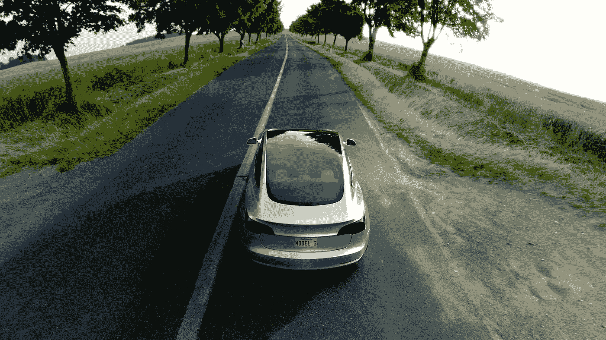

# 简化特斯拉

> 原文：<https://medium.com/hackernoon/simplifying-tesla-d816353413db>

在特斯拉[年度股东大会](https://www.theverge.com/2017/6/6/15750228/elon-musk-tesla-model-3-model-y-twitter-red-wine)上，埃隆·马斯克承认在推出早期车型时有一些失误。

“我认为实际上我们在试图从 Model S 平台衍生 Model X 时犯了一个错误，”他说。“按照 SUV 的设计方式来设计 SUV，按照轿车的设计方式来设计轿车，会更好。否则，你只是想把一些没有意义的东西硬塞进去。”

如果马斯克有一台时间机器，他不仅会从头开始打造 Model X，还会简化产品。

“我们在 X 上犯了一个大错误，这主要是我的责任——从一开始就有太多的复杂性。那是非常愚蠢的。。。它有太多很酷的东西，应该在第二版、第三版中推出。”

Model 3 的产量将比更早、更贵的型号高得多。为了应对制造业的增长，早期客户将被限制在少数几个选项上，比如颜色和车轮。

特斯拉的核心优势是其直接面向消费者的模式，其成功的全电动平台，以及不仅对环境更好，而且驾驶乐趣和外观都很棒的汽车。随着时间的推移，我们可能会看到特斯拉利用这些优势，而不是提供大量的额外选择。