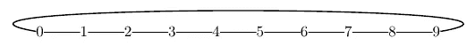
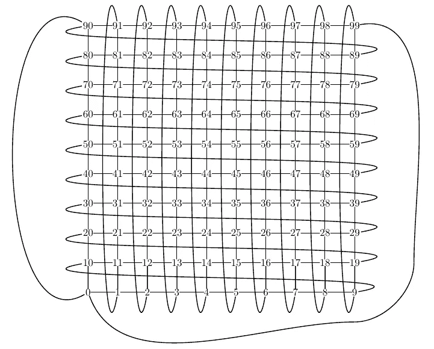

# 模拟拥有 1000 万用户的分散式闪电网络

> 原文：<https://medium.com/hackernoon/simulating-a-decentralized-lightning-network-with-10-million-users-9a8b5930fa7a>

Jonald Fyookball 最近的一篇帖子声称给出了数学证明，闪电网络(LN)不可能很大，而且仍然是分散的。鉴于 [Murch 的回应](/@murchandamus/i-have-just-read-jonald-fyookballs-article-https-medium-com-jonaldfyookball-mathematical-fd112d13737a)，Jorge Stolfi 教授发布了以下[挑战](https://www.reddit.com/r/btc/comments/6jxem4/responding_to_murchs_responding_to_jonald):

> 有一个非常简单的方法来关闭像乔纳森和我这样的批评。只需为 1000 万用户提供一个具有拓扑结构和数量的假设场景——有多少客户、商家和枢纽，每对用户类别有多少渠道和每个用户的支付(每天或每月),以及每个用户向其渠道承诺多少[比特币](https://hackernoon.com/tagged/bitcoin)等。任何怀疑 LN 可行性的人都可以用这些数据进行模拟，然后自己得出结论。有人愿意接受这个挑战吗？

我决定接受这个挑战。为了强调 LN 可以去中心化，假设的拥有 1000 万用户的[网络](https://hackernoon.com/tagged/network)以所有用户都相同的方式来描述:所有用户都有相同数量的渠道，最初由相同数量的比特币资助。“客户”、“商家”或“枢纽”之间没有区别。特别是，每个用户有 14 个开放频道，最初用 0.01 比特币资助。图表的结构描述如下。

我还编写了 ocaml 代码来为这样一个拥有 1000 万用户的闪电网络提供一个基本的模拟。有 11 种不同的费用政策平均分配给用户。在模拟的每一步，随机选择两个用户，其中一个试图向另一个付款。付款可能是“大的”(0.001 到 0.009 btc 之间，几美元)，“中等大小的”(0.00001 到 0.001 btc 之间，大约 2 美元或更少)，也可能是“微的”(小于 0.00001 btc，大约 2 美分或更少)。该代码搜索一条便宜的路线，如果找到一条，就尝试付费。模拟器假设路由中的节点有 0.1%的机会变得不合作，在这种情况下，请求避开该节点的新路由(最多 5 次重试)。下面我们报告对 400，000 次支付尝试运行模拟的结果。

# **拥有 1000 万用户的网络拓扑**

第一个挑战是想象一个有 1000 万个节点(用户)和足够多的边(通道)的图，这样每个节点都可以从其他节点到达，具有足够的冗余，没有中心化。我们还有一个限制，即每个渠道都必须有一定数量的比特币。

我们认为节点集是从 0 到 9，999，999 的自然数。

边的第一种可能性是使用从 0 到 9，999，999(需要 24 位)的数的二进制表示，并且每当两个位序列相差恰好 1 位时包括一条边(汉明图)。所有节点都可以通过最多 24 跳，平均 12 跳的(许多)路径到达。然而，将会有大约 2 亿个频道。如果两个用户都用 0.01 个比特币资助每个通道，那么 400 万个比特币将被锁定在 LN 支付通道中。虽然这在技术上是可能的，但似乎太不现实了。

基于汉明图给出的思想，我们可以考虑节点的 10 进制表示。首先考虑网络中只有 10 个节点的可能性。在这种情况下，我们可以在模 10 相差 1 的节点之间包含一条边。

A trivial network with 10 users

这个“网络”是连接的，但冗余很少。每个节点都有两条边，并且从所有其他节点都可以通过两种方式到达。从一个节点到另一个节点的最短路径最多有 5 跳。

接下来考虑网络中有 100 个节点。在这种情况下
,我们可以包括模 100 相差 1 或模 100 相差 10 的节点之间的边。

A connected network with 100 nodes and many paths

这里每个节点正好有 4 个连接，从一个节点到另一个节点有许多路径，提供了大量冗余。每个节点可在 10 跳内到达，平均 5 跳。

跳到具有 1000 万个节点的情况，每当节点相差 10 的幂的 *n* (对于 *n* =0，…，6)模 1000 万时，我们包括一条边。每个节点将正好有 14 条边，对应于 LN 中的每个用户有 14 个开放信道。由于每个信道涉及 2 个用户，因此网络中总共有 7000 万个开放信道。假设每个用户用 0.01 个比特币资助每个通道，要求用户在 LN 个通道中锁定 0.14 个比特币。对于 1000 万用户，这需要 140 万个比特币参与 LN。这仍然有些异想天开，但比上面的汉明图所要求的 400 万更现实。(对于更现实的场景，用户数量可能应该限制在最多 100 万。)每个节点都可以通过最多 35 跳的路径从其他节点到达，平均 17.5 跳。

# **模拟 40 万次支付尝试**

这里我们描述了模拟 400，000 次尝试支付后的网络状态。这些付款在随机用户之间具有随机值，分布在大额付款(0.001 至 0.009 btc)、中型付款(0.00001 至 0.001 btc)和小额付款(少于 0.00001 btc)之间，大约三分之一的付款属于这三类。

在 400，000 次尝试支付后，大约一半的用户(5，049，576)参与了支付途径，10%的渠道(7，091，810)用于支付途径。

在某些情况下，路由请求超时(时间限制为 1 秒)，导致路由失败。这种情况发生在 4，500 起案件中(在 400，000 次尝试付款中仅占 1%多一点)。更仔细地看，小额支付更容易出现路由失败。这大概是因为小额支付在接受路线方面更具限制性，以避免费用过高。请求路由时的最高费用总是 0.00001 btc (10 位)或被转移价值的 5%，以较高者为准。

以下是三种支付方式的具体数字:

尝试了 133，865 次“大额”支付(介于 0.001 和 0.009 之间)。只有 8 个失败了。成功支付的中间跳数为 18，中间总费用(整个路线)为 3 位(0.000003 btc)或转账金额的 0.06%。

尝试了 132，734 次中等规模的支付，其中 1031 次(0.8%)失败。对于成功的支付，跳数的中间值是 18，总费用的中间值是 2 比特(0.000002 btc)或转移价值的 0.5%。

尝试了 133，401 次小额支付，其中 3461 次(2.6%)失败。对于成功的支付，跳数的中间值是 19，总费用的中间值是 2 比特(0.000002 btc)或转移价值的 32%。

Fyookball 在他的[第一篇文章](/@jonaldfyookball/mathematical-proof-that-the-lightning-network-cannot-be-a-decentralized-bitcoin-scaling-solution-1b8147650800)中指出的一个可能的问题是，通道将变得不平衡，这样它们在路由期间只能在一个方向上使用。在模拟中，信道确实开始变得不平衡。在用于路由的 700 万个渠道中，近 400，000 笔成功支付中的 294，508 笔(4%)在渠道的一端具有 90%或更多的价值。这似乎还不是一个问题，因为这仍然只占 7000 万个可用频道总数的 0.4%，但随着模拟器的长时间运行，这可能会成为一个问题。如果这是一个问题，人们会认为它会增加大额支付的失败，因为它会比小额支付更多地限制大额支付的可能路径。然而，不平衡信道也可能不会造成问题，因为有大量的替代路由(包括，如默奇[指出的](/@murchandamus/i-have-just-read-jonald-fyookballs-article-https-medium-com-jonaldfyookball-mathematical-fd112d13737a)，在另一个方向专门使用不平衡信道的路由)。

# **模拟器如何改进**

[模拟器](https://github.com/dianerey/lnsim)相对较慢，运行时间越长，需要的内存越多。这 400，000 笔付款的模拟花费了几个小时，在达到 500，000 笔付款之前，该流程就终止了。该代码可用于那些拥有更强大硬件的人想要更长时间运行模拟器的情况。

除了效率问题之外，模拟还可以在许多方面进行改进，使其更加真实。例如，模拟可以扩展到模拟通道的打开和关闭。此外，假设频道的数量和频道的资金随用户而变化会更现实。

# **结论**

我们给出了一个拥有 1000 万用户的闪电网络的结构，它没有集中的集线器。事实上，每个用户都拥有与所有其他用户完全相同的连接和资金。虽然这不是闪电网络在现实世界中的预期发展，但它确实表明了拥有这样一个网络在技术上是可能的。此外，我们给出了代码来模拟在网络中进行支付。一次相对较短的运行(尝试 400，000 次支付)显示，支付成功率为 99%，小额支付的失败频率高于大额支付。

> [黑客中午](http://bit.ly/Hackernoon)是黑客如何开始他们的下午。我们是 [@AMI](http://bit.ly/atAMIatAMI) 家庭的一员。我们现在[接受投稿](http://bit.ly/hackernoonsubmission)，并乐意[讨论广告&赞助](mailto:partners@amipublications.com)机会。
> 
> 如果你喜欢这个故事，我们推荐你阅读我们的[最新科技故事](http://bit.ly/hackernoonlatestt)和[趋势科技故事](https://hackernoon.com/trending)。直到下一次，不要把世界的现实想当然！

