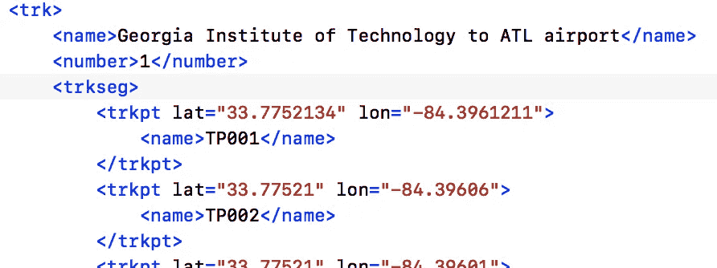
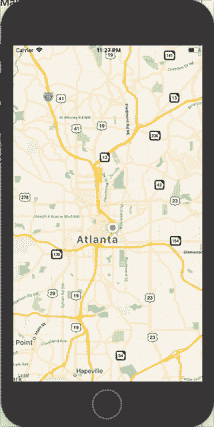

# 在没有 Xcode 的 iPhone 上模拟用户位置和导航路线。

> 原文：<https://medium.com/hackernoon/simulating-user-location-and-navigation-route-on-iphone-without-xcode-761f06905f1c>

# **问题陈述:**

最近，作为围绕用户位置的某些个性化界面的概念验证的一部分，我们意识到展示该功能的最佳方式是模拟用户的旅程。在 iPhone 上。没有任何电缆连接到一个 [Xcode](https://hackernoon.com/tagged/xcode) 实例。*因此，我们着手弄清楚* ***模拟*** *用户位置和* ***用户从 A 点到 B 点的旅程需要什么，在实际设备上按需进行，而不使用 Xcode 来模拟位置*** *。*

# 第一步:GPX 档案

合理的步骤是首先设置要模拟的路线。最简单的方法[是在谷歌地图上获取方向，然后在这里将其转换为. gpx 文件](https://mapstogpx.com/)。如果您正在模拟导航路线，请确保您选择了跟踪点选项。

创建的 gpx 文件如下所示:

a sample gpx file showing trackpoints!

将这个 gpx 文件保存到您的 XCode 项目中，供以后使用。

# 第二步:GPX 解析器

下一步是能够将这个 gpx 文件解析为 CLLocation 结构的集合，然后可以对其进行模拟。以下要点说明了如何做到这一点。

负责调用 GpxParser 的类也符合 GpxParsing 协议，该协议允许它在解析完成后继续进行。这个解析的输出是一个队列<cllocation>。实现一个[队列](https://en.wikipedia.org/wiki/Queue_(abstract_data_type))应该很简单(或者说是一个很好的练习:)。</cllocation>

a gpx parser implementation

# 3.MockCLLocationManager

*CLLocationManager* (来自 *CoreLocation* 模块)是一个主类，它为一个 [iOS](https://hackernoon.com/tagged/ios) 应用程序提供所有位置特定的功能。如果您正在编写一个位置感知应用程序，您将实现一个 CLLocationManager。如果您使用 MKMapView 来显示地图，MKMapView 将在内部依赖 CLLocationManager 来提供位置细节。因此，对于我们来说，使用解析的 gpx 文件位置创建一个 MockCLLocationManager 和模仿 CLLocationManager 并每隔一段时间服务它们是有意义的。

MockCLLocationManager 提供了一些 sugar 方法，比如使用 gpx 文件名的 startMocks，或者停止它。

# 4.好吧，那现在有什么计划？

概括地说，我们现在有能力将路由表示为 CLLocation 结构的队列。我们也有能力模仿 CLLocationManager 和模仿位置的变化。我们现在需要做的就是将所有对 CLLocationManager 的请求重定向到这个 MockCLLocationManager。

听起来很简单。但是怎么做呢？

一个字: **Swizzling** ！

NSHipster 有一个[优秀的博客](http://nshipster.com/method-swizzling/)解释 swizzling。简单地说，它是一种在运行时改变类(特别是它的方法)行为的方法。想法是，每当运行时试图访问 CLLocationManager 时，我们的方法(我们已经“swizzled ”)在 MockCLLocationManager 上执行相同的操作，并调用适当的委托，以便调用者获得所请求的位置。

在 DLAppDelegate 中，通过调用 CLLocationManager.classInit 来完成重组(这是您将检查调试或生产版本的地方)。

说够了。要点如下:

*有人可能会争辩说，为什么 Swizzle 不只是使用 MockCLLocationManager 实例呢？*。这种方法有两个问题。它不会帮助在 MKMapView 上模拟位置更新，因为它使用 CLLocationManager 的内部实例(谢谢苹果！:| ).其次，我们只有一个位置来切换这种行为。老实说，你甚至不想意外地将这些代码发布到产品中！

# 我猜你已经搞定了。

词。

下面是视图控制器的要点。你会发现没有任何嘲笑的痕迹。

下面是实际运行的代码！

## 感谢您的阅读！如果你喜欢这篇文章，请分享/推荐。如果没有，请评论/批评，这样我可以改进和学习更多！:)