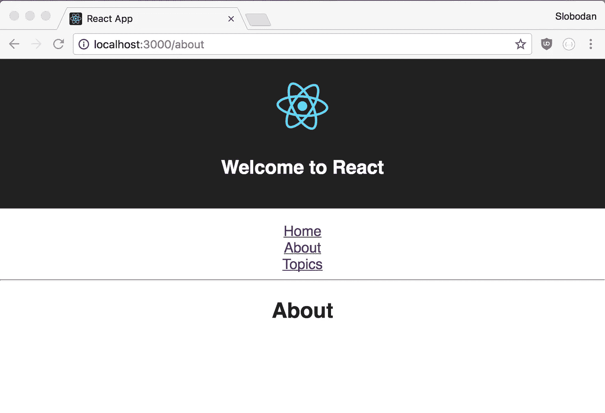
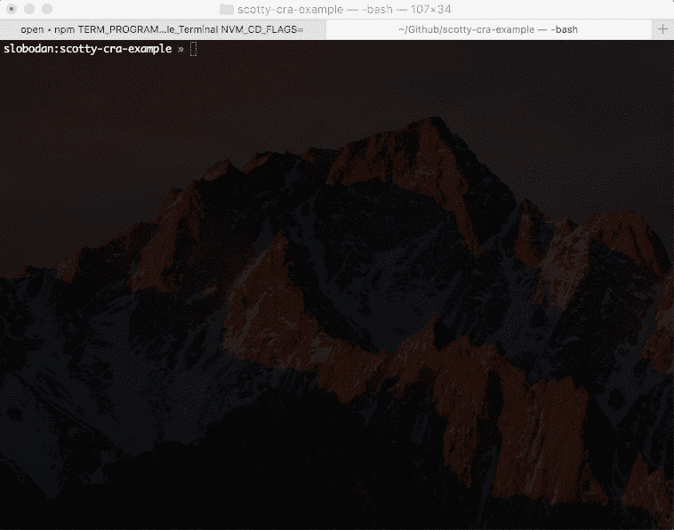
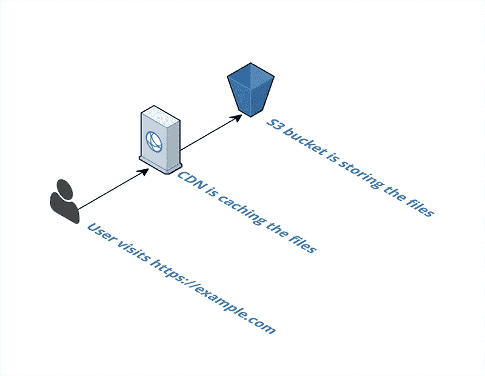

# 单页面应用的单命令部署

> 原文：<https://medium.com/hackernoon/single-command-deployment-for-single-page-apps-29941d62ef97>

开发一个单页面的应用程序是很难的。从一开始，您就需要做出许多决定——比如选择一个框架、设置文件夹结构、配置 linter 等等。

这些任务中的一些更容易，因为围绕你最喜欢的框架和 web 开发的工具生态系统。例如，像 [Create React App](https://github.com/facebookincubator/create-react-app) 、 [Angular CLI](https://cli.angular.io) 和 [Create Choo App](https://github.com/choojs/create-choo-app) 这样的工具会帮助你在几秒钟内设置好你喜欢的框架。


Photo by [Jonatan Pie](https://unsplash.com/photos/3l3RwQdHRHg?utm_source=unsplash&utm_medium=referral&utm_content=creditCopyText) on [Unsplash](https://unsplash.com/?utm_source=unsplash&utm_medium=referral&utm_content=creditCopyText)

通常，当您开始新项目时，您甚至没有足够的时间来考虑部署。在某些时候，你需要公开你的应用程序，因为你想把它展示给你的客户、朋友，或者在你找第一份工作的时候把它添加到你的文件夹中。

但是，如何快速选择部署应用程序的最佳位置呢？部署工具也有很多。如果你用一些新的闪亮的东西，它会为生产规模，或者你会被迫作出另一个决定改变它吗？你可以使用 Github 页面，但是你需要的服务人员的 HTTPS 呢？

亚马逊提供了一些可以扩展的东西，结合了用于静态网站托管的 [*简单存储服务*](https://aws.amazon.com/s3/)*【S3】*和作为 CDN 的*[*CloudFront*](https://aws.amazon.com/cloudfront/)是一种廉价但可扩展的方式来交付你的单页应用。虽然这两个也需要一些时间来准备，如果你不熟悉亚马逊网络服务，甚至需要更多时间。*

*不过，还有一种更简单的方法——引入 Scotty.js ，这是一个简单的 CLI 工具，可以帮助你用一个命令将你的网站或单页应用部署到亚马逊 S3 和 CloudFront。*

# *把我传送上去，斯科特*

*Scotty 背后的主要思想是用一个命令将你的静态网站或单页应用程序部署到亚马逊生态系统。*

*它将部署你的静态网站，设置 HTTPS 的 CDN，甚至在一分钟左右的时间内将网站 URL 复制到你的剪贴板，这取决于你的互联网速度和网站/应用程序的大小。*

*对于单页应用程序，它还将配置重定向，因此 *pushState* 可以开箱即用。*

**

*Beam me up, Scotty*

*让我们通过一个简单的 React 应用程序来看看它的运行情况。*

# *创建 React 应用*

*在部署之前，我们需要应用程序，所以让我们使用 Create React App 创建一个简单的应用程序。*

*首先，通过从终端运行`create react app`命令创建一个示例应用程序:*

```
*create-react-app scotty-cra-example*
```

*如果你没有安装 create-react-app 命令，你可以从 https://www.npmjs.com/package/create-react-app 的 NPM 这里得到它:。*

*或者，如果您使用的是 NPM v5，您可以运行 Create React App 命令，而不用使用新的`npx`命令全局安装它:*

```
*npx create-react-app -- scotty-cra-example*
```

*了解更多`npx`在这里:[https://medium . com/@ maybe Katz/introducing-npx-an-NPM-package-runner-55 f 7d 4 BD 282 b](/@maybekatz/introducing-npx-an-npm-package-runner-55f7d4bd282b)。*

*让我们添加 [React 路由器](https://reacttraining.com/react-router/)来演示推状态支持是如何工作的。为此，请输入您的新项目并安装 React Router 作为依赖项:*

```
*cd scotty-cra-examplenpm install react-router-dom --save*
```

*现在一切都已安装完毕，让我们将 React Router 添加到项目中——在您最喜欢的编辑器中打开“src/App.js”文件，并将其更新为 React Router 的基本示例([https://reacttraining.com/react-router/web/example/basic](https://reacttraining.com/react-router/web/example/basic)):*

*[React Router basic example](https://reacttraining.com/react-router/web/example/basic)*

*现在，如果您使用`npm start`启动您的应用程序，它应该可以工作，看起来与这张截图类似:*

**

*Basic React app with React Router on localhost*

*是时候使用`npm run build`节点脚本来构建你的应用了。这将在项目的根目录下创建一个名为“build”的文件夹。*

# *部署应用程序*

*首先运行以下命令，将 NPM 的 Scotty.js 作为一个全局包安装:*

```
*npm install scottyjs -g*
```

*Scotty 的先决条件是:*

*   *带有 NPM 的 Node.js (v4+)*
*   *[AWS](https://hackernoon.com/tagged/aws) 账户*
*   *AWS 凭据—设置教程:[http://docs . AWS . Amazon . com/CLI/latest/user guide/CLI-chap-getting-started . html](http://docs.aws.amazon.com/cli/latest/userguide/cli-chap-getting-started.html)*

*然后只需运行以下命令:*

```
*scotty --spa --source ./build*
```

*这个命令告诉 Scotty 您的应用程序是单页应用程序(SPA ),并且您的项目的源代码在“build”文件夹中。*

> *Bucket 名称对所有用户都是全局的，这意味着您需要为您的应用程序想出一个唯一的名称——重用“scotty-cra-example”是行不通的。*

*从您的终端运行此命令将部署应用程序，并为您提供两个 URL，如下所示:*

**

*第一个，也添加到您的剪贴板，是一个到 AWS S3 的 HTTP 链接。第二个是同样支持 HTTPS 的 CloudFront URL。*

## *CDN 和 HTTPS*

*Scotty 将在 CloudFront CDN 上设置您的项目，这意味着它将被缓存并分发到不同的区域以减少延迟。*

*它还将免费设置 HTTPS，因此您的应用程序将随时可供服务人员或任何需要安全连接的人使用。*

> *直播 app:[https://d1reyqfbyftmjg.cloudfront.net](https://d1reyqfbyftmjg.cloudfront.net)*

# *它是如何工作的*

**

*斯科特背后没有魔法。它在幕后使用了 Node.js 的 AWS SDK。*

*首先，它检查您是否已经有一个默认区域。不幸的是，AWS 没有通过 AWS SDK 给我们一个默认区域。Scotty 有一个小型的 LevelDB 数据库来存储这些信息。如果该区域不存在并且没有提供，Scotty 会要求您选择它。*

*下一步是创建一个 bucket。如果没有提供 bucket name，Scotty 将使用当前文件夹的名称。请记住，bucket 名称对于所有用户都是全局的，因此，您需要为您的 bucket 取一个唯一的名称。*

*创建 bucket 后，Scotty 将使用 AWS SDK 将您的项目上传到 AWS S3。如果没有提供源标志，当前文件夹将被用作源。*

*最后一步，如果你的项目是一个网站或单页应用，Scotty 将在 HTTPS 的支持下建立 CloudFront CDN。SPA 和 website 的区别在于，Scotty 将所有不存在的页面重定向回 index.html，这使得 pushState 可以开箱即用。*

*下一步是什么？*

*试试 Scotty，让我知道有什么可以改进的地方。很高兴收到拉取请求，因为欢迎新功能和改进。*

> *Github 库:【https://github.com/stojanovic/scottyjs *

*Scotty 目前的想法是只为 AWS 保留一个小库，但这并不意味着它不能改变。*

*但是，还缺少一些东西，比如设置自定义域名和配置文件以便于协作。*

*希望你会喜欢👽*