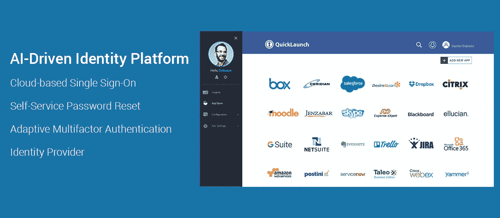
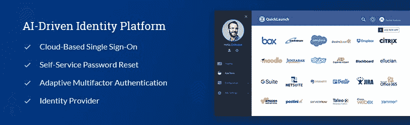
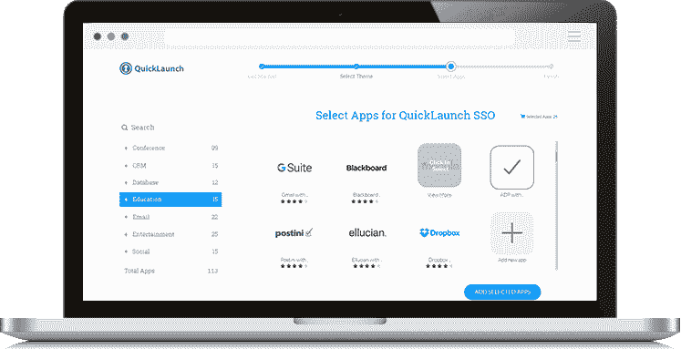
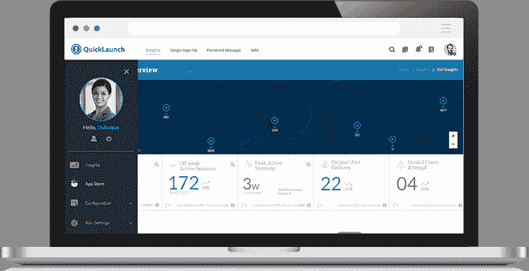

# 只需点击一个按钮，即可从任何设备单点登录到您的所有应用程序

> 原文：<https://medium.com/hackernoon/single-sign-on-from-any-device-to-all-of-your-applications-with-the-click-of-a-button-93dc0bcb9cb0>

[**QuickLaunch**](http://www.quicklaunchsso.com/) 是一个基于云的自助式身份即服务(IDaaS)应用程序集成平台，帮助企业和机构在其应用程序和设备之间建立安全连接，而不考虑其集成协议，例如 LDAP 集成应用程序、安全 Web 身份验证、支持 CAS/SAML/OAUTH 的应用程序。它的单点登录市场有 2000 多个预集成的应用程序，提供了对最常见的企业系统的现成集成，以及对所有应用程序的单一注销支持系统，从而增强了整体 IT [安全性](https://hackernoon.com/tagged/security)。

[**凯文·威廉·大卫**](https://twitter.com/kwdinc) 采访了 [**萨姆·桑德哈尔**](https://www.linkedin.com/in/sai-sundhar-padmanabhan-2159a531/)[**快速启动**](https://siftery.com/quicklaunch) 营销副总裁，了解更多信息。

## 嗨，Sam，请告诉我们有关快速启动的情况。

QuickLaunch 是一个领先的身份平台，是机构、组织和政府机构解决身份和访问相关挑战的一站式解决方案。它是智能的、人工智能驱动的，已帮助数千个组织的数百万用户获得智能授权访问，从而帮助他们通过无缝、简化的访问管理充分利用其 It 资源。

QuickLaunch 是一个身份平台，提供多种功能，如**单点登录、自助密码管理/重置、多因素身份认证**(不仅限于电子邮件& SMS，还包括智能技术，如地理位置、地理围栏、通过推送通知授权、浏览器推送等。).**身份供应和移动单点登录。**

## 告诉我更多关于你正在试图解决的问题？

我们看到了许多机构和组织在记忆多个凭证时普遍存在的问题。我们还看到了单点登录的强大之处，它不仅解决了密码疲劳的问题，还简化了身份管理。机构有几个正在使用的 IT 应用程序，学生/用户必须记住所有这些用户名和密码才能访问。我们看到了这个问题，并构建了自己的单点登录(SSO)产品来减少用户的工作量(通过减少登录次数)，同时提高安全性并降低成本。多年来，我们的平台发展出了其他一些功能，如帮助降低服务台成本的自助密码重置、帮助解决未授权访问问题的多因素身份认证等。我们现在正在将人工智能构建到系统中，从而使其为未来做好准备。

## QuickLaunch 与市场上已经存在的产品有何不同？

与竞争对手相比，我们在以下一些关键领域拥有巨大优势:

a.100%基于 SaaS 和自助服务，而该领域的大多数其他参与者仅通过技术咨询和实施费用就获得了数百万美元的收入。

b.我们的实施后支持非常出色，每次通话不到一分钟。您需要一个系统来保护员工、外部合作伙伴和客户对信息的访问。它应该简单，可扩展，易于使用。

c.QuickLaunch 是一个屡获殊荣的平台，提供出色的用户体验，与我们的竞争对手相比，我们的用户界面有了很大的改进，例如[**【Ping Identity】**](https://siftery.com/ping-identity)[**Okta**](https://siftery.com/okta)&[**one log in**](https://siftery.com/onelogin)。

## 谁使用快速启动？您的客户在他们的公司中担任什么样的角色？

身份验证是一项基本要求。QuickLaunch 是一个垂直无关的平台。几乎任何需要保护、简化和控制访问管理的组织都非常适合我们。我们在美国高等教育领域占据主导地位。我们正在获取其他垂直行业的第一批客户，如商业智能、医疗保健、零售等。

它是一个平台，有助于为组织中的 It 最终用户提供便利。管理界面通常由 IT 经理管理，他们管理最终用户对特定应用程序的访问。从最终用户的角度来看，它将他们工作所需的所有基本应用程序都放在一个窗口中，他们只需使用一组凭据就可以访问该窗口。这有助于他们节省大量时间，否则这些时间会被浪费在使用多种凭证在多个窗口之间周旋上。当用户需要重置密码或恢复帐户时，他们可以在自助服务界面上完成，而不必致电 it 服务台。这不仅节省了帮助台的成本，也为最终用户节省了大量时间。

除此之外，快速启动平台还具有多因素身份认证功能，可帮助组织通过多种模式(如电话、电子邮件、动态口令等)对用户进行身份认证。在任何组织的 IT 生态系统中，MFA 不再是一个好东西，而是一个必需品。

## 您的客户如何使用快速启动？你能分享一些不同的使用案例吗？

解除密码疲劳

用户不再需要记住多个密码，因为单点登录允许他们使用一组凭证访问多个应用程序。组织和用户不再遭受密码疲劳。

帮助台成本节约

自助密码重置是削减 IT 服务台成本的一个好方法。用户可以自行重置密码，而无需致电 IT 服务台。

更快更轻松地访问应用

通过绕过重置多个密码的需要，节省了大量时间，否则他们将需要记住这些密码。单点登录提供了对多个应用程序的一次点击访问，从而为他们提供了卓越的用户体验。

使用案例:

学生门户 SSO

合作伙伴门户 SSO

大学教职员工的门户访问

## 快速启动是否有您没有想到或预料到的独特使用案例？

最初，快速启动是一种单点登录解决方案。但是，在短短几年的时间里，它已经发展成为一个成熟的身份平台，这一切都要归功于我们的客户，他们信任我们能够构建和实施额外的功能，如密码管理器、多因素身份认证等。

## 有什么早期的“成长秘诀”或策略促成了你现在的成功吗？

我们让最初一批客户的首席信息官和 IT 团队加入了一个严肃的客户顾问委员会。这有助于我们更深入地了解目标受众所面临的挑战。不仅如此，它还有助于良好的口碑营销，帮助我们获得更多的客户。没有什么工具比客户宣传更强大了。我们的秘密增长秘诀是通过一个伟大的产品创造一群快乐的顾客。

## 在早期构建产品时，最大的挑战是什么？你是如何解决的？

过去两年，我们面临的最大挑战是在不浪费资源的情况下管理增长。我们作为一个小团队有太多的工作，但在我们增加队友后，我们必须保持稳定的工作流来支付新队友。

QuickLaunch 正致力于通过推广更多的重复性工作来克服这一挑战。我们还在开发一个推荐系统，通过现有客户获得更多合格的线索。

## 你加入的最有趣的整合是什么？有什么对你特别有影响的吗？

**—这是一个在高等教育领域广泛使用的学生信息系统，这种集成使我们成为一个受欢迎的选择**

**[**Ellucian Banner**](https://siftery.com/ellucian) —这可以说是高等教育中使用最多的 ERP 系统。这种整合进一步为我们开辟了新的途径。**

**[**Salesforce**](https://siftery.com/company/salesforce) —我们最近实现的 SSO 集成打开了我们在教育行业之外的大门。全面 B2B 的前景看起来非常有希望，我们期待着一个改变游戏规则的 2018 年。**

## **在我们结束之前，你运营公司所依赖的顶级产品是什么&你如何使用它们？**

**[**AWS**](https://siftery.com/amazon-ec2) —快速启动计算能力、存储、网络和数据库等基础设施服务的安全云服务平台。它的可靠性是我们喜欢它的原因。**

**[**JIRA**](https://siftery.com/atlassian-jira)**—敏捷产品开发和缺陷跟踪。干净的用户体验&高可用性。****

******—电子邮件营销活动，基础营销自动化。史上最有效的免费工具之一。******

**********—CRM 跟踪我们的销售线索-客户转换漏斗的状态。它不仅仅是一个 CRM。**********

******[**Adobe Creative Cloud**](https://siftery.com/adobe-creative-cloud)—为产品设计用户界面，为营销设计图形&创建美观的文档。******

*****最初发表于*[*【siftery.com】*](https://siftery.com/stories/single-sign-on-from-any-device-to-all-of-your-applications-with-the-click-of-a-button)*。*****