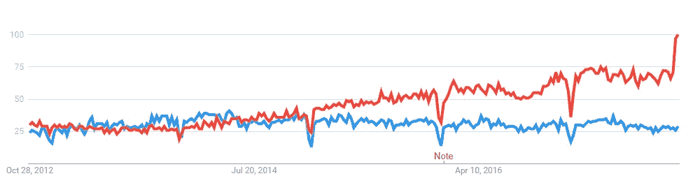

# 原型开发的情况

> 原文：<https://medium.com/hackernoon/situation-with-prototyping-5bb49abfb2b4>

> UX/用户界面，线框+样机需要专家

当你浏览 [desig](https://hackernoon.com/tagged/design) n 界面类别时，你会在任何自由职业者网站上看到上面这个非常受欢迎的工作条目。几乎每个客户都需要设计师来分析用户与网站或应用程序的交互，然后创建一个好看的界面。奇怪的是，这么多人认为用户体验专家非常类似于典型的平面设计师，他们实际上只负责开发引人注目、令人愉快的模型。事实上，UX 专家很像业务分析师，他们的主要精力放在解决最终用户的任务上。

# 你曾经需要雇用一个商业分析师，他也需要是一个伟大的高保真 Photoshop 样机专业人员吗？或者，一个具有商业分析师技能的平面设计师？

为什么这么多人想雇佣一个多专业的人来完成和实体模型设计任务？原因很简单——很多人喜欢合并密切相关的专业。你是程序员还是硬件工程师？如果是，你绝对有能力修我的打印机和 iPhone。你是医生吗？你可能是一名耳鼻喉科医生，但我相信你仍然可以建议我如何解决我的牙齿问题。如果你是农业专家，我肯定你能建议我家哪些仙人掌长得好。诸如此类。

关键是，上述任何一位专业人士在相关领域的关系都比任何一位普通人更密切，他们能够在一些简单的案例中给你提供合格的帮助。但是，如果你需要一个真正专业的解决方案，没有什么能打败一个狭隘的专家开发的。

打破原型过程的逻辑顺序是正在进行的第二个奇怪的过程。我不能理解许多网站创建者的[愿景](https://www.invisionapp.com/)高使用率。是的，当你已经有了必要的图形，或者，例如，你不想在 UX 分析上投入时间和金钱，或者你有一个如此简单的网站，你不需要任何分析，这是一个方便的解决方案。但是，当我看到一个复杂的 web 应用程序的规范，它必须从头开始开发，并且有一个针对 vision 的原型需求时，我不禁要问。

前面我们看到了一个正确的设计过程，首先是手绘草图，然后是线框、原型、测试和模型。现在这被简化成了模型和原型。这看似相似，但本质上是完全不同的。在制作原型时，你不应该专注于像素完美的设计，它会分散你对最终用户任务解决的注意力。你不应该分析，例如，按钮颜色，标志，横幅照片等。，现阶段。

你如何用像 Invision 这样的东西来设计大型菜单导航的原型？比如[这个样本](https://codyhouse.co/demo/mega-dropdown/)。我需要提到导航是任何网站的主要特征之一吗？如果用户不能理解你网站的结构，他们会感到困惑，可能会觉得被误导了。而你很可能会失去这个用户。

是的，您可以先在 Photoshop 中创建 20 个屏幕，然后在 Invision 中链接它们，从而在 Invision 中构建您的网站。但是，这真的是二十一世纪构建原型的方式吗？如果您随后需要通过将屏幕控制移动到不同的位置来进行修改，该怎么办？您将需要创建另外 20 个新屏幕，并再次将它们全部链接起来。你做的每一个修改都是如此。这种制造原型的方法在 2002 年的第一版 [Axure](https://www.axure.com/) 中是可行的。

人们喜欢简单，这是任何 UX 设计的基本原则之一，也是 Invision 受欢迎的原因，尽管它逆转了原型制作过程，现在从最终设计转向交互式原型。我们需要像 Axure 一样强大，像 [Balsamiq](https://balsamiq.com/) 一样简单的东西，让网站所有者回到正确的原型制作过程。不幸的是，在不久的将来，我们在这个领域看不到任何革命性的和新的东西——但是，谁知道呢。

Axure vs InVision. Five year [trend](https://trends.google.com/trends/explore?date=today%205-y&q=Axure,Invision) by Google. Red line represents Invision

总之，我再次强调，在创建任何中等或高度复杂的网站的第一阶段，你应该找到并使用 UX 专家。不要仅仅因为某个工具或趋势流行，就简单地跟随它。并使用正确的工具制作现实生活中的交互式原型，例如 Axure。