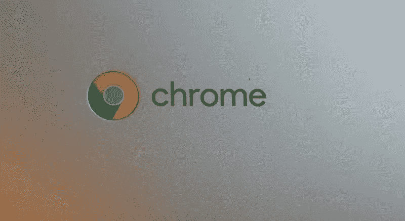
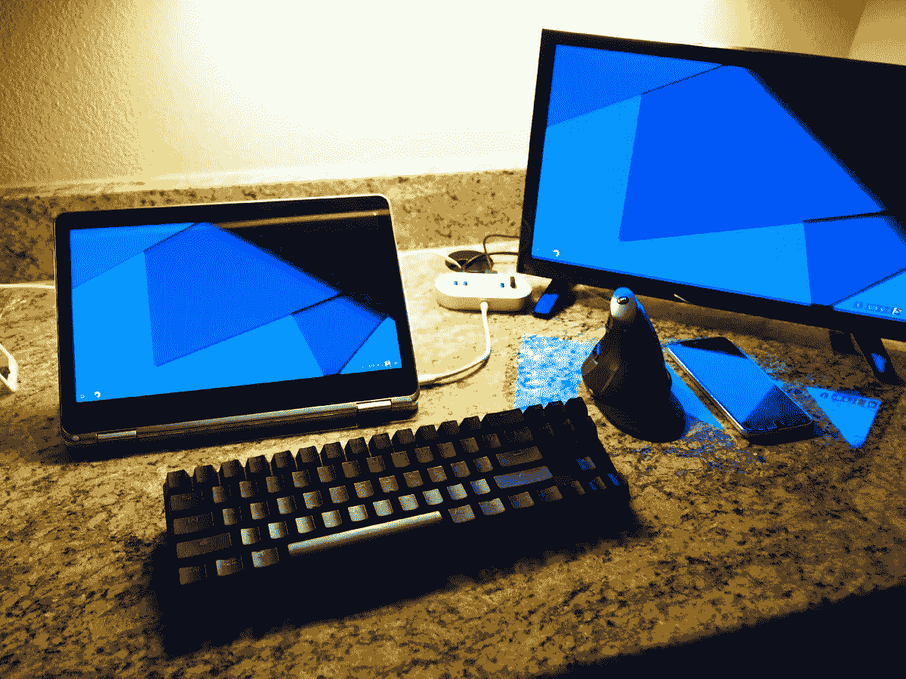
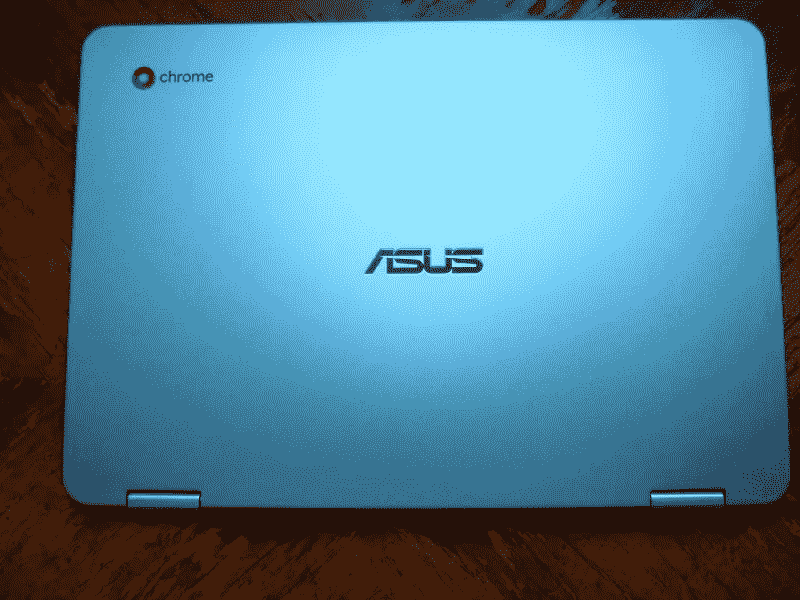

# 使用 Chrome 操作系统六个月

> 原文：<https://medium.com/hackernoon/six-months-with-chrome-os-e5f56ef53b0>

去年 12 月，我卖掉了我的 Windows 笔记本电脑，决定接受 Chromebooks 和 Chrome OS。刚开始很犹豫，但是才过了几个星期就知道不想回去了。事实上，我不确定我将在这篇文章中讨论什么，因为我一直在使用的[chrome book](https://hackernoon.com/tagged/vhromebook)—[华硕 Chromebook C302](/@TomWestrick/asus-chromebook-c302-review-c3847940ba4a) —就像预期的那样工作。在华硕之前，我尝试的所有其他 Chromebooks 也是如此。他们之间的差异归结为硬件的差异——更强大的处理器，不同的屏幕宽高比。它们中的每一个都和其他的一样容易拿起和使用。

这并不是说我的经历在过去的六个月里没有改变。最大的增加是 Android 应用程序——仍然只在我的华硕 Chromebook 的测试版中——随着最近的更新，它们变得越来越好。但即使添加了新功能，核心体验仍然毫不费力。当我拿起笔记本电脑并打开盖子时，操作系统启动了。每一个。单身。时间。当我在以前的公寓将笔记本电脑插入我的基座时，它向第二个显示器输出视频并开始充电。每一个。单身。时间。当我打开蓝牙键盘或鼠标时，它们连接没有问题。每一个。单身。时间。

My set up for most of this year. The dock connected without issue 100% of the time.

我特别想将最后一点与我使用 Windows 的经历进行对比。在过去的两天里，我一直在尝试获得一个键盘和鼠标，通过蓝牙与我的 Windows 桌面进行配对，这简直是一场噩梦。在工厂重置我的台式机、禁用内置的英特尔蓝牙无线电并购买 USB 蓝牙转换器后，键盘仍然缺少或增加了额外的击键。鼠标稍微好一点，但是有它自己的导航抖动问题。

我尝试过一些 Android 应用程序，大多数时候我会回到使用 web 应用程序。对于一些服务，如 Plex 和网飞，在网站上使用 Android 应用程序对我来说没有任何优势。这些服务的 Android 版本允许用户下载媒体进行离线消费，但我从来没有这样做过。翻转屏幕阅读小说或漫画书绝对是一种乐趣——尽管有点不方便，因为我在阅读时会感觉到键盘。

微软 Office 等其他服务仍然有点笨拙。我在 Chromebook 上安装了 Word、Powerpoint 和 Excel，因为我认为它们值得我在大学课程中尝试。然而，Android 应用程序无法将文件保存到 Chrome OS 的主文件空间中。虽然微软提供了将 Office 文件保存到 OneDrive 云存储的选项，但他们没有提供将文件保存到 Google Drive 的选项。我更喜欢将文件保存到我的 Google Drive，因为现在学位已经完成，我将失去我的学校 Office 365 帐户，所以我最终将它们保存在那里。这样做意味着使用一个名为 [FolderSync Pro](https://play.google.com/store/apps/details?id=dk.tacit.android.foldersync.full) 的 Android 应用程序，在我的 Google Drive 帐户和 Chromebook 的 Android 应用程序空间之间手动同步我的学校作业文件夹。它起作用了，但是不太理想。现在我已经完成了我的学位课程，我已经从 Chromebook 上完全卸载了 Word、Excel 和 Powerpoint。

当谷歌将 Chromebooks 的应用程序接口(API)级别从 Android 6.0.1 更新到 Android 7.0 时，Android 应用程序整体上变得更好了。这听起来可能不是一个大的飞跃，但 Android 7.0 增加了调整应用程序窗口大小的能力，以及将 Android 应用程序移动到第二个显示器的能力。这两者都极大地改善了 Android 应用程序的使用体验。[Android O](/@TomWestrick/the-top-five-things-im-looking-forward-to-in-android-o-d26d2d2cab3a)的另一项改进将是应用程序内部更好的键盘和触控板导航。

关于 Chrome OS 上的 Android 应用，最需要记住的是，它们根本不需要使用。如果用户只是希望他们的 Chromebook 成为一个简单的观看网飞和查看电子邮件的设备，它绝对可以，他们永远不需要知道谷歌 Play 商店存在于他们的设备上。与此同时，如果有人确实希望一些 Android 应用程序使他们的 Chromebook 成为一台更好的生产力机器，那么核心体验不会改变或变得令人沮丧。它还是一如既往的棒。

微软最近确实推出了 Windows 10 S，以满足 Chrome OS 提供的安全性和简单性，但他们错过了目标。微软 Edge 在功能上与 Chrome 浏览器旗鼓相当之前仍有一些发展空间——除了仍不如 Chrome 安全之外。在消费和生产应用方面，Windows 应用商店与 Android 应用商店相比相形见绌，操作系统本身[仍然可以被标准的 Windows 攻击利用](http://www.tomshardware.com/news/pwn2own-2017-microsoft-edge-hacked,33940.html)。我仍然有我的 Windows 桌面，我用它来完成某些功能——游戏、媒体转换和托管我的电视和电影库。它在所有这些方面都做得很好，虽然 Chromeboxes 是一个东西，但我看不到自己会很快得到一个。同样，我也无法想象自己会在笔记本电脑上回到 Windows，除非我在未来的工作中特别需要一台。

【https://twitter.com/TomWestrick1 在推特上关注我