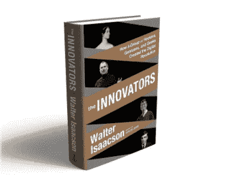
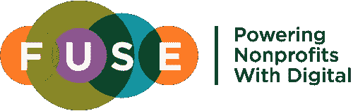
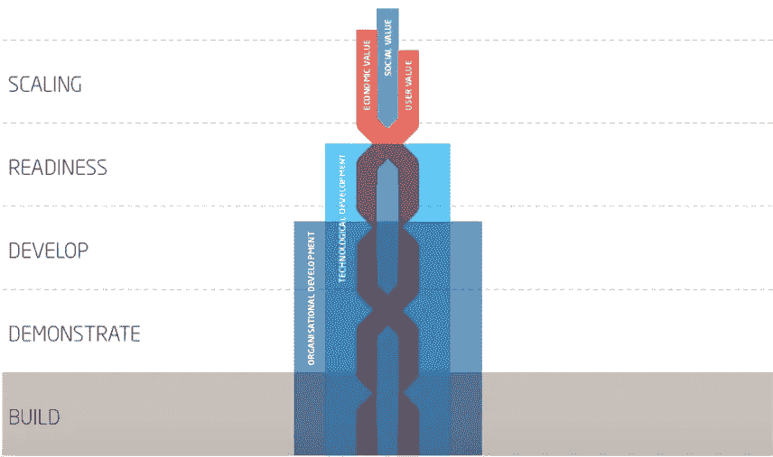
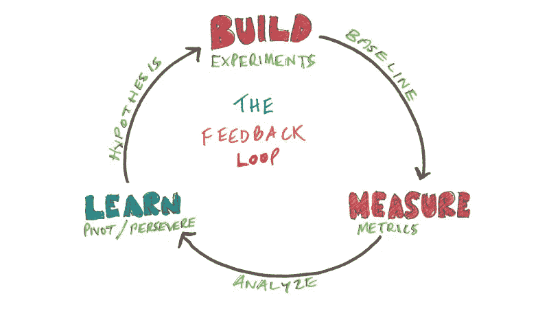
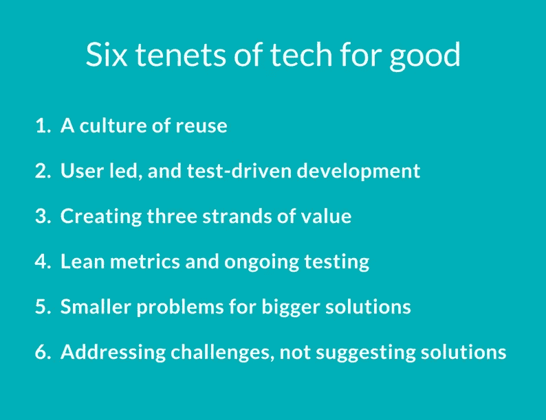

# 科技造福人类的六大原则

> 原文：<https://medium.com/hackernoon/six-tenets-of-tech-for-good-210168573f87>

我们决心看到更多、更好地利用技术，我们希望了解我们在生活的其他方面看到的大规模数字化转型的潜在驱动因素。这些潜在的行动和条件促成了令人难以置信的大规模变化，如果我们要创造类似规模的社会进步，那么我们需要确保这种发展存在正确的条件。

当然，这种变化需要充满激情的企业家和具有创新思想的团队；当然，有效的融资和一致的投资，当然，还有针对实际问题的针对性解决方案。不那么“当然”的是[好时机](https://www.ted.com/talks/bill_gross_the_single_biggest_reason_why_startups_succeed)的重要性——但如果我们能把正确的条件落实到位，2017 年就能实现。

我们已经认识到**如果我们想要创造出可以与数字化在我们生活的其他领域所产生的巨大影响相媲美的东西，我们需要的六样东西**。它们是潜在的条件，允许我们以一种能带来巨大变化的方式去实践。**科技造福人类的六大信条**。

我们将努力确保这些要素都建立在我们的活动、合作伙伴关系和对话中。如果我们都能做到这一点，那么我们将真正看到通过数字技术加速社会影响。我们很乐意听到您的想法、挑战和补充，并支持它们得到发展和实践。

Drumroll…

**科技造福人类的六大原则**

1.  重用文化
2.  用户主导和测试驱动的开发
3.  创造三股价值
4.  精益度量和持续测试
5.  更大的解决方案解决更小的问题
6.  应对挑战，而不是提出解决方案

1.  **重用文化**

计算的历史以及它所推动的巨大飞跃，是一部协作、异步开发以及致力于类似问题和解决方案的人们/组织运动的历史。

One to add to the reading list

来自洛夫莱斯和巴贝奇；贝尔实验室和布莱奇利公园；通过有组织的跨部门[研究生态系统](https://en.wikipedia.org/wiki/ARPANET)；20 世纪 70 年代的家酿黑客和开源运动——当许多人和团队致力于类似的问题和解决方案时，数字创新往往就会出现。这表明，要看到技术领域的类似进步，鼓励/支持(高层)做同样事情的人是很重要的——尽管在这样一个资源有限的环境中这可能很难做到。

然而，如此快速发展的核心是这些创新者重复使用已经创造的东西。这不仅仅是站在巨人的肩膀上，而是建立在以前的想法基础上，这看到了硬件和代码的重用，这可以提供更快地构建解决方案的捷径。从 [IBM 开源他们的操作系统](https://en.wikipedia.org/wiki/History_of_free_and_open-source_software)到更现代的[工具](https://wordpress.org/) / [功能](https://techvibes.com/2015/09/04/a-brief-history-of-shopify-2015-09-04)这种[重用文化](https://t.co/CRZyy3W046)极大地降低了早期创新的成本，鼓励了更多(更广泛)的探索。是否想要一个新的[网站](https://www.squarespace.com/)、[网络社区](https://www.entrepreneur.com/article/247541)；[测验](https://www.typeform.com/)甚至是[机器人](http://www.techworld.com/picture-gallery/apps/seven-platforms-for-developers-build-chatbots-3639106/)，将会有代码和平台以低成本或零成本满足你 80%的需求。

如果我们可以通过创造一种重用的文化来降低早期数字创新的成本；如果我们可以通过证明对新服务的需求(已经证明对现有服务的使用)来增加我们对投资需求的信心，那么我们就可以开始创造数字化在我们生活的其他方面所创造的影响的速度和规模。

当然，这不仅仅是关于数字工具，也是基础研究。分享和寻找存在的东西，可以加快创新的步伐，提高我们集体工作的效率。请看我们最近的博客了解更多！

**我们的挑战:**双方**以可重复使用的格式分享我们的产品/产出**(无论是作为[研究](http://www.shiftdesign.org.uk/products/bfb-labs/#research)、[API](https://www.programmableweb.com/category/charity/api)、[开放数据](http://www.threesixtygiving.org/)、[速赢](https://projects.doteveryone.org.uk/assets/quick-wins.pdf)等)**、**还是**养成重复使用的习惯**:搜索、调整和测试已经存在的东西(并对之前的工作给予肯定)。

**2。用户主导和测试驱动开发**

创造有效的数字产品和服务的核心是确保它具有“产品-市场适应性”。这意味着正在创造的东西以一种产生收入的方式吸引用户。初创公司不断测试这种适合度，改变产品、语言和/或价格，直到适合为止。Digital 提供了一种简单且相对便宜的独特方法——提供由分析程序支持的廉价数字工具，以观察人们对你的新产品的反应。

Our Fusilier charities take a user led, test-driven approach to everything they create

在 Fuse 中，我们从第三天开始与五个人进行测试/交谈，目的是创建原型，以尽快用我们的想法理解人们的行为。这种测试驱动的方法将贯穿整个为期三个月的项目，并融入到持续的产品开发中——确保产品符合受众的选择和使用行为。

这不仅仅是采用测试驱动的开发方法，而是将用户放在开发的中心——甚至比许多传统的协同设计方法更重要。

虽然我们采用了许多合作设计和参与式设计技术，但是测试驱动开发中的所有开发都是对用户行为的响应，而不是明确表达的愿望。这样，他们的想法、需求和行为就是职业发展团队工作的核心。

已经有很多关于测试驱动和精益开发的文章——但本质上是关于建立对你的产品/服务的信心，因为人们使用它的方式。这意味着尽快将产品送到他们手中，而不是花太多时间设计你认为最需要/想要的东西。

**我们的挑战:**确保所有产品、服务和项目都围绕测试驱动和用户主导的流程构建。

**3。创造三股价值**

我们已经写了很多(和在 [Shift](http://shiftdesign.org.uk) 的优秀团队一起)关于每一个好项目/风险的技术的关键需求，集中于建立三种类型的价值:社会价值；财务价值和用户价值。没有阐明和发展所有这些价值，整个方法将会失败——所以从一开始就探索和建立这些价值是至关重要的。

The ‘triple helix’: Social value, financial value and user value

我们已经写了关于[理论](http://www.nominettrust.org.uk/sites/default/files/Nominet%20Trust%20-%20Triple%20Helix%20Overview%20Paper.pdf)，和[实际含义](http://www.nominettrust.org.uk/sites/default/files/Practical%20uses%20of%20the%20Triple%20Helix.pdf)，所以坐下来喝杯茶，浏览一下吧。关键点包括认识到，只有当产品/服务以人们主动选择使用的方式被创造时，社会价值才会实现(创造用户价值)；您需要确定[相关指标](http://www.nominettrust.org.uk/sites/default/files/NT%20Lean%20Social%20Metrics%20Paper%20-%20dev%2003.pdf)来测试(并给予您信心)这些价值正在实现——或者它们有可能实现，并且这些价值中的每一个都只能基于它们的发展阶段和稳定性得到[证明](http://www.nominettrust.org.uk/knowledge-centre/publications/measuring-growth-your-social-tech-business)。

这是投资者和创始人的一个重要关注点——我们需要支持创新者测试和开发这些有价值的领域，但同样地[对通过投资可以实现的目标设定现实的期望](http://castaround.tumblr.com/post/137274400456/mist-growth)。

**我们的挑战:**与初创公司和新项目合作，围绕这三个价值观进行建设，并与资助者、专员和投资者合作，实施支持这种增长的融资、支持和评估框架。

**4。精益指标和持续测试**

[精益指标](http://provocations)或精益分析是敏捷开发的核心，在技术领先的初创公司中非常重要。在著名的[构建-测量-学习循环](http://jpattonassociates.com/wp-content/uploads/2015/04/lean-startup-model.jpg)中，它们是连接“学习”和“构建”的重要测量步骤。

Iterate your way from small short-term steps to big long-term impact, measuring as you go

这里真正重要的是，有一个既定的方法来在长期愿望中看到短期发展(例如创建一个具有巨大影响力的科技公司)。基于这种方法，我们需要实现的三个价值中的每一个都有了一个[有价值的发展途径，并且通过测量和制定更小的步骤来帮助解决创造长期社会影响的挑战。](https://www.nominettrust.org.uk/sites/default/files/NT%20Lean%20Social%20Metrics%20Paper%20-%20dev%2003.pdf)

这有助于确保开发是不断发展的，并集中于改进，但也有助于确定与资助者和投资者合作的现实期望。

**我们的挑战:**使用精益指标构建我们所有的方法，并与 tech for good 组织合作实施和支持类似的方法——创建一个共享的[测量框架](http://castaround.tumblr.com/post/137229147036/mist-growth?is_related_post=1)(和语言),它是诚实的、合理的和有据可查的。

**5。更大的解决方案解决更小的问题**

去年，我们发表了一篇简短的文章，讲述了数字方法的一个特殊好处，那就是小号，而不是长号。这里的核心论点是，为了创造一个数字解决方案，好的技术需要非常具体地描述大问题。考虑一下谷歌如何返回与你“最相关”的搜索结果。如果你搜索“本地新闻”——那么这些术语中的每一个都必须有非常具体的定义:本地对你意味着什么，什么算新闻。

In analogue vs. digital, the trumpet wins

在我们这个领域，我们主要关注[棘手的问题](https://en.wikipedia.org/wiki/Wicked_problem)——那些重大的、具有挑战性的、难以理解和解决的问题。然而，数字方法促使我们不断反思和重新阐述挑战，以帮助创建特定的解决方案。[传感制作](https://www.youtube.com/watch?v=N7oz366X0-8)、[用户研究](https://www.usability.gov/what-and-why/user-research.html)和测试驱动开发都可以对此有所帮助，但数字方法需要对问题进行重新构建和重新表述，从而创造出解决问题的新方法。随着时间的推移，我们可以解决许多具体的问题，而不是追逐一些无法克服的大问题。

**我们的挑战:**继续专注于数字技术可以带来巨大变化的领域，并不懈努力实现这一价值。诚实地面对数字技术没有作用或作用有限的领域，并确保我们让多才多艺/多学科的团队专注于识别和解决重要问题。

**6。应对挑战，而不是提出解决方案**

我们在社会组织中拥有如此丰富的专业知识和经验，很容易理解为什么每年会有如此多的新想法、新方法和新解决方案被发现和发展。

然而，技术发展的一个重要教训是，我们不太擅长判断客户/用户的需求，我们需要将我们的信念/期望与人们的实际选择和行为区分开来。

Solutionising is not just a social sector problem!

这又回到了“产品-市场契合度”(见第二点)，在这种情况下，科技企业可以在开发最受欢迎的部件之前，用他们的想法快速、轻松地测试用户的行为。如果我们能找到一种方法来测试我们的解决方案，并准备好根据我们“观众”的行为和选择迅速改变它们，那么我们就能真正开始应对巨大的社会挑战。数字社区采用这样的方法，使用[精益和敏捷](https://castfellowship.wordpress.com/2016/05/09/lean-start-up-methodology-and-agile-processes/)方法来确保最好的产品/服务。如果我们可以开发类似的方法，那么随着时间的推移，我们就可以真正解决巨大的社会挑战，不是通过遵循我们最初的解决方案，而是通过遵循测试驱动的方法来解决挑战。

对于慈善机构/风险企业来说，这不仅仅是一个采用测试驱动方法的挑战。它要求资助者支持组织应对挑战，而不是提供解决方案。这意味着对解决方案/干预措施将根据反馈/用户测试而改变感到放心；对解决方案可能与最初的预期有很大不同感到放心。这并不意味着资助开放探索，而是[支持可信的组织](https://www.comicrelief.com/grants/tech-for-good)使用经过测试的方法来寻找(然后交付)正确的解决方案。它可能看起来更开放——甚至更有风险——但是它能够发现和创建更好的有针对性的解决方案。

**我们的挑战:**继续使用测试驱动的方法来应对挑战。与资助者、投资者和社会组织合作，理解并实施可信的方法，以严格找到应对重大社会挑战的正确解决方案——考虑到这可能带来的责任和报告差异。

Here it is again, but bigger and more colourful :)

**六件事**。它们中的每一个都很大很重要，但它们共同创造了推动数字创新浪潮的暗流，这可能对个人和我们社区面临的社会挑战产生巨大影响。如果我们能够创造这种暗流，那么这种影响的规模就可以像我们在生活中的许多其他领域看到的那样大，那样具有变革性。

想象一下，如果我们真的能创造这样的改变，会有什么样的可能性。这六个原则是将这种想象转变为 2017 年焦点的部分。

> [黑客中午](http://bit.ly/Hackernoon)是黑客如何开始他们的下午。我们是 [@AMI](http://bit.ly/atAMIatAMI) 家庭的一员。我们现在[接受投稿](http://bit.ly/hackernoonsubmission)并乐意[讨论广告&赞助](mailto:partners@amipublications.com)机会。
> 
> 如果你喜欢这个故事，我们推荐你阅读我们的[最新科技故事](http://bit.ly/hackernoonlatestt)和[趋势科技故事](https://hackernoon.com/trending)。直到下一次，不要把世界的现实想当然！

