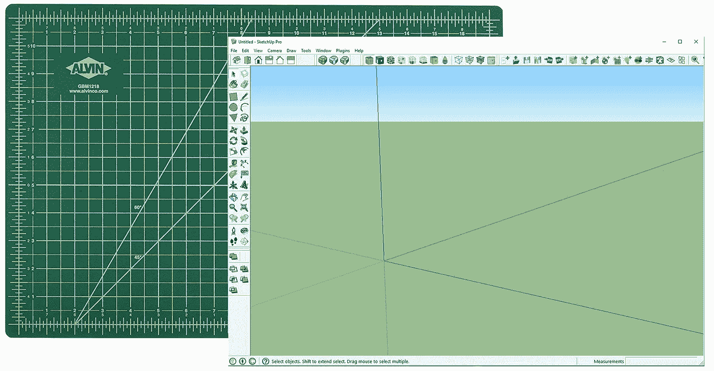

# 用全息透镜进行草图建模

> 原文：<https://medium.com/hackernoon/sketch-modeling-with-hololens-b12e8e411b85>

## 克服协作差距

[技术](https://hackernoon.com/tagged/technology)使全新的[设计概念](https://hackernoon.com/tagged/design)成为可能。数字建模允许设计师比以往任何时候都更快地试验和尝试新的想法，在二维和三维表示之间随意移动，在神一般的概览视角和人类身临其境的观点之间移动。过程中的所有这些变化都内在地改变了过程的最终产品，可以说是变得更好了。

Can we move on from Alvin, without loosing his benefits?

尽管数字建模工具给我们带来了很多好处，但是我们也丢失了一些有价值的部分，这对最终产品也有影响。

将物理模型放在屏幕上**将它从最终形式将存在的感知环境中取出**。这也将它从设计公司应该存在的关键环境中移除，引入了**协作缺口**。一个物理模型可以放在桌子上，被每个人观看(和评论);当一个人挤在屏幕周围，观看由一个人控制时，评论一个物体要困难得多，更不用说尝试合作设计了。

在 Ankrom Moisan ，为了探索如何解决这些限制，我们开发了一个在微软 HoloLens 上进行大规模建模的应用程序。HoloLens 将数字全息图投射到用户的视野中，它们看起来与真实物体非常相似，带回了真实物理模型的许多感知。

它仍处于早期阶段，功能不多，还有些 bug。然而，你可以从视频中看到，它允许快速、可逆和迭代建模，其中比例是你选择的；但是在现实世界中。用户可以四处走动，靠近，一起修改*，这样协作的差距就可以开始缩小。*