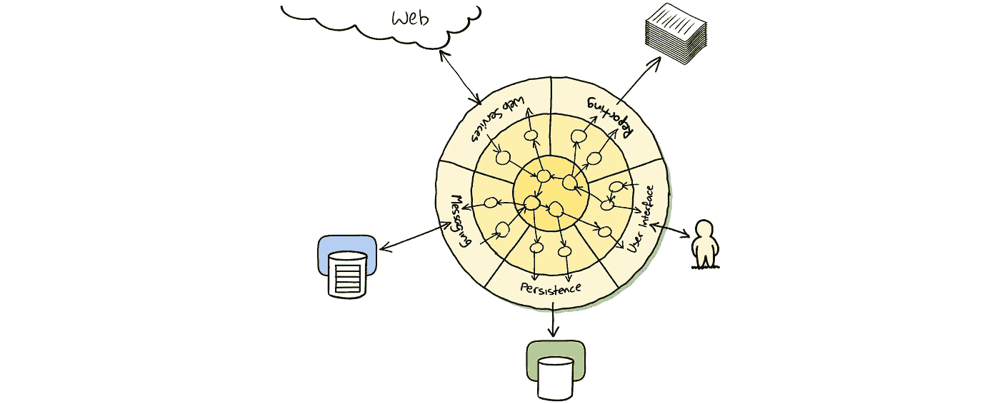

# 撇去你代码库的污垢！

> 原文：<https://medium.com/hackernoon/skim-the-crap-off-your-codebase-b7bb79202d65>

[Hexagonal Architecture](http://alistair.cockburn.us/Hexagonal+architecture). Source of the image unknown.

## 如何清理一个 3 年以上的老项目，从此过上幸福的生活？

我们都有过这样的经历:一个软件项目足够幸运，在最初的开发之后还能存活数年，然而，在开发过程中的某个地方，它开始受到补丁和解决方法的影响，这些补丁和解决方法只是暂时的，但是没有人能够清理干净。

作为一名承包商，每隔几个月我就会换一家公司。我曾与初创公司和老牌公司合作过。我曾经在开发过程的早期加入了一个项目，在发布应用程序后离开了团队，并在差不多三年后发现自己在从事同一个项目。那真是一次不寻常的经历！我在里面写的唯一代码是分散在几个文件中的一堆空行。我参与过项目生命周期的各个阶段。然而，我经常发现同样的问题。幸运的是，解决方案也保持不变。

我最常发现的问题是，随着项目复杂性和特性集的增加，它们也变得更难改变。开发新功能所需的时间不断增加，打破东西变得越来越容易。代码库不同领域的知识往往停留在一个人或一个小团队的头脑中。团队中的其他开发人员通常不会费心去学习一些东西是如何工作的，直到他们不得不这样做，而且随着这些人的离开，这些知识将永远消失。

好代码的头号敌人是代码本身。这是一个不断增长的依赖网络，缺乏隔离，缺乏文档。这也是你头脑中的一个诱人的声音，它说如果你只是在一个已经很胖的类中增加一个方法，那就没问题。因为如果你这样做了，你就已经完成了，你的功能或错误修复将会完成，你的经理会很高兴，每个人都会为你快速行动的能力而欢呼(并打破一天左右就会回来找你的东西，只是为了让你再修补一些)。

也许你向自己保证你会回去好好做事。然而，在你知道它之前，整个项目看起来像一个不体面的烂摊子，做最简单的事情变成了有史以来最困难的工作。

免责声明:我所说的并无新意。人们已经写了数百页关于 [*处理遗留代码*](http://amzn.to/2jLINYV)*[*清理代码*](http://amzn.to/2kagYgt) *或* [*重构*](http://amzn.to/2kacPZL) *。然而，这似乎永远不够。同样的问题不断重现。因此，我只是尽了自己的一份力量，试图让一些原则在人们和我自己的心中留下深刻的印象。**

# *软件编程更像园艺而不是工程*

*如果你在一座建筑、一座桥梁上工作，或者试图将一枚载人火箭发射到太空，你会做同样的事情吗？希望不会！不过，我知道有些人会。就[看看几个月前意大利发生的事情](https://www.ft.com/content/f1b3768a-6e94-11e6-a0c9-1365ce54b926)！或者看看[英国的房屋质量差](http://www.thisismoney.co.uk/money/mortgageshome/article-3548584/Wonky-windows-dodgy-wiring-holes-walls-Beware-builders-flogging-shoddy-new-build-homes.html)！*

*长期以来，编程软件一直被比作建造一座大楼。也许这是一个很好的比较，也许不是。一些元素让编程看起来像工程:你必须分析一个问题，提出一个好的解决方案，确保你采取了正确的措施，构建它，测试它，[希望它不会自己掉下来](https://www.theguardian.com/uk/2000/jun/12/2)。然而，改变软件中的东西是如此的廉价，有时又是如此的不可预测，以至于你知道它会发生。正如《实用程序员*的作者安迪·亨特所说:**

> **在许多文献中有一个持久的观念，即软件开发应该像工程一样。[……]软件不是这样的。[……]软件更像园艺。你确实有计划。你计划你要做一个这么大的阴谋。你要准备土壤。你带来一个景观设计师，他说把大的植物放在后面，矮的放在前面。你有一个伟大的计划，一个完整的设计。**
> 
> *但是当你种下球茎和种子时，会发生什么呢？花园和你画的不太一样。这株植物比你想象的要大得多。你得修剪一下。你得把它分开。你得在花园里到处移动它。后面的这棵大植物死了。你得把它挖出来，扔进堆肥堆里。这些颜色最终看起来和包装上的不一样。他们挨着不好看。你得把这株移植到花园的另一边。*
> 
> *《务实的程序员》的作者安迪·亨特。*

# *修复糟糕的代码库*

*当我们发现自己在一个令人讨厌的代码库上工作时，我们能做什么呢？也许我们刚刚加入了一个需要帮助的团队，或者我们失去了对这艘船的控制，我们正在努力让它回到正轨。*

*我发现的解决这个问题的唯一方法是先把垃圾推到边缘，然后再把它完全移除。这意味着，我们必须努力将代码库的各个部分隔离在小黑盒中，每个部分都服务于一个且只有一个目的。包含的小代码块更容易理解和更改。我们可以独立于应用程序的其他部分测试它们，并根据需要重构它们。简而言之，我们必须:*

1.  *孤立的*
2.  *试验*
3.  *重构*

## *分步解决*

*第一步是识别小的、包含的功能块，并将它们提取到它们自己的容器中。我将称它们为**模块**。*

*目标是在主应用程序和自包含功能之间创建交互边界。通过这样做，我们将拥有更容易理解和维护的代码。或者至少，我们可以取出一段没人理解的代码，最小化并重新定义主应用程序与它的交互方式。将代码库中受感染的区域隔离开来也可以避免疾病的进一步传播。*

*当分离一个模块时，最好创建一个新的包/框架来包含它，这样旧的代码就不能再访问它了。一旦局限于它自己的世界，我们可以定义一个*接口*，通过它世界的其他部分将与模块交互。该接口将是包的一部分，我们将在模块内进行必要的转换。这样，当我们出于任何原因更改模块的实现时——例如，为了清理它——其他代码都不会受到影响。*

*最初，您将不得不面对依赖关系这堵墙，但事实上这就是您正在解决的问题！这些依赖关系要么必须注入到模块中，要么模块必须依赖其他模块来获取它们。*

*实现这一点的一个完美方法是避免传递相同类型的数据。相反，尽可能使用[协议](https://en.wikipedia.org/wiki/Protocol_(object-oriented_programming))和[dto](https://en.wikipedia.org/wiki/Data_transfer_object)。这样做将使您的代码更容易理解和维护。一个小缺点是，您可能需要编写一些代码来符合那些协议，或者将您的数据模型转换成(或转换成)这个中间对象。这里稍微重复一下自己就可以了。优势太大了，不容忽视。*

*例如，模块将不必依赖其他模块来了解它们需要的类型。他们可以*定义*他们需要什么。在您的主应用程序中，您可以扩展类型以符合协议或将它们转换为其他类型。您的模块代码也将更容易测试，因为为您的测试定义 stub 和 mock 对象将不需要依赖性和状态维护的负担。*

> *先把垃圾推到边上，再去掉！*

*最后一点，您提取的内容不一定是写得很差或难以理解的，尽管最大的好处来自于隔离代码的这些部分。从长远来看，抽出写得好的文章也会有帮助。*

## *试验*

*有了模块的接口，我们就可以单独测试它了。因此，我们将能够确保一致的、功能性的行为，并使用[持续集成系统](https://en.wikipedia.org/wiki/Continuous_integration)自动化该过程。*

*测试将作为澄清模块范围和防止回归的一种方式。当新人必须使用这些代码时，它们也是预期行为的良好文档。随着对提取的片段必须做什么的重新理解，我们能够识别更多我们可以移出模块或一起修剪的区域。*

*测试是这个过程的重要部分，不应该被忽视。这是我们重构模块的基础。通过测试，我们可以确信我们将捕捉到回归。依赖性和弱点会浮出水面，因为您会发现不容易测试的地方。生活会很美好。*

*自信是关键。作为程序员，当我们对自己捕捉回归的能力缺乏信心时，我们害怕改变。我们害怕打碎东西，我们应该害怕。在每次提交时对整个代码库运行一组自动化测试可以让我们摆脱恐惧的负担。*

## *重构*

*最后一步是重构。一旦一切都被隔离和测试，你会发现代码库已经比以前更好了。为了分离出代码，必须有所改变。块必须被重新排列，通信在新的接口后面被清理。为了测试该模块，其他部分必须变得更加可测试。*

*在这一点上，你必须做出一个重要的决定:重构还是不重构。一些模块将处于完美的状态。有些仍然是你不敢碰的黑盒。我知道。没关系。你没有全部测试，因为你害怕改变和破坏东西。这并不理想，但我们可以接受。分离出那个组件已经是一项伟大的成就了。其他需求堆积在你的待办事项中，你开始紧张了。你不想让你的经理失望。*

*不过，事情是这样的。你已经走了很长一段路，光明就在眼前。你已经可以看到了。如果你要去*让你的代码库再次变得伟大*，你必须忍耐。这需要时间；你必须在重构工作和公司要求你投入新特性和增强的时间之间取得平衡。你所处的位置允许这样做。然而，细节决定成败。*

*为了防止代码库再次受损，你必须继续培育它。这是没有办法的。相信我。我去过那里。一次又一次，由于时间、压力、过度自信和厌倦，我避免了测试或重构。从来没有回报。我一直被自己缺乏耐力所困扰。一点都不好玩。再也不会了。难道你不想继续在一个健康的代码库上工作吗，在那里一切都像预期的那样工作，并且很少引入 bug。如果你的答案是“是”，那么你知道你必须做什么。你将不得不测试和重构那些仍然存在的代码库的蹩脚部分。*

# *维护健康的花园*

*即使你已经隔离了代码库中最好和最差的部分，将它们包装在一个合理的自动化测试套件中，并重构了一切，你仍然会处于危险之中。没有停止。工作还没有完成。当然，你的应用程序将处于有史以来的最佳状态。然而，如果你不继续关心，这不会持续很久。正如我在[的一篇旧文章](/@gtranchedone/working-with-legacy-code-44656ae19186#.kif7zez3d)中提到的，根据《 *的作者 Michael Feathers 所说，有效地使用遗留代码* *，* " *遗留代码*仅仅是没有测试的代码*

> *遗留代码仅仅是没有测试的代码*

*测试驱动开发，即在短周期内编写自动化测试和代码的实践——我们说的是短*秒*——在“实际代码”之前编写测试，非常方便地保持我们的*花园*处于健康状态。*

*一个重要的注意事项是，你应该**尽可能地避免模块相互依赖**。同样，使用协议和 dto 来避免传播依赖性！这些结构是无价的朋友。*

# *从这里去哪里*

*恭喜你走到这一步！我知道这一定不是最容易消化或最有趣的作品。正如我在本文开头提到的，我所说的并不新鲜。都是很老的东西了。我站在巨人的肩膀上。我们都是。因此，我强烈建议你花些时间通读描述称为 [*六角形架构*](http://alistair.cockburn.us/Hexagonal+architecture) 的概念的原始文章，该文章强调了将应用程序的核心域与外部依赖项隔离的重要性，并使用*端口*和*适配器与它们进行交互。当我提到你应该定义清晰的接口层，主应用程序和测试通过这些接口层与模块进行通信时，我指的正是这种类型的架构。您可能还想看看一个类似的概念，称为 [*自包含系统架构*](http://scs-architecture.org/) 。祝你的重构好运！**

*如果你对使用 [Swift](https://swift.org/about) 开发 web 应用程序感兴趣，这是苹果新的超级酷和高效的编程语言，你可能想订阅 *Swift Web Weekly* ，这是一份每周时事通讯，我在互联网上提供了关于该主题和任何相关内容的最佳链接。*

******

> *[黑客中午](http://bit.ly/Hackernoon)是黑客如何开始他们的下午。我们是 AMI 家庭的一员。我们现在[接受投稿](http://bit.ly/hackernoonsubmission)并乐意[讨论广告&赞助](mailto:partners@amipublications.com)机会。*
> 
> *如果你喜欢这个故事，我们推荐你阅读我们的[最新科技故事](http://bit.ly/hackernoonlatestt)和[趋势科技故事](https://hackernoon.com/trending)。直到下一次，不要把世界的现实想当然！*

**