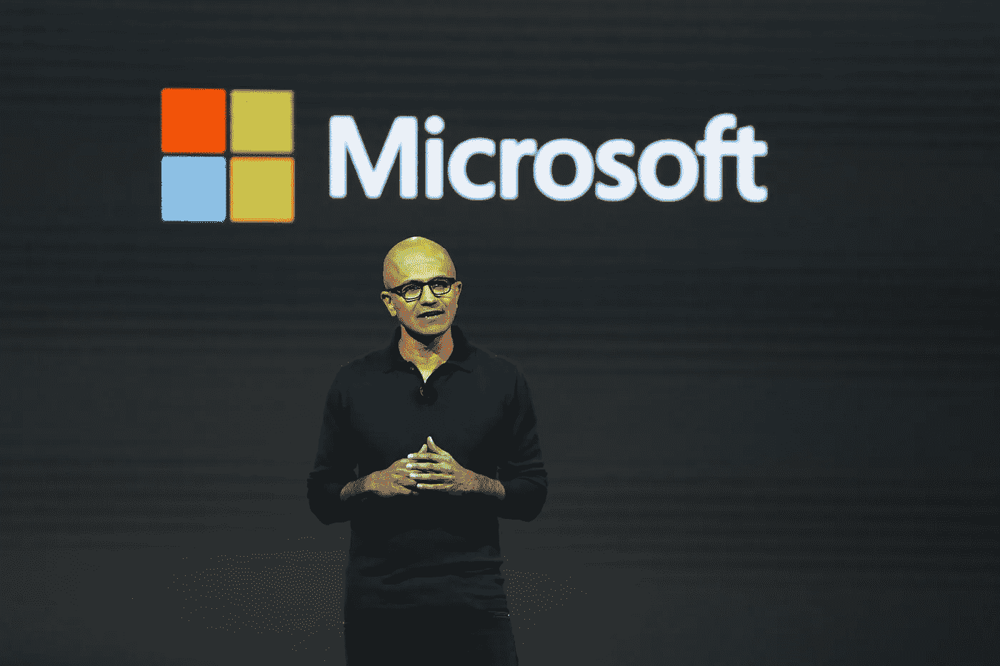

# Slack 和微软团队只能解决你团队一半的生产力问题

> 原文：<https://medium.com/hackernoon/slack-and-microsoft-teams-only-solve-half-of-your-teams-productivity-problems-a53e4b26228>

微软最近推出了新的企业通讯工具微软团队。这一发布表明经理们的注意力已经坚定地转向团队——这使微软与 Slack 正面交锋。

过去，大多数新的[生产力](https://hackernoon.com/tagged/productivity) [工具](https://hackernoon.com/tagged/tools)都是针对个人的。但现在不是了。最新的应用都是关于**提高团队的表现**。

经理们现在意识到，如果你每天只提高团队 1%的绩效，对公司的影响可能是巨大的。因此，采用速度很快。《财富》100 强公司中有 77%的公司现在处于闲置状态，员工花在该应用上的时间已经达到每月 1 亿小时。

但风险在于，像 Slack 这样的团队应用只能解决一个问题:团队成员之间的沟通。他们没有走得更远。

## **不能开始和结束通信**

Slack 改变了游戏规则。它解决了一个巨大的问题。在 Slack 之前，团队在全球范围内来回发送数千封电子邮件，等待答案，浪费宝贵的时间。**但是糟糕、缓慢的沟通并不是阻碍高效团队的唯一因素**。缺乏反馈也是——而 Slack 解决不了这个问题。

> 但是糟糕、缓慢的沟通并不是阻碍高效团队的唯一原因

许多团队成员仍然不知道他们的公司同事如何看待他们团队的表现。我们合作得有多好？我们走得够快吗？是什么阻碍了我们的交付？我们的集体工作对公司的整体业绩有贡献吗？

如果管理者真的想提高团队绩效，应用程序也必须帮助他们解决这个群体反馈的挑战。在实践中，这意味着**员工必须获得对团队整体绩效进行评分的工具**。员工应该被授权从团队贡献的角度来思考效率，而不仅仅是他们个人在做什么。

小组反馈工具也将揭示隐藏的动态，并提出提高团队生产力和绩效的方法。可能是两个人在一起工作不愉快，这种紧张关系需要解决；可能是审批程序拖慢了事情的进展，或者完全是其他原因。

所有经理都知道，一线员工——努力工作、才华横溢、充满激情的人——并不总是能在团队中高效合作。是的，个人表现出色，但团队整体表现不佳。“团队魔术”不见了。

这些是个人绩效评估不一定涵盖的群体问题。但是有了团队反馈应用程序，它们就可以了。

## **反馈也必须在团队间共享**

但是，只有当团队一开始就知道自己在做有价值的事情时，提高团队绩效才是有用的。

通常情况并非如此；**团队经常在孤岛中运作**。他们正在做伟大的工作，但是这项工作要么对公司的整体目标没有贡献，要么有贡献，但是团队不知道它适合哪里。

可能该公司 2017 年的目标是增加现有客户的收入，但设计团队正在打发时间，推出新的网站和应用程序来吸引该公司无法支持的新客户。很好，但是没用。

> 发现两个团队做完全相同的事情并不罕见

或者，更糟糕的是，**发现两个团队做完全相同的事情**并不罕见。也许一个办公室里有一个团队；一个团队在另一个团队——两个团队都有充足的资金。

这就是团队间反馈发挥作用的地方。除了让团队对自己的表现给出反馈，**应用程序还应该允许人们对其他团队给出反馈**。销售主管应该能够给出他们对设计团队的意见，反之亦然。工程师应该能够给出他们对营销的反馈，反之亦然。

**这将为团队的工作提供外部检查和平衡**；局外人的观点。它有助于防止团队认为他们做得很好，但他们的工作与组织的整体目标不一致的情况。

## **减少团队之间的冲突**

令人惊讶的是，**团队间的反馈也是减少冲突的非常有效的方法**。在我与大型专业服务公司经理的讨论中，同样的问题反复出现:团队之间的摩擦。事实上，一位著名的 CEO(也是他的朋友)最近估计，他花了多达 25%的时间来解决和缓解团队之间的冲突。

许多经理认为这些冲突是商业生活中的现实:不可避免，不可避免，几乎不可能减轻。拥有不同个性、方法和技能的团队总是会争夺相同的资源，是吗？**但是根据我的经验，绝大多数的冲突都是由过度保护的管理者引起的，他们控制着进出团队的信息**。

结果就是很多团队成员就是不知道自己在朝着什么方向努力；他们不知道高级管理层对他们的工作做了什么；他们不知道他们的工作如何与其他团队的工作相协调。因此，他们并不把自己的团队看作是为同一个目标而努力的更大机器的一个重要组成部分，而是觉得自己像一只团队的木筏，在与其他所有人的竞争中处于下风。

> 突然间，人们对自己在公司中的角色有了更清晰的认识

团队间反馈的力量在于，它给整个团队，而不仅仅是经理，一个外部的视角。突然之间，人们对自己在公司中的角色有了更清晰的认识，也更清楚每个人是如何为了同样的事情一起工作的。

团队沟通 app 的流行表明，越来越多的管理者开始将注意力转向提高团队绩效。这是个好消息。但是，我们必须确保讨论不会仅仅止于即时消息。团队反馈是公司成功的重要驱动力，为了确保团队富有成效，它也需要集成到这些应用程序中。

Ab Banerjee 是团队间评级和反馈工具 ViewsHub([*【https://viewshub.com*](https://viewshub.com)*)的创始人兼首席执行官。*

> [黑客中午](http://bit.ly/Hackernoon)是黑客如何开始他们的下午。我们是阿妹家庭的一员。我们现在[接受投稿](http://bit.ly/hackernoonsubmission)并乐意[讨论广告&赞助](mailto:partners@amipublications.com)机会。
> 
> 如果你喜欢这个故事，我们推荐你阅读我们的[最新科技故事](http://bit.ly/hackernoonlatestt)和[趋势科技故事](https://hackernoon.com/trending)。直到下一次，不要把世界的现实想当然！

