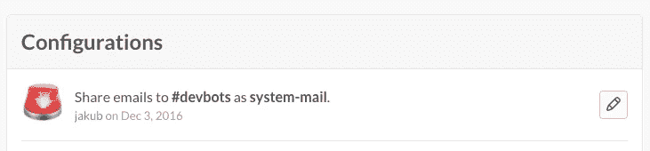
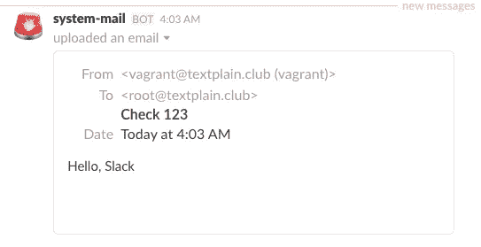
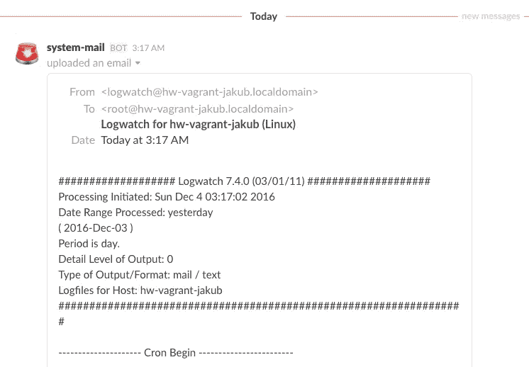

# Slack:本地邮件递送

> 原文：<https://medium.com/hackernoon/slack-hack-1-botify-servers-4783cf527981>


Then one / Wired

Slack 对团队沟通很有帮助，这已经不是什么秘密了。但让它大放异彩的是将任何东西连接到你的团队渠道的能力。

# “虚拟化”服务器

如果你运行任何服务器，它们偶尔会给你发送系统通知。因为这些邮件是通过本地邮件发送系统发送的，很可能你永远也不会读到它们，或者等到太迟的时候；默认情况下，所有本地邮件都以`/var/spool/mail/root.`结束。你需要通过 SSH 连接到服务器，从终端的一个可爱的*通知中了解它们。*

常见的解决方案是启用转发到外部电子邮件地址。然而，这种解决方案是不可靠的，因为消息经常被标记为垃圾邮件或被接收服务器拒绝——除非您特别小心地使您的主机在外界看来像一个合法的邮件服务器。

另一个问题是，由于某种原因，Unix 服务器在 Slack 特性中没有提供*共享。*

让我们快速解决这两个问题:

1.  向您的空闲团队添加新的电子邮件集成，并复制电子邮件地址:



2.在服务器上安装邮件传输代理，例如:

```
$ yum -y install mailx postfix && systemctl enable postfix && systemctl start postfix
```

3.启用将所有`root`邮件转发到备用:

```
$ echo your-token@your-team.slack.com > /root/.forward
```

搞定了。

您刚刚建立了一条从您的服务器到 Slack 的直接电子邮件线路。让我们来测试一下:

```
$ echo 'Hello, Slack!' | mail -s 'Check 123' root
```



或者更有用的东西:

```
$ pg_dump | mail -s 'DB backup' root
```

…开个玩笑，别这样。但是你明白了。

如你所见，你现在可以简单地通过邮件发送到`root`从你的服务器发送消息到 Slack。

顺便说一下，这就是系统服务——比如`cron`、`logwatch`和其他服务——已经用来通知重要的事件和问题。因此，您也会自动将它们松弛下来:



Mail from logwatch delivered to Slack