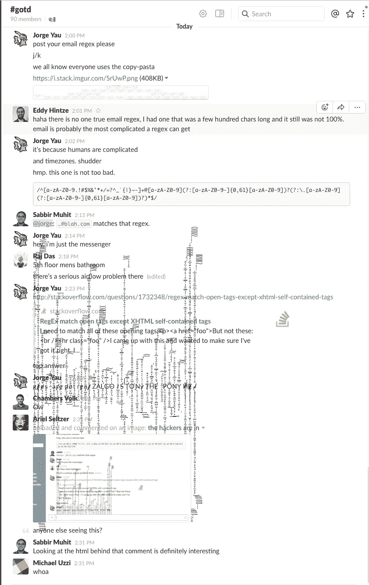
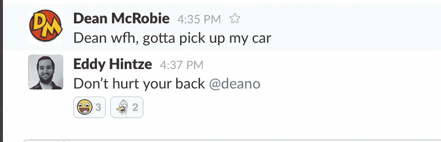
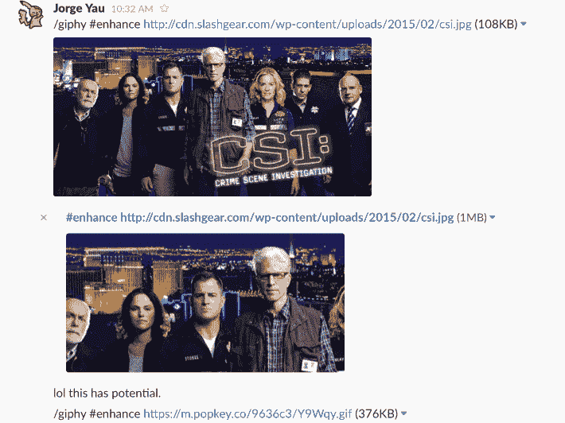
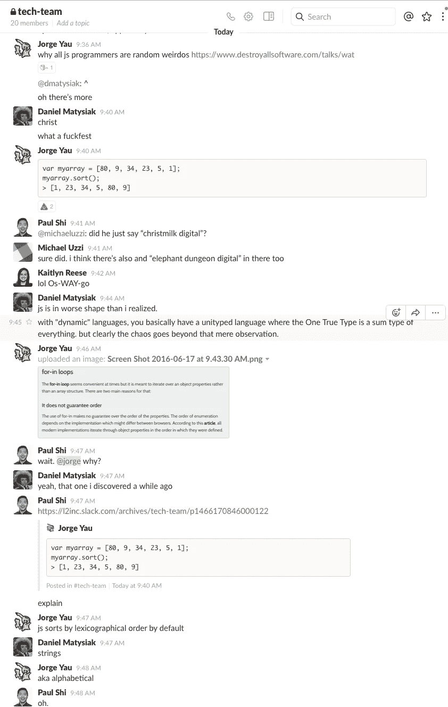
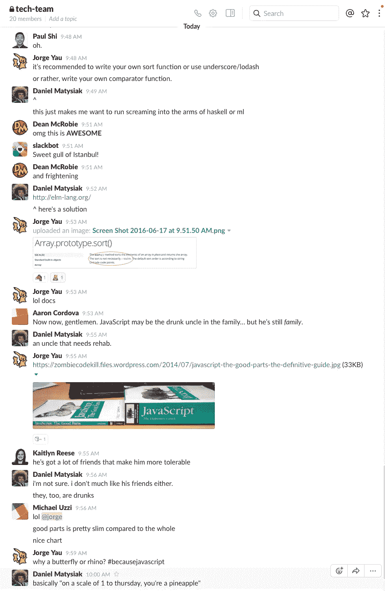
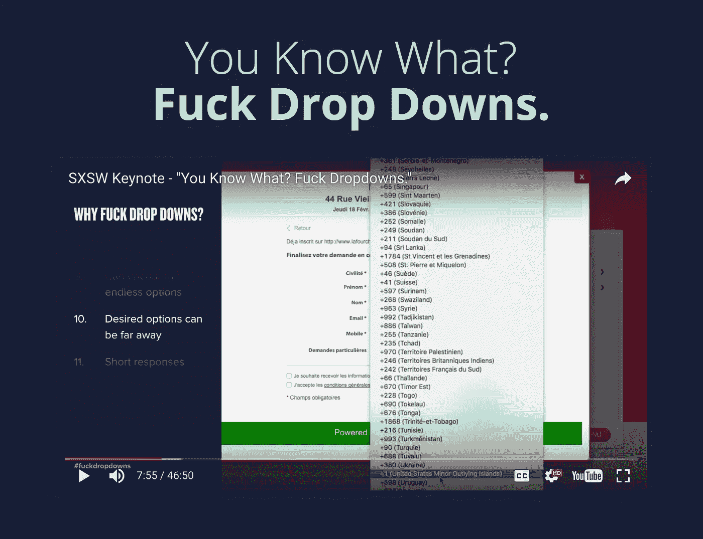
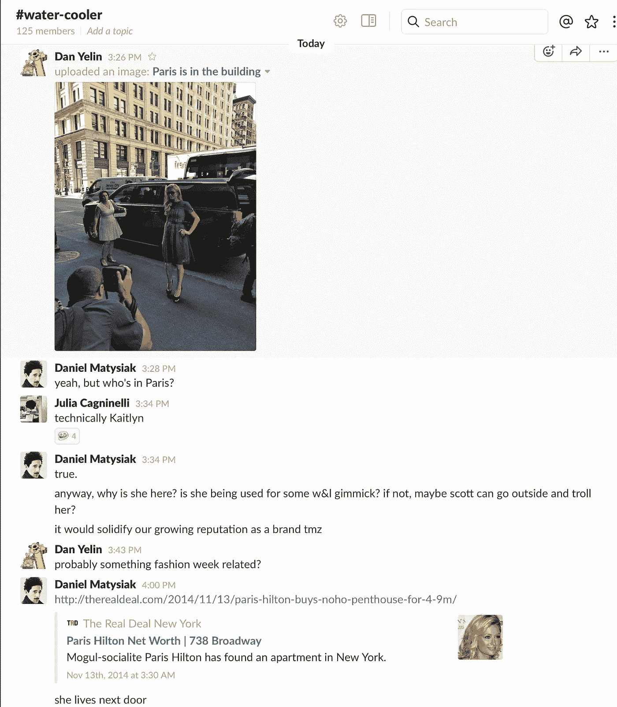
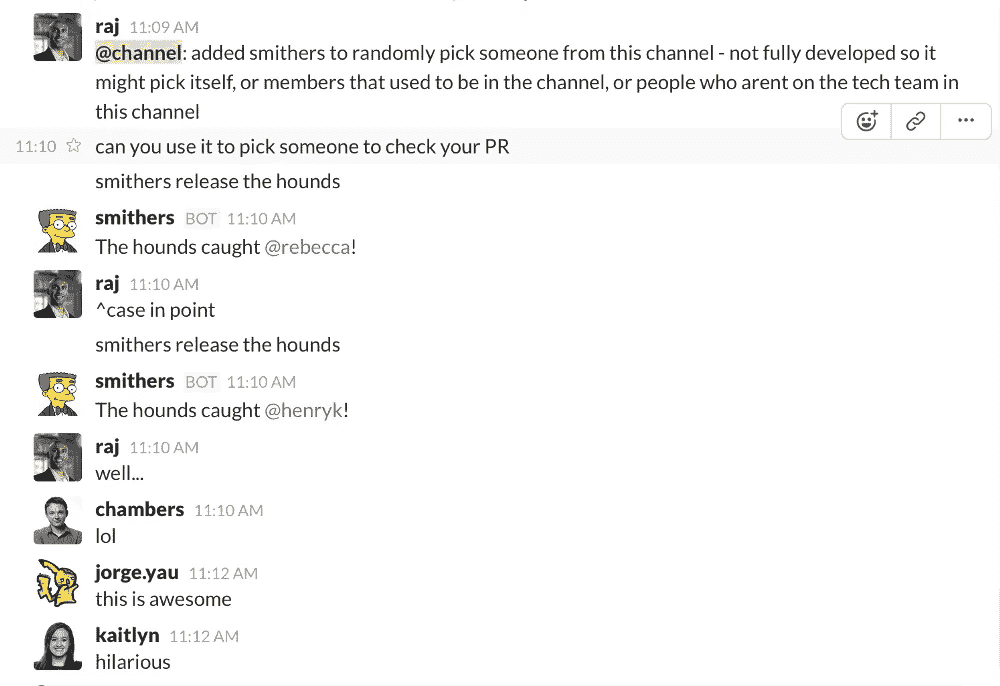
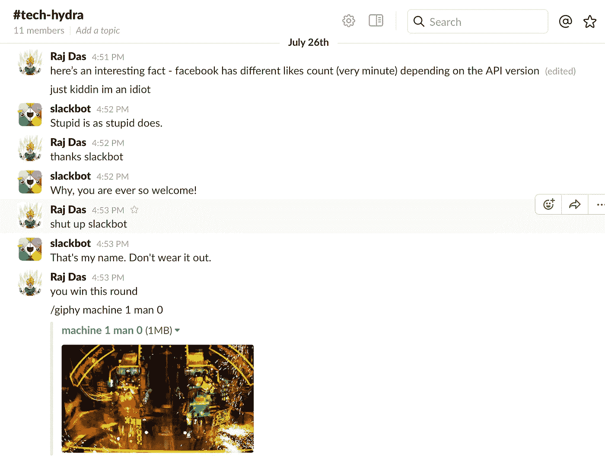

# Slack — L2 版

> 原文：<https://medium.com/hackernoon/slack-l2-edition-8a0317411ffc>

懈怠是我喜欢在创业公司工作的原因之一。作为免责声明，这些懈怠的对话是我自己自愿贴出来的。[科技](https://hackernoon.com/tagged/tech)团队工作异常努力，在他们所做的事情上表现出色。事不宜迟，以下是我最喜欢的工作中的轻松对话，绝对让我热泪盈眶。

**Just one of the few ways to mess with your co-workers on slack.**

**Dean’s our CTO. He can be rather charming.**

**The day I discovered giphy’s secret commands. It was not productive.**

**JavaScript.**

**Gonna do a series of blog posts on this.**

***Obligatory Intermission***

**Kaitlyn was indeed in Paris.**

**Apparently Smithers only picks ex-employees.**

**Trunks, where are you?**

> 伙计们，表演结束了。喜欢这篇文章，并关注，如果你想看到更多。

> [黑客中午](http://bit.ly/Hackernoon)是黑客如何开始他们的下午。我们是 [@AMI](http://bit.ly/atAMIatAMI) 家庭的一员。我们现在[接受投稿](http://bit.ly/hackernoonsubmission)并乐意[讨论广告&赞助](mailto:partners@amipublications.com)机会。
> 
> 如果你喜欢这个故事，我们推荐你阅读我们的[最新科技故事](http://bit.ly/hackernoonlatestt)和[趋势科技故事](https://hackernoon.com/trending)。直到下一次，不要把世界的现实想当然！

[https://upscri.be/hackernoon/](https://upscri.be/hackernoon/)