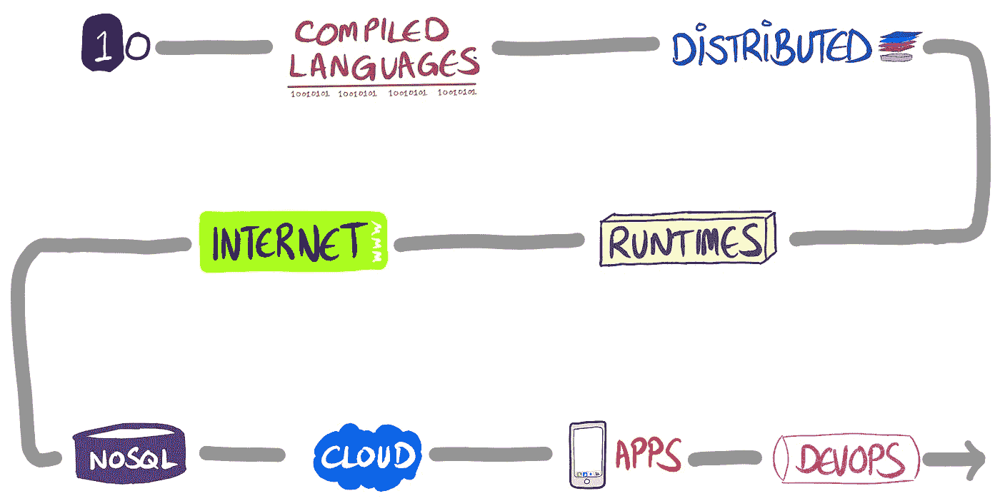
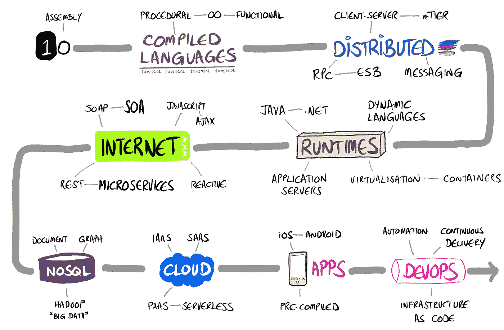

# 软件架构趋势的奴隶？

> 原文：<https://medium.com/hackernoon/slave-to-software-architecture-trends-5cd8899af381>

你注意到软件架构的最新趋势了吗？这些趋势是普遍的做法，似乎每个人都在谈论和做。或者至少声称他们在做。

现在我们已经习惯了流行趋势。我们中的一些人盲目地追随时尚。我们大多数人都不是——我们不太关心是否追随最新的时尚。但是很难避免趋势的影响，即使你是一个迟到的追随者或迟到的大多数之一。回头看看你 20 年前的家庭照片，你会穿着当时的时尚。趋势浪潮一直带着我们。

这种趋势对软件来说似乎是相似的。例如，在 2000 年代，我们大规模采用了互联网，随之而来的是 SOA 浪潮。这种面向服务的架构趋势对组织和架构师非常有吸引力。每个人都在谈论它，好像它是新软件的必备方法。然而今天没有人谈论 SOA。相反，人们更多地谈论微服务、反应式编程和大数据。

# 软件架构趋势简史

Peter Campbell, 2016

我在互联网上找不到太多关于软件架构趋势的历史。我能找到的最好的书是 simplicable 写的【T2 软件架构简史】。所以我试图从这件事和我的经历中获得灵感来画一幅。可以看到从机器码到 DevOps(上图)的主要趋势类型。

然后，我添加了从这些趋势类型中产生的一些实践和技术(如下)。我没有试图使它变得全面或与时间表一致，因为我想避免掉进兔子洞。我已经按照趋势类型对所有的实践进行了分组(即使它们比其他趋势出现得晚)。也有缺失的环节，比如云计算的虚拟化:我避免画交叉趋势类型的关系来简化图片。这是我的软件架构趋势简史。

Peter Campbell, 2016

我在分布式时代开始编程，当时高级语言是标准的(至少对于商业应用程序来说)。我在分布式计算方面的经验见证了它从二进制和专有到更简单的开放标准，经历了 RPC、CORBA、RMI、EJB、SOAP 到 REST。互联网可能是软件架构中影响最大的一个趋势，并催生了 SOA 和微服务等主要趋势。

今天，先前趋势的影响仍然很强。互联网仍然是进步和趋势的主要推动者。虽然 Hadoop 及其生态系统仍然是一项未充分开发的技术，但“大数据”的谈论比过去少了(可能因为这是一个糟糕的名字)。云供应商继续扩展他们的平台，从基本的虚拟化(基础设施即服务)到一切即服务。智能手机的普及为更高级的应用程序，尤其是商业应用程序提供了充足的空间。DevOps 工具链已经成为主流，但是持续交付对许多人来说仍然是难以捉摸的。

# 不要做奴隶

对于软件架构师来说，受制于流行趋势是危险的。喝太多的 kool-aid 很容易扭曲你对技术背景和价值的看法。

这很重要，因为微服务并不总是正确的解决方案。关系数据库可能是你的软件产品所需要的*。一个[宏伟的单体](https://m.signalvnoise.com/the-majestic-monolith-29166d022228#.14izxw2jk)可以满足您组织的需求。使用 shell 脚本部署到生产环境可以降低门槛，允许任何人部署代码。*

这让我想起了 2000 年代初被卷入企业 Java Beans 浪潮的情景——那时我还年轻得多。当时，它提供了跨 Java 供应商的标准化(针对代码，而不是针对配置)，更简单的分布式计算 Java，开源实现和新的高级应用服务器运行时。我愉快地钻研无状态会话 bean、实体 bean、应用程序容器和消息 bean。然而几年后，Spring 和其他公司对重量级模型、笨拙的持久模型和单一运行时产生了(必要的)反弹。趋势因此减弱。我当时学到的教训是，软件架构趋势是变化无常的。

所以让我们从历史中学习。让我们对软件架构趋势有一个更清晰的自我认识，并在我们眼前看到的需求的背景下评估它们。

我确信这里至少隐藏着一个历史错误。如果你发现了，请告诉我。

> [黑客中午](http://bit.ly/Hackernoon)是黑客如何开始他们的下午。我们是 [@AMI](http://bit.ly/atAMIatAMI) 家庭的一员。我们现在[接受投稿](http://bit.ly/hackernoonsubmission)并乐意[讨论广告&赞助](mailto:partners@amipublications.com)机会。
> 
> 如果你喜欢这个故事，我们推荐你阅读我们的[最新科技故事](http://bit.ly/hackernoonlatestt)和[趋势科技故事](https://hackernoon.com/trending)。直到下一次，不要把世界的现实想当然！

