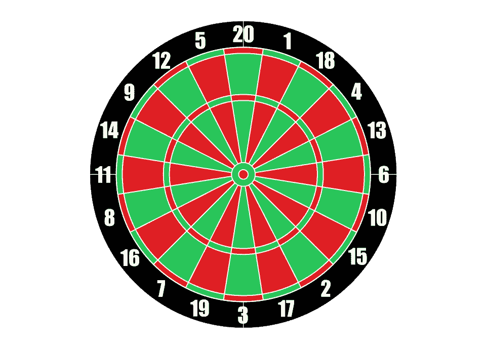
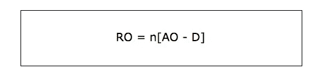
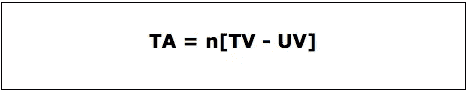
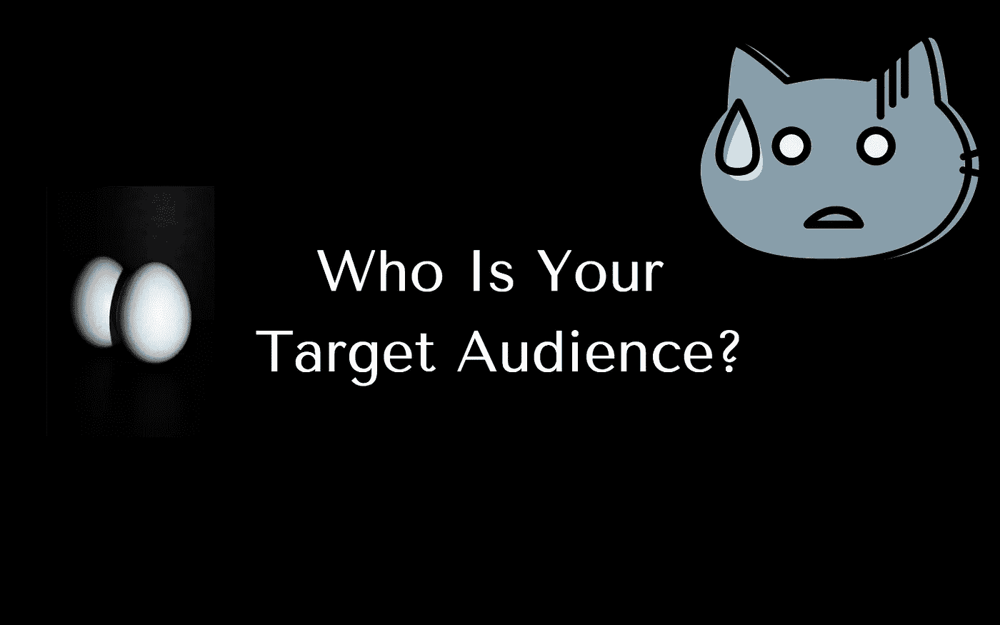

# 为了更好的 A/B 测试结果，对目标受众进行细分

> 原文：<https://medium.com/hackernoon/slice-and-dice-your-target-audience-for-better-a-b-testing-results-c2a9fd01ccb8>

对于一个天体生物学迷来说…

这个定律是为了找出撞击我们轨道的实际可研究物体。

用这个公式测量输出，

**RO** —可研究对象

**敖**——外星物体

**D** —碎片

就网站和目标受众而言，

可研究对象[ **RO** ]=目标受众[ **TA** ]

外星物体[ **AO** ]=访客总数[ **TV**

碎片=不速之客

通过应用*等价单位*(这个定律只有在你知道你的目标受众的情况下才适用)。

我有点偏爱我这种类型的人。我爱量子物理！

**R and R 到此结束……:D**

接下来，在这篇文章中，我将严肃地列举我所学到的关于在 **A/B 测试中针对目标受众的最佳方法及其重要性的所有信息。**

从更广泛的角度来看，在你的实验中，你可能想排除或包括五种不同类型的观众。

# 通过查询参数的目标

让我们从一个例子开始…

作为一家电子商务商店，你可能想开展一场活动来推广你的感恩节优惠。这个提议似乎更适合来自美国的游客，而不是来自南亚的游客。

在这种情况下，您可以为来自首选地点的受众创建一个专用的登录页面。在谷歌的 **URL 生成器**或 **UTM 生成器**的帮助下，你可以为你运行的每个活动分配单独的**查询字符串**。

通过这种方式，无论何时访问者通过活动进入您的网站，您都可以使用分配给访问者的**唯一查询字符串**来追踪他们。

# 基于浏览器类型的目标受众

您可能希望根据访问者使用的浏览器类型来排除或包括他们。

**举个例子**:如果你的新登陆页面应该在页面加载几秒钟后推送一个**订阅模式**，那么让它面向来自移动浏览器的访问者并不是一个好主意。

一个反应灵敏的网站在移动浏览器上可能比在桌面浏览器上慢一点，因此，将移动访问者排除在目标受众之外可以带来更有效/可操作的线索。

# 来自推荐 URL 的目标受众

来自第三方网站的访客，比如 Twitter、T2 和 Yelp，更有可能是在寻找 T4 的交易。他们的行为和热情不同于那些通过有机搜索或博客来的人。当然，他们需要对交易出价，并尽快离开网站。

考虑这样的场景，为了从运行实验中获得高质量的结果，您可以选择排除或包含这些访问者。

如果你想包括这些游客，你可能必须向他们展示“ **Bonanza 销售**”。但是如果你把他们排除在外，你可以列出与你的产品相关的另一套天价优惠。

# 使用 cookie 值/访问者类型的目标受众

当其他跟踪方法不起作用时，访客 cookies 特别有用。**举个例子**

突出显示**行动号召**按钮的最主要方式是通过**模态**或**内联弹出窗口，**其性能无法通过传统方法跟踪。

模态没有唯一的 URL。因此，由于它的动态特性，很难监控它的性能。

要解决这个冲突，首先，你需要将访问者区分开来，区分哪些人必须看这些元素，哪些人不能看。如果你能在每个访问者第一次访问你的网站时保存他们的 cookies，这就可以做到。

**例如**:如果您想只向再次访问您网站的访问者显示**【优惠券】**模态，请使用 cookie 值来跟踪再次出现的访问者。

除了上面提到的技术，这里还有一些其他的方法，你可以用来为不同的观众群做实验。

**设备类型** —仅向 iPad 上的用户显示变体。

**移动设备** —仅包括 android 用户。

**浏览器**—Chrome 的人

**用户代理** —提及一个独特的用户代理(字符串)，以跟踪访问者每次查看您的网站时使用的浏览器/设备。

**一周中的某一天** —跟踪在一周的某一天访问您的网站/活动页面的访问者。

**一天中的某个小时** —访问者访问您的网站/活动页面的特定时间。

**位置** —根据受众的地理位置(他们访问您页面的位置)为他们进行实验。

**Javascript 变量** —创建一个单独的 JS 变量，只为通过上述 JS 条件的用户运行。

**IP4/IP6** —仅考虑来自特定 IP 地址的访问者。

从表面上看，这些是最好的、广泛使用的目标定位方法，可以看出哪种受众类型最适合产品/服务。

伙计。你应该知道更多一点，因为你读了整个$#！*我已经写了。

如果你是一个 **Venutian** 并且知道我在这个脚本中破译的任何东西，那么继续开始 [**A/B 测试**](https://zarget.com/features/ab-test.html) 。

如果你在**谷歌**上搜索**‘韦努蒂人’**或任何**其他术语**？你真的需要这个 [**指南**](https://zarget.com/resources/ab-testing-guide/index.html) 。

**是的！我是为人类写的。继续😃**

# 发这些→👏 👏 👏无论你能做多少…😃