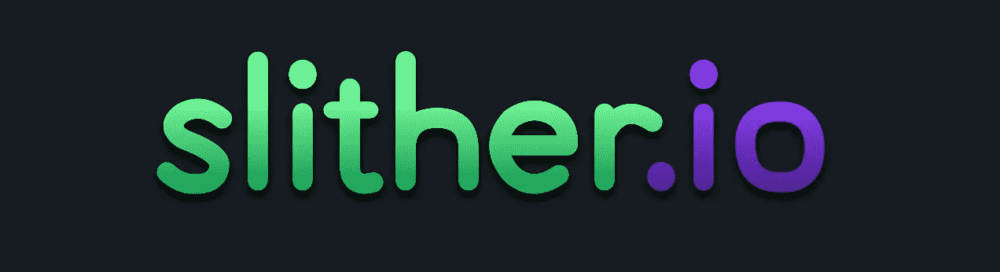

# 一起滑行:让 slither.io 成为多人游戏体验

> 原文：<https://medium.com/hackernoon/slithering-together-making-slither-io-a-multiplayer-experience-9c30a63133ef>



作为一个在 [B12](https://medium.com/u/41f95c48b7bf?source=post_page-----9c30a63133ef--------------------------------) 的工程团队，我们花了很多时间构建由自动化和未来工作驱动的产品。我们也花了很多时间闲逛和拖延——这就是我们如何找到 [slither.io](http://slither.io) 的。为了从工作中快速休息一下，我们经常会玩一两局游戏。我们注意到大部分时间我们被放在不同的游戏室，虽然游戏很有趣，但我们想一起滑行。

我们开始挖掘源代码，看看是否有办法修改代码，把我们放在同一个房间里，并偶然发现了这一行:

```
ws = new WebSocket(“ws://” + bso.ip + “:” + bso.po + “/slither”);
```

在 Safari 中，您可以修改调试器断点来执行 javascript，因此我们在 websocket 创建的下面添加了一行代码来硬编码 ip 和端口。我们现在有了一种总是共享游戏室的方式。这在一段时间内奏效了，然而，我们想一起工作来击败其他玩家，并且很快发现很难协调我们的位置。输入共享的小地图。


Shared minimap.

在内部，Slither 通过 websocket 共享游戏信息，并在本地建立用户位置的小地图。因为我们可以执行自己的 javascript，所以我们也可以访问这些位置信息，并与我们想一起玩的其他玩家分享。我们设置了一个简单的 websocket 服务器，在玩家之间传递 JSON 编码的消息，通过复制一些游戏源代码，我们将朋友的位置添加到地图上。由于我们已经在分享信息，我们也认为玩家之间共享排行榜会很好。


Shared leaderboard.

有了这三个功能:共享游戏室、小地图和团队排行榜，我们意识到我们已经为 [slither.io](http://slither.io) 建立了一个多人游戏体验的 v1。我们想发布并与他人分享，这样他们就可以组建自己的团队。我们希望看到其他人做出改进！在 github 上给我们发送一些爱[。](https://github.com/kkamalov/snake-den)

[](http://bit.ly/HackernoonFB)[](https://goo.gl/k7XYbx)[](https://goo.gl/4ofytp)

> [黑客中午](http://bit.ly/Hackernoon)是黑客如何开始他们的下午。我们是 [@AMI](http://bit.ly/atAMIatAMI) 家庭的一员。我们现在[接受投稿](http://bit.ly/hackernoonsubmission)并乐意[讨论广告&赞助](mailto:partners@amipublications.com)机会。
> 
> 如果你喜欢这个故事，我们推荐你阅读我们的[最新科技故事](http://bit.ly/hackernoonlatestt)和[趋势科技故事](https://hackernoon.com/trending)。直到下一次，不要把世界的现实想当然！

