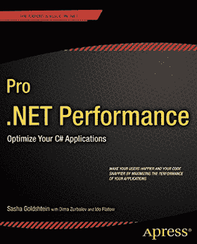
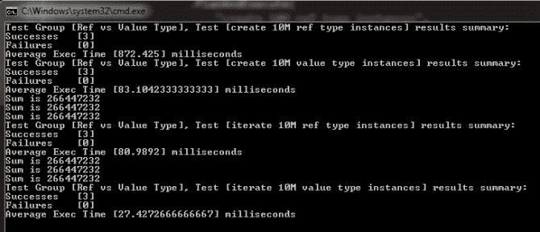
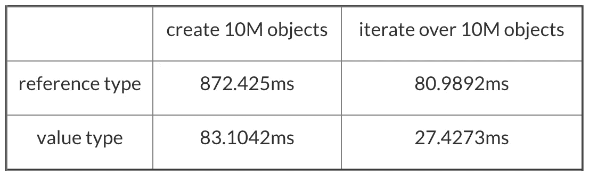

# 最小的。净引用类型是 12 字节

> 原文：<https://medium.com/hackernoon/smallest-net-ref-type-is-12-bytes-or-why-you-should-consider-using-value-types-7ab87975876a>

## 为什么应该考虑使用值类型

我偶然发现了萨沙·戈德斯坦的优秀著作《T2 职业》。Net Performance:优化你的 C#应用程序，几年前，我非常喜欢它。

尽管我读它已经快 3 年了，我已经忘记了很多我学过的东西，但我仍然清楚地记得这句话:

> …事实上，即使一个没有实例字段的类在实例化时也会占用 **12 个字节**…

当然，这仅限于一个 32 位的系统。在 **64 位**系统上，最小的引用类型实例将占用 **24 字节**内存！

# 怎么会？！？

之所以这样是由于方式。Net 对象被放置在内存中:

*   4 字节用于对象头字；
*   4 字节用于方法表指针；和
*   实例字段最少 4 个字节

当你的类只有一个字节字段时，它仍然会为实例字段占用 4 个字节的空间，因为对象必须与 4 个字节的倍数对齐。即使你的类没有实例字段，它仍然会占用 4 个字节。因此，在 32 位系统上，最小的引用类型实例将是 12 字节。

在 64 位系统中，一个字是 8 个字节而不是 4 个字节，并且对象与最接近的 8 个字节的倍数对齐，因此在这种情况下，最小的引用类型实例将是 24 个字节。

**侧栏:** *对象头字和方法表指针被 JIT 和 CLR 使用。这本书详细介绍了它们的结构和用途，在这篇博文中我们将忽略这些。如果你有兴趣了解更多，去买这本书吧，这钱花得值。*

# 引用与值类型

当谈到引用与值类型时，有很多东西可以讨论，包括:

*   堆栈与堆分配；
*   默认相等语义，即按引用比较与按值比较；
*   按值传递与按引用传递；
*   …

出于本文的目的，让我们来关注当您拥有大量内存和缓存时，它们在内存消耗和缓存友好性方面有何不同。

# 内存消耗

假设您有一个只有 X 和 Y 整数字段的 *Point2D* 类，这个类型的每个实例将在堆中总共占用 16 个字节(包括 X 和 Y 的 8 个字节)。考虑到一个 4 字节的引用指针(同样，在 32 位系统上)，它使我们对每个 *Point2D* 类型实例的总投资达到 20 字节！

如果你有一个有 10M 个 Point2D 实例的数组，那么你将为这个数组分配 190MB 的内存！

另一方面，如果 *Point2D* 是值类型，那么每个实例将只占用 X 和 Y 值的 8 个字节，并且它们将被紧密地打包到数组中，而不需要每个引用指针额外的 4 个字节。总的来说，您提交给该阵列的内存量将下降到 76MB。

# 缓存友好性

虽然访问堆栈和堆分配的内存的速度没有本质上的区别(它们只是虚拟内存中不同的地址范围)，但是有许多与性能相关的考虑因素。

**堆栈分配的内存不会产生 GC 开销**

堆栈是自我管理的，当你离开一个作用域时，你只需将指针移回到先前的位置，你就已经“释放”了先前分配的内存。

对于堆分配的内存，您会招致相当复杂的分代 GC 的开销，作为集合的一部分，它需要移动幸存的对象来压缩内存空间(随着您从 gen 0 迁移到 gen 2，这变得越来越昂贵)。

**侧栏:** *我记得几年前看过一篇帖子，讨论了 StackOverflow 的人如何检查他们的整个代码库，并尽可能多地将类转换为 struct，以便减少由于 GC 暂停而导致的服务器上的延迟峰值。虽然我并不提倡您也这样做，只是为了说明 GC 暂停是 web 服务器上的一个常见问题。最近引入的后台 GC 模式。Net releases 会减少这些暂停的频率，但明智地使用值类型在这方面仍然会有所帮助。*

**在堆栈上，时间局部性意味着空间局部性和时间访问局部性**

这意味着，在时间上靠近分配的对象也在空间上靠近存储。此外，在时间上接近分配的对象(例如，在同一个方法中)也可能被一起使用。

空间和时间访问局部性与高速缓存的工作方式(例如，更少的高速缓存未命中)和操作系统分页的工作方式(例如，更少的虚拟内存交换)配合得很好。

**在堆栈上，内存密度更高**

因为值类型没有引用类型的开销——对象头字和方法表指针——所以你可以在相同数量的内存中装入更多的对象。

更高的内存密度会带来更好的性能，因为这意味着从内存中提取的数据更少。

**在现代硬件上，整个线程堆栈可以放入 CPU 缓存**

当你生成一个新线程时，它被分配了 1MB 的堆栈空间。然而，如今的 CPU 配备了更大的 L3 缓存(例如，Nehalem 拥有[高达 24MB 的 L3 缓存](https://en.wikipedia.org/wiki/Nehalem_(microarchitecture)))，因此整个堆栈可以放入 L3 缓存中，与主内存相比，L3 缓存的访问速度要快得多(看看 PostSharp 的创造者盖尔·弗雷特(Gael Fraiteur)的[这篇演讲](http://theburningmonk.com/2012/06/takeaways-from-gael-fraiteurs-multithreading-talk/)，了解访问时间有何不同)。

无论是好是坏，现代硬件都是为了利用空间和时间局部性而构建的，这些优化表现在如何从高速缓存行中的主存储器获取数据。

考虑一下当你遍历一个由 1000 万个 *Point2D* 对象组成的数组时，在硬件层面会发生什么。如果 *Point2D* 是一个引用类型，那么每次迭代数组中它的一个实例时:

*   CPU 将从数组元素所在的位置提取一个缓存行(通常为 64 字节)
*   它将访问内存来获取堆中对象的引用指针(4 字节)
*   它会丢弃缓存线的剩余部分
*   它将从对象所在的位置获取另一个缓存行(同样是 64 字节)
*   它会读取对象并做你要求它做的任何事情
*   然后它会对数组中的下一个元素做同样的事情，依此类推…

注意这里由于引用跳转浪费了多少工作？

另一方面，如果 *Point2D* 是只有 X 和 Y 值(8 字节)的值类型:

*   CPU 将从数组元素所在的位置获取一个缓存行(64 字节)
*   它将读取对象(8 字节)并完成它的工作
*   它将尝试获取下一个对象，意识到它已经在缓存中了(多么幸运的一天！)
*   它将从现有的缓存行中读取下一个对象(8 字节),依此类推

CPU 能够从一次读取中读取 8 个对象，而每个对象只能读取 2 次！

要了解这种缓存友好性如何转化为性能数字，我们可以很容易地测量—执行时间。让我们考虑这个简单的例子:

以下是在发布模式下运行上述测试的结果:

或者以表格形式:

除了额外的内存开销之外，当对象被定义为引用类型时，创建一个包含 1000 万个对象的数组比**慢 10 倍，比**慢 3 倍。

你可能会说“嗯，这些仍然只是毫秒！”，但是对于一个需要处理大量并发请求的 web 服务器来说，这些余量是非常可观的！

在软件的某些领域，如高频交易或套利交易，即使是纳秒也能对你的底线产生很大的影响。

**侧栏:** *人们正在这些领域做一些真正时髦的事情，以获得对彼此的轻微优势，包括:*

*   *在交易所旁边建立数据中心；*
*   *使用微波传输数据，使您接收数据的速度比通过光缆连接的交换机更快；*
*   *用 FPGA 运行你的交易逻辑；*
*   *等。*

这是一个真正非常有趣的金融领域，我已经从在这些领域工作的朋友那里听到了一些有趣的故事。

# 结论

明智地使用值类型是提高。Net 应用程序——对于 C#和 F#都是如此。在不走极端的情况下，您应该考虑使用*结构*，如果:

*   对象很小，你需要创建大量的对象；
*   你需要高内存密度；
*   内存消耗是一个限制因素；
*   您需要频繁地迭代它们的大型数组

此外，以下是一些帮助您“正确使用值类型”的提示:

*   使它们不可改变；
*   override *等于*(以*对象*为参数的那个)；
*   重载*等于*取同值类型的另一个实例(如*等于(point 2d other)*)；
*   重载运算符==和！=
*   覆盖 *GetHashCode*

在下一篇文章中，我们将看看使用值类型的一些陷阱，以及为什么我们有上面的最佳实践。

Scott Meyers 在去年的 NDC 奥斯陆做了一个关于 CPU 缓存的[精彩演讲，并触及了其他话题，如**虚假共享**等。如果您不熟悉 CPU 缓存如何影响代码的性能，这是一个很好的起点。](https://vimeo.com/97337258)

(因[颠覆者](http://martinfowler.com/articles/lmax.html)而出名的)马丁·汤普森有一个很棒的[博客](http://mechanical-sympathy.blogspot.jp/)，他在里面写了很多相关的话题，包括:

*   [为什么内存访问模式很重要](http://mechanical-sympathy.blogspot.jp/2012/08/memory-access-patterns-are-important.html)
*   [记忆屏障/栅栏](http://mechanical-sympathy.blogspot.jp/2011/07/memory-barriersfences.html)
*   [虚假分享](http://mechanical-sympathy.blogspot.jp/2011/07/false-sharing.html)
*   [CPU 缓存刷新谬误](http://mechanical-sympathy.blogspot.jp/2013/02/cpu-cache-flushing-fallacy.html)

Martin 的文章使用 Java 作为例子，但是许多经验可以直接应用于。网也是。

# 链接

*   [小心值类型的隐式装箱](/@theburningmonk/beware-of-implicit-boxing-of-value-types-cb515354cef1)
*   [Scott Meyers——CPU 高速缓存以及您为什么应该关注它](https://vimeo.com/97337258)
*   [机器同情](http://mechanical-sympathy.blogspot.jp/)
*   [LMAX 架构](http://martinfowler.com/articles/lmax.html)
*   [从“超越锁关键字的多线程”中获得的经验](http://theburningmonk.com/2012/06/takeaways-from-gael-fraiteurs-multithreading-talk/)

> [黑客中午](http://bit.ly/Hackernoon)是黑客如何开始他们的下午。我们是 AMI 家庭的一员。我们现在[接受投稿](http://bit.ly/hackernoonsubmission)并乐意[讨论广告&赞助](mailto:partners@amipublications.com)机会。
> 
> 如果你喜欢这个故事，我们推荐你阅读我们的[最新科技故事](http://bit.ly/hackernoonlatestt)和[趋势科技故事](https://hackernoon.com/trending)。直到下一次，不要把世界的现实想当然！

