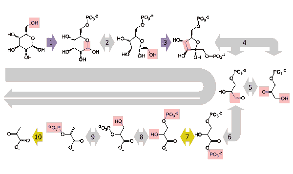
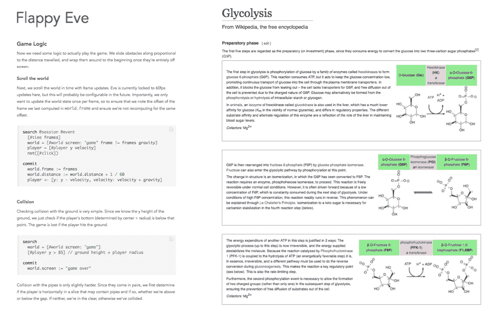

# 闲聊和蛋白质编程

> 原文：<https://medium.com/hackernoon/smalltalk-and-protein-programming-4da245ac93e2>

## 帮助理解夏娃的类比

欢迎来到我关于 Eve 的系列文章的第四部分，这是一种令人兴奋和着迷的新编程语言。

*   [*I .*Eve 如何统一你的整个编程栈](https://hackernoon.com/how-eve-unifies-your-entire-programming-stack-900ca80c58a7)
*   [*二世。*当逻辑编程遇上 CQRS](https://hackernoon.com/when-logic-programming-meets-cqrs-1137ab2a5f86)
*   [*三世。*挣脱我们的镜链](https://hackernoon.com/throwing-off-our-scope-chains-7567beb2d0b6)
*   ***四世。* Smalltalk 和蛋白质编程**
*   [*五、*夏娃远大理想的坚实基础](https://hackernoon.com/the-rock-solid-foundation-for-eves-big-vision-225b80b91e11)
*   [*六。*为什么 Eve 是实时应用的完美选择](https://hackernoon.com/why-eve-will-be-perfect-for-realtime-apps-92b965b80ad)

# 使用无状态 API 的 Smalltalk

Eve 的影响之一是 Smalltalk，这是一种创新的编程语言，由施乐 PARC 公司开发，于 1980 年发布。在 Smalltalk 中，运行的程序由对象组成，每个对象都有自己独立编程的行为，相互传递消息。

维基百科解释说 Smalltalk 对象可以做三件事:

> 1.保持状态(对其他对象的引用)。
> 
> 2.从自身或另一个对象接收消息。
> 
> 3.在处理消息的过程中，向自身或另一个对象发送消息。

从 30，000 英尺的高空看，Eve 看起来像 Smalltalk，因为这两种程序都是由独立的代码块组成的，即使在程序运行时也可以放入程序中，这被称为**现场编程**。

但是，一旦放大并查看特定块正在做什么，相似性就不复存在了:Smalltalk 对象在词法范围链中的消息之间持久化状态，而 Eve 块只能通过写入全局数据库来在时间步长之间持久化状态。

与其将 Eve 块与 Smalltalk 对象进行比较，不如将它们与 **API 处理程序**进行比较，后者是那些处理客户端对 API 端点的请求的服务器端应用层代码块。

更准确地说，Eve 类似于所谓的“无状态”API 处理程序(在请求之间不会保持内存状态)。无状态 API 处理程序只允许执行以下操作:

1.  从请求缓冲区读取
2.  操纵局部变量
3.  操作数据库数据
4.  写入响应缓冲区

#2 和#3 是 Eve 的面包和黄油，#1 和#4 相当于操纵`@request`数据库(3 的子集)。所以 Eve 就像 Smalltalk，用无状态 API 代替对象。

# 蛋白质编程

回想一下生物课上提到的[蛋白质](https://en.wikipedia.org/wiki/Protein)是在你的细胞中运行的无状态 API 处理器。他们被召唤去做有趣的工作，比如催化化学反应和运输分子。当他们完成任务时，他们不会保持任何状态；它们会重置回原始配置。

你有没有想过 cells *如何称呼*为他们的小 API 处理程序？看看西恩·约翰逊的[生物堆栈交换](https://biology.stackexchange.com/)对[的回答“蛋白质如何到达细胞内的底物？”](http://biology.stackexchange.com/questions/46369/how-does-a-protein-reach-its-substrate-within-the-cell):

> 蛋白质不会向任何方向移动。它只是在细胞中随机扩散(四处弹跳)，直到粘在什么东西上。蛋白质的特殊化学结构(形状)和它碰到的任何东西将决定它们粘在一起的紧密程度以及是否会发生化学反应。
> 
> […]
> 
> 这里有一个很酷的视频,展示了具有非常特殊形状的蛋白质如何随机跳跃，组装成复杂的结构。

现在我们知道了“蛋白质编程”的基本规则，我们可以通过查看 Eve 与蛋白质编程相似但与主流编程不同的地方来获得一些关于 Eve 的见解:

## 1.直播节目

我们已经看到 Smalltalk 和 Eve 是“现场编程”系统，其代码块可以在不重启程序的情况下改变。同样，细胞的一组蛋白质可以在运行时改变，而不需要重启细胞。这是一个叫做“生活”的直播节目的特例。

## 2.没有单点故障

任何单个蛋白质都可能被搞乱，无法发挥作用。但是当一个细胞被部署在一个有机体中时，它不能因为任何原因而离线。幸运的是，没有一个单一的蛋白质失效会如此严重地破坏细胞的状态，所以绝大多数其他细胞过程并不关心单一蛋白质何时失效。此外，错误检查和冗余可以以其他蛋白质的形式分层。

## 3.无序编程

在[糖酵解](https://en.wikipedia.org/wiki/Glycolysis)中，葡萄糖在一系列反应中被分解，最终生成 [ATP](https://en.wikipedia.org/wiki/Adenosine_triphosphate) ，细胞的“能量货币”。整个过程发生在细胞的细胞质中，也就是所有蛋白质疯狂跳动的液体。

糖酵解是一种“代谢途径”，但单个蛋白质并不编码它们是任何更大事物的一部分的事实——每个蛋白质只编码何时运行的逻辑以及运行时它进行的状态修改。这些蛋白质恰好可以以某种方式连接起来，一个人的输出可以成为下一个人的输入。在一个细胞中，永恒的输入-输出链结构最终被映射成一个按时间运行的实际事件链；只是时间在蛋白质中并不明确。

Eve 称自己为“无顺序编程”，因为它的代码块没有明确表示它们执行路径的顺序，就像蛋白质没有明确编码糖酵解路径一样。

在像细胞或数据库这样的分布式系统中，隐式排序的过程比那些试图显式协调它们的时间的过程更健壮。例如，在糖酵解过程中，如果一种蛋白质的输出被其他细胞过程吞噬，代谢途径会自动知道不再继续运行。如果这种中间输出后来再次出现，代谢途径知道如何从它停止的地方继续。

## 4.数据触发的代码

每当细胞质中出现葡萄糖分子时，就是第一个糖酵解蛋白进入的时候(如果你想知道，这是一种“己糖激酶”)。

[事件驱动编程](https://en.wikipedia.org/wiki/Event-driven_programming)是主流范式，但一个葡萄糖分子挂在身边只是普通数据；这不是一个事件。糖酵解蛋白质是一种由数据触发的代码，就像一个 Eve 块。

顺便说一下，看起来生物学家已经独立发现了[文化编程](https://en.wikipedia.org/wiki/Literate_programming)的价值。比较:

## 黑板系统

“蛋白质编程”是我自己的术语，指的是从类似于无状态 API 的组件中出现的过程。另一个恰当的比喻术语是[黑板系统](https://en.wikipedia.org/wiki/Blackboard_system):

> 一群专家[……]都在看黑板，寻找机会将他们的专业知识应用到开发解决方案中。当有人在黑板上写下一些东西，允许另一个专家应用他们的专业知识时，第二个专家会在黑板上记录他们的贡献，希望其他专家能够应用他们的专业知识。这个向黑板添加贡献的过程一直持续到问题被解决。

黑板系统的著名现有技术包括[元组空间](https://en.wikipedia.org/wiki/Tuple_space)和[琳达](https://en.wikipedia.org/wiki/Linda_(coordination_language))。

**下一篇:** [*五、*夏娃远大理想的坚实基石](https://hackernoon.com/the-rock-solid-foundation-for-eves-big-vision-225b80b91e11)

> [黑客中午](http://bit.ly/Hackernoon)是黑客如何开始他们的下午。我们是阿妹家庭的一员。我们现在[接受投稿](http://bit.ly/hackernoonsubmission)并乐意[讨论广告&赞助](mailto:partners@amipublications.com)机会。
> 
> 如果你喜欢这个故事，我们推荐你阅读我们的[最新科技故事](http://bit.ly/hackernoonlatestt)和[趋势科技故事](https://hackernoon.com/trending)。直到下一次，不要把世界的现实想当然！

