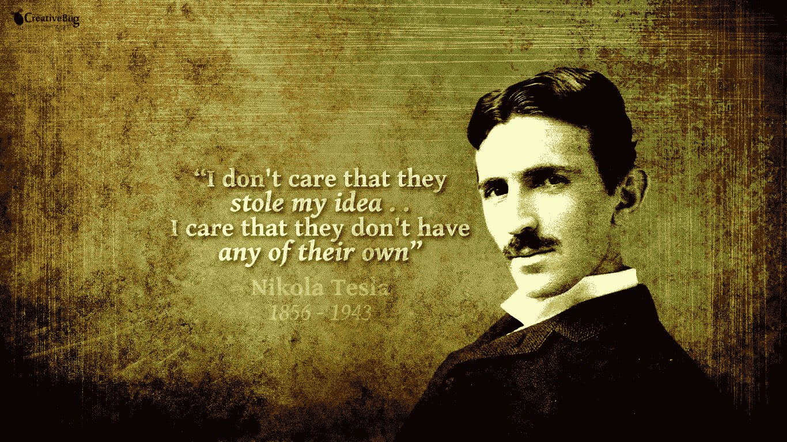
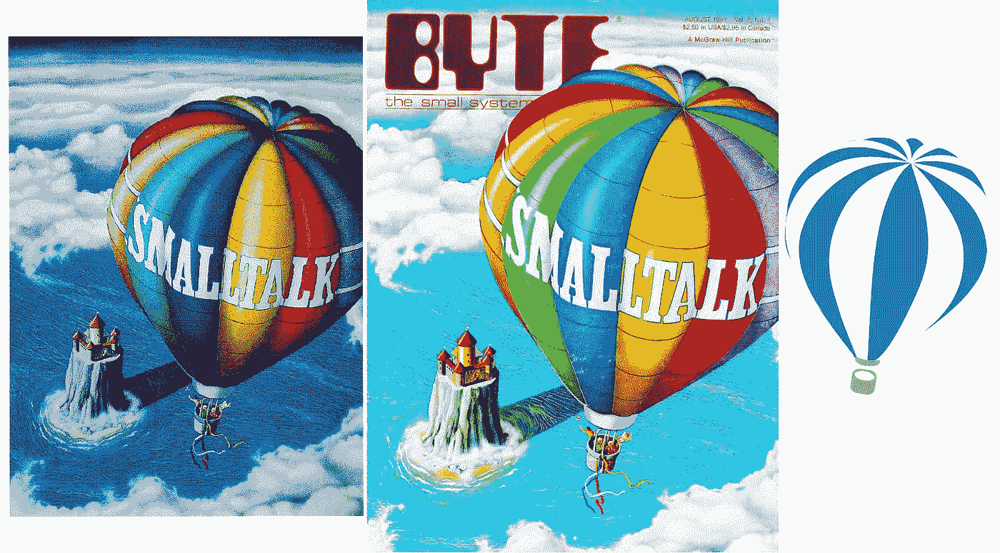
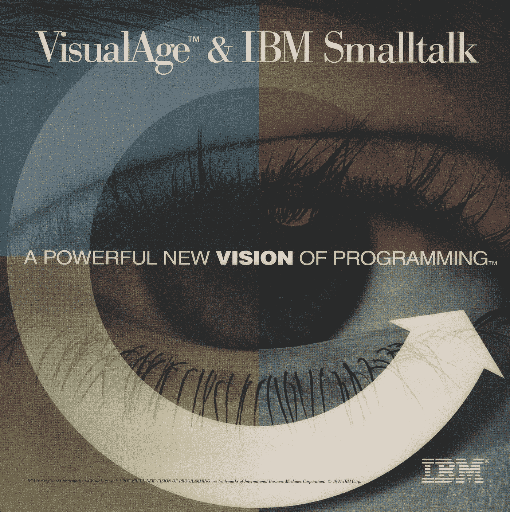
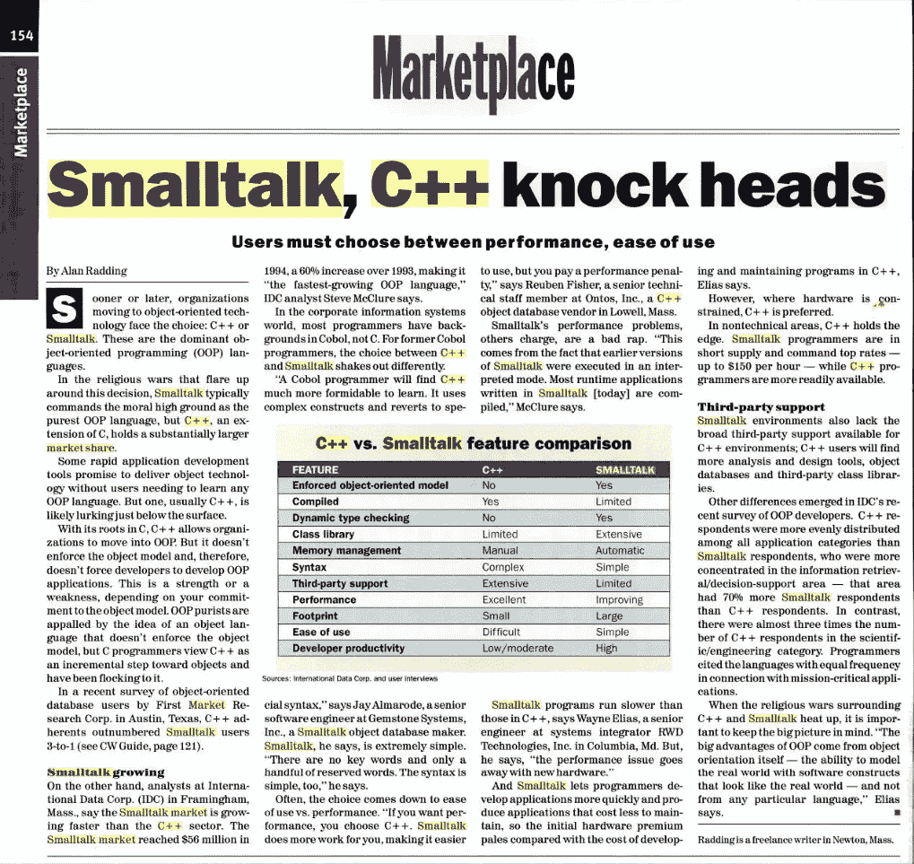

# Smalltalk 可能是 IT 行业的尼古拉·特斯拉

> 原文：<https://medium.com/hackernoon/smalltalk-is-the-nikola-tesla-of-the-it-industry-dbef0a8ddd57>

## 尼古拉·特斯拉是一位才华横溢的发明家和梦想家，他去世后基本上被人遗忘了。

他对世界的贡献是巨大的，但是人们仍然记得爱迪生、富兰克林、达芬奇和贝尔。几十年来，在沃登科利弗建立纽约博物馆以纪念特斯拉的尝试屡遭失败。直到最近，这种情况才有了结果。

以下是特斯拉的一些贡献:

*   发明了第一台交流电机
*   发达的交流发电和输电技术
*   创造了特斯拉线圈，这是一种高压变压器，后来成为阴极射线管、无线电发射机、雷达和许多其他技术的起源
*   发明了 x 光技术
*   发明了发电机和感应电动机
*   发明了第一台能用的收音机
*   发明了荧光灯泡
*   发明了遥控器
*   发明了电的无线传输
*   设计了尼亚加拉瀑布的第一座水力发电站

在 1887 年和 1888 年，他的发明获得了 30 多项专利。

特斯拉在 1943 年去世时，身无分文，被人遗忘。

## Smalltalk 是艾伦·凯(Alan Kay)的创意，他是一位真正的梦想家，在施乐 PARC 公司领导着一个出色的团队。

如今，Smalltalk 被大大低估了。尽管 Kay 从未想到 Smalltalk 是他的愿景的中心焦点，但它仍然是编程技术进步的强大力量。四十多年后，在简单和优雅、最小的认知冲突、面向对象的纯粹性、优雅的现场编码和调试、巨大的程序员生产力和专业尊重方面，还没有一种编程语言能赶上 Smalltalk。

在 Slant 和 StackOverflow，闲聊受到尊敬:阅读[大众的智慧](https://hackernoon.com/the-wisdom-of-the-crowd-c7aff954bd5f)。

Namcook Analytics 的 Capers Jones 展示了 [Smalltalk 在程序员生产率方面的巨大优势](/smalltalk-talk/smalltalk-s-proven-productivity-fe7cbd99c061)。

Smalltalk 的*实时编码* IDE 和运行时非常强大，没有像 Visual Studio、Eclipse 和 Xcode 这样的现代 IDE 那样晦涩难懂。这里有一个演示:

**Smalltalk 通过** [**Pharo**](http://pharo.org) **项目继续以显著的方式发展和改进。**以下是一些伟大的创新:

*   native boost——拥有内联汇编器绝对不是动态语言中的常见特性。NativeBoost 后来演变成了统一对外功能接口(或 UFFI)。
*   Moose 是一套代码可视化工具，包含许多可视化和分析代码的方法。
*   [Amber](http://amber-lang.net) ，以 Pharo 为参考语言，是一款梦幻般的前端 web 编程工具。
*   [PharoJS](https://pharojs.github.io) 是另一个非常棒的前端 web 编程工具。
*   [延续](https://smalltalkrenaissance.wordpress.com/2015/01/24/the-heretic-web-framework/)是 Seaside web 框架中的一个奇妙特性。
*   燃料(Fuel)——一种序列化活动对象的方式，也是一种运输对象的方式。
*   Oz —允许一个图像操纵另一个图像。非常适合调试一个已经崩溃并且无法打开/加载的图像。
*   [Pharo Launcher](https://jigyasagrover.wordpress.com/2015/04/11/pharolauncher-tutorial-what-how-pharoinprogress/) 允许您管理您的 Pharo 图像(启动、重命名、复制和删除)并从许多不同的来源下载图像模板(即 zip 存档),以便从任何模板创建新图像。
*   [SmalltalkHub](http://smalltalkhub.com) 是 Pharo 的 Github，但与 Github 不同的是，它是完全开源的，全是 Smalltalk。
*   Phratch 是 Scratch 到 Pharo 的一个移植，这很重要，因为 Scratch 已经被移植到 HTML5，这是为了保持 Scratch 基于 Smalltalk。Phratch 是一个教孩子如何编码的优秀平台。
*   [洗发水](http://dmitrymatveev.co.uk/shampoo/)—Emacs 中对 Pharo 的良好支持；您可以用 Emacs 代替 Pharo GUI，享受这个最强大的编辑器的好处。

## 遗产

和特斯拉一样，Smalltalk 也有着美好的遗产。它对面向对象编程的漂亮实现直接影响了我们今天使用的几乎所有面向对象语言的设计:Java、Python、C#、PHP、Ruby、Perl、Objective-C、Groovy、Scala、Dart、Erlang、CLOS。

Smalltalk 向世界介绍了语言*虚拟机*。(不，这不是第一个，但却是最有名的。)这也是支撑 Java 和. NET 的技术。

Smalltalk 开创了 JIT(实时)编译。

Smalltalk 诞生了第一个现代 IDE(集成开发环境)，它包括一个文本编辑器、一个系统或类浏览器、一个对象或属性检查器以及一个调试器。

Smalltalk 是第一个支持实时编程和高级调试技术的语言工具，例如以易于使用的形式在执行过程中进行动态检查和代码更改。

自 Smalltalk-80(1980 年)以来，它拥有一流的函数和闭包，奇怪的是，这使得 small talk 非常适合函数式编程。对于一门“纯粹的”面向对象语言来说，这是非常了不起的。(Java、Python、C#和 C++用了多长时间才得到这个特性？)

Smalltalk 引入了软件架构模式 MVC(模型-视图-控制器)。

在很大程度上，Smalltalk 给了我们[测试驱动开发](http://derekbarber.ca/blog/2012/03/27/why-test-driven-development/)(或 TDD)和极限编程(或 XP)，这两者在今天的标准敏捷实践中都非常有影响力。

Smalltalk 让“鸭子打字”这个词家喻户晓。Duck typing 是将“类型检查”推迟到运行时进行的地方——在运行时使用反射功能来确保正确的行为。今天，我们在许多语言中都发现了 duck 类型，包括 Java、Python、Go、Groovy、Objective-C 和 PHP。

Smalltalk 率先开发了对象数据库，其中[宝石](https://gemtalksystems.com/products/gs64/)就是一个很好的例子。

Smalltalk 给了我们[第一个*重构*浏览器](http://c2.com/cgi/wiki?RefactoringBrowser)。

Smalltalk 在开发*图形用户界面*(或 GUI)和“所见即所得”(WYSIWYG)用户界面方面发挥了重要作用。

人们没有意识到这一点，但是 Smalltalk 完全可以像 Lisp 一样扩展！阅读 [Lisp、Smalltalk 和对称的力量](https://insearchofsecrets.com/2014/08/04/lisp-smalltalk-and-the-power-of-symmetry/)。谁需要 Lisp 宏？

苹果的成功很大程度上归功于 Smalltalk。是真的！

*   Objective-C 一直是 macOS 和 iOS 的基础，Objective-C 本质上是 C 和 Smalltalk 的交叉。
*   MacOS 是从用 Objective-C 构建的 NeXTStep 发展而来的。
*   施乐 PARC 公司的 GUI 和 WIMP 给了史蒂夫乔布斯灵感，他彻底调整了苹果的战略；GUI 是 Smalltalk 工作的直接产物。

咻！尼古拉·特斯拉会感到骄傲的！

四十多年后，Smalltalk ***仍然*** 享有比我们经常听说的任何新贵语言更多的商业用途(例如，Ceylon、Clojure、Crystal、D、Dart、Elixir、Elm、F#、Haskell、Haxe、Julia、Nim、Rust)。 **Cincom、Instantiations 和 GemTalk 是主要的 Smalltalk 供应商。**他们拥有许多杰出的 Smalltalk 用户:

*   摩根大通
*   德雅尔丹
*   瑞士联合银行
*   佛罗里达电力和电灯公司
*   德州仪器
*   阿根廷电信
*   [东方海外集装箱航线](http://www.cincomsmalltalk.com/main/successes/shipping/orient-overseas-container-lines-ltd/)
*   德国宝马汽车公司(Bavarian Motor Works)
*   西门子股份公司

仅举几个例子。在我的祖国，Smalltalk 被加拿大国家密码机构通信安全机构(CSE)所使用。

Pharo 本身也有突出的用户，例如:

*   [奥尔斯托克](http://pharo.org/success/AllStocker)
*   [莫斯科街头的自动取款机](http://pharo.org/success/ATMsInMoscowStreets)
*   [LAMRC](http://pharo.org/success/LAMRC)
*   [FINWorks](http://pharo.org/success/FINWorks)
*   [是计划](http://pharo.org/success/yesplan)

在 21 世纪初，美国联合军方使用 Smalltalk 编写了一个名为 JWARS 的百万行战斗模拟程序。它实际上胜过了美国空军用 C++编写的类似模拟程序 STORM。这本身就是语言能力的惊人证明。

下面是 Smalltalk 做的一个商业虚拟现实应用: [3D 沉浸式协作](http://www.3dicc.com/)。宏伟！

Smalltalk 有利于[机器学习](https://biosmalltalk.github.io/web/)和[数据科学](http://agilevisualization.com)。

Smalltalk 正被用于[抗击埃博拉！](http://ummisco.github.io/kendrick/)

Smalltalk 用于 16 个国家的[大规模药物数据可视化](http://mutabit.com/offray/blog/en/entry/sdv-infomed)。

Smalltalk 非常适合商业应用，以至于在 20 世纪 90 年代早期，IBM 选择 Smalltalk 作为其 VisualAge 企业计划的核心，以取代 COBOL。不幸的是，1995 年 Java 的出现结束了这种局面。众所周知，今天 Java 是企业标准编程语言。

事实上，根据 1995 年的 IDC 报告，面向对象语言的市场份额是:

1.  C++ — 71.3%
2.  **Smalltalk — 15.1%**
3.  目标-C — 5.7%
4.  面向对象帕斯卡——4.2%
5.  接近 2.5%
6.  埃菲尔铁塔——1.1%
7.  所有其他— 0.2%

这是《计算机世界》1995 年 11 月 6 日的一页，展示了 Smalltalk 和 C++之间的争斗:

让我们来看看*几所*使用 Smalltalk (Pharo)的大学和研究团体:

*   瑞士伯尔尼大学 [http://scg.unibe.ch](http://scg.unibe.ch/)
*   大学。阿根廷的布宜诺斯艾利斯
*   比利时布鲁塞尔自由大学
*   大学。法国西部布列塔尼
*   大学。阿根廷天主教，阿根廷
*   巴西圣埃斯皮里图联邦大学(UFES)
*   大学。智利圣地亚哥，智利
*   捷克技术大学。，捷克
*   捷克 CULS 布拉格
*   DCyT —阿根廷国家大学 [http://www.unq.edu.ar](http://www.unq.edu.ar/)
*   法国杜埃矿业学院 [http://ia.mines-douai.fr](http://ia.mines-douai.fr/)
*   恩斯塔·布列塔尼
*   http://www.fernuni-hagen.de/ps/lehrveranstaltungen/k01814/哈根大学
*   哥伦比亚波哥大 Hackerspace。[http://hackbo.co](http://hackbo.co/)
*   伊万·弗兰科·纳特。大学。乌克兰利沃夫
*   法国蒙彼利埃大学
*   法国 IAE 萨瓦勃朗峰
*   大学。喀麦隆德马鲁阿
*   丹麦奥尔堡大学
*   北密歇根大学。美国
*   大学。西班牙加泰罗尼亚警察
*   大学。阿根廷拉普拉塔
*   大学。阿尔及利亚 55-Skikda
*   大学。阿根廷布宜诺斯艾利斯国家理工学院
*   大学。阿根廷科尔多瓦国家理工学院
*   大学。阿根廷国家圣马丁
*   俄罗斯托木斯克国立大学 [http://www.csd.tsu.ru](http://www.csd.tsu.ru/)
*   比利时鲁汶大学
*   喀麦隆雅温得大学
*   意大利卡利亚里大学
*   拉菲斯 (AR)
*   [兽医遗传研究所 IGEVET](http://igevet.fcv.unlp.edu.ar/index.php/IGEVET) (AR)
*   阿塞格
*   [软件组合组](http://scg.unibe.ch/) (CH)
*   [汽车](http://car.mines-douai.fr/)(法国)
*   [RMOD](http://rmod.lille.inria.fr/) (法国)
*   乌米斯科 (IRD)
*   [揭示](http://reveal.inf.usi.ch/) (CH)
*   [昴宿星](http://pleiad.cl/) (CL)
*   [OC](http://www.lirmm.fr/~dony/) (FR)
*   CEA-列表(法国)
*   本体论实验室和观察站
*   Uqbar (AR)
*   [CCMI 拟合](http://ccmi.fit.cvut.cz/en/ccm-je-nyni-ccmi/) (CZ)
*   UMR 实验室统计中心 6285
*   [敏捷小组](http://pharo.org/www.agilegroup.eu) (IT)

如你所见，Smalltalk 在工业界**和学术界**非常强大！

所以最后，我很困惑为什么 Smalltalk 很少被媒体报道，为什么 Smalltalk 像尼古拉·特斯拉一样被遗忘。这两个人应该有更好的命运。